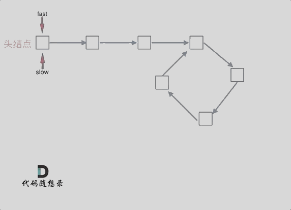

## Day04: 链表part02

### 24. 两两交换链表中的节点
[LeetCode](https://leetcode.cn/problems/swap-nodes-in-pairs/)  [文章讲解](https://programmercarl.com/0024.%E4%B8%A4%E4%B8%A4%E4%BA%A4%E6%8D%A2%E9%93%BE%E8%A1%A8%E4%B8%AD%E7%9A%84%E8%8A%82%E7%82%B9.html)  [视频讲解](https://www.bilibili.com/video/BV1YT411g7br/)

#### 题目描述：

给你一个链表，两两交换其中相邻的节点，并返回交换后链表的头节点。你必须在不修改节点内部的值的情况下完成本题（即，只能进行节点交换）。

**示例：**

> 输入：[1, 2, 3, 4]
>
> 输出：[2, 1, 4, 3]

#### 我的解法：

初始时，cur 指向虚拟头结点，然后进行一下三步：


操作之后，链表如下：


```C++
class Solution
{
 public:
	ListNode* swapPairs(ListNode* head)
	{
		ListNode* vHead = new ListNode(0, head);
		ListNode* pre = vHead;
		ListNode* cur;
		ListNode* next1;
		ListNode* next2;
		while (pre->next != nullptr && pre->next->next != nullptr)
		{
			// 保存后面的节点，防止指针修改后无法访问到
			cur = pre->next;
			next1 = pre->next->next;
			next2 = next1->next;

			pre->next = next1;    // 步骤一
			next1->next = cur;    // 步骤二
			cur->next = next2;    // 步骤三

			pre = pre->next->next;
		}
		head = vHead->next;
		delete vHead;
		return head;
	}
};
```

### 19.删除链表的倒数第N个节点
[LeetCode](https://leetcode.cn/problems/remove-nth-node-from-end-of-list/)  [文章讲解](https://programmercarl.com/0019.%E5%88%A0%E9%99%A4%E9%93%BE%E8%A1%A8%E7%9A%84%E5%80%92%E6%95%B0%E7%AC%ACN%E4%B8%AA%E8%8A%82%E7%82%B9.html)  [视频讲解](https://www.bilibili.com/video/BV1vW4y1U7Gf/)

#### 题目描述：

给你一个链表，删除链表的倒数第 n 个结点，并且返回链表的头结点。

进阶：你能尝试使用一趟扫描实现吗？

**示例**：

> 输入：head = [1,2,3,4,5], n = 2
> 输出：[1,2,3,5]

#### 我的解法：

感觉有点赖皮，创建一个 vector 将所有节点的指针存放进去，然后删除指定位置即可。

```C++
 #include <vector>
class Solution
{
 public:
	ListNode* removeNthFromEnd(ListNode* head, int n)
	{
		vector<ListNode*> list;
		ListNode* cur = head;

		// 遍历一遍链表，同时存储其节点信息
		while(cur!= nullptr)
		{
			list.push_back(cur);
			cur=cur->next;
		}

		// 找到倒数第 n 个节点的前一个节点
		if(list.size() == 1)
		{
			delete head;
			return nullptr;
		}
		else if(list.size() == n)
		{
			auto temp = head;
			head = head->next;
			delete temp;
			return head;
		}
		else
		{
			cur = list[list.size() - n - 1];
		}
		auto temp = cur->next;
		cur->next = cur->next->next;
		delete temp;

		return head;
	}
};
```

#### 快慢指针法：

如果要删除倒数第 `n` 个节点，让 `fast` 移动 `n` 步，然后让 `fast` 和 `slow` 同时移动，直到 `fast` 指向链表末尾。删掉 `slow` 所指向的节点就可以了。

分为如下几步：

- 首先这里我推荐大家使用虚拟头结点，这样方便处理删除实际头结点的逻辑；
- 定义 `fast` 指针和 `slow` 指针，初始值为虚拟头结点；

-  `fast` 首先走 `n + 1` 步 ，只有这样同时移动的时候 `slow` 才能指向删除节点的上一个节点（方便做删除操作）
-  `fast` 和 `slow` 同时移动，直到 `fast` 指向末尾；
- 删除 `slow` 指向的下一个节点。

```c++
class Solution
{
 public:
	// 快慢指针法
	ListNode* removeNthFromEnd(ListNode* head, int n)
	{
		// 有虚拟头节点
        auto vHead = new ListNode(0, head);
		auto fast = vHead;
		auto slow = vHead;

		n++;    // 需要 slow 指向被删除的前一个节点
		while (n--)
		{
			fast = fast->next;
		}

		// 遍历到 fast 指向 nullptr，此时 slow 正好是被删除的前一个节点
		while (fast != nullptr)
		{
			slow = slow->next;
			fast = fast->next;
		}
		
		// 删除节点
		fast = slow->next;
		slow->next = slow->next->next;
		delete fast;

        // 删除虚拟头节点
        head = vHead->next;
        delete vHead;
		return head;
	}
};
```

### 160. 相交链表

[LeetCode](https://leetcode.cn/problems/intersection-of-two-linked-lists/)  [文章讲解](https://programmercarl.com/%E9%9D%A2%E8%AF%95%E9%A2%9802.07.%E9%93%BE%E8%A1%A8%E7%9B%B8%E4%BA%A4.html#)

#### 题目描述：

给你两个单链表的头节点 `headA` 和 `headB` ，请你找出并返回两个单链表相交的起始节点。如果两个链表没有交点，返回 `null` 。**交点不是数值相等，而是指针相等**。

**示例：**

[](https://assets.leetcode.com/uploads/2018/12/13/160_example_1.png)

> 输入：intersectVal = 8, listA = [4,1,8,4,5], listB = [5,0,1,8,4,5], skipA = 2, skipB = 3
> 输出：Intersected at '8'
> 解释：相交节点的值为 8 （注意，如果两个链表相交则不能为 0）。
> 从各自的表头开始算起，链表 A 为 [4,1,8,4,5]，链表 B 为 [5,0,1,8,4,5]。
> 在 A 中，相交节点前有 2 个节点；在 B 中，相交节点前有 3 个节点。

#### 我的解法：

感觉有点赖皮，创建两个 stack ，分别依次存放 A 和 B 的所有节点的指针。之后两个 stack 分别弹出顶部节点的指针进行比较。

```C++
#include <stack>
class Solution
{
 public:
	ListNode* getIntersectionNode(ListNode* headA, ListNode* headB)
	{
		ListNode* result = nullptr;
		stack<ListNode*> listA;
		stack<ListNode*> listB;
		ListNode* curA = headA;
		ListNode* curB = headB;

		while (curA != nullptr)
		{
			listA.push(curA);
			curA = curA->next;
		}

		while (curB != nullptr)
		{
			listB.push(curB);
			curB = curB->next;
		}

		while ((!listA.empty()) && (!listB.empty()))
		{
			if (listA.top() == listB.top())
				result = listA.top();
			listA.pop();
			listB.pop();
		}

		return result;
	}
};
```

#### 解法：

求出两个链表的长度，并求出两个链表长度的差值，然后让 `curA` 移动到，和 `curB` 末尾对齐的位置。此时我们就可以比较 `curA` 和 `curB` 是否相同，如果不相同，同时向后移动 `curA` 和 `curB` ，如果遇到 `curA == curB`，则找到交点。否则循环退出返回空指针。

- 时间复杂度：O(n + m)
- 空间复杂度：O(1)

```C++
class Solution
{
 public:
	ListNode* getIntersectionNode(ListNode* headA, ListNode* headB)
	{
		ListNode* curA = headA;
		ListNode* curB = headB;
		int lenA = 0, lenB = 0;

		while (curA != nullptr)
		{
			curA = curA->next;
			lenA++;
		}

		while (curB != nullptr)
		{
			curB = curB->next;
			lenB++;
		}

		curA = headA;
		curB = headB;

		// 让curA为最长链表的头，lenA为其长度
		if (lenB > lenA)
		{
			swap(lenA, lenB);
			swap(curA, curB);
		}

		// 求长度差
		int gap = lenA - lenB;
		// 让curA和curB在同一起点上（末尾位置对齐）
		while (gap--)
		{
			curA = curA->next;
		}

		// 遍历curA 和 curB，遇到相同则直接返回
		while (curA != nullptr)
		{
			// 因为是节点的内存相同，那么后面的节点自然也就相同
			if (curA == curB)
			{
				return curA;
			}
			curA = curA->next;
			curB = curB->next;
		}

		return nullptr;
	}
};
```

### 142.环形链表II

[LeetCode](https://leetcode.cn/problems/linked-list-cycle-ii/)  [文章讲解](https://programmercarl.com/0142.%E7%8E%AF%E5%BD%A2%E9%93%BE%E8%A1%A8II.html)  [视频讲解](https://www.bilibili.com/video/BV1if4y1d7ob/)

#### 题目描述：

给定一个链表的头节点  `head` ，返回链表开始入环的第一个节点。 如果链表无环，则返回 `null`。

如果链表中有某个节点，可以通过连续跟踪 `next` 指针再次到达，则链表中存在环。 为了表示给定链表中的环，评测系统内部使用整数 `pos` 来表示链表尾连接到链表中的位置（**索引从 0 开始**）。如果 `pos` 是 `-1`，则在该链表中没有环。**注意：`pos` 不作为参数进行传递**，仅仅是为了标识链表的实际情况。**不允许修改** 链表。

**示例 1：**


> 输入：head = [3,2,0,-4], pos = 1
> 输出：返回索引为 1 的链表节点
> 解释：链表中有一个环，其尾部连接到第二个节点。

#### 我的解法：

纯粹的暴力，创建一个 vector，依次放入链表中的节点，每个要入的节点与 vector 中所存的节点进行比较，发现地址相同则该节点为循环节点。

```C++
class Solution
{
 public:
	ListNode* detectCycle(ListNode* head)
	{
		auto cur = head;
		vector<ListNode*> list;

		while (cur != nullptr)
		{
			for (auto it : list)
			{
				if(cur == it)
				{
					return it;
				}
			}

			list.push_back(cur);
			cur = cur->next;
		}

		return nullptr;
	}
};
```

#### 快慢指针法：

**判断是否有环**：分别定义 `fast` 和 `slow` 指针，从头结点出发， `fast` 指针每次移动两个节点， `slow` 指针每次移动一个节点，如果 `fast` 和 `slow` 指针在途中相遇 ，说明这个链表有环。


**如何找到环的入口**：假设从头结点到环形入口节点 的节点数为`x`。 环形入口节点到`fast`指针与`slow`指针相遇节点 节点数为`y`。 从相遇节点 再到环形入口节点节点数为`z`。 如图所示：


那么相遇时： `slow`指针走过的节点数为: `x + y`， `fast`指针走过的节点数：`x + y + n (y + z)`，`n`为`fast`指针在环内走了`n`圈才遇到`slow`指针， `(y+z)`为 一圈内节点的个数。

因为`fast`指针是一步走两个节点，`slow`指针一步走一个节点， 所以`fast`指针走过的节点数 = `slow`指针走过的节点数 * 2：

```
(x + y) * 2 = x + y + n (y + z)
```

因为需要知道环的入口，即`x`，整理公式之后为如下公式：

```
x = (n - 1) (y + z) + z
```

注意这里`n`一定是大于等于1的，因为`fast`指针至少要多走一圈才能相遇`slow`指针。

当`n`为1的时候，公式就化解为 `x = z`，这就意味着，**从头结点出发一个指针，从相遇节点 也出发一个指针，这两个指针每次只走一个节点， 那么当这两个指针相遇的时候就是 环形入口的节点**。也就是在相遇节点处，定义一个指针`index1`，在头结点处定一个指针`index2`。让 index1和`index2`同时移动，每次移动一个节点， 那么他们相遇的地方就是 环形入口的节点。动画如下：



如果`n`大于1时，就是`fast`指针在环形转`n`圈之后才遇到`slow`指针。其实这种情况和`n`为1的时候效果是一样的，一样可以通过这个方法找到 环形的入口节点，只不过，`index1`指针在环里 多转了`(n-1)`圈，然后再遇到index2，相遇点依然是环形的入口节点。

```C++
class Solution
{
 public:
	ListNode* detectCycle(ListNode* head)
	{
		auto fast = head;
		auto slow = head;

		while(fast != nullptr && fast->next!= nullptr)
		{
			fast = fast->next->next;
			slow = slow->next;

            // 快慢指针相遇，此时从 head 和 相遇点，同时查找直至相遇
			if(fast == slow)
			{
				auto temp1 = head;
				auto temp2 = fast;

				while (temp1 != temp2)
				{
					temp1 = temp1->next;
					temp2 = temp2->next;
				}
				return temp1; // 返回环入口
			}
		}

		return nullptr;
	}
};
```

### 链表篇总结

**虚拟头节点**：链表的一大问题就是操作当前节点必须要找前一个节点才能操作。这就造成了，头结点的尴尬，因为头结点没有前一个节点了。每次对应头结点的情况都要单独处理，所以使用虚拟头结点的技巧，就可以解决这个问题。


### 今日总结

今天的题目虽然都自己做出来了，但是后面三个题目都是有些去取巧的，通过额外创建一个 vector 或者 stack 完成的。

通过看讲解掌握了空间复杂度为 O(1) 的方法，确实还是有些巧妙的，特别第四题需要重点关注。使用快慢指针法，需要灵活变通。
