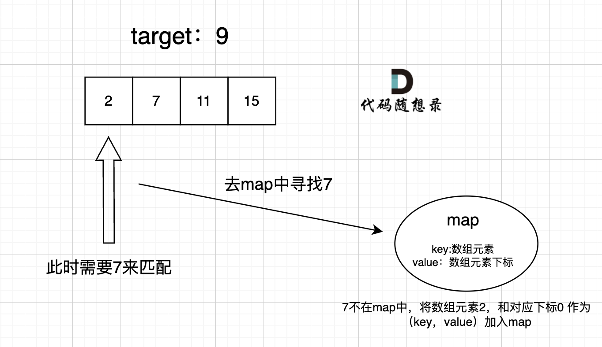

## Day06: 哈希表part01

### 哈希表理论基础
[文章讲解](https://programmercarl.com/%E5%93%88%E5%B8%8C%E8%A1%A8%E7%90%86%E8%AE%BA%E5%9F%BA%E7%A1%80.html#)

#### 哈希表：

哈希表（英文名字为Hash table，国内也有一些算法书籍翻译为散列表）。

> 哈希表是根据关键码的值而直接进行访问的数据结构。

例如，数组就是一张哈希表。哈希表中关键码就是数组的索引下标，然后通过下标直接访问数组中的元素，如下图所示：


那么哈希表能解决什么问题呢，**一般哈希表都是用来快速判断一个元素是否出现集合里。**

例如，要查询一个名字是否在这所学校里。要枚举的话时间复杂度是O(n)，但如果使用哈希表的话， 只需要O(1)就可以做到。我们只需要初始化把这所学校里学生的名字都存在哈希表里，在查询的时候通过索引直接就可以知道这位同学在不在这所学校里了。将学生姓名映射到哈希表上就涉及到了**hash function ，也就是哈希函数**。

#### 哈希函数：

哈希函数，把学生的姓名直接映射为哈希表上的索引，然后就可以通过查询索引下标快速知道这位同学是否在这所学校里了。

哈希函数如下图所示，通过hashCode把名字转化为数值，一般hashcode是通过特定编码方式，可以将其他数据格式转化为不同的数值，这样就把学生名字映射为哈希表上的索引数字了。


如果hashCode得到的数值大于 哈希表的大小了，也就是大于tableSize了，怎么办呢？

此时为了保证映射出来的索引数值都落在哈希表上，我们会在再次对数值做一个取模的操作，这样我们就保证了学生姓名一定可以映射到哈希表上了。

此时问题又来了，哈希表我们刚刚说过，就是一个数组。

如果学生的数量大于哈希表的大小怎么办，此时就算哈希函数计算的再均匀，也避免不了会有几位学生的名字同时映射到哈希表 同一个索引下标的位置。

接下来**哈希碰撞**登场

##### 哈希碰撞：

如图所示，小李和小王都映射到了索引下标 1 的位置，**这一现象叫做哈希碰撞**。


一般哈希碰撞有两种解决方法， 拉链法和线性探测法。

##### 拉链法：

刚刚小李和小王在索引1的位置发生了冲突，发生冲突的元素都被存储在链表中。 这样我们就可以通过索引找到小李和小王了


（数据规模是dataSize， 哈希表的大小为tableSize）其实拉链法就是要选择适当的哈希表的大小，这样既不会因为数组空值而浪费大量内存，也不会因为链表太长而在查找上浪费太多时间。

##### 线性探测法：

使用线性探测法，一定要保证tableSize大于dataSize。 我们需要依靠哈希表中的空位来解决碰撞问题。

例如冲突的位置，放了小李，那么就向下找一个空位放置小王的信息。所以要求tableSize一定要大于dataSize ，要不然哈希表上就没有空置的位置来存放 冲突的数据了。如图所示：


#### 常见的三种哈希结构

当我们想使用哈希法来解决问题的时候，我们一般会选择如下三种数据结构。

- 数组
- set （集合）
- map(映射)

在C++中，set 和 map 分别提供以下三种数据结构，其底层实现以及优劣如下表所示：

| 集合               | 底层实现 | 是否有序 | 数值是否可以重复 | 能否更改数值 | 查询效率 | 增删效率 |
| ------------------ | -------- | -------- | ---------------- | ------------ | -------- | -------- |
| std::set           | 红黑树   | 有序     | 否               | 否           | O(log n) | O(log n) |
| std::multiset      | 红黑树   | 有序     | 是               | 否           | O(logn)  | O(logn)  |
| std::unordered_set | 哈希表   | 无序     | 否               | 否           | O(1)     | O(1)     |

std::unordered_set底层实现为哈希表，std::set 和std::multiset 的底层实现是红黑树，红黑树是一种平衡二叉搜索树，所以key值是有序的，但key不可以修改，改动key值会导致整棵树的错乱，所以只能删除和增加。

| 映射               | 底层实现 | 是否有序 | 数值是否可以重复 | 能否更改数值 | 查询效率 | 增删效率 |
| ------------------ | -------- | -------- | ---------------- | ------------ | -------- | -------- |
| std::map           | 红黑树   | key有序  | key不可重复      | key不可修改  | O(logn)  | O(logn)  |
| std::multimap      | 红黑树   | key有序  | key可重复        | key不可修改  | O(log n) | O(log n) |
| std::unordered_map | 哈希表   | key无序  | key不可重复      | key不可修改  | O(1)     | O(1)     |

std::unordered_map 底层实现为哈希表，std::map 和std::multimap 的底层实现是红黑树。同理，std::map 和std::multimap 的key也是有序的（这个问题也经常作为**面试题**，考察对语言容器底层的理解）。

当我们要使用集合来解决哈希问题的时候，**优先使用unordered_set**，因为它的查询和增删效率是最优的，如果需要集合是有序的，那么就用set，如果要求不仅有序还要有重复数据的话，那么就用multiset。同理，并不需要key有序时，选择std::unordered_map 效率更高。

map 是一个key value 的数据结构，map中，对key是有限制，对value没有限制的，因为key的存储方式使用红黑树实现的。

虽然std::set、std::multiset 的底层实现是红黑树，不是哈希表，std::set、std::multiset 使用红黑树来索引和存储，不过给我们的使用方式，还是哈希法的使用方式，即key和value。所以使用这些数据结构来解决映射问题的方法，我们依然称之为哈希法。 map也是一样的道理。

#### 总结

总结一下，**当我们遇到了要快速判断一个元素是否出现集合里的时候，就要考虑哈希法**。

但是哈希法也是**牺牲了空间换取了时间**，因为我们要使用额外的数组，set或者是map来存放数据，才能实现快速的查找。

如果在做面试题目的时候遇到需要判断一个元素是否出现过的场景也应该第一时间想到哈希法！


### 242.有效的字母异位词

[LeetCode](https://leetcode.cn/problems/valid-anagram/)  [文章讲解](https://programmercarl.com/0242.%E6%9C%89%E6%95%88%E7%9A%84%E5%AD%97%E6%AF%8D%E5%BC%82%E4%BD%8D%E8%AF%8D.html#)  [视频讲解](https://www.bilibili.com/video/BV1YG411p7BA/)

#### 题目描述：

给定两个字符串 s 和 t ，编写一个函数来判断 t 是否是 s 的字母异位词。

示例 1: 输入: s = "anagram", t = "nagaram" 输出: true

示例 2: 输入: s = "rat", t = "car" 输出: false

**说明:** 你可以假设字符串只包含小写字母。

#### 我的解法（map哈希表）：

创建一个 map<char, int> 容器，首先遍历`s`，`s`中每出现一个新的字符，就给 map 容器创建一个新的`key`，并使其`vaule`加1，否则就直接使对应的`value`加1。然后，遍历`t`，如果`t`中的字符在map容器中存在，就使其对应的`value`减1，如果`value`为0，则移除该`key`，否则直接返回false。最后，如果map容器为空，则表示两个字符串满足题目条件，返回true。

```C++
class Solution	// map 哈希表，可以判断任意字符，但是复杂度较高
{
 public:
	bool isAnagram(const string& s, const string& t)
	{
		map<char, int> hash;

		for (auto ch : s)
		{
			auto pos = hash.find(ch);
			if (pos != hash.end())
				hash[ch]++;
			else
				hash[ch] = 1;
		}

		for (auto ch : t)
		{
			auto pos = hash.find(ch);
			if (pos != hash.end())
			{
				hash[ch]--;
				if (hash[ch] <= 0)
					hash.erase(ch);
			}
			else
				return false;
		}

		if (hash.empty())
			return true;
		else
			return false;
	}
};
```

#### 数组哈希表：

这道题目中字符串只有小写字符，那么就可以定义一个数组，来记录字符串`s`里字符出现的次数。只需要字符映射到数组也就是哈希表的索引下标上，因为字符`a`到字符`z`的ASCII是26个连续的数值，所以字符`a`映射为下标0，相应的字符`z`映射为下标25。在遍历字符串`s`的时候，只需要将 `s[i] - ‘a’` 所在的元素做+1 操作即可，并不需要记住字符`a`的ASCII，只要求出一个相对数值就可以了。


```C++
class Solution2    // 数组 哈希表，对于题目要求仅小写字母，采用数组效率较高
{
 public:
	bool isAnagram(const string& s, const string& t)
	{
		int hash[26] = { 0 };

		// 遍历字符串 s，对应 hash 表中的值加 1
		for (char ch : s)
			hash[ch - 'a']++;

		// 遍历字符串 t，对应 hash 表中的值减 1
		for (auto ch : t)
			hash[ch - 'a']--;

		// 如果 hash 表中值全为 0，则符合题意
		for (int i : hash)
			if (i != 0)
				return false;

		return true;
	}
};
```

### 349. 两个数组的交集

[LeetCode](https://leetcode.cn/problems/intersection-of-two-arrays/)  [文章讲解](https://programmercarl.com/0349.%E4%B8%A4%E4%B8%AA%E6%95%B0%E7%BB%84%E7%9A%84%E4%BA%A4%E9%9B%86.html)  [视频讲解](https://www.bilibili.com/video/BV1ba411S7wu/)

#### 题目描述：

给定两个数组 `nums1` 和 `nums2` ，返回 *它们的交集* 。输出结果中的每个元素一定是 **唯一** 的。我们可以**不考虑输出结果的顺序** 。

**示例 1：**

> 输入：nums1 = [1,2,2,1], nums2 = [2,2]
> 输出：[2]

**示例 2：**

> 输入：nums1 = [4,9,5], nums2 = [9,4,9,8,4]
> 输出：[9,4]
> 解释：[4,9] 也是可通过的

#### 我的解法（map哈希表）：

由于题目要求输出不带有重复的数，因此需要对数组进行去重。创建一个 map<int, bool> 容器，首先遍历`nums1`，`nums1`中每出现一个新的整数，就给 map 容器创建一个新的`key`，并使其`vaule`加false。然后，遍历`nums2`，如果`nums2`中的整数在map容器中存在，就使其对应的`value`为true。最后，如果遍历map容器，`value`为true的值插入`result`数组中。

```C++
class Solution		// map 实现，效率较低
{
 public:
	vector<int> intersection(vector<int>& nums1, vector<int>& nums2)
	{
		vector<int> result;
		map<int, bool> hash;

		// 将 nums1 中的数据存入哈希表
		for (auto num : nums1)
		{
			if ( hash.find(num) == hash.end())
				// 新加入数据
				hash[num] = false;
		}

		// 在哈希表中寻找 nums2 中的数据
		for (auto num : nums2)
		{
			if (hash.find(num) != hash.end())
				hash[num] = true;
		}

		// 输出哈希表的内容
		for (auto it : hash)
		{
			if (it.second)
				result.push_back(it.first);
		}

		return result;
	}
};
```

#### set哈希表：

这道题目涉及到去除重复元素，主要要学会使用一种哈希数据结构：unordered_set，这个数据结构可以解决很多类似的问题。std::set和std::multiset底层实现都是红黑树，std::unordered_set的底层实现是哈希表， 使用unordered_set 读写效率是最高的，并不需要对数据进行排序，而且还不要让数据重复，所以选择unordered_set。


```C++
class Solution2        // set 实现
{
 public:
	vector<int> intersection(vector<int>& nums1, vector<int>& nums2)
	{
		unordered_set<int> result_set;
		unordered_set<int> hash(nums1.begin(), nums1.end());

		for (int num : nums2)
		{
			// 发现 nums2 的元素在 hash 表中出现过
			if (hash.find(num) != hash.end())
			{
				result_set.insert(num);
			}
		}

		return vector<int>(result_set.begin(), result_set.end());
	}
};
```

#### 数组哈希表：

由于这道题目限制了数值的大小（0到1000），用数组来做哈希表也是不错的选择，类似242题。但是要注意，如果题目没有限制数值的大小，就无法使用数组来做哈希表了。**因为如果哈希值比较少、特别分散、跨度非常大，使用数组就造成空间的极大浪费。**

### 202. 快乐数
[LeetCode](https://leetcode.cn/problems/happy-number/)  [文章讲解](https://programmercarl.com/0202.%E5%BF%AB%E4%B9%90%E6%95%B0.html#)

#### 题目描述：

编写一个算法来判断一个数 `n` 是不是快乐数。

**「快乐数」** 定义为：

- 对于一个正整数，每一次将该数替换为它每个位置上的数字的平方和。
- 然后重复这个过程直到这个数变为 1，也可能是 **无限循环** 但始终变不到 1。
- 如果这个过程 **结果为** 1，那么这个数就是快乐数。

如果 `n` 是 *快乐数* 就返回 `true` ；不是，则返回 `false` 。

**示例 1：**

> 输入：n = 19
> 输出：true
> 解释：
> 1^2 + 9^2 = 82
> 8^2 + 2^2 = 68
> 6^2 + 8^2 = 100
> 1^2 + 0^2 + 0^2 = 1

**示例 2：**

> 输入：n = 2
> 输出：false

#### 思路：

题目中说了会 **无限循环**，那么也就是说**求和的过程中，sum会重复出现，这对解题很重要！**

当我们遇到了要快速判断一个元素是否出现集合里的时候，就要考虑哈希法来判断这个sum是否重复出现，如果重复了就是return false， 否则一直找到sum为1为止。判断sum是否重复出现就可以使用unordered_set。

#### 我的解法：

```C++
class Solution
{
 public:
	bool isHappy(int n)
	{
		if (n == 1)
			return true;

		unordered_set<int> hash;
		hash.insert(n);

		do
		{
			n = sumOfSquares(intToArray(n));

			if (hash.find(n) != hash.end())
			{
				return false;
			}

			hash.insert(n);
		} while (n != 1);

		return true;
	}

	vector<int> intToArray(int num)
	{
		vector<int> result;
		if (num <= 0)
		{
			// 要求是正整数
			return std::move(result);
		}

		while ((num % 10 != 0) || (num >= 10))
		{
			result.push_back(num % 10);
			num /= 10;
		}
		return std::move(result);
	}

	int sumOfSquares(vector<int> nums)
	{
		int sum = 0;
		for (auto num : nums)
		{
			sum += num * num;
		}
		return sum;
	}

};
```

其中，`intToArray`和`sumOfSquares`可以整和到一个函数中实现，加快效率：

```C++
class Solution
{
 public:
    // 取数值各个位上的单数之和
    int getSum(int n)
    {
       int sum = 0;
       while (n)
       {
          sum += (n % 10) * (n % 10);
          n /= 10;
       }
       return sum;
    }

    bool isHappy(int n)
    {
       unordered_set<int> set;
       while (true)
       {
          int sum = getSum(n);
          if (sum == 1)
          {
             return true;
          }
          // 如果这个sum曾经出现过，说明已经陷入了无限循环了，立刻return false
          if (set.find(sum) != set.end())
             return false;
          else
             set.insert(sum);

          n = sum;
       }
    }
};
```

### 1. 两数之和

[LeetCode](https://leetcode.cn/problems/two-sum/)  [文章讲解](https://programmercarl.com/0001.%E4%B8%A4%E6%95%B0%E4%B9%8B%E5%92%8C.html#)  [视频讲解](https://www.bilibili.com/video/BV1aT41177mK/)

#### 题目描述：

给定一个整数数组 `nums` 和一个整数目标值 `target`，请你在该数组中找出 **和为目标值** *`target`* 的那 **两个** 整数，并返回它们的数组下标。你可以假设每种输入只会对应一个答案。但是，数组中同一个元素在答案里不能重复出现。你可以按任意顺序返回答案。

**示例 1：**

> 输入：nums = [2,7,11,15], target = 9
> 输出：[0,1]
> 解释：因为 nums[0] + nums[1] == 9 ，返回 [0, 1] 。

**示例 2：**

> 输入：nums = [3,2,4], target = 6
> 输出：[1,2]

#### 我的解法（暴力解法）：

两个循环穷举，直至找到满足条件的下标。

```C++
class Solution    // 暴力解法
{
 public:
	vector<int> twoSum(vector<int>& nums, int target)
	{
		for (int i = 0; i < nums.size() - 1; i++)
		{
			for (int j = i + 1; j < nums.size(); j++)
			{
				if (nums[i] + nums[j] == target)
				{
					return { i, j };
				}
			}
		}

		return {};
	}
};
```

#### map哈希表：

**什么时候使用哈希法**：当我们需要查询一个元素是否出现过，或者一个元素是否在集合里的时候，就要第一时间想到哈希法。

本题需要一个集合来存放我们遍历过的元素，然后在遍历数组的时候去询问这个集合，某元素是否遍历过，也就是 是否出现在这个集合。因为本题，我们不仅要知道元素有没有遍历过，还要知道这个元素对应的下标，**需要使用 key value结构来存放，key来存元素，value来存下标，那么使用map正合适**。

再来看一下使用数组和set来做哈希法的局限。

- 数组的大小是受限制的，而且如果元素很少，而哈希值太大会造成内存空间的浪费。
- set是一个集合，里面放的元素只能是一个key，而两数之和这道题目，不仅要判断y是否存在而且还要记录y的下标位置，因为要返回x和y的下标。所以set 也不能用。

此时就要选择另一种数据结构：map ，map是一种key value的存储结构，可以用key保存数值，用value再保存数值所在的下标。




```C++
class Solution2    // map 哈希表
{
 public:
	vector<int> twoSum(vector<int>& nums, int target)
	{
		unordered_map<int, int> hash;

		for (int i = 0; i < nums.size(); ++i)
		{
			// 遍历当前元素，并在map中寻找是否有匹配的key
			auto pos = hash.find(target - nums[i]);
			if (pos != hash.end())
			{
				return { pos->second, i };
			}

			// 如果没找到匹配对，就把访问过的元素和下标加入到map中
			hash[nums[i]] = i;
		}

		return {};
	}
};
```

### 今日总结

学习了什么时候使用数组，什么时候使用set，什么时候使用map。了解C++中，set 和 map 分别提供的三种数据结构，以及优劣。
