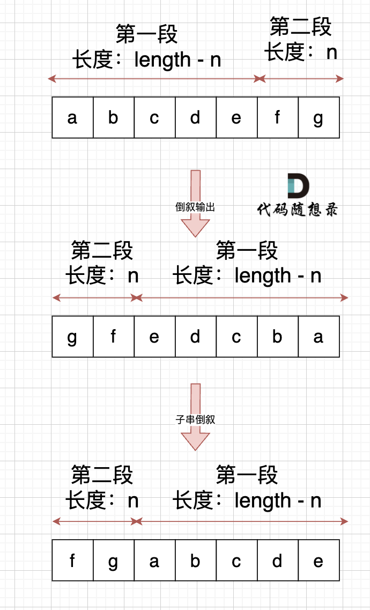

## Day08: 字符串part01

### 344.反转字符串
[LeetCode](https://leetcode.cn/problems/reverse-string/)  [文章讲解](https://programmercarl.com/0344.%E5%8F%8D%E8%BD%AC%E5%AD%97%E7%AC%A6%E4%B8%B2.html)  [视频讲解](https://www.bilibili.com/video/BV1fV4y17748/)

#### 题目描述：

编写一个函数，其作用是将输入的字符串反转过来。输入字符串以字符数组 `s` 的形式给出。

不要给另外的数组分配额外的空间，你必须**原地修改输入数组**、使用 O(1) 的额外空间解决这一问题。

**示例 1：**

> 输入：s = ["h","e","l","l","o"]
> 输出：["o","l","l","e","h"]

**示例 2：**

> 输入：s = ["H","a","n","n","a","h"]
> 输出：["h","a","n","n","a","H"]

#### 我的解法：


```C++
class Solution
{
 public:
	void reverseString(vector<char>& s)
	{
		int left = 0, right = s.size() - 1;
		char temp;
		while (left < right)
		{
			temp = s[left];
			s[left] = s[right];
			s[right] = temp;

			left++;
			right--;
		}
	}
};
```

能使用 for 尽量不要使用 while，while的运行效率比 for 低：

```C++
class Solution2
{
 public:
    void reverseString(vector<char>& s)
    {
       for (int i = 0, j = s.size() - 1; i < s.size() / 2; i++, j--)
          swap(s[i], s[j]);
    }
};
```

### 541. 反转字符串II

[LeetCode](https://leetcode.cn/problems/reverse-string-ii/)  [文章讲解](https://programmercarl.com/0541.%E5%8F%8D%E8%BD%AC%E5%AD%97%E7%AC%A6%E4%B8%B2II.html)  [视频讲解](https://www.bilibili.com/video/BV1dT411j7NN/)

#### 题目描述：

给定一个字符串 `s` 和一个整数 `k`，从字符串开头算起，每计数至 `2k` 个字符，就反转这 `2k` 字符中的前 `k` 个字符。

- 如果剩余字符少于 `k` 个，则将剩余字符全部反转。
- 如果剩余字符小于 `2k` 但大于或等于 `k` 个，则反转前 `k` 个字符，其余字符保持原样。

**示例 1：**

> 输入：s = "abcdefg", k = 2
> 输出："bacdfeg"

**示例 2：**

> 输入：s = "abcd", k = 2
> 输出："bacd"

#### 我的解法：

```C++
class Solution
{
 public:
	string reverseStr(string s, int k)
	{
		int size = s.size();
		int count = 0;
		int left, right;
		char temp;

		while (size >= k * 2)
		{
			left = count * 2 * k;
			right = left + k - 1;

			while (left < right)
			{
				temp = s[left];
				s[left] = s[right];
				s[right] = temp;

				left++;
				right--;
			}

			count++;
			size -= k * 2;
		}

		left = count * 2 * k;
		if (size < k)
			right = left + size - 1;
		else
			right = left + k - 1;

		while (left < right)
		{
			temp = s[left];
			s[left] = s[right];
			s[right] = temp;

			left++;
			right--;
		}

		return s;
	}
};
```

同理，尽量使用 for

```C++
class Solution2
{
 public:
    string reverseStr(string s, int k)
    {
       for (int i = 0; i < s.size(); i += k * 2)
       {
          if (i + k <= s.size())
          {
             reverse(s, i, i + k - 1);
             continue;
          }

          reverse(s, i, s.size() - 1);
       }
       return s;
    }

    void reverse(string& str, int start, int end)
    {
       // 左闭右闭实现
       for (int i = start, j = end; i < j; ++i, --j)
       {
          swap(str[i], str[j]);
       }
    }
};
```

### 54.替换数字（卡码网）

[卡码网](https://kamacoder.com/problempage.php?pid=1064)  [文章讲解](https://programmercarl.com/kama54.%E6%9B%BF%E6%8D%A2%E6%95%B0%E5%AD%97.html)

#### 题目描述：

给定一个字符串 s，它包含小写字母和数字字符，请编写一个函数，将字符串中的字母字符保持不变，而将每个数字字符替换为number。 例如，对于输入字符串 "a1b2c3"，函数应该将其转换为 "anumberbnumbercnumber"。

#### 我的解法：

创建了额外的一个字符串存放结果。不推荐，尽量掌握空间复杂度为 O(1) 的方法。

```C++
// 使用了额外的空间
class Solution
{
 public:
	string replaceNumbers(const string& str)
	{
		string result;

		for (char ch : str)
		{
			if (isLetter(ch))
			{
				result += ch;
				continue;
			}

			result += "number";
		}

		return result;
	}

	bool isLetter(char ch)
	{
		if ((ch - 'a') >= 0 && (ch - 'a') < 26)
			return true;

		return false;
	}

};
```

#### 双指针法

首先扩充数组到每个数字字符替换成 "number" 之后的大小。例如 字符串 "a5b" 的长度为3，那么 将 数字字符变成字符串 "number" 之后的字符串为 "anumberb" 长度为 8，即 `newSize = oldSize + count * 5`，`count`为字符串中数字的个数。

然后从后向前替换数字字符，也就是双指针法，过程如下：`i`指向新长度的末尾，`j`指向旧长度的末尾。


**其实很多数组填充类的问题，其做法都是先预先给数组扩容带填充后的大小，然后在从后向前进行操作。**

这么做有两个好处：

1. 不用申请新数组。
2. 从后向前填充元素，避免了从前向后填充元素时，每次添加元素都要将添加元素之后的所有元素向后移动的问题。

```C++
// 不使用额外的空间
class Solution2
{
 public:
    string replaceNumbers(string s)
    {
       // 统计数字的个数
       int count = 0;
       int sOldSize = s.size();
       for (int i = 0; i < s.size(); i++)
       {
          if (!isLetter(s[i])) count++;
       }

       // 扩充字符串s的大小，也就是每个空格替换成"number"之后的大小
       s.resize(s.size() + count * 5);
       int sNewSize = s.size();

       // 从后先前将空格替换为"number"
       for (int i = sNewSize - 1, j = sOldSize - 1; j < i; i--, j--)
       {
          if (isLetter(s[j]))
          {
             s[i] = s[j];
          }
          else
          {
             s[i] = 'r';
             s[i - 1] = 'e';
             s[i - 2] = 'b';
             s[i - 3] = 'm';
             s[i - 4] = 'u';
             s[i - 5] = 'n';
             i -= 5;
          }
       }
       return s;
    }

    bool isLetter(char ch)
    {
       if ((ch - 'a') >= 0 && (ch - 'a') < 26)
          return true;

       return false;
    }

};
```

### 151.翻转字符串里的单词

[LeetCode](https://leetcode.cn/problems/reverse-words-in-a-string/)  [文章讲解](https://programmercarl.com/0151.%E7%BF%BB%E8%BD%AC%E5%AD%97%E7%AC%A6%E4%B8%B2%E9%87%8C%E7%9A%84%E5%8D%95%E8%AF%8D.html)  [视频讲解](https://www.bilibili.com/video/BV1uT41177fX/)

#### 题目描述：

给你一个字符串 `s` ，请你反转字符串中 **单词** 的顺序。

**单词** 是由非空格字符组成的字符串。`s` 中使用至少一个空格将字符串中的 **单词** 分隔开。

返回 **单词** 顺序颠倒且 **单词** 之间用单个空格连接的结果字符串。

**注意：**输入字符串 `s`中可能会存在前导空格、尾随空格或者单词间的多个空格。返回的结果字符串中，单词间应当仅用单个空格分隔，且不包含任何额外的空格。

**示例 1：**

> 输入：s = "the sky is blue"
> 输出："blue is sky the"

**示例 2：**

> 输入：s = "  hello world  "
> 输出："world hello"
> 解释：反转后的字符串中不能存在前导空格和尾随空格。

**示例 3：**

> 输入：s = "a good   example"
> 输出："example good a"
> 解释：如果两个单词间有多余的空格，反转后的字符串需要将单词间的空格减少到仅有一个。

#### 双指针法：

- 移除多余空格（采用双指针，类似[27.移除元素](https://programmercarl.com/0027.移除元素.html)）
- 将整个字符串反转
- 将每个单词反转

```C++
class Solution
{
 public:
	void reverse(string& s, int start, int end)
	{
		//翻转，区间写法：左闭右闭 []
		for (int i = start, j = end; i < j; i++, j--)
			swap(s[i], s[j]);
	}

	void removeExtraSpaces(string& s)
	{
		//去除所有空格并在相邻单词之间添加空格, 快慢指针。
		int slow = 0;
		for (int fast = 0; fast < s.size(); ++fast)
		{
			//遇到非空格就处理，即删除所有空格。
			if (s[fast] != ' ')
			{
				//手动控制空格，给单词之间添加空格。slow != 0说明不是第一个单词，需要在单词前添加空格。
				if (slow != 0) s[slow++] = ' ';

				while (fast < s.size() && s[fast] != ' ')
				{
					//补上该单词，遇到空格说明单词结束。
					s[slow++] = s[fast++];
				}
			}
		}
		s.resize(slow); //slow的大小即为去除多余空格后的大小。
	}

	string reverseWords(string s)
	{
		//去除多余空格，保证单词之间之只有一个空格，且字符串首尾没空格。
		removeExtraSpaces(s);
		reverse(s, 0, s.size() - 1);

		//removeExtraSpaces后保证第一个单词的开始下标一定是0。
		int start = 0;
		for (int i = 0; i <= s.size(); ++i)
		{
			//到达空格或者串尾，说明一个单词结束。进行翻转。
			if (i == s.size() || s[i] == ' ')
			{
				//翻转，注意是左闭右闭 []的翻转。
				reverse(s, start, i - 1);
				//更新下一个单词的开始下标start
				start = i + 1;
			}
		}
		return s;
	}
};
```

### 55.右旋字符串（卡码网）
[卡码网](https://kamacoder.com/problempage.php?pid=1065)  [文章讲解](https://programmercarl.com/kama55.%E5%8F%B3%E6%97%8B%E5%AD%97%E7%AC%A6%E4%B8%B2.html)

#### 题目描述：

字符串的右旋转操作是把字符串尾部的若干个字符转移到字符串的前面。给定一个字符串 s 和一个正整数 k，请编写一个函数，将字符串中的后面 k 个字符移到字符串的前面，实现字符串的右旋转操作。 

例如，对于输入字符串 "abcdefg" 和整数 2，函数应该将其转换为 "fgabcde"。

#### 解法：

（我是猪，怎么就没想到呢）



```C++
class Solution
{
 public:
	string rightRotationString(string str, int k)
	{
		reverse(str, 0, str.size()-1);
		reverse(str, 0, k-1);
		reverse(str, k, str.size()-1);
		return str;
	}

	void reverse(string& str, int start, int end)
	{
		for (int i = start, j = end; i < j; i++, j--)
		{
			swap(str[i], str[j]);
		}
	}
};
```
### 今日总结

前两个题目比较简单，后三个题目的思路没有想到，今天题目难度不是特别大。做题的时候老想着额外创建一个字符串或使用库函数偷懒，一定要好好掌握空间复杂度为O(1)的方法。
