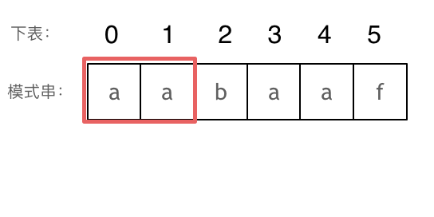
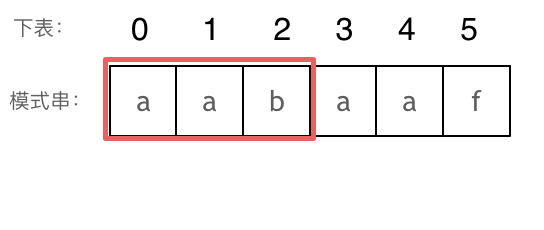

## Day09: 字符串part02

### 28. 找出字符串中第一个匹配项的下标
[LeetCode](https://leetcode.cn/problems/find-the-index-of-the-first-occurrence-in-a-string/)  [文章讲解](https://programmercarl.com/0028.%E5%AE%9E%E7%8E%B0strStr.html)  [KMP视频讲解1](https://www.bilibili.com/video/BV1PD4y1o7nd/) [KMP视频讲解2](https://www.bilibili.com/video/BV1M5411j7Xx/)

#### 题目描述：

给你两个字符串 `haystack` 和 `needle` ，请你在 `haystack` 字符串中找出 `needle` 字符串的第一个匹配项的下标（下标从 0 开始）。如果 `needle` 不是 `haystack` 的一部分，则返回 `-1` 。

**示例 1：**

> 输入：haystack = "sadbutsad", needle = "sad"
> 输出：0
> 解释："sad" 在下标 0 和 6 处匹配。第一个匹配项的下标是 0 ，所以返回 0 。

**示例 2：**

> 输入：haystack = "leetcode", needle = "leeto"
> 输出：-1
> 解释："leeto" 没有在 "leetcode" 中出现，所以返回 -1 。

#### 我的解法（暴力解法）：

暴力解法，两层 for 循环逐次匹配。为了减少不必要的匹配，每次匹配失败即立刻停止当前子串的匹配，对下一个子串继续匹配。如果当前子串匹配成功，返回当前子串的开始位置即可。如果所有子串都匹配失败，则返回 −1。

```C++
class Solution
{
 public:
	int strStr(string haystack, string needle)
	{
		for (int i = 0; i < haystack.size(); ++i)
		{
			for (int j = 0; j < needle.size(); ++j)
			{
				if (needle[j] == haystack[i + j])
				{
					if (j == needle.size() - 1)
						return i;

					continue;
				}
				else
					break;
			}
		}

		return -1;
	}
};
```

#### KMP算法：

KMP的经典思想就是:**当出现字符串不匹配时，可以记录一部分之前已经匹配的文本内容，利用这些信息避免从头再去做匹配。**

要在文本串：`aabaabaafa` 中查找是否出现过一个模式串：`aabaaf`


可以看出，文本串中第六个字符`b` 和 模式串的第六个字符`f`，不匹配了。如果暴力匹配，发现不匹配，此时就要从头匹配了。但如果使用前缀表，就不会从头匹配，而是从上次已经匹配的内容开始匹配，找到了模式串中第三个字符`b`继续开始匹配。

##### 前缀表

记录下标`i`之前（包括`i`）的字符串中，有多大长度的相同前缀后缀。前缀表是用来回退的，它记录了模式串与主串(文本串)不匹配的时候，模式串应该从哪里开始重新匹配。

**最长公共前后缀（最长相等前后缀）：**字符串的前缀是指不包含最后一个字符的所有以第一个字符开头的连续子串。后缀是指不包含第一个字符的所有以最后一个字符结尾的连续子串。所以字符串`a`的最长相等前后缀为0。 字符串`aa`的最长相等前后缀为1。 字符串`aaa`的最长相等前后缀为2。 等等.....。

##### 为什么一定要用前缀表

为什么前缀表就能告诉我们上次匹配的位置，并跳过去呢？

回顾一下，刚刚匹配的过程在下标5的地方遇到不匹配，模式串是指向f，如图： 


然后就找到了下标2，指向b，继续匹配：如图：


以下这句话，对于理解为什么使用前缀表可以告诉我们匹配失败之后跳到哪里重新匹配 非常重要！

**下标5之前这部分的字符串（也就是字符串aabaa）的最长相等的前缀 和 后缀字符串是 子字符串aa ，因为找到了最长相等的前缀和后缀，匹配失败的位置是后缀子串的后面，那么我们找到与其相同的前缀的后面重新匹配就可以了。**

所以前缀表具有告诉我们当前位置匹配失败，跳到之前已经匹配过的地方的能力。

##### 如何计算前缀表


长度为前1个字符的子串`a`，最长相同前后缀的长度为0。（注意字符串的**前缀是指不包含最后一个字符的所有以第一个字符开头的连续子串**；**后缀是指不包含第一个字符的所有以最后一个字符结尾的连续子串**。）



长度为前2个字符的子串`aa`，最长相同前后缀的长度为1。



长度为前3个字符的子串`aab`，最长相同前后缀的长度为0。

以此类推： 长度为前4个字符的子串`aaba`，最长相同前后缀的长度为1。 长度为前5个字符的子串`aabaa`，最长相同前后缀的长度为2。 长度为前6个字符的子串`aabaaf`，最长相同前后缀的长度为0。

那么把求得的最长相同前后缀的长度就是对应前缀表的元素，如图： 

可以看出模式串与前缀表对应位置的数字表示的就是：**下标i之前（包括i）的字符串中，有多大长度的相同前缀后缀。**

再来看一下如何利用 前缀表找到 当字符不匹配的时候应该指针应该移动的位置。如动画所示：


找到不匹配的位置时，需要找前面字符串的最长相同的前缀和后缀，那么此时我们要看它的前一个字符的前缀表的数值是多少。前一个字符的前缀表的数值是2， 所以把下标移动到下标2的位置继续比配。 可以再反复看一下上面的动画。最后就在文本串中找到了和模式串匹配的子串了。

##### 前缀表与next数组

next数组就可以是前缀表，但是很多实现都是把前缀表统一减一（或者 右移一位，初始位置为-1）之后作为next数组。其实**这并不涉及到KMP的原理，而是具体实现，next数组既可以就是前缀表，也可以是前缀表统一减一（或者 右移一位，初始位置为-1）。**

##### 使用next数组来匹配

有了next数组，就可以根据next数组来 匹配文本串s，和模式串t了。

注意next数组是新前缀表（旧前缀表统一减一了）。

匹配过程动画如下：


##### 时间复杂度分析

其中n为文本串长度，m为模式串长度，因为在匹配的过程中，根据前缀表不断调整匹配的位置，可以看出匹配的过程是O(n)，之前还要单独生成next数组，时间复杂度是O(m)。所以整个KMP算法的时间复杂度是O(n+m)的。

暴力的解法显而易见是O(n × m)，所以**KMP在字符串匹配中极大地提高了搜索的效率。**

##### 构造next数组

我们定义一个函数getNext来构建next数组，函数参数为指向next数组的指针，和一个字符串。 代码如下：

```C++
void getNext(int* next, const string& s)
```

构造next数组其实就是计算模式串s，前缀表的过程。 主要有如下三步：

1. 初始化
2. 处理前后缀不相同的情况
3. 处理前后缀相同的情况
3. 更新 `next` 数组的值

整体构建next数组的函数代码如下：

```C++
void getNext(int* next, const string& str)
{
    int j = 0;
    next[0] = 0;

    for (int i = 1; i < str.size(); ++i)
    {
        // j要保证大于0，因为下面有取j-1作为数组下标的操作
        while (j > 0 && str[i] != str[j]) j = next[j - 1]; // 找前一位的对应的回退位置了

        if (str[i] == str[j]) j++;
        next[i] = j;
    }
}
```

代码构造`next`数组的逻辑流程动画如下（动画中整体进行了减1）：


得到了next数组之后，就要用这个来做匹配了。

##### 使用next数组来做匹配

定义两个下标`j` 指向模式串起始位置，`i`指向文本串起始位置。那么使用`next`数组，用模式串匹配文本串的整体代码如下：

```C++
int strStr(string haystack, string needle)
	{
		if (needle.empty()) return 0;

		int next[needle.size()];
		getNext(next, needle);

		int j = 0;
		for (int i = 0; i < haystack.size(); ++i)
		{
			// 不匹配时，j 寻找之前匹配的位置
			while (j > 0 && haystack[i] != needle[j]) j = next[j - 1];

			// 匹配时，j 和 i 同时向后移动，i 的增加在 for 循环里
			if (haystack[i] == needle[j]) ++j;

			// 文本串 s 里出现了模式串 t
			if (j == needle.size())
				return (i - int(needle.size()) + 1);
		}

		return -1;
	}
```

##### 题目的整体代码：

```c++
class Solution2    // kmp 算法
{
 public:
    void getNext(int* next, const string& str)
    {
       int j = 0;
       next[0] = 0;

       for (int i = 1; i < str.size(); ++i)
       {
          // j要保证大于0，因为下面有取j-1作为数组下标的操作
          while (j > 0 && str[i] != str[j]) j = next[j - 1]; // 找前一位的对应的回退位置了

          if (str[i] == str[j]) j++;
          next[i] = j;
       }
    }

    int strStr(string haystack, string needle)
    {
       if (needle.empty()) return 0;

       int next[needle.size()];
       getNext(next, needle);

       int j = 0;
       for (int i = 0; i < haystack.size(); ++i)
       {
          // 不匹配时，j 寻找之前匹配的位置
          while (j > 0 && haystack[i] != needle[j]) j = next[j - 1];

          // 匹配时，j 和 i 同时向后移动，i 的增加在 for 循环里
          if (haystack[i] == needle[j]) ++j;

          // 文本串 s 里出现了模式串 t
          if (j == needle.size())
             return (i - int(needle.size()) + 1);
       }

       return -1;
    }
};
```

### 459.重复的子字符串

[LeetCode](https://leetcode.cn/problems/repeated-substring-pattern/)  [文章讲解](https://programmercarl.com/0459.%E9%87%8D%E5%A4%8D%E7%9A%84%E5%AD%90%E5%AD%97%E7%AC%A6%E4%B8%B2.html)  [视频讲解](https://www.bilibili.com/video/BV1cg41127fw/)

#### 题目描述：

给定一个非空的字符串 `s` ，检查是否可以通过由它的一个子串重复多次构成。

**示例 1:**

> 输入: s = "abab"
> 输出: true
> 解释: 可由子串 "ab" 重复两次构成。

**示例 2:**

> 输入: s = "aba"
> 输出: false

**示例 3:**

> 输入: s = "abcabcabcabc"
> 输出: true
> 解释: 可由子串 "abc" 重复四次构成。 (或子串 "abcabc" 重复两次构成。)

#### 移动匹配：

当一个字符串s：abcabc，内部由重复的子串组成，那么这个字符串的结构一定是这样的：


也就是由前后相同的子串组成。那么既然前面有相同的子串，后面有相同的子串，用 s + s，这样组成的字符串中，后面的子串做前串，前面的子串做后串，就一定还能组成一个s，如图：


所以判断字符串s是否由重复子串组成，只要两个s拼接在一起，里面还出现一个s的话，就说明是由重复子串组成。

当然，我们在判断 s + s 拼接的字符串里是否出现一个s的的时候，**要刨除 s + s 的首字符和尾字符**，这样避免在s+s中搜索出原来的s，我们要搜索的是中间拼接出来的s。

```C++
class Solution
{
 public:
	bool repeatedSubstringPattern(string s)
	{
		string t = s + s;
		t.erase(t.begin());
		t.erase(t.end() - 1); // 掐头去尾
		if (t.find(s) != std::string::npos) return true;
		return false;
	}
};
```

#### KMP算法：

在由重复子串组成的字符串中，最长相等前后缀不包含的子串就是最小重复子串，这里拿字符串s：abababab 来举例，ab就是最小重复单位，如图所示：


假设字符串`s`使用多个重复子串构成（这个子串是最小重复单位），重复出现的子字符串长度是`x`，所以`s`是由`n * x`组成。

因为字符串`s`的最长相同前后缀的长度一定是不包含`s`本身，所以 最长相同前后缀长度必然是`m * x`，而且 `n - m = 1`，所以如果 `n*x % (n - m)x = 0`，就可以判定有重复出现的子字符串。

最长相等前后缀的长度为：next[len - 1]，数组长度为：len。

如果`len % (len - (next[len - 1] + 1)) == 0` ，则说明数组的长度正好可以被 (数组长度-最长相等前后缀的长度) 整除 ，说明该字符串有重复的子字符串。

**数组长度减去最长相同前后缀的长度相当于是第一个周期的长度，也就是一个周期的长度，如果这个周期可以被整除，就说明整个数组就是这个周期的循环。**

如图（图中 next 数组进行了-1操作）：


next[len - 1] = 7，next[len - 1] + 1 = 8，8就是此时字符串asdfasdfasdf的最长相同前后缀的长度。

(len - (next[len - 1] + 1)) 也就是： 12(字符串的长度) - 8(最长公共前后缀的长度) = 4， 4正好可以被 12(字符串的长度) 整除，所以说明有重复的子字符串（asdf）。

```C++
class Solution
{
 public:
    void getNext(int* next, const string& str)
    {
       next[0] = 0;
       int j = 0;
       for (int i = 1; i < str.size(); ++i)
       {
          while ((j > 0) && (str[i] != str[j])) j = next[j - 1];

          if (str[i] == str[j]) j++;

          next[i] = j;
       }
    }

    bool repeatedSubstringPattern(string s)
    {
       if (s.empty()) return false;

       int next[s.size()];
       getNext(next, s);

       int len = int(s.size());
       if (next[len - 1] != 0 && len % (len - next[len - 1]) == 0)
          return true;

       return false;
    }
};
```

### 今日总结

KMP以前一直没怎么看懂，今天终于理解了。
