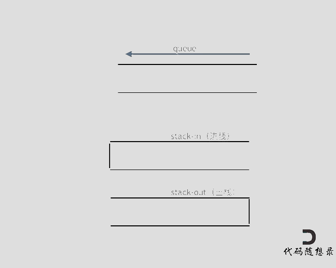

## Day10: 栈和队列part01

### 栈与队列理论基础

队列是先进先出，栈是先进后出。如图所示：


**四个关于栈的问题**：

1. C++中stack 是容器么？
2. 我们使用的stack是属于哪个版本的STL？
3. 我们使用的STL中stack是如何实现的？
4. stack 提供迭代器来遍历stack空间么？

首先要知道 栈和队列是STL（C++标准库）里面的两个数据结构。C++标准库是有多个版本的，要知道使用的STL是哪个版本，才能知道对应的栈和队列的实现原理。那么来介绍一下，三个最为普遍的STL版本：

1. HP STL 其他版本的C++ STL，一般是以HP STL为蓝本实现出来的，HP STL是C++ STL的第一个实现版本，而且开放源代码。
2. P.J.Plauger STL 由P.J.Plauger参照HP STL实现出来的，被Visual C++编译器所采用，不是开源的。
3. SGI STL 由Silicon Graphics Computer Systems公司参照HP STL实现，被Linux的C++编译器GCC所采用，SGI STL是开源软件，源码可读性甚高。

接下来介绍的栈和队列也是SGI STL里面的数据结构， 知道了使用版本，才知道对应的底层实现。来说一说栈，栈先进后出，如图所示：


栈提供push 和 pop 等等接口，所有元素必须符合先进后出规则，所以栈不提供走访功能，也不提供迭代器(iterator)。 不像是set 或者map 提供迭代器iterator来遍历所有元素。**栈是以底层容器完成其所有的工作，对外提供统一的接口，底层容器是可插拔的（也就是说我们可以控制使用哪种容器来实现栈的功能）。**所以STL中栈往往不被归类为容器，而被归类为container adapter（容器适配器）。

从下图中可以看出，栈的内部结构，栈的底层实现可以是vector，deque，list 都是可以的， 主要就是数组和链表的底层实现。


**我们常用的SGI STL，如果没有指定底层实现的话，默认是以deque为缺省情况下栈的底层结构。**deque是一个双向队列，只要封住一段，只开通另一端就可以实现栈的逻辑了。**SGI STL中 队列底层实现缺省情况下一样使用deque实现的。**我们也可以指定vector为栈的底层实现，初始化语句如下：

```C++
std::stack<int, std::vector<int> > third;  // 使用vector为底层容器的栈
```


队列的情况是一样的。队列中先进先出的数据结构，同样不允许有遍历行为，不提供迭代器, **SGI STL中队列一样是以deque为缺省情况下的底部结构。**也可以指定list 为起底层实现，初始化queue的语句如下：

```c++
std::queue<int, std::list<int>> third; // 定义以list为底层容器的队列
```

所以STL 队列也不被归类为容器，而被归类为container adapter（ 容器适配器）。

### 232.用栈实现队列

[LeetCode](https://leetcode.cn/problems/implement-queue-using-stacks/)  [文章讲解](https://programmercarl.com/0232.%E7%94%A8%E6%A0%88%E5%AE%9E%E7%8E%B0%E9%98%9F%E5%88%97.html)  [视频讲解](https://www.bilibili.com/video/BV1nY4y1w7VC/)

#### 题目描述：

请你仅使用两个栈实现先入先出队列。队列应当支持一般队列支持的所有操作（`push`、`pop`、`peek`、`empty`）：

实现 `MyQueue` 类：

- `void push(int x)` 将元素 x 推到队列的末尾
- `int pop()` 从队列的开头移除并返回元素
- `int peek()` 返回队列开头的元素
- `boolean empty()` 如果队列为空，返回 `true` ；否则，返回 `false`

**示例 1：**

> 输入：
> ["MyQueue", "push", "push", "peek", "pop", "empty"]
> [[], [1], [2], [], [], []]
> 输出：
> [null, null, null, 1, 1, false]
> 
> 解释：
> MyQueue myQueue = new MyQueue();
> myQueue.push(1); // queue is: [1]
> myQueue.push(2); // queue is: [1, 2] (leftmost is front of the queue)
> myQueue.peek(); // return 1
> myQueue.pop(); // return 1, queue is [2]
> myQueue.empty(); // return false

#### 解法：

在push数据的时候，只要数据放进输入栈就好，**但在pop的时候，操作就复杂一些，输出栈如果为空，就把进栈数据全部导入进来（注意是全部导入）**，再从出栈弹出数据，如果输出栈不为空，则直接从出栈弹出数据就可以了。



```C++
// 我的解法，过于复杂
// 应当只需要 in2out 这一过程，保证每次 in2out 之前出栈为空即可
class MyQueue 
{
 public:
	MyQueue()
	{
		m_stackIn = new stack<int>();
		m_stackOut = new stack<int>();
	}

	~MyQueue()
	{
		if (m_stackIn != nullptr)
		{
			delete m_stackIn;
			m_stackIn = nullptr;
		}

		if (m_stackOut != nullptr)
		{
			delete m_stackOut;
			m_stackOut = nullptr;
		}
	}

	void push(int x)
	{
		out2in();
		m_stackIn->push(x);
	}

	int pop()
	{
		in2out();
		int temp = m_stackOut->top();
		m_stackOut->pop();
		return temp;
	}

	int peek()
	{
		in2out();
		return m_stackOut->top();
	}

	bool empty()
	{
		return (m_stackOut->empty() && m_stackIn->empty());
	}

	void in2out()
	{
		while (!m_stackIn->empty())
		{
			m_stackOut->push(m_stackIn->top());
			m_stackIn->pop();
		}
	}

	void out2in()
	{
		while (!m_stackOut->empty())
		{
			m_stackIn->push(m_stackOut->top());
			m_stackOut->pop();
		}
	}

 private:
	stack<int>* m_stackIn;
	stack<int>* m_stackOut;
};
```

优化版本：

```c++
class MyQueue2
{
 public:
    MyQueue2()
    {
       m_stackIn = new stack<int>();
       m_stackOut = new stack<int>();
    }

    ~MyQueue2()
    {
       if (m_stackIn != nullptr)
       {
          delete m_stackIn;
          m_stackIn = nullptr;
       }

       if (m_stackOut != nullptr)
       {
          delete m_stackOut;
          m_stackOut = nullptr;
       }
    }

    void push(int x)
    {
       m_stackIn->push(x);
    }

    int pop()
    {
       // 只有当出栈为空的时候，再从入栈里导入数据（导入入栈全部数据）
       if(m_stackOut->empty())
          in2out();

       int temp = m_stackOut->top();
       m_stackOut->pop();
       return temp;
    }

    int peek()
    {
       int temp = this->pop(); // 直接使用已有的pop函数
       m_stackOut->push(temp); // 因为pop函数弹出了元素res，所以再添加回去
       return temp;
    }

    bool empty()
    {
       return (m_stackOut->empty() && m_stackIn->empty());
    }

    void in2out()
    {
       while (!m_stackIn->empty())
       {
          m_stackOut->push(m_stackIn->top());
          m_stackIn->pop();
       }
    }

 private:
    stack<int>* m_stackIn;
    stack<int>* m_stackOut;
};
```

### 225. 用队列实现栈

[LeetCode](https://leetcode.cn/problems/implement-stack-using-queues/)  [文章讲解](https://programmercarl.com/0225.%E7%94%A8%E9%98%9F%E5%88%97%E5%AE%9E%E7%8E%B0%E6%A0%88.html)  [视频讲解](https://www.bilibili.com/video/BV1Fd4y1K7sm/)

#### 题目描述：

请你仅使用队列实现一个后入先出（LIFO）的栈，并支持普通栈的全部四种操作（`push`、`top`、`pop` 和 `empty`）。

实现 `MyStack` 类：

- `void push(int x)` 将元素 x 压入栈顶。
- `int pop()` 移除并返回栈顶元素。
- `int top()` 返回栈顶元素。
- `boolean empty()` 如果栈是空的，返回 `true` ；否则，返回 `false` 。

**示例：**

> 输入：
> ["MyStack", "push", "push", "top", "pop", "empty"]
> [[], [1], [2], [], [], []]
> 输出：
> [null, null, null, 2, 2, false]
> 
> 解释：
> MyStack myStack = new MyStack();
> myStack.push(1);
> myStack.push(2);
> myStack.top(); // 返回 2
> myStack.pop(); // 返回 2
> myStack.empty(); // 返回 False

#### 我的解法：

一个队列在模拟栈的时候，在 push 的同时把前面所有的元素逐个 pop 再 push，即可调整为栈的顺序。

```C++
class MyStack
{
 public:
	MyStack()
	{
		m_queue = new queue<int>();
	}

	~MyStack()
	{
		if (m_queue != nullptr)
		{
			delete m_queue;
			m_queue = nullptr;
		}
	}

	void push(int x)
	{
		m_queue->push(x);

		// 执行 size - 1 次
		for (int i = 0; i < m_queue->size() - 1; ++i)
		{
			elementCycle();
		}
	}

	int pop()
	{
		int temp = m_queue->front();
		m_queue->pop();
		return temp;
	}

	int top()
	{
		return m_queue->front();
	}

	bool empty()
	{
		return m_queue->empty();
	}

	void elementCycle()
	{
		m_queue->push(m_queue->front());
		m_queue->pop();
	}

 private:
	queue<int>* m_queue;
};
```

### 今日总结

今天的题目比较友好，都能自己独立完成。
