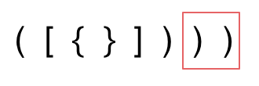

## Day11: 栈和队列part02

### 20. 有效的括号
[LeetCode](https://leetcode.cn/problems/valid-parentheses/)  [文章讲解](https://programmercarl.com/0020.%E6%9C%89%E6%95%88%E7%9A%84%E6%8B%AC%E5%8F%B7.html)  [视频讲解](https://www.bilibili.com/video/BV1AF411w78g/)

#### 题目描述：

给定一个只包括 `'('`，`')'`，`'{'`，`'}'`，`'['`，`']'` 的字符串 `s` ，判断字符串是否有效。

有效字符串需满足：

1. 左括号必须用相同类型的右括号闭合。
2. 左括号必须以正确的顺序闭合。
3. 每个右括号都有一个对应的相同类型的左括号。

**示例 1：**

> 输入：s = "()"
> 输出：true

**示例 2：**

> 输入：s = "()[]{}"
> 输出：true

**示例 3：**

> 输入：s = "(]"
> 输出：false

#### 思路：

这里有三种不匹配的情况：

1. 第一种情况，字符串里左方向的括号多余了 ，所以不匹配。


2. 第二种情况，括号没有多余，但是 括号的类型没有匹配上。


3. 第三种情况，字符串里右方向的括号多余了，所以不匹配。 



动画如下：


第一种情况：已经遍历完了字符串，但是栈不为空，说明有相应的左括号没有右括号来匹配，所以return false

第二种情况：遍历字符串匹配的过程中，发现栈里没有要匹配的字符。所以return false

第三种情况：遍历字符串匹配的过程中，栈已经为空了，没有匹配的字符了，说明右括号没有找到对应的左括号return false

那么什么时候说明左括号和右括号全都匹配了呢，就是字符串遍历完之后，栈是空的，就说明全都匹配了。

#### 我的解法：

遇到`'('`，`'{'`，`'['` 的就入栈，遇到`')'`，`'}'`，`']'` 就取出栈顶元素进行匹配，如果不匹配或者栈为空，则无法匹配。

```C++
class Solution
{
 public:
	bool isValid(const string& s)
	{
		stack<char> stack;

		for (auto ch : s)
		{
			if (ch == '(' || ch == '[' || ch == '{')
			{
				stack.push(ch);
			}
			else if(stack.empty())
			{
				return false;
			}
			else
			{
				switch (ch)
				{
				case ')':
				{
					if (stack.top() != '(') return false;

					stack.pop();
					break;
				}
				case ']':
				{
					if (stack.top() != '[') return false;

					stack.pop();
					break;
				}
				case '}':
				{
					if (stack.top() != '{') return false;

					stack.pop();
					break;
				}
				default:
					break;
				}
			}

		}

		if (stack.empty()) return true;
		else return false;
	}
};
```

### 1047. 删除字符串中的所有相邻重复项
[LeetCode](https://leetcode.cn/problems/remove-all-adjacent-duplicates-in-string/)  [文章讲解](https://programmercarl.com/1047.%E5%88%A0%E9%99%A4%E5%AD%97%E7%AC%A6%E4%B8%B2%E4%B8%AD%E7%9A%84%E6%89%80%E6%9C%89%E7%9B%B8%E9%82%BB%E9%87%8D%E5%A4%8D%E9%A1%B9.html)  [视频讲解](https://www.bilibili.com/video/BV12a411P7mw/)

#### 题目描述：

给出由小写字母组成的字符串 `S`，**重复项删除操作**会选择两个相邻且相同的字母，并删除它们。在 S 上反复执行重复项删除操作，直到无法继续删除。在完成所有重复项删除操作后返回最终的字符串。答案保证唯一。

**示例：**

> 输入："abbaca"
> 输出："ca"
> 解释：
> 例如，在 "abbaca" 中，我们可以删除 "bb" 由于两字母相邻且相同，这是此时唯一可以执行删除> 操作的重复项。之后我们得到字符串 "aaca"，其中又只有 "aa" 可以执行重复项删除操作，所以最> 后的字符串为 "ca"。

#### 我的解法：

通过栈存放遍历过的元素，当遍历当前的这个元素的时候，去栈里看一下我们是不是遍历过相同数值的相邻元素。然后再去做对应的消除操作。 如动画所示：


从栈中弹出剩余元素，此时是字符串ac，因为从栈里弹出的元素是倒序的，所以再对字符串进行反转一下，就得到了最终的结果。

```C++
class Solution
{
 public:
	string removeDuplicates(string s)
	{
		stack<char> stack;

		for (auto ch : s)
		{
			if (!stack.empty() && stack.top() == ch)
			{
				stack.pop();
			}
			else
			{
				stack.push(ch);
			}
		}

		s.clear();
		while (!stack.empty())
		{
			s += stack.top();
			stack.pop();
		}
		reverse(s.begin(), s.end());
		return s;
	}
};
```

### 150. 逆波兰表达式求值
[LeetCode](https://leetcode.cn/problems/evaluate-reverse-polish-notation/)  [文章讲解](https://programmercarl.com/0150.%E9%80%86%E6%B3%A2%E5%85%B0%E8%A1%A8%E8%BE%BE%E5%BC%8F%E6%B1%82%E5%80%BC.html)  [视频讲解](https://www.bilibili.com/video/BV1kd4y1o7on/)

#### 题目描述：

根据 逆波兰表示法，求表达式的值。有效的运算符包括 + , - , * , / 。每个运算对象可以是整数，也可以是另一个逆波兰表达式。

说明：整数除法只保留整数部分。 给定逆波兰表达式总是有效的。换句话说，表达式总会得出有效数值且不存在除数为 0 的情况。

**示例 1：**

> 输入: ["2", "1", "+", "3", " * "]
> 输出: 9
> 解释: 该算式转化为常见的中缀算术表达式为：((2 + 1) * 3) = 9

**示例 2：**

> 输入: ["4", "13", "5", "/", "+"]
> 输出: 6
> 解释: 该算式转化为常见的中缀算术表达式为：(4 + (13 / 5)) = 6

**示例 3：**

> 输入: ["10", "6", "9", "3", "+", "-11", " * ", "/", " * ", "17", "+", "5", "+"]
> 输出: 22
> 解释:该算式转化为常见的中缀算术表达式为：
>    ((10 * (6 / ((9 + 3) * -11))) + 17) + 5
> = ((10 * (6 / (12 * -11))) + 17) + 5
> = ((10 * (6 / -132)) + 17) + 5
> = ((10 * 0) + 17) + 5
> = (0 + 17) + 5
> = 17 + 5
> = 22

逆波兰表达式：是一种后缀表达式，所谓后缀就是指运算符写在后面。

平常使用的算式则是一种中缀表达式，如 ( 1 + 2 ) * ( 3 + 4 ) 。

该算式的逆波兰表达式写法为 ( ( 1 2 + ) ( 3 4 + ) * ) 。

逆波兰表达式主要有以下两个优点：

- 去掉括号后表达式无歧义，上式即便写成 1 2 + 3 4 + * 也可以依据次序计算出正确结果。
- 适合用栈操作运算：遇到数字则入栈；遇到运算符则取出栈顶两个数字进行计算，并将结果压入栈中。

#### 我的解法：

通过栈来存放数字，遇到数字入栈，遇到运算法就从栈顶取出两个数字进行运算，然后将结果入栈。最后的结果就是栈中的元素。


```C++
class Solution
{
 public:
	int evalRPN(vector<string>& tokens)
	{
		stack<string> stack;
		int result = 0;
		int num1, num2;

		for (auto& token : tokens)
		{
			if (!isOperator(token))
			{
				stack.push(token);
			}
			else
			{
				num2 = stoi(stack.top());
				stack.pop();
				num1 = stoi(stack.top());
				stack.pop();

				if (token == "+")
					result = num1 + num2;
				else if (token == "-")
					result = num1 - num2;
				else if (token == "*")
					result = num1 * num2;
				else if (token == "/")
					result = num1 / num2;

				stack.push(to_string(result));
			}
		}
		return stoi(stack.top());
	}

	bool isOperator(const string& op)
	{
		return (op == "+" || op == "-" || op == "*" || op == "/");
	}
};
```

### 今日总结

今天的题目都比较熟悉，都能够自己独立完成。
