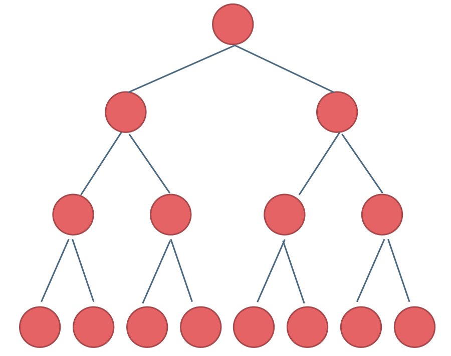
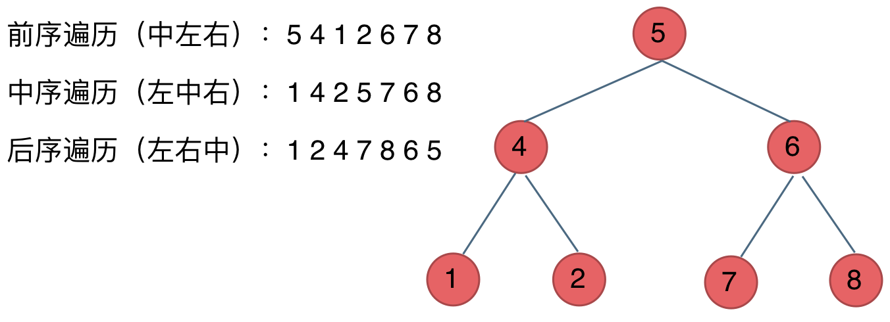

## Day14: 二叉树part01

### 二叉树理论基础

题目分类大纲如下：


#### 二叉树的种类

##### 1.满二叉树

满二叉树：如果一棵二叉树只有度为0的结点和度为2的结点，并且度为0的结点在同一层上，则这棵二叉树为满二叉树。

如图所示：



这棵二叉树为满二叉树，也可以说深度为k，有2^k-1个节点的二叉树。

##### 2.完全二叉树

在完全二叉树中，除了最底层节点可能没填满外，其余每层节点数都达到最大值，并且最下面一层的节点都集中在该层**最左边**的若干位置。若最底层为第 h 层（h从1开始），则该层包含 1~ 2^(h-1) 个节点。如：


**堆就是一棵完全二叉树，同时保证父子节点的顺序关系。**

##### 3.二叉搜索树

二叉搜索树是一个有序树：

- 若它的左子树不空，则左子树上所有结点的值均小于它的根结点的值；
- 若它的右子树不空，则右子树上所有结点的值均大于它的根结点的值；
- 它的左、右子树也分别为二叉排序树

下面这两棵树都是搜索树


##### 4.平衡二叉搜索树

平衡二叉搜索树：又被称为AVL（Adelson-Velsky and Landis）树，且具有以下性质：它是一棵空树或它的左右两个子树的高度差的绝对值不超过1，并且左右两个子树都是一棵平衡二叉树。

如图：


最后一棵 不是平衡二叉树，因为它的左右两个子树的高度差的绝对值超过了1。

**C++中map、set、multimap，multiset的底层实现都是平衡二叉搜索树**，所以map、set的增删操作时间时间复杂度是O(logn)，而unordered_map、unordered_set，unordered_map、unordered_set底层实现是哈希表，时间复杂度为O(1)。

#### 二叉树的存储方式

**二叉树可以链式存储，也可以顺序存储。**链式存储方式就用指针， 顺序存储的方式就是用数组。

链式存储如图：


顺序存储的方式就是用数组来存储二叉树，如图：


遍历数组存储的二叉树：**如果父节点的数组下标是 i，那么它的左孩子就是 i \* 2 + 1，右孩子就是 i \* 2 + 2。**

#### 二叉树的遍历方式

二叉树主要有两种遍历方式：

1. 深度优先遍历：先往深走，遇到叶子节点再往回走。
2. 广度优先遍历：一层一层的去遍历。

**这两种遍历也是图论中最基本的两种遍历方式**。从深度优先遍历和广度优先遍历进一步拓展，才有如下遍历方式：

- 深度优先遍历
  - 前序遍历（递归法，迭代法）
  - 中序遍历（递归法，迭代法）
  - 后序遍历（递归法，迭代法）
- 广度优先遍历
  - 层次遍历（迭代法）

**这里前中后，其实指的就是中间节点的遍历顺序：**

- 前序遍历：中左右
- 中序遍历：左中右
- 后序遍历：左右中

例如：



**之前我们讲栈与队列的时候，就说过栈其实就是递归的一种实现结构**，也就说前中后序遍历的逻辑其实都是可以借助栈使用递归的方式来实现的。

而广度优先遍历的实现一般使用队列来实现，这也是队列先进先出的特点所决定的，因为需要先进先出的结构，才能一层一层的来遍历二叉树。

#### 二叉树的定义

顺序存储就是用数组来存，链式存储的定义如下：

```C++
 struct TreeNode {
     int val;
     TreeNode *left;
     TreeNode *right;
     TreeNode() : val(0), left(nullptr), right(nullptr) {}
     TreeNode(int x) : val(x), left(nullptr), right(nullptr) {}
     TreeNode(int x, TreeNode *left, TreeNode *right) : val(x), left(left), right(right) {}
 };
```

二叉树的定义 和链表是差不多的，相对于链表 ，二叉树的节点里多了一个指针， 有两个指针，指向左右孩子。

### 二叉树的递归遍历

[144. 二叉树的前序遍历](https://leetcode.cn/problems/binary-tree-preorder-traversal/)、[145. 二叉树的后序遍历](https://leetcode.cn/problems/binary-tree-postorder-traversal/)、[94. 二叉树的中序遍历](https://leetcode.cn/problems/binary-tree-inorder-traversal/)

递归算法的三个要素：

1. **确定递归函数的参数和返回值：** 确定哪些参数是递归的过程中需要处理的，那么就在递归函数里加上这个参数， 并且还要明确每次递归的返回值是什么进而确定递归函数的返回类型。
2. **确定终止条件：** 写完了递归算法, 运行的时候，经常会遇到栈溢出的错误，就是没写终止条件或者终止条件写的不对，操作系统也是用一个栈的结构来保存每一层递归的信息，如果递归没有终止，操作系统的内存栈必然就会溢出。
3. **确定单层递归的逻辑：** 确定每一层递归需要处理的信息。在这里也就会重复调用自己来实现递归的过程。

**以下以前序遍历为例：**

1. **确定递归函数的参数和返回值**：因为要打印出前序遍历节点的数值，所以参数里需要传入vector来放节点的数值，除了这一点就不需要再处理什么数据了也不需要有返回值，所以递归函数返回类型就是void，代码如下：

```C++
void traversal(TreeNode* cur, vector<int>& vec)
```

2. **确定终止条件**：在递归的过程中，如何算是递归结束了呢，当然是当前遍历的节点是空了，那么本层递归就要结束了，所以如果当前遍历的这个节点是空，就直接return，代码如下：

```C++
if (cur == NULL) return;
```

3. **确定单层递归的逻辑**：前序遍历是中左右的循序，所以在单层递归的逻辑，是要先取中节点的数值，代码如下：

```C++
vec.push_back(cur->val);    // 中
traversal(cur->left, vec);  // 左
traversal(cur->right, vec); // 右
```

单层递归的逻辑就是按照中左右的顺序来处理的，这样二叉树的前序遍历，基本就写完了，再看一下完整代码：

前序遍历：

```C++
class Solution {
public:
    void traversal(TreeNode* cur, vector<int>& vec) {
        if (cur == NULL) return;
        vec.push_back(cur->val);    // 中
        traversal(cur->left, vec);  // 左
        traversal(cur->right, vec); // 右
    }
    vector<int> preorderTraversal(TreeNode* root) {
        vector<int> result;
        traversal(root, result);
        return result;
    }
};
```

那么前序遍历写出来之后，中序和后序遍历就不难理解了，代码如下：

中序遍历：

```C++
void traversal(TreeNode* cur, vector<int>& vec) {
    if (cur == NULL) return;
    traversal(cur->left, vec);  // 左
    vec.push_back(cur->val);    // 中
    traversal(cur->right, vec); // 右
}
```

后序遍历：

```C++
void traversal(TreeNode* cur, vector<int>& vec) {
    if (cur == NULL) return;
    traversal(cur->left, vec);  // 左
    traversal(cur->right, vec); // 右
    vec.push_back(cur->val);    // 中
}
```

### 二叉树的非递归遍历

[144. 二叉树的前序遍历](https://leetcode.cn/problems/binary-tree-preorder-traversal/)、[145. 二叉树的后序遍历](https://leetcode.cn/problems/binary-tree-postorder-traversal/)、[94. 二叉树的中序遍历](https://leetcode.cn/problems/binary-tree-inorder-traversal/)

**递归的实现就是：每一次递归调用都会把函数的局部变量、参数值和返回地址等压入调用栈中，然后递归返回的时候，从栈顶弹出上一次递归的各项参数**，所以这就是递归为什么可以返回上一层位置的原因。因此，理论上递归都可以通过栈来实现，但对于比较复杂的递归，没有必要一定要通过栈来实现。

#### 前序遍历

前序遍历是中左右，每次先处理的是中间节点，那么先将根节点放入栈中，然后将右孩子加入栈，再加入左孩子。**先加入 右孩子，再加入左孩子**，这样出栈的时候才是中左右的顺序。动画如下：


```C++
class Solution2 // 非递归遍历
{
 public:
    vector<int> preorderTraversal(TreeNode* root)
    {
       if (root == nullptr) return {};

       vector<int> result;
       stack<TreeNode*> stack;
       TreeNode* cur;

       stack.push(root);
       while (!stack.empty())
       {
          cur = stack.top();    // 中
          stack.pop();
          result.push_back(cur->val);
          if (cur->right != nullptr) stack.push(cur->right);    // 右（空节点不入栈）
          if (cur->left != nullptr) stack.push(cur->left);    // 左（空节点不入栈）
       }

       return result;
    }
};
```

#### 后序遍历

先序遍历是中左右，后续遍历是左右中，那么我们只需要调整一下先序遍历的代码顺序，就变成中右左的遍历顺序，然后在反转result数组，输出的结果顺序就是左右中了，如下图：


```C++
class Solution2 // 非递归遍历
{
 public:
	vector<int> postorderTraversal(TreeNode* root)
	{
		if (root == nullptr) return {};

		vector<int> result;
		stack<TreeNode*> stack;
		TreeNode* cur;

		stack.push(root);
		while (!stack.empty())
		{
			cur = stack.top();
			stack.pop();
			result.push_back(cur->val);
			if (cur->left != nullptr) stack.push(cur->left); // 相对于前序遍历，这更改一下入栈顺序 （空节点不入栈）
			if (cur->right != nullptr) stack.push(cur->right); // 空节点不入栈
		}

		reverse(result.begin(), result.end()); // 将结果反转之后就是左右中的顺序了 
		return result;
	}
};
```

#### 中序遍历

分析一下为什么刚刚写的前序遍历的代码，不能和中序遍历通用呢，因为前序遍历的顺序是中左右，先访问的元素是中间节点，要处理的元素也是中间节点，所以刚刚才能写出相对简洁的代码，**因为要访问的元素和要处理的元素顺序是一致的，都是中间节点。**

那么再看看中序遍历，中序遍历是左中右，先访问的是二叉树顶部的节点，然后一层一层向下访问，直到到达树左面的最底部，再开始处理节点（也就是在把节点的数值放进result数组中），这就造成了**处理顺序和访问顺序是不一致的。**

那么**在使用迭代法写中序遍历，就需要借用指针的遍历来帮助访问节点，栈则用来处理节点上的元素。**

动画如下：


```C++
class Solution2 // 非递归遍历
{
 public:
	vector<int> inorderTraversal(TreeNode* root)
	{
		if (root == nullptr) return {};

		vector<int> result;
		stack<TreeNode*> stack;
		TreeNode* cur = root;

		while (cur != nullptr || !stack.empty())
		{
			// 指针来访问节点，访问到最底层
			if (cur != nullptr)
			{
				// 将访问的节点放进栈
				stack.push(cur);
				cur = cur->left;			// 左
			}
			// 从栈里弹出的数据，就是要处理的数据（放进result数组里的数据）
			else
			{
				cur = stack.top();
				stack.pop();
				result.push_back(cur->val);	// 中
				cur = cur->right;			// 右
			}
		}

		return result;
	}
};
```

### 二叉树的非递归遍历的统一写法

我们发现迭代法实现的先中后序，其实风格也不是那么统一，除了先序和后序，有关联，中序完全就是另一个风格了，一会用栈遍历，一会又用指针来遍历。其实针对三种遍历方式，使用迭代法是可以写出统一风格的代码！

**将访问的节点放入栈中，把要处理的节点也放入栈中，紧接着放入一个空指针作为标记**。 这种方法也可以叫做标记法。

#### 中序遍历


可以看出将访问的节点直接加入到栈中，但如果是处理的节点则后面放入一个空节点， 这样只有空节点弹出的时候，才将下一个节点放进结果集。

```c++
class Solution3
{
 public:
    vector<int> inorderTraversal(TreeNode* root)
    {
       vector<int> result;
       stack<TreeNode*> st;
       if (root != nullptr) st.push(root);
       while (!st.empty())
       {
          TreeNode* node = st.top();
          if (node != nullptr)
          {
             st.pop(); // 将该节点弹出，避免重复操作，下面再将右中左节点添加到栈中
             if (node->right) st.push(node->right);  // 添加右节点（空节点不入栈）
             st.push(node);                          // 添加中节点
             st.push(nullptr); // 中节点访问过，但是还没有处理，加入空节点做为标记。
             if (node->left) st.push(node->left);    // 添加左节点（空节点不入栈）
          }
          else
          { 
             // 只有遇到空节点的时候，才将下一个节点放进结果集
             st.pop();           // 将空节点弹出
             node = st.top();    // 重新取出栈中元素
             st.pop();
             result.push_back(node->val); // 加入到结果集
          }
       }
       return result;
    }
};
```

#### 前序遍历

仅修改两行代码的顺序

```C++
class Solution3
{
 public:
    vector<int> preorderTraversal(TreeNode* root)
    {
       vector<int> result;
       stack<TreeNode*> st;
       if (root != nullptr) st.push(root);
       while (!st.empty())
       {
          TreeNode* node = st.top();
          if (node != nullptr)
          {
             st.pop(); // 将该节点弹出，避免重复操作，下面再将右中左节点添加到栈中
             if (node->right) st.push(node->right);  // 添加右节点（空节点不入栈）
             if (node->left) st.push(node->left);    // 添加左节点（空节点不入栈）
             st.push(node);                          // 添加中节点
             st.push(nullptr); // 中节点访问过，但是还没有处理，加入空节点做为标记。
          }
          else
          {
             // 只有遇到空节点的时候，才将下一个节点放进结果集
             st.pop();           // 将空节点弹出
             node = st.top();    // 重新取出栈中元素
             st.pop();
             result.push_back(node->val); // 加入到结果集
          }
       }
       return result;
    }
};
```

#### 中序遍历

仅修改两行代码的顺序

```C++
class Solution3
{
 public:
    vector<int> postorderTraversal(TreeNode* root)
    {
       vector<int> result;
       stack<TreeNode*> st;
       if (root != nullptr) st.push(root);
       while (!st.empty())
       {
          TreeNode* node = st.top();
          if (node != nullptr)
          {
             st.pop(); // 将该节点弹出，避免重复操作，下面再将右中左节点添加到栈中
             st.push(node);                          // 添加中节点
             st.push(nullptr); // 中节点访问过，但是还没有处理，加入空节点做为标记。
             if (node->right) st.push(node->right);  // 添加右节点（空节点不入栈）
             if (node->left) st.push(node->left);    // 添加左节点（空节点不入栈）
          }
          else
          {
             // 只有遇到空节点的时候，才将下一个节点放进结果集
             st.pop();           // 将空节点弹出
             node = st.top();    // 重新取出栈中元素
             st.pop();
             result.push_back(node->val); // 加入到结果集
          }
       }
       return result;
    }
};
```

### 今日总结

之前学习二叉树的时候只掌握了递归的遍历方式，这次学到了非递归的遍历方式，特别是中序还有统一写法的非递归遍历。
