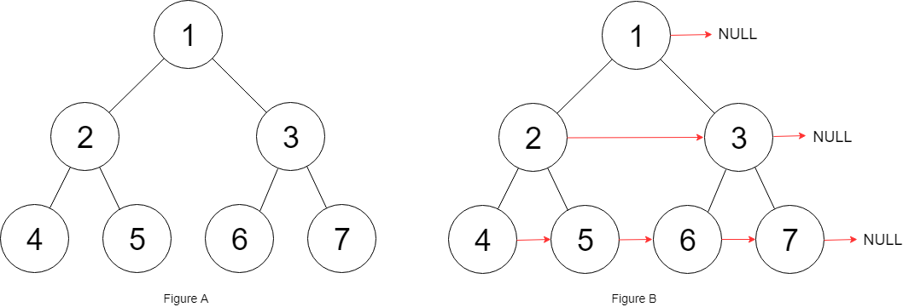

## Day15: 二叉树part02

### 二叉树的广度优先遍历

#### 102.二叉树的层序遍历
[LeetCode](https://leetcode.cn/problems/binary-tree-level-order-traversal/)  [视频讲解](https://www.bilibili.com/video/BV1GY4y1u7b2/)

##### 题目描述：

给你二叉树的根节点 `root` ，返回其节点值的 **层序遍历** 。 （即逐层地，从左到右访问所有节点）。

**示例 1：**


> 输入：root = [3,9,20,null,null,15,7]
> 输出：[[3],[9,20],[15,7]]

##### 我的解法：

使用队列实现二叉树广度优先遍历，动画如下：


```C++
class Solution
{
 public:
	vector<vector<int>> levelOrder(TreeNode* root)
	{
		if (root == nullptr) return {};

		vector<vector<int>> result;
		vector<int> layers;
		queue<TreeNode*> queue;
		queue.push(root);
		int size;	// 通过 size 记录每层的节点数

		while (!queue.empty())
		{
			size = queue.size();

			for (int i = size; i > 0; --i)
			{
				auto node = queue.front();
				queue.pop();

				layers.push_back(node->val);
				if (node->left != nullptr) queue.push(node->left);
				if (node->right != nullptr) queue.push(node->right);
			}
			result.push_back(layers);
			layers.clear();
		}

		return result;
	}
};
```

#### 107.二叉树的层次遍历 II
[LeetCode](https://leetcode.cn/problems/binary-tree-level-order-traversal-ii/)

##### 题目描述：

给你二叉树的根节点 `root` ，返回其节点值 **自底向上的层序遍历** 。 （即按从叶子节点所在层到根节点所在的层，逐层从左向右遍历）

**示例 1：**


> 输入：root = [3,9,20,null,null,15,7]
> 输出：[[15,7],[9,20],[3]]

##### 我的解法：

对 102.二叉树的层序遍历 的结果进行翻转即可

```C++
class Solution
{
 public:
	vector<vector<int>> levelOrderBottom(TreeNode* root)
	{
		if (root == nullptr) return {};

		vector<vector<int>> result;
		vector<int> layers;
		queue<TreeNode*> queue;
		queue.push(root);
		int size;    // 通过 size 记录每层的节点数

		while (!queue.empty())
		{
			size = queue.size();

			for (int i = size; i > 0; --i)
			{
				auto node = queue.front();
				queue.pop();

				layers.push_back(node->val);
				if (node->left != nullptr) queue.push(node->left);
				if (node->right != nullptr) queue.push(node->right);
			}
			result.push_back(layers);
			layers.clear();
		}

		reverse(result.begin(), result.end());
		return result;
	}
};
```

#### 199.二叉树的右视图
[LeetCode](https://leetcode.cn/problems/binary-tree-right-side-view/)

##### 题目描述：

给定一个二叉树的 **根节点** `root`，想象自己站在它的右侧，按照从顶部到底部的顺序，返回从右侧所能看到的节点值。

**示例 1:**


> 输入: [1,2,3,null,5,null,4]
> 输出: [1,3,4]

##### 我的解法：

层序遍历的时候，如果是单层的最后面的元素，就放进result数组中，随后返回result就可以了。

```C++
class Solution
{
 public:
	vector<int> rightSideView(TreeNode* root)
	{
		if (root == nullptr) return {};

		vector<int> result;
		queue<TreeNode*> queue;
		TreeNode* node;
		queue.push(root);

		int size; // 存放每层的节点数

		while (!queue.empty())
		{
			size = queue.size();

			for (int i = size; i > 0; --i)
			{
				node = queue.front();
				queue.pop();

				if (node->left != nullptr) queue.push(node->left);
				if (node->right != nullptr) queue.push(node->right);
			}

			result.push_back(node->val);

		}

		return result;
	}
};
```

#### 637.二叉树的层平均值
[LeetCode](https://leetcode.cn/problems/average-of-levels-in-binary-tree/)

##### 题目描述：

给定一个非空二叉树的根节点 `root` , 以数组的形式返回每一层节点的平均值。与实际答案相差 `10-5` 以内的答案可以被接受。

**示例 1：**


> 输入：root = [3,9,20,null,null,15,7]
> 输出：[3.00000,14.50000,11.00000]
> 解释：第 0 层的平均值为 3,第 1 层的平均值为 14.5,第 2 层的平均值为 11 。
> 因此返回 [3, 14.5, 11] 。

##### 我的解法：

层序遍历的时候把一层求个总和在取一个均值。

```C++
class Solution
{
 public:
	vector<double> averageOfLevels(TreeNode* root)
	{
		if (root == nullptr) return {};

		vector<double> result;
		double average;    // 记录每层的平均数
		int size;    // 记录每层节点数
		TreeNode* cur;
		queue<TreeNode*> queue;
		queue.push(root);

		while (!queue.empty())
		{
			average = 0;
			size = (int)queue.size();

			for (int i = size; i > 0; --i)
			{
				cur = queue.front();
				queue.pop();
				average += cur->val;

				if (cur->left != nullptr) queue.push(cur->left);
				if (cur->right != nullptr) queue.push(cur->right);
			}
			average /= size;
			result.push_back(average);
		}

		return result;
	}
};
```

#### 429.N叉树的层序遍历
[LeetCode](https://leetcode.cn/problems/n-ary-tree-level-order-traversal/)

##### 题目描述：

给定一个 N 叉树，返回其节点值的*层序遍历*。（即从左到右，逐层遍历）。

树的序列化输入是用层序遍历，每组子节点都由 null 值分隔（参见示例）。

**示例 1：**


> 输入：root = [1,null,3,2,4,null,5,6]
> 输出：[[1],[3,2,4],[5,6]]

**示例 2：**


> 输入：root = [1,null,2,3,4,5,null,null,6,7,null,8,null,9,10,null,null,11,null,12,null,13,null,null,14]
> 输出：[[1],[2,3,4,5],[6,7,8,9,10],[11,12,13],[14]]

##### 我的解法：

与层序遍历无异，只是孩子节点变多了

```C++
class Solution
{
 public:
	vector<vector<int>> levelOrder(Node* root)
	{
		if (root == nullptr) return {};

		vector<vector<int>> result;
		vector<int> nodes; // 记录每次节点值
		int size; // 记录每次节点数

		Node* cur;
		queue<Node*> queue;
		queue.push(root);
		while (!queue.empty())
		{
			size = queue.size();

			for (int i = size; i > 0; --i)
			{
				cur = queue.front();
				queue.pop();
				nodes.push_back(cur->val);

				for (auto item : cur->children)
				{
                    // 将所有孩子节点加入队列
					if (item != nullptr) queue.push(item);
				}
			}
			result.push_back(nodes);
			nodes.clear();
		}
		return result;
	}
};
```

#### 515.在每个树行中找最大值
[LeetCode](https://leetcode.cn/problems/find-largest-value-in-each-tree-row/)

##### 题目描述：

给定一棵二叉树的根节点 `root` ，请找出该二叉树中每一层的最大值。

**示例1：**


> 输入: root = [1,3,2,5,3,null,9]
> 输出: [1,3,9]

##### 我的解法：

层序遍历，取每一层的最大值

```C++
class Solution
{
 public:
	vector<int> largestValues(TreeNode* root)
	{
		if (root == nullptr) return {};

		vector<int> result;
		int size;
		int layer_max = INT_MIN;

		TreeNode* cur;
		queue<TreeNode*> queue;
		queue.push(root);
		while (!queue.empty())
		{
			size = (int)queue.size();

			for (int i = size; i > 0; --i)
			{
				cur = queue.front();
				queue.pop();
				layer_max = cur->val > layer_max ? cur->val : layer_max;

				if (cur->left != nullptr) queue.push(cur->left);
				if (cur->right != nullptr) queue.push(cur->right);
			}
			result.push_back(layer_max);
			layer_max = INT_MIN;
		}
		return result;
	}
};
```

#### 116.填充每个节点的下一个右侧节点指针
[LeetCode](https://leetcode.cn/problems/populating-next-right-pointers-in-each-node/)

##### 题目描述：

给定一个 **完美二叉树** ，其所有叶子节点都在同一层，每个父节点都有两个子节点。二叉树定义如下：

```C++
struct Node {
  int val;
  Node *left;
  Node *right;
  Node *next;
}
```

填充它的每个 next 指针，让这个指针指向其下一个右侧节点。如果找不到下一个右侧节点，则将 next 指针设置为 `NULL`。初始状态下，所有 next 指针都被设置为 `NULL`。

**示例 1：**



> 输入：root = [1,2,3,4,5,6,7]
> 输出：[1,#,2,3,#,4,5,6,7,#]
> 解释：给定二叉树如图 A 所示，你的函数应该填充它的每个 next 指针，以指向其下一个右侧节点，如图 B 所示。序列化的输出按层序遍历排列，同一层节点由 next 指针连接，'#' 标志着每一层的结束。

##### 我的解法：

依然是层序遍历，只不过在单层遍历的时候每个节点的 next 指针指向队列内的下一个节点，每层最后一个节点的 next 指针指向nullptr

```C++
class Solution
{
 public:
	Node* connect(Node* root)
	{
		if (root == nullptr) return nullptr;

		vector<int> result;
		int size;

		Node* cur;
		queue<Node*> queue;
		queue.push(root);
		while (!queue.empty())
		{
			size = (int)queue.size();

			for (int i = size; i > 0; --i)
			{
				cur = queue.front();
				queue.pop();
				cur->next = queue.front();	// next 指针指向下一个节点

				if (cur->left != nullptr) queue.push(cur->left);
				if (cur->right != nullptr) queue.push(cur->right);
			}
			cur->next = nullptr;	// 每层的最后一个节点的 next 指针指向nullptr
		}
		return root;
	}
};
```

#### 117.填充每个节点的下一个右侧节点指针II

[LeetCode](https://leetcode.cn/problems/populating-next-right-pointers-in-each-node-ii/)

##### 题目描述：

给定一个二叉树：

```C++
struct Node {
  int val;
  Node *left;
  Node *right;
  Node *next;
}
```

填充它的每个 next 指针，让这个指针指向其下一个右侧节点。如果找不到下一个右侧节点，则将 next 指针设置为 `NULL` 。初始状态下，所有 next 指针都被设置为 `NULL` 。

**示例 1：**


> 输入：root = [1,2,3,4,5,null,7]
> 输出：[1,#,2,3,#,4,5,7,#]
> 解释：给定二叉树如图 A 所示，你的函数应该填充它的每个 next 指针，以指向其下一个右侧节点，如图 B 所示。序列化输出按层序遍历顺序（由 next 指针连接），'#' 表示每层的末尾。

##### 我的解法：

这道题目说是二叉树，但116题目说是完整二叉树，其实没有任何差别，一样的代码一样的逻辑一样的味道

```C++
class Solution
{
 public:
	Node* connect(Node* root)
	{
		if (root == nullptr) return nullptr;

		vector<int> result;
		int size;

		Node* cur;
		queue<Node*> queue;
		queue.push(root);
		while (!queue.empty())
		{
			size = (int)queue.size();

			for (int i = size; i > 0; --i)
			{
				cur = queue.front();
				queue.pop();
				cur->next = queue.front();	// next 指针指向下一个节点

				if (cur->left != nullptr) queue.push(cur->left);
				if (cur->right != nullptr) queue.push(cur->right);
			}
			cur->next = nullptr;	// 每层的最后一个节点的 next 指针指向nullptr
		}
		return root;
	}
};
```

#### 104.二叉树的最大深度
[LeetCode](https://leetcode.cn/problems/maximum-depth-of-binary-tree/)

##### 题目描述：

给定一个二叉树 `root` ，返回其最大深度。二叉树的 **最大深度** 是指从根节点到最远叶子节点的最长路径上的节点数。

**示例 1：**


> 输入：root = [3,9,20,null,null,15,7]
> 输出：3

##### 我的解法：

一层一层的来遍历二叉树，记录一下遍历的层数就是二叉树的深度

```C++
class Solution
{
 public:
	int maxDepth(TreeNode* root)
	{
		if (root == nullptr) return 0;

		int size;
		int depth = 0;
		TreeNode* cur;
		queue<TreeNode*> queue;
		queue.push(root);

		while (!queue.empty())
		{
			size = queue.size();

			for (int i = size; i > 0; --i)
			{
				cur = queue.front();
				queue.pop();
				if (cur->left != nullptr) queue.push(cur->left);
				if (cur->right != nullptr) queue.push(cur->right);
			}
			++depth;
		}
		return depth;
	}
};
```

#### 111.二叉树的最小深度
[LeetCode](https://leetcode.cn/problems/minimum-depth-of-binary-tree/)

##### 题目描述：

给定一个二叉树，找出其最小深度。最小深度是从根节点到最近叶子节点的最短路径上的节点数量。

**示例 1：**


> 输入：root = [3,9,20,null,null,15,7]
> 输出：2

##### 我的解法：

只有当左右孩子都为空的时候，才说明遍历的最低点了。如果其中一个孩子为空则不是最低点

```C++
class Solution
{
 public:
	int minDepth(TreeNode* root)
	{
		if (root == nullptr) return 0;

		int size;
		int depth = 0;
		TreeNode* cur;
		queue<TreeNode*> queue;
		queue.push(root);

		while (!queue.empty())
		{
			size = queue.size();

			for (int i = size; i > 0; --i)
			{
				cur = queue.front();
				queue.pop();

				// 第一个出现的叶子节点就在最小深度的那层
				if (cur->right == nullptr && cur->left == nullptr)
					return depth + 1;

				if (cur->left != nullptr) queue.push(cur->left);
				if (cur->right != nullptr) queue.push(cur->right);
			}
			++depth;
		}
		return depth;
	}
};
```

### 226.翻转二叉树
[LeetCode]()  [文章讲解](https://programmercarl.com/0226.%E7%BF%BB%E8%BD%AC%E4%BA%8C%E5%8F%89%E6%A0%91.html)  [视频讲解](https://leetcode.cn/problems/invert-binary-tree/)

#### 题目描述：

给你一棵二叉树的根节点 `root` ，翻转这棵二叉树，并返回其根节点。

**示例 1：**


> 输入：root = [4,2,7,1,3,6,9]
> 输出：[4,7,2,9,6,3,1]

#### 我的解法：

层序遍历的同时，交换每个节点的左子节点和右子节点

```C++
class Solution
{
 public:
	TreeNode* invertTree(TreeNode* root)
	{
		if (root == nullptr) return nullptr;

		int size;
		TreeNode* cur;
		queue<TreeNode*> queue;
		queue.push(root);
		while (!queue.empty())
		{
			size = queue.size();

			for (int i = size; i > 0; --i)
			{
				cur = queue.front();
				queue.pop();
				swap(cur->left, cur->right);
				if(cur->left!= nullptr) queue.push(cur->left);
				if(cur->right!= nullptr) queue.push(cur->right);
			}
			size = 0;
		}
		return root;
	}
};
```

#### 递归法：

遍历的过程中去翻转每一个节点的左右孩子就可以达到整体翻转的效果。注意只要把每一个节点的左右孩子翻转一下，就可以达到整体翻转的效果。

**这道题目使用前序遍历和后序遍历都可以，唯独中序遍历不方便，因为中序遍历会把某些节点的左右孩子翻转了两次，而有的节点没有被交换！**

以前序遍历为例，通过动画来看一下翻转的过程:


```C++
class Solution
{
 public:
	TreeNode* invertTree(TreeNode* root)
	{
		if (root == nullptr) return nullptr;

		int size;
		TreeNode* cur;
		queue<TreeNode*> queue;
		queue.push(root);
		while (!queue.empty())
		{
			size = queue.size();

			for (int i = size; i > 0; --i)
			{
				cur = queue.front();
				queue.pop();
				swap(cur->left, cur->right);
				if(cur->left!= nullptr) queue.push(cur->left);
				if(cur->right!= nullptr) queue.push(cur->right);
			}
			size = 0;
		}
		return root;
	}
};
```

### 101. 对称二叉树
[LeetCode](https://leetcode.cn/problems/symmetric-tree/)  [文章讲解](https://programmercarl.com/0101.%E5%AF%B9%E7%A7%B0%E4%BA%8C%E5%8F%89%E6%A0%91.html)  [视频讲解](https://www.bilibili.com/video/BV1ue4y1Y7Mf/)

#### 题目描述：

给你一个二叉树的根节点 `root` ， 检查它是否轴对称。

**示例 1：**


> 输入：root = [1,2,2,3,4,4,3]
> 输出：true

**示例 2：**


> 输入：root = [1,2,2,null,3,null,3]
> 输出：false

#### 我的解法：

递归法，结束条件判断要清晰

```C++
class Solution
{
 public:
	void _isSymmetric(TreeNode* left, TreeNode* right, bool& flag)
	{
		// 首先排除空节点的情况
		if ((left == nullptr) && (right == nullptr))
			return;
		else if (left == nullptr)
		{
			flag = false;
			return;
		}
		else if (right == nullptr)
		{
			flag = false;
			return;
		}
		// 排除了空节点，再排除数值不相同的情况
		else if (left->val != right->val)
		{
			flag = false;
			return;
		}

		// 此时就是：左右节点都不为空，且数值相同的情况
		// 此时才做递归，做下一层的判断
		_isSymmetric(left->right, right->left, flag);
		_isSymmetric(left->left, right->right, flag);
	}

	bool isSymmetric(TreeNode* root)
	{
		if (root == nullptr) return false;

		bool flag = true;
		_isSymmetric(root->left, root->right, flag);
		return flag;
	}
};
```

### 今日总结

今天刷题刷爽了，层序遍历一招鲜吃遍天。
