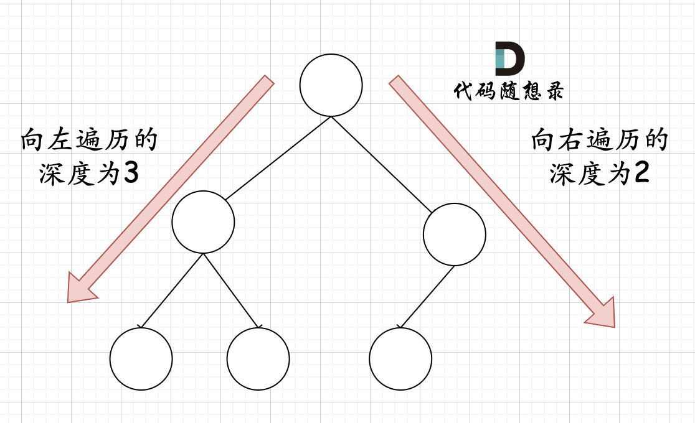

## Day16: 二叉树part03

### 104. 二叉树的最大深度
[LeetCode](https://leetcode.cn/problems/maximum-depth-of-binary-tree/)  [文章讲解](https://programmercarl.com/0104.%E4%BA%8C%E5%8F%89%E6%A0%91%E7%9A%84%E6%9C%80%E5%A4%A7%E6%B7%B1%E5%BA%A6.html)  [视频讲解](https://www.bilibili.com/video/BV1Gd4y1V75u/)

#### 题目描述：

给你二叉树的根节点 `root` ，返回其节点值的 **层序遍历** 。 （即逐层地，从左到右访问所有节点）。

**示例 1：**


> 输入：root = [3,9,20,null,null,15,7]
> 输出：[[3],[9,20],[15,7]]

[非递归法（层序遍历）](./day15二叉树part02.md#102二叉树的层序遍历)

#### 我的解法（递归法）：

本题可以使用前序（中左右），也可以使用后序遍历（左右中），使用前序求的就是深度，使用后序求的是高度。

```C++
class Solution2	// 递归法
{
 public:
	int getDepth(TreeNode* node)
	{
		if (node == nullptr) return 0;
		int leftDepth = getDepth(node->left);
		int rightDepth = getDepth(node->right);

		// 加1是因为算上当前中间节点
		return max(leftDepth, rightDepth) + 1;
	}

	int maxDepth(TreeNode* root)
	{
		return getDepth(root);
	}
};
```

### 559.N叉树的最大深度
[LeetCode](https://leetcode.cn/problems/maximum-depth-of-n-ary-tree/)

#### 题目描述：

给定一个 N 叉树，找到其最大深度。最大深度是指从根节点到最远叶子节点的最长路径上的节点总数。

N 叉树输入按层序遍历序列化表示，每组子节点由空值分隔（请参见示例）。

**示例 1：**


> 输入：root = [1,null,3,2,4,null,5,6]
> 输出：3

#### 我的解法（递归法）：

与 104. 二叉树的最大深度 类似，只不过访问子节点变成了使用 for 循环

```C++
class Solution
{
 public:
	int getDepth(Node* node)
	{
		if (node == nullptr) return 0;

		int depth = 0;
		for (auto it : node->children)
		{
			int temp = getDepth(it);
			if (temp > depth) depth = temp;
		}

		// 加1是因为算上当前中间节点
		return depth + 1;
	}

	int maxDepth(Node* root)
	{
		return getDepth(root);
	}
};
```

### 111.二叉树的最小深度
[LeetCode](https://leetcode.cn/problems/minimum-depth-of-binary-tree/)  [文章讲解](https://programmercarl.com/0111.%E4%BA%8C%E5%8F%89%E6%A0%91%E7%9A%84%E6%9C%80%E5%B0%8F%E6%B7%B1%E5%BA%A6.html)  [视频讲解](https://www.bilibili.com/video/BV1QD4y1B7e2/)

#### 题目描述：

给定一个二叉树，找出其最小深度。最小深度是从根节点到最近叶子节点的最短路径上的节点数量。

**示例 1：**


> 输入：root = [3,9,20,null,null,15,7]
> 输出：2

[非递归法（层序遍历）](./day15二叉树part02.md#111二叉树的最小深度)

#### 我的解法：

本题有一个误区，在处理节点的过程中，最大深度很容易理解，最小深度就不那么好理解，如图：


这就重新审题了，题目中说的是：**最小深度是从根节点到最近叶子节点的最短路径上的节点数量。**，注意是**叶子节点**。

什么是叶子节点，**左右孩子都为空的节点才是叶子节点**！

```C++
class Solution2	// 递归法
{
 public:
	int getDepth(TreeNode* node)
	{
		int depth = 0;

		if (node == nullptr) return 0;
		int leftDepth = getDepth(node->left);
		int rightDepth = getDepth(node->right);

		// 左右孩子都为空的节点才是叶子节点！
		// 计算的左右子树深度都为 0 才表示最小深度为 0，否则是非叶子节点
		// 也就是 左右深度只有一个 0 并不代表最小深度为 0，直接 min 会出错
		if (leftDepth == 0) depth = rightDepth;
		else if (rightDepth == 0) depth = leftDepth;
		else depth = min(leftDepth, rightDepth);

		return depth + 1;
	}

	int minDepth(TreeNode* root)
	{
		return getDepth(root);
	}
};
```

### 222.完全二叉树的节点个数
[LeetCode](https://leetcode.cn/problems/count-complete-tree-nodes/)  [文章讲解](https://programmercarl.com/0222.%E5%AE%8C%E5%85%A8%E4%BA%8C%E5%8F%89%E6%A0%91%E7%9A%84%E8%8A%82%E7%82%B9%E4%B8%AA%E6%95%B0.html#)  [视频讲解](https://www.bilibili.com/video/BV1eW4y1B7pD/)

#### 题目描述：

给你一棵 **完全二叉树** 的根节点 `root` ，求出该树的节点个数。

[完全二叉树](https://baike.baidu.com/item/完全二叉树/7773232?fr=aladdin) 的定义如下：在完全二叉树中，除了最底层节点可能没填满外，其余每层节点数都达到最大值，并且最下面一层的节点都集中在该层最左边的若干位置。若最底层为第 `h` 层，则该层包含 `1~ 2h` 个节点。

**示例 1：**


> 输入：root = [1,2,3,4,5,6]
> 输出：6

#### 我的解法（递归法）：

直接当成普通的二叉树进行遍历，然后计算出节点数目。

```C++
class Solution
{
 private:
	int getNodesNum(TreeNode* cur)
	{
		if (cur == nullptr) return 0;
		int leftNum = getNodesNum(cur->left);      	// 左
		int rightNum = getNodesNum(cur->right);    	// 右
		int treeNum = leftNum + rightNum + 1;      	// 中
		return treeNum;
	}
 public:
	int countNodes(TreeNode* root)
	{
		return getNodesNum(root);
	}
};
```

#### 利用完全二叉树的性质：

完全二叉树只有两种情况，情况一：就是满二叉树，情况二：最后一层叶子节点没有满。

对于情况一，可以直接用 2^树深度 - 1 来计算，注意这里根节点深度为1。

对于情况二，分别递归左孩子，和右孩子，递归到某一深度一定会有左孩子或者右孩子为满二叉树，然后依然可以按照情况1来计算。

完全二叉树（一）如图： 

完全二叉树（二）如图： 

可以看出如果整个树不是满二叉树，就递归其左右孩子，直到遇到满二叉树为止，用公式计算这个子树（满二叉树）的节点数量。

**如何去判断一个左子树或者右子树是不是满二叉树**：在完全二叉树中，如果递归向左遍历的深度等于递归向右遍历的深度，那说明就是满二叉树。如图：


在完全二叉树中，如果递归向左遍历的深度不等于递归向右遍历的深度，则说明不是满二叉树，如图：



那有录友说了，这种情况，递归向左遍历的深度等于递归向右遍历的深度，但也不是满二叉树，如题：


如果这么想，大家就是对 完全二叉树理解有误区了，**以上这棵二叉树，它根本就不是一个完全二叉树**！

代码如下

```C++
class Solution2
{
 public:
	int countNodes(TreeNode* root)
	{
		if (root == nullptr) return 0;
		TreeNode* left = root->left;
		TreeNode* right = root->right;
		int leftDepth = 0, rightDepth = 0; // 这里初始为0是有目的的，为了下面求指数方便
		while (left)
		{  // 求左子树深度
			left = left->left;
			leftDepth++;
		}
		while (right)
		{ // 求右子树深度
			right = right->right;
			rightDepth++;
		}
		if (leftDepth == rightDepth)
		{
			return (2 << leftDepth) - 1; // 注意(2<<1) 相当于2^2，所以leftDepth初始为0
		}
		return countNodes(root->left) + countNodes(root->right) + 1;
	}
};
```

### 今日总结

今天的题目都比较容易，都能快速想到解法。
