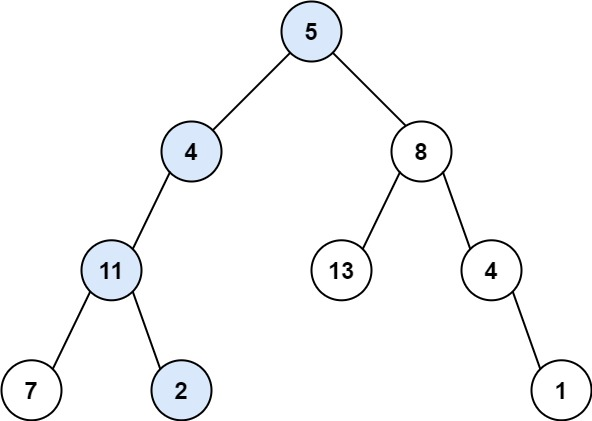

## Day18: 二叉树part05

### 513.找树左下角的值
[LeetCode](https://leetcode.cn/problems/find-bottom-left-tree-value/)  [文章讲解](https://programmercarl.com/0513.%E6%89%BE%E6%A0%91%E5%B7%A6%E4%B8%8B%E8%A7%92%E7%9A%84%E5%80%BC.html)  [视频讲解](https://www.bilibili.com/video/BV1424y1Z7pn/)

#### 题目描述：

给定一个二叉树的 **根节点** `root`，请找出该二叉树的 **最底层 最左边** 节点的值。假设二叉树中至少有一个节点。

**示例 1:**


> 输入: root = [2,1,3]
> 输出: 1

**示例 2:**


> 输入: [1,2,3,4,null,5,6,null,null,7]
> 输出: 7

#### 我的解法（层序遍历）：

进行层序遍历，记录每一层的第一个节点，遍历完最后一层后，返回最后一层第一个节点的值，即为树最左下角的值。

```C++
class Solution // 层序遍历
{
 public:
	int findBottomLeftValue(TreeNode* root)
	{
		if (root == nullptr) return 0;

		TreeNode* cur;
		TreeNode* result;
		queue<TreeNode*> queue;
		queue.push(root);

		while (!queue.empty())
		{
			int size = queue.size();

			result = queue.front();
			for (int i = 0; i < size; ++i)
			{
				cur = queue.front();
				queue.pop();

				if (cur->left != nullptr) queue.push(cur->left);
				if (cur->right != nullptr) queue.push(cur->right);
			}
		}

		return result->val;
	}
};
```

#### 递归法：

深度最大的叶子节点一定是最后一行。那么如何找最左边的呢？可以使用前序遍历（当然中序，后序都可以，因为本题没有 中间节点的处理逻辑，只要左优先就行），保证**优先左边搜索**，然后记录深度最大的叶子节点，此时就是树的最后一行最左边的值。

```C++
class Solution2 // 递归
{
 public:
    Solution2()
    {
       reset();
    }

    int findBottomLeftValue(TreeNode* root)
    {
       traversal(root, 0);
       int result = m_result;
       reset();
       return result;
    }

 private:
    void reset()
    {
       m_maxDepth = INT_MIN;
    }

    void traversal(TreeNode* cur, int depth)
    {
       if (cur->left == nullptr && cur->right == nullptr)
       {
          /* 因为左节点的优先级比右节点高，所以若最后一层有很多节点，
           * 但是它们的深度都不大于第一个左节点。因此 结果就是第一个到达最深深度的节点
           */
          if (depth > m_maxDepth)
          {
             m_maxDepth = depth;
             m_result = cur->val;
          }
          return;
       }

       if (cur->left != nullptr) traversal(cur->left, depth + 1); // 隐藏着回溯
       if (cur->right != nullptr) traversal(cur->right, depth + 1);   // 隐藏着回溯
    }

 private:
    int m_maxDepth;
    int m_result;
};
```

### 112. 路径总和

[LeetCode](https://leetcode.cn/problems/path-sum/)  [文章讲解](https://programmercarl.com/0112.%E8%B7%AF%E5%BE%84%E6%80%BB%E5%92%8C.html)  [视频讲解](https://www.bilibili.com/video/BV19t4y1L7CR/)

#### 题目描述：

给你二叉树的根节点 `root` 和一个表示目标和的整数 `targetSum` 。判断该树中是否存在 **根节点到叶子节点** 的路径，这条路径上所有节点值相加等于目标和 `targetSum` 。如果存在，返回 `true` ；否则，返回 `false` 。

**示例 1：**



> 输入：root = [5,4,8,11,null,13,4,7,2,null,null,null,1], targetSum = 22
> 输出：true
> 解释：等于目标和的根节点到叶节点路径如上图所示。

#### 我的解法：

遍历出所有的路径和，然后寻找是否有符合条件的目标值。（运行效率不是最优）

```C++
class Solution
{
 private:
	void getPathSum(TreeNode* cur, int sum, vector<int>& sums)
	{
		if (cur->left == nullptr && cur->right == nullptr)
		{
			sum += cur->val;
			sums.push_back(sum);
		}

		if (cur->left != nullptr) getPathSum(cur->left, sum + cur->val, sums);
		if (cur->right != nullptr) getPathSum(cur->right, sum + cur->val, sums);

		sum += cur->val;
	}

 public:
	bool hasPathSum(TreeNode* root, int targetSum)
	{
		if (root == nullptr) return false;

		int sum = 0;
		vector<int> sums;
		getPathSum(root, sum, sums);

		for(auto it : sums)
		{
			if(it == targetSum)
				return true;
		}

		return false;
	}
};
```

#### 参考解法：

添加一个计数器，这个计数器用来计算二叉树的一条边之和是否正好是目标和

```C++
class Solution2
{
 private:
    // count 用于记录当前的和（还差多少满足条件）
    bool traversal(TreeNode* cur, int count)
    {
       // 叶子节点且满足和
       if (cur->left == nullptr && cur->right == nullptr && count == 0) return true;

       // 叶子节点但不满足和
       if (cur->left == nullptr && cur->right == nullptr) return false;

       // 左
       if (cur->left != nullptr)
       {
          // count - cur->left->val 隐含回溯
          if (traversal(cur->left, count - cur->left->val))
             return true;
       }

       // 右
       if (cur->right != nullptr)
       {
          // count - cur->right->val 隐含回溯
          if (traversal(cur->right, count - cur->right->val)) return true;
       }

       return false;
    }

 public:
    bool hasPathSum(TreeNode* root, int targetSum)
    {
       if (root == nullptr) return false;

       return traversal(root, targetSum - root->val);
    }
};
```

#### 优化解法：

添加一个计数器，这个计数器用来计算二叉树的一条边之和是否正好是目标和，满足计数和的路径加入到结果中。

```C++
class Solution2
{
 private:
    void getPath(TreeNode* cur, int count, vector<int>& path, vector<vector<int>>& paths)
    {
       // 中
       path.push_back(cur->val);

       // 是叶子节点，且值符合条件
       if (cur->left == nullptr && cur->right == nullptr && count == 0)
       {
          paths.push_back(path);
          return;
       }

       // 是叶子节点，但其值不符合条件
       if (cur->left == nullptr && cur->right == nullptr)
       {
          return;
       }

       // 左
       if (cur->left != nullptr)
       {
          getPath(cur->left, count - cur->left->val, path, paths);
          path.pop_back();
       }

       // 左
       if (cur->right != nullptr)
       {
          getPath(cur->right, count - cur->right->val, path, paths);
          path.pop_back();
       }
    }

 public:
    vector<vector<int>> pathSum(TreeNode* root, int targetSum)
    {
       if(root == nullptr) return {};

       vector<vector<int>> result;
       vector<int> path;
       getPath(root, targetSum - root->val, path, result);
       return result;
    }
};
```

### 113. 路径总和ii

[LeetCode](https://leetcode.cn/problems/path-sum-ii/)  [文章讲解](https://programmercarl.com/0112.%E8%B7%AF%E5%BE%84%E6%80%BB%E5%92%8C.html#%E7%9B%B8%E5%85%B3%E9%A2%98%E7%9B%AE%E6%8E%A8%E8%8D%90)

#### 题目描述：

给你二叉树的根节点 `root` 和一个整数目标和 `targetSum` ，找出所有 **从根节点到叶子节点** 路径总和等于给定目标和的路径。

**示例 1：**


> 输入：root = [5,4,8,11,null,13,4,7,2,null,null,5,1], targetSum = 22
> 输出：[[5,4,11,2],[5,8,4,5]]

#### 我的解法：

遍历出所有的路径，然后寻找是否有符合条件的路径。（运行效率不是最优）

```C++
class Solution
{
 private:
	void getPath(TreeNode* cur, vector<int>& path, vector<vector<int>>& paths)
	{
		path.push_back(cur->val);

		if (cur->left == nullptr && cur->right == nullptr)
		{
			paths.push_back(path);
			return;
		}

		if (cur->left != nullptr)
		{
			getPath(cur->left, path, paths);
			path.pop_back();
		}

		if (cur->right != nullptr)
		{
			getPath(cur->right, path, paths);
			path.pop_back();
		}
	}

 public:
	vector<vector<int>> pathSum(TreeNode* root, int targetSum)
	{
		if (root == nullptr) return {};

		vector<int> path;
		vector<vector<int>> paths;
		getPath(root, path, paths);

		for (auto itm = paths.begin(); itm != paths.end();)
		{
			int sum = 0;
			for (auto num : *itm)
			{
				sum += num;
			}
			if (sum != targetSum)
				itm = paths.erase(itm);
			else
				++itm;
		}

		return paths;
	}
};
```

### 106.从中序与后序遍历序列构造二叉树
[LeetCode](https://leetcode.cn/problems/construct-binary-tree-from-inorder-and-postorder-traversal/)  [文章讲解](https://programmercarl.com/0106.%E4%BB%8E%E4%B8%AD%E5%BA%8F%E4%B8%8E%E5%90%8E%E5%BA%8F%E9%81%8D%E5%8E%86%E5%BA%8F%E5%88%97%E6%9E%84%E9%80%A0%E4%BA%8C%E5%8F%89%E6%A0%91.html)  [视频讲解](https://www.bilibili.com/video/BV1vW4y1i7dn/)

#### 题目描述：

给定两个整数数组 `inorder` 和 `postorder` ，其中 `inorder` 是二叉树的中序遍历， `postorder` 是同一棵树的后序遍历，请你构造并返回这颗 *二叉树* 。题目保证`preorder` 和 `inorder` 均 **无重复** **元素**。

**示例 1:**


> 输入：inorder = [9,3,15,20,7], postorder = [9,15,7,20,3]
> 输出：[3,9,20,null,null,15,7]

#### 递归解法：

流程如图：


那么代码应该怎么写呢？

说到一层一层切割，就应该想到了递归。

来看一下一共分几步：

- 第一步：如果数组大小为零的话，说明是空节点了。

- 第二步：如果不为空，那么取后序数组最后一个元素作为节点元素。

- 第三步：找到后序数组最后一个元素在中序数组的位置，作为切割点

- 第四步：切割中序数组，切成中序左数组和中序右数组 （顺序别搞反了，一定是先切中序数组）

- 第五步：切割后序数组，切成后序左数组和后序右数组

- 第六步：递归处理左区间和右区间

**切割的标准，是左闭右开，还有左开右闭，还是左闭右闭，这个就是不变量，要在递归中保持这个不变量。**

```C++
class Solution
{
 public:
	TreeNode* buildTree(vector<int>& inorder, vector<int>& postorder)
	{
		// 后序数组为 0，空节点
		if (postorder.empty()) return nullptr;

		// 后序数组最后一个元素为节点元素
		int rootValue = postorder.back();
		auto root = new TreeNode(rootValue);
		if (postorder.size() == 1) return root;

		// 寻找中序数组切割点
		int index = 0;
		for (; index < inorder.size(); index++)
		{
			if (inorder[index] == rootValue) break;
		}

		// 切中序数组
		// 左闭右开区间：[0, delimiterIndex)
		auto leftInorder = vector<int>(inorder.begin(), inorder.begin() + index);
		// [delimiterIndex + 1, end)
		auto rightInorder = vector<int>(inorder.begin() + index + 1, inorder.end());

		// 切后序数组
		// 依然左闭右开，注意这里使用了左中序数组大小作为切割点
		// [0, leftInorder.size)
		auto leftPostorder = vector<int>(postorder.begin(), postorder.begin() + leftInorder.size());
		// [leftInorder.size(), end-1)，end-1 即最后一个值，为中序节点
		auto rightPostorder = vector<int>(postorder.begin() + leftInorder.size(), postorder.end() - 1);

		// 递归处理左区间和后区间
		root->left = buildTree(leftInorder, leftPostorder);
		root->right = buildTree(rightInorder, rightPostorder);

		return root;
	}
};
```

### 105.从前序与中序遍历序列构造二叉树
[LeetCode](https://leetcode.cn/problems/construct-binary-tree-from-preorder-and-inorder-traversal/)  [文章讲解](https://programmercarl.com/0106.%E4%BB%8E%E4%B8%AD%E5%BA%8F%E4%B8%8E%E5%90%8E%E5%BA%8F%E9%81%8D%E5%8E%86%E5%BA%8F%E5%88%97%E6%9E%84%E9%80%A0%E4%BA%8C%E5%8F%89%E6%A0%91.html#%E7%9B%B8%E5%85%B3%E9%A2%98%E7%9B%AE%E6%8E%A8%E8%8D%90)

#### 题目描述：

给定两个整数数组 `preorder` 和 `inorder` ，其中 `preorder` 是二叉树的**先序遍历**， `inorder` 是同一棵树的**中序遍历**，请构造二叉树并返回其根节点。题目保证`preorder` 和 `inorder` 均 **无重复** 元素

**示例 1:**


> 输入: preorder = [3,9,20,15,7], inorder = [9,3,15,20,7]
> 输出: [3,9,20,null,null,15,7]

#### 我的解法：

思路同 106.从中序与后序遍历序列构造二叉树，区别在于区间的分割略有不同。

```C++
class Solution
{
 public:
	TreeNode* buildTree(vector<int>& preorder, vector<int>& inorder)
	{
		// 空节点返回
		if (preorder.empty()) return nullptr;

		// 根节点为先序遍历的第一个节点
		int rootValue = preorder.front();
		auto root = new TreeNode(rootValue);
		if (preorder.size() == 1) return root;    // 叶子节点返回

		// 寻找中序遍历的分割点
		int index = 0;
		for (; index < inorder.size(); ++index)
		{
			if (inorder[index] == rootValue) break;
		}

		// 分割中序，左开有闭
		auto leftInorder = vector<int>(inorder.begin(), inorder.begin() + index);
		auto rightInorder = vector<int>(inorder.begin() + index + 1, inorder.end());

		// 分割前序，左开有闭
		auto leftPreorder = vector<int>(preorder.begin() + 1, preorder.begin() + 1 + leftInorder.size());
		auto rightPreorder = vector<int>(preorder.begin() + 1 + leftInorder.size(), preorder.end());

		// 递归处理
		root->left = buildTree(leftPreorder, leftInorder);
		root->right = buildTree(rightPreorder, rightInorder);

		return root;
	}
};
```
### 今日总结

想法还是太简单了，可以一步解决的事情总是分成了两步来做。构造二叉树很巧妙，有学到了。