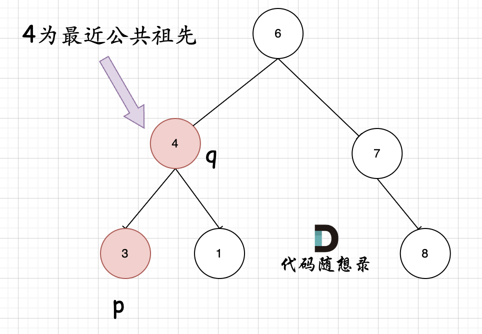

## Day21: 二叉树part07

### 530.二叉搜索树的最小绝对差
[LeetCode](https://leetcode.cn/problems/minimum-absolute-difference-in-bst/)  [文章讲解](https://programmercarl.com/0530.%E4%BA%8C%E5%8F%89%E6%90%9C%E7%B4%A2%E6%A0%91%E7%9A%84%E6%9C%80%E5%B0%8F%E7%BB%9D%E5%AF%B9%E5%B7%AE.html)  [视频讲解](https://www.bilibili.com/video/BV1DD4y11779/)

#### 题目描述：

给你一个二叉搜索树的根节点 `root` ，返回 **树中任意两不同节点值之间的最小差值** 。

差值是一个正数，其数值等于两值之差的绝对值。

**示例 1：**


> 输入：root = [4,2,6,1,3]
> 输出：1

#### 我的解法（直观解法）：

二叉搜索树采用中序遍历转换成有序数组，然后遍历一遍数组，就统计出来最小差值了

```C++
// 先中序遍历，然后取遍历符合条件的结果
class Solution
{
 private:
	vector<int> m_vec;

	void traversal(TreeNode* cur)
	{
		if (cur == nullptr) return;

		traversal(cur->left);
		m_vec.push_back(cur->val);
		traversal(cur->right);
	}

 public:
	int getMinimumDifference(TreeNode* root)
	{
		m_vec.clear();
		traversal(root);

		int result = INT_MAX;
		for (int i = 0; i < m_vec.size() - 1; ++i)
		{
			result = min(result, m_vec[i + 1] - m_vec[i]);
		}

		return result;
	}
};
```

#### 递归法：

在二叉搜素树中序遍历的过程中，用一个pre节点记录一下cur节点的前一个节点，进行判断


```C++

```


### 501.二叉搜索树中的众数

[LeetCode](https://leetcode.cn/problems/find-mode-in-binary-search-tree/)  [文章讲解](https://programmercarl.com/0501.%E4%BA%8C%E5%8F%89%E6%90%9C%E7%B4%A2%E6%A0%91%E4%B8%AD%E7%9A%84%E4%BC%97%E6%95%B0.html)  [视频讲解](https://www.bilibili.com/video/BV1fD4y117gp/)

#### 题目描述：

给你一个含重复值的二叉搜索树（BST）的根节点 `root` ，找出并返回 BST 中的所有 [众数](https://baike.baidu.com/item/众数/44796)（即，出现频率最高的元素）。

如果树中有不止一个众数，可以按 **任意顺序** 返回。

假定 BST 满足如下定义：

- 结点左子树中所含节点的值 **小于等于** 当前节点的值
- 结点右子树中所含节点的值 **大于等于** 当前节点的值
- 左子树和右子树都是二叉搜索树

**示例 1：**


> 输入：root = [1,null,2,2]
> 输出：[2]

#### 我的解法：

因为二叉搜索树的中序遍历是有序的，遍历的过程记录上一个节点，若与当前节点相同则众数的计数就加一。

```C++
class Solution
{
 private:
	TreeNode* pre = nullptr;
	vector<int> result;
	int max_count = 0;
	int count = 0;

	void traversal(TreeNode* cur)
	{
		if (cur == nullptr) return;

		// 左
		traversal(cur->left);

		// 中
		if (pre == nullptr) count++;
		else
		{
			if (cur->val == pre->val) count++;
			else count = 1;
		}

		if (count > max_count)
		{
			result.clear();
			result.push_back(cur->val);
			max_count = count;
		}
		else if (count == max_count)
		{
			result.push_back(cur->val);
		}
		pre = cur;

		// 右
		traversal(cur->right);
	}

 public:
	vector<int> findMode(TreeNode* root)
	{
		pre = nullptr;
		result.clear();
		max_count = 0;
		count = 0;

		traversal(root);
		return result;
	}
};
```

#### 拓展：

如果不是二叉搜索树，最直观的方法一定是把这个树都遍历了，用map统计频率，把频率排个序，最后取前面高频的元素的集合。

如果想直接对map中的value排序，还真做不到，C++中如果使用std::map或者std::multimap可以对key排序，但不能对value排序。所以要把map转化数组即vector，再进行排序，当然vector里面放的也是`pair<int, int>`类型的数据，第一个int为元素，第二个int为出现频率。

```C++
class Solution {
private:

void searchBST(TreeNode* cur, unordered_map<int, int>& map) { // 前序遍历
    if (cur == NULL) return ;
    map[cur->val]++; // 统计元素频率
    searchBST(cur->left, map);
    searchBST(cur->right, map);
    return ;
}
bool static cmp (const pair<int, int>& a, const pair<int, int>& b) {
    return a.second > b.second;
}
public:
    vector<int> findMode(TreeNode* root) {
        unordered_map<int, int> map; // key:元素，value:出现频率
        vector<int> result;
        if (root == NULL) return result;
        searchBST(root, map);
        vector<pair<int, int>> vec(map.begin(), map.end());
        sort(vec.begin(), vec.end(), cmp); // 给频率排个序
        result.push_back(vec[0].first);
        for (int i = 1; i < vec.size(); i++) {
            // 取最高的放到result数组中
            if (vec[i].second == vec[0].second) result.push_back(vec[i].first);
            else break;
        }
        return result;
    }
};
```

### 236. 二叉树的最近公共祖先

[LeetCode](https://leetcode.cn/problems/lowest-common-ancestor-of-a-binary-tree/)  [文章讲解](https://programmercarl.com/0236.%E4%BA%8C%E5%8F%89%E6%A0%91%E7%9A%84%E6%9C%80%E8%BF%91%E5%85%AC%E5%85%B1%E7%A5%96%E5%85%88.html)  [视频讲解](https://www.bilibili.com/video/BV1jd4y1B7E2/)

#### 题目描述：

给定一个二叉树, 找到该树中两个指定节点的最近公共祖先。

[百度百科](https://baike.baidu.com/item/最近公共祖先/8918834?fr=aladdin)中最近公共祖先的定义为：“对于有根树 T 的两个节点 p、q，最近公共祖先表示为一个节点 x，满足 x 是 p、q 的祖先且 x 的深度尽可能大（**一个节点也可以是它自己的祖先**）。”

**示例 1：**


> 输入：root = [3,5,1,6,2,0,8,null,null,7,4], p = 5, q = 1
> 输出：3
> 解释：节点 5 和节点 1 的最近公共祖先是节点 3 。

**示例 2：**


> 输入：root = [3,5,1,6,2,0,8,null,null,7,4], p = 5, q = 4
> 输出：5
> 解释：节点 5 和节点 4 的最近公共祖先是节点 5 。因为根据定义最近公共祖先节点可以为节点本身。

#### 思路：

遇到这个题目首先想的是要是能自底向上查找就好了，这样就可以找到公共祖先了。而二叉树回溯的过程就是从低到上，并且后序遍历（左右中）就是天然的回溯过程，可以根据左右子树的返回值，来处理中节点的逻辑。

如何判断一个节点是节点q和节点p的公共祖先：**如果找到一个节点，发现左子树出现结点p，右子树出现节点q，或者 左子树出现结点q，右子树出现节点p，那么该节点就是节点p和q的最近公共祖先。** 即情况一：


判断逻辑是 如果递归遍历遇到q，就将q返回，遇到p 就将p返回，那么如果 左右子树的返回值都不为空，说明此时的中节点，一定是q 和p 的最近祖先。

对于节点本身p(q)，它拥有一个子孙节点q(p)。情况二：



其实情况一 和 情况二 代码实现过程都是一样的，也可以说，实现情况一的逻辑，顺便包含了情况二。

因为遇到 q 或者 p 就返回，这样也包含了 q 或者 p 本身就是 公共祖先的情况。

**递归三部曲**：

- 确定递归函数返回值以及参数

需要递归函数返回值，来告诉我们是否找到节点q或者p，那么返回值为bool类型就可以了。但我们还要返回最近公共节点，可以利用上题目中返回值是TreeNode * ，那么如果遇到p或者q，就把q或者p返回，返回值不为空，就说明找到了q或者p。

代码如下：

```cpp
TreeNode* lowestCommonAncestor(TreeNode* root, TreeNode* p, TreeNode* q)
```

- 确定终止条件

遇到空的话，因为树都是空了，所以返回空。

如果 root == q，或者 root == p，说明找到 q p ，则将其返回，这个返回值，后面在中节点的处理过程中会用到，那么中节点的处理逻辑，下面讲解。

代码如下：

```cpp
if (root == q || root == p || root == NULL) return root;
```

- 确定单层递归逻辑

值得注意的是 本题函数有返回值，是因为回溯的过程需要递归函数的返回值做判断，但本题我们依然要遍历树的所有节点。

如果递归函数有返回值，如何区分要搜索一条边，还是搜索整个树呢？

搜索一条边的写法：

```cpp
if (递归函数(root->left)) return ;

if (递归函数(root->right)) return ;
```

搜索整个树写法：

```cpp
left = 递归函数(root->left);  // 左
right = 递归函数(root->right); // 右
left与right的逻辑处理;         // 中 
```

**在递归函数有返回值的情况下：如果要搜索一条边，递归函数返回值不为空的时候，立刻返回，如果搜索整个树，直接用一个变量left、right接住返回值，这个left、right后序还有逻辑处理的需要，也就是后序遍历中处理中间节点的逻辑（也是回溯）**。

那么为什么要遍历整棵树呢？直观上来看，找到最近公共祖先，直接一路返回就可以了。

如图：


就像图中一样直接返回7。

但事实上还要遍历根节点右子树（即使此时已经找到了目标节点了），也就是图中的节点4、15、20。

因为在如下代码的后序遍历中，如果想利用left和right做逻辑处理， 不能立刻返回，而是要等left与right逻辑处理完之后才能返回。

```cpp
left = 递归函数(root->left);  // 左
right = 递归函数(root->right); // 右
left与right的逻辑处理;         // 中 
```

所以此时大家要知道我们要遍历整棵树。知道这一点，对本题就有一定深度的理解了。

那么先用left和right接住左子树和右子树的返回值，代码如下：

```cpp
TreeNode* left = lowestCommonAncestor(root->left, p, q);
TreeNode* right = lowestCommonAncestor(root->right, p, q);
```

**如果left 和 right都不为空，说明此时root就是最近公共节点。这个比较好理解**

**如果left为空，right不为空，就返回right，说明目标节点是通过right返回的，反之依然**。

为什么left为空，right不为空，目标节点通过right返回呢？

如图：


图中节点10的左子树返回null，右子树返回目标值7，那么此时节点10的处理逻辑就是把右子树的返回值（最近公共祖先7）返回上去！

那么如果left和right都为空，则返回left或者right都是可以的，也就是返回空。

代码如下：

```cpp
if (left == NULL && right != NULL) return right;
else if (left != NULL && right == NULL) return left;
else  { //  (left == NULL && right == NULL)
    return NULL;
}
```

那么寻找最小公共祖先，完整流程图如下：


整体代码如下：

```cpp
class Solution
{
 public:
	TreeNode* lowestCommonAncestor(TreeNode* root, TreeNode* p, TreeNode* q)
	{
		if (root == q || root == p || root == nullptr) return root;
		
		TreeNode* left = lowestCommonAncestor(root->left, p, q);
		TreeNode* right = lowestCommonAncestor(root->right, p, q);
		
		if (left != nullptr && right != nullptr) return root;
		if (left == nullptr && right != nullptr) return right;
		else if (left != nullptr && right == nullptr) return left;
		else
		{ //  (left == NULL && right == NULL)
			return nullptr;
		}

	}
};
```

#### 总结

1. 求最小公共祖先，需要从底向上遍历，那么二叉树，只能通过后序遍历（即：回溯）实现从底向上的遍历方式。
2. 在回溯的过程中，必然要遍历整棵二叉树，即使已经找到结果了，依然要把其他节点遍历完，因为要使用递归函数的返回值（也就是代码中的left和right）做逻辑判断。
3. 要理解如果返回值left为空，right不为空为什么要返回right，为什么可以用返回right传给上一层结果。

### 今日总结

掌握了搜索二叉树中的双指针，求二叉树的最近公共祖先