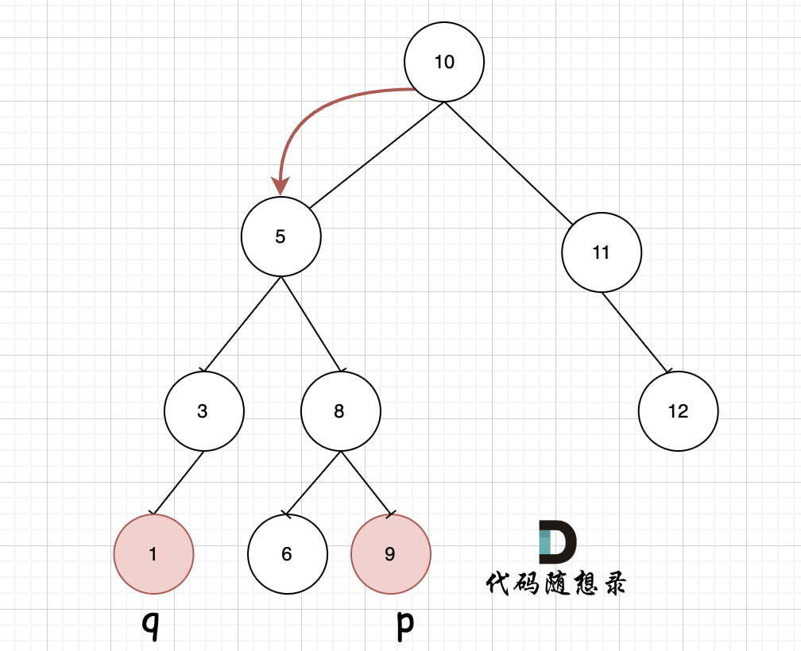
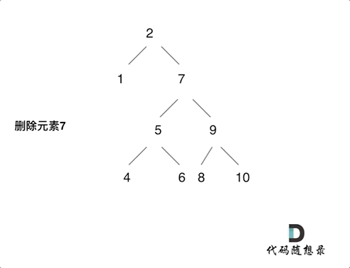

## Day22: 二叉树part08

### 235. 二叉搜索树的最近公共祖先
[LeetCode](https://leetcode.cn/problems/lowest-common-ancestor-of-a-binary-search-tree/)  [文章讲解](https://programmercarl.com/0235.%E4%BA%8C%E5%8F%89%E6%90%9C%E7%B4%A2%E6%A0%91%E7%9A%84%E6%9C%80%E8%BF%91%E5%85%AC%E5%85%B1%E7%A5%96%E5%85%88.html)  [视频讲解](https://www.bilibili.com/video/BV1Zt4y1F7ww/)

#### 题目描述：

给定一个二叉搜索树, 找到该树中两个指定节点的最近公共祖先。

[百度百科](https://baike.baidu.com/item/最近公共祖先/8918834?fr=aladdin)中最近公共祖先的定义为：“对于有根树 T 的两个结点 p、q，最近公共祖先表示为一个结点 x，满足 x 是 p、q 的祖先且 x 的深度尽可能大（**一个节点也可以是它自己的祖先**）。”

例如，给定如下二叉搜索树: root = [6,2,8,0,4,7,9,null,null,3,5]


**示例 1:**

> 输入: root = [6,2,8,0,4,7,9,null,null,3,5], p = 2, q = 8
> 输出: 6 
> 解释: 节点 2 和节点 8 的最近公共祖先是 6。

#### 解题思路：

因为是有序树，所有 如果 中间节点是 q 和 p 的公共祖先，那么 中节点的数值 一定是在 [p, q]区间的。即 中节点 > p && 中节点 < q 或者 中节点 > q && 中节点 < p。

那么只要从上到下去遍历，遇到 cur节点是数值在[p, q]区间中则一定可以说明该节点cur就是p 和 q的公共祖先。 那问题来了，**一定是最近公共祖先吗**？

如图，我们从根节点搜索，第一次遇到 cur节点是数值在[q, p]区间中，即 节点5，此时可以说明 q 和 p 一定分别存在于 节点 5的左子树，和右子树中。



此时节点5是不是最近公共祖先？ 如果 从节点5继续向左遍历，那么将错过成为p的祖先， 如果从节点5继续向右遍历则错过成为q的祖先。所以当我们从上向下去递归遍历，第一次遇到 cur节点是数值在[q, p]区间中，那么cur就是 q和p的最近公共祖先。

而递归遍历顺序，本题就不涉及到 前中后序了（这里没有中节点的处理逻辑，遍历顺序无所谓了）。

```C++
class Solution // 利用搜索二叉树的性质
{
 public:
	TreeNode* lowestCommonAncestor(TreeNode* root, TreeNode* p, TreeNode* q)
	{
		if (root == nullptr) return nullptr;

		// p 和 q 都在 root 的左子树
		if (root->val > p->val && root->val > q->val)
		{
			auto left = lowestCommonAncestor(root->left, p, q);
			if (left != nullptr) return left;
		}

		// p 和 q 都在 root 的右子树
		if (root->val < p->val && root->val < q->val)
		{
			auto right = lowestCommonAncestor(root->right, p, q);
			if (right != nullptr) return right;
		}

		// root 的值在 p 和 q 之间，即所求的节点
		return root;
	}
};
```

### 701.二叉搜索树中的插入操作
[LeetCode](https://leetcode.cn/problems/insert-into-a-binary-search-tree/)  [文章讲解](https://programmercarl.com/0701.%E4%BA%8C%E5%8F%89%E6%90%9C%E7%B4%A2%E6%A0%91%E4%B8%AD%E7%9A%84%E6%8F%92%E5%85%A5%E6%93%8D%E4%BD%9C.html)  [视频讲解](https://www.bilibili.com/video/BV1Et4y1c78Y/)

#### 题目描述：

给定二叉搜索树（BST）的根节点 `root` 和要插入树中的值 `value` ，将值插入二叉搜索树。 返回插入后二叉搜索树的根节点。 输入数据 **保证** ，新值和原始二叉搜索树中的任意节点值都不同。

**注意**，可能存在多种有效的插入方式，只要树在插入后仍保持为二叉搜索树即可。 你可以返回 **任意有效的结果** 。

**示例 1：**


> 输入：root = [4,2,7,1,3], val = 5
> 输出：[4,2,7,1,3,5]
> 解释：另一个满足题目要求可以通过的树是：
> 

#### 解题思路：

例如插入元素10 ，需要找到末尾节点插入便可，一样的道理来插入元素15，插入元素0，插入元素6，**需要调整二叉树的结构么？ 并不需要。**


只要遍历二叉搜索树，找到空节点 插入元素就可以了，那么这道题其实就简单了。接下来就是遍历二叉搜索树的过程了。

```C++
class Solution
{
 private:
	void traversal(TreeNode* cur, int val)
	{
		if(cur->left == nullptr && cur->val > val)
		{
			cur->left = new TreeNode(val);
			return;
		}
		else if(cur->right == nullptr && cur->val < val)
		{
			cur->right = new TreeNode(val);
			return;
		}


		if (cur->left != nullptr && cur->val > val)
		{
			traversal(cur->left, val);
		}

		if (cur->right != nullptr && cur->val < val)
		{
			traversal(cur->right, val);
		}
	}

 public:
	TreeNode* insertIntoBST(TreeNode* root, int val)
	{
		if (root == nullptr) return new TreeNode(val);

		traversal(root, val);
		return root;
	}
};
```

### 450.删除二叉搜索树中的节点
[LeetCode](https://leetcode.cn/problems/delete-node-in-a-bst/)  [文章讲解](https://programmercarl.com/0450.%E5%88%A0%E9%99%A4%E4%BA%8C%E5%8F%89%E6%90%9C%E7%B4%A2%E6%A0%91%E4%B8%AD%E7%9A%84%E8%8A%82%E7%82%B9.html)  [视频讲解](https://www.bilibili.com/video/BV1tP41177us/)

#### 题目描述：

给定一个二叉搜索树的根节点 **root** 和一个值 **key**，删除二叉搜索树中的 **key** 对应的节点，并保证二叉搜索树的性质不变。返回二叉搜索树（有可能被更新）的根节点的引用。

一般来说，删除节点可分为两个步骤：

1. 首先找到需要删除的节点；
2. 如果找到了，删除它。

**示例 1:**


> 输入：root = [5,3,6,2,4,null,7], key = 3
> 输出：[5,4,6,2,null,null,7]
> 解释：给定需要删除的节点值是 3，所以我们首先找到 3 这个节点，然后删除它。
> 一个正确的答案是 [5,4,6,2,null,null,7], 如上图所示。
> 另一个正确答案是 [5,2,6,null,4,null,7]。
> 

#### 解题思路：

有以下五种情况：

- 第一种情况：没找到删除的节点，遍历到空节点直接返回了
- 找到删除的节点
  - 第二种情况：左右孩子都为空（叶子节点），直接删除节点， 返回NULL为根节点
  - 第三种情况：删除节点的左孩子为空，右孩子不为空，删除节点，右孩子补位，返回右孩子为根节点
  - 第四种情况：删除节点的右孩子为空，左孩子不为空，删除节点，左孩子补位，返回左孩子为根节点
  - 第五种情况：左右孩子节点都不为空，则将删除节点的左子树头结点（左孩子）放到删除节点的右子树的最左面节点的左孩子上，返回删除节点右孩子为新的根节点。

第五种情况如下面动画：



```C++
class Solution
{
 private:
	TreeNode* traversal(TreeNode* cur, int key)
	{
		// 没有找到要删除的节点，直接返回
		if (cur == nullptr) return nullptr;

		// 找到节点进行删除
		if (cur->val == key)
		{
			// 是叶子节点，直接删除
			if (cur->left == nullptr && cur->right == nullptr)
			{
				delete cur;
				return nullptr;
			}

			// 有一个子节点，用子节点接替该节点的位置
			if (cur->left != nullptr && cur->right == nullptr)
			{
				auto temp = cur->left;
				delete cur;
				return temp;
			}
			else if (cur->left == nullptr && cur->right != nullptr)
			{
				auto temp = cur->right;
				delete cur;
				return temp;
			}

			// 左右子树都不为空
			auto min_right_node = cur->right;
			while (min_right_node->left != nullptr)
			{
				min_right_node = min_right_node->left;
			}
			min_right_node->left = cur->left;
			auto temp = cur->right;
			delete cur;
			return temp;
		}

		// 向左子树查找
		if (cur->val > key)
		{
			cur->left = traversal(cur->left, key);
		}

		// 向右子树查找
		if (cur->val < key)
		{
			cur->right = traversal(cur->right, key);
		}

		return cur;
	}

 public:
	TreeNode* deleteNode(TreeNode* root, int key)
	{
		return traversal(root, key);
	}
};
```

### 今日总结

今天的题目做得磕磕绊绊的，对于二叉搜索树的操作还是不够熟悉。