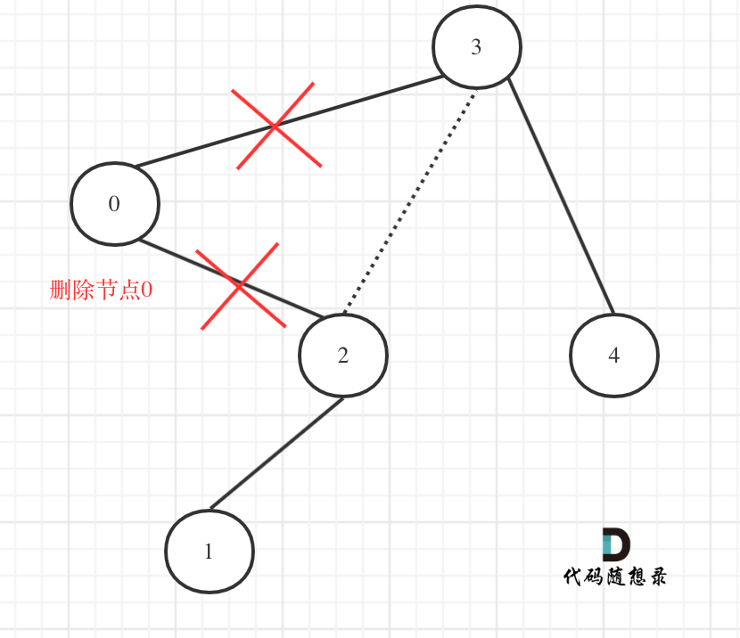

## Day23: 二叉树part09

### 669. 修剪二叉搜索树
[LeetCode](https://leetcode.cn/problems/trim-a-binary-search-tree/)  [文章讲解](https://programmercarl.com/0669.%E4%BF%AE%E5%89%AA%E4%BA%8C%E5%8F%89%E6%90%9C%E7%B4%A2%E6%A0%91.html)  [视频讲解](https://www.bilibili.com/video/BV17P41177ud/)

#### 题目描述：

给你二叉搜索树的根节点 `root` ，同时给定最小边界`low` 和最大边界 `high`。通过修剪二叉搜索树，使得所有节点的值在`[low, high]`中。修剪树 **不应该** 改变保留在树中的元素的相对结构 (即，如果没有被移除，原有的父代子代关系都应当保留)。 可以证明，存在 **唯一的答案** 。所以结果应当返回修剪好的二叉搜索树的新的根节点。注意，根节点可能会根据给定的边界发生改变。树中每个节点的值都是 **唯一** 的。

**示例 1：**


> 输入：root = [3,0,4,null,2,null,null,1], low = 1, high = 3
> 输出：[3,2,null,1]

#### 参考解法：

- 确定递归函数的参数以及返回值

有返回值，更方便，可以通过递归函数的返回值来移除节点。这样的做法在[二叉树：搜索树中的插入操作](https://programmercarl.com/0701.二叉搜索树中的插入操作.html)和[二叉树：搜索树中的删除操作中类似。

代码如下：

```cpp
TreeNode* trimBST(TreeNode* root, int low, int high)
```

- 确定终止条件

修剪的操作并不是在终止条件上进行的，所以就是遇到空节点返回就可以了。

```cpp
if (root == nullptr ) return nullptr;、
```

- 确定单层递归的逻辑

如果root（当前节点）的元素小于low的数值，那么应该递归右子树，并返回右子树符合条件的头结点。（右子树中可能也有不符合条件的节点）代码如下：

```cpp
if (root->val < low) {
    TreeNode* right = trimBST(root->right, low, high); // 寻找符合区间[low, high]的节点
    return right;
}
```

如果root(当前节点)的元素大于high的，那么应该递归左子树，并返回左子树符合条件的头结点。（同理，左子树中也可能有不符合条件的节点）代码如下：

```cpp
if (root->val > high) {
    TreeNode* left = trimBST(root->left, low, high); // 寻找符合区间[low, high]的节点
    return left;
}
```

接下来要将下一层处理完左子树的结果赋给root->left，处理完右子树的结果赋给root->right。

最后返回root节点，代码如下：

```cpp
root->left = trimBST(root->left, low, high); // root->left接入符合条件的左孩子
root->right = trimBST(root->right, low, high); // root->right接入符合条件的右孩子
return root;
```

在回顾一下上面的代码，针对下图中二叉树的情况：



如下代码相当于把节点0的右孩子（节点2）返回给上一层，

```cpp
if (root->val < low) {
    TreeNode* right = trimBST(root->right, low, high); // 寻找符合区间[low, high]的节点
    return right;
}
```

然后如下代码相当于用节点3的左孩子 把下一层返回的 节点0的右孩子（节点2） 接住。

```cpp
root->left = trimBST(root->left, low, high);
```

此时节点3的左孩子就变成了节点2，将节点0从二叉树中移除了。

整体优化后的代码：

```cpp
class Solution
{
 public:
	TreeNode* trimBST(TreeNode* root, int low, int high)
	{
		if (root == nullptr) return nullptr;
		if (root->val < low)
		{
			TreeNode* rightTrimmed = trimBST(root->right, low, high);	// 寻找符合区间[low, high]的节点
			//delete root; // 释放删除的节点内存
			return rightTrimmed;
		}
		if (root->val > high)
		{
			TreeNode* leftTrimmed = trimBST(root->left, low, high);	// 寻找符合区间[low, high]的节点
			//delete root; // 释放删除的节点内存
			return leftTrimmed;
		}
		root->left = trimBST(root->left, low, high);	// root->left接入符合条件的左孩子
		root->right = trimBST(root->right, low, high);	// root->right接入符合条件的右孩子
		return root;
	}
};
```

#### 释放被删除节点的内存：

上面代码中被注释掉的地方是手动释放内存的操作，但是可能是由于LeetCode后台的二叉树类自带有析构函数，如果在trimBST中删除了根节点，那么作为输入的这个二叉树对象，它的根节点就没有了，析构的时候会内存报错。

### 108.将有序数组转换为二叉搜索树

[LeetCode]()  [文章讲解]()  [视频讲解]()

#### 题目描述：

给你一个整数数组 `nums` ，其中元素已经按 **升序** 排列，请你将其转换为一棵 **高度平衡** 二叉搜索树。

**高度平衡** 二叉树是一棵满足「每个节点的左右两个子树的高度差的绝对值不超过 1 」的二叉树。

**示例 1：**


> 输入：nums = [-10,-3,0,5,9]
> 输出：[0,-3,9,-10,null,5]
> 解释：[0,-10,5,null,-3,null,9] 也将被视为正确答案：

#### 我的解法：

每次取数组中间的节点作为根节点，然后左闭右开，不断取分割区间，同时取中间节点。

```C++
class Solution
{
 private:
	TreeNode* traversal(vector<int>& nums, int left, int right)
	{
		if (left >= right) return nullptr;

		int mid = (left + right) / 2;
		auto root = new TreeNode(nums[mid]);

		root->left = traversal(nums, left, mid);
		root->right = traversal(nums, mid + 1, right);

		return root;
	}

 public:
	// 左闭右开，不断取中间节点
	TreeNode* sortedArrayToBST(vector<int>& nums)
	{
		return traversal(nums, 0, nums.size());
	}
};
```

### 538.把二叉搜索树转换为累加树
[LeetCode]()  [文章讲解]()  [视频讲解]()

#### 题目描述：

给出二叉 **搜索** 树的根节点，该树的节点值各不相同，请你将其转换为累加树（Greater Sum Tree），使每个节点 `node` 的新值等于原树中大于或等于 `node.val` 的值之和。

**示例 1：**

****

> 输入：[4,1,6,0,2,5,7,null,null,null,3,null,null,null,8]
> 输出：[30,36,21,36,35,26,15,null,null,null,33,null,null,null,8]

#### 我的解法：

从树中可以看出累加的顺序是右中左，所以我们需要反中序遍历，即右中左遍历这个二叉树，然后顺序累加就可以了。定义一个sum记录累加的结果。

```C++
class Solution
{
 private:
	int sum = 0;
	void traversal(TreeNode* cur)
	{
		if (cur == nullptr) return;

		// 右
		traversal(cur->right);

		// 中
		sum += cur->val;
		cur->val = sum;

		// 左
		traversal(cur->left);
	}

 public:
	TreeNode* convertBST(TreeNode* root)
	{
		sum = 0;
		// 采用右中左遍历，即从大到小
		traversal(root);
		return root;
	}
};
```

### 二叉树篇总结


### 今日总结

第一道题比较难，递归套递归，后面两道题都自己独立完成的。

**注意第一题中给的解法没有手动释放被删除的节点的内存！**