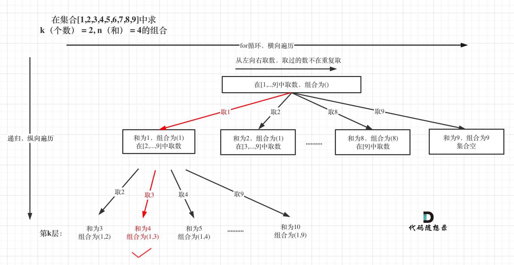

## Day25: 回溯算法part02

### 216.组合总和III
[LeetCode](https://leetcode.cn/problems/combination-sum-iii/)  [文章讲解](https://programmercarl.com/0216.%E7%BB%84%E5%90%88%E6%80%BB%E5%92%8CIII.html)  [视频讲解](https://www.bilibili.com/video/BV1wg411873x)

#### 题目描述：

找出所有相加之和为 `n` 的 `k` 个数的组合，且满足下列条件：

- 只使用数字1到9
- 每个数字 **最多使用一次** 

返回 *所有可能的有效组合的列表* 。该列表不能包含相同的组合两次，组合可以以任何顺序返回。

**示例 1:**

> 输入: k = 3, n = 7
> 输出: [[1,2,4]]
> 解释:
> 1 + 2 + 4 = 7
> 没有其他符合的组合了。

**示例 2:**

> 输入: k = 3, n = 9
> 输出: [[1,2,6], [1,3,5], [2,3,4]]
> 解释:
> 1 + 2 + 6 = 9
> 1 + 3 + 5 = 9
> 2 + 3 + 4 = 9
> 没有其他符合的组合了。

**示例 3:**

> 输入: k = 4, n = 1
> 输出: []
> 解释: 不存在有效的组合。
> 在[1,9]范围内使用4个不同的数字，我们可以得到的最小和是1+2+3+4 = 10，因为10 > 1，没有有效的组合。

#### 我的解法：

本题和[77. 组合](https://programmercarl.com/0077.组合.html)区别之一就是集合固定的就是9个数[1,...,9]，所以for循环固定i<=9

如图： 

处理过程就是 path收集每次选取的元素，相当于树型结构里的边，sum来统计path里元素的总和。

```C++
class Solution
{
 private:
	vector<int> m_nums;				// 存放每一次的结果
	vector<vector<int>> m_result;	// 存放最终的结果

	// start --记录当前开始的数字
	// k 	 --组合所需要的数字数
	// n	 --需要满足的和
	void backtracking(int start, int k, int n)
	{
		// 满足 相加之和为n 且 数字个数为k
		if (n == 0 && m_nums.size() == k)
		{
			m_result.push_back(m_nums);
			return;
		}

		// 逐次遍历数字 1 到 9
		for (int i = start; i <= 9; ++i)
		{
			m_nums.push_back(i);
			// i + 1 和 n - i 中包含着回溯
			backtracking(i + 1, k, n - i);
			m_nums.pop_back();	// 回溯
		}
	}

 public:
	vector<vector<int>> combinationSum3(int k, int n)
	{
		// 数组清空，以防上次的结果对本次产生影响
		m_nums.clear();
		m_result.clear();
		backtracking(1, k, n);
		return m_result;
	}
};
```

#### 剪枝：

- 如果元素的数量已经等于 `k` 了，往后遍历没有意义了。

- 已选元素总和如果已经大于`n`了，那么往后遍历就没有意义了，直接剪掉。
- 如果 for 循环剩余的数字无法满足数字的个数之和为 `k`，直接剪掉。

```C++
class Solution
{
 private:
    vector<int> m_nums;                // 存放每一次的结果
    vector<vector<int>> m_result;    // 存放最终的结果

    // start --记录当前开始的数字
    // k    --组合所需要的数字数
    // n    --需要满足的和
    void backtracking(int start, int k, int n)
    {
       // 剪枝操作
       if (n < 0) return;

       // 满足数字个数为k
       if (m_nums.size() == k)
       {
          // 满足数字相加之和为 n
          if (n == 0) m_result.push_back(m_nums);

          return;
       }

       // 逐次遍历数字 1 到 9
       for (int i = start; i <= 9 - (k - m_nums.size()) + 1; ++i) // 剪枝操作
       {
          m_nums.push_back(i);
          // i + 1 和 n - i 中包含着回溯
          backtracking(i + 1, k, n - i);
          m_nums.pop_back();    // 回溯
       }
    }

 public:
    vector<vector<int>> combinationSum3(int k, int n)
    {
       // 数组清空，以防上次的结果对本次产生影响
       m_nums.clear();
       m_result.clear();
       backtracking(1, k, n);
       return m_result;
    }
};
```

### 17.电话号码的字母组合
[LeetCode](https://leetcode.cn/problems/letter-combinations-of-a-phone-number/)  [文章讲解](https://programmercarl.com/0017.%E7%94%B5%E8%AF%9D%E5%8F%B7%E7%A0%81%E7%9A%84%E5%AD%97%E6%AF%8D%E7%BB%84%E5%90%88.html)  [视频讲解](https://www.bilibili.com/video/BV1yV4y1V7Ug/)

#### 题目描述：

给定一个仅包含数字 `2-9` 的字符串，返回所有它能表示的字母组合。答案可以按 **任意顺序** 返回。

给出数字到字母的映射如下（与电话按键相同）。注意 1 不对应任何字母。


**示例 1：**

> 输入：digits = "23"
> 输出：["ad","ae","af","bd","be","bf","cd","ce","cf"]

**示例 2：**

> 输入：digits = ""
> 输出：[]

**示例 3：**

> 输入：digits = "2"
> 输出：["a","b","c"]

#### 我的解法：

例如：输入："23"，抽象为树形结构，如图所示：


```C++
class Solution
{
 private:
	const vector<string> m_d2s = { "abc", "def", "ghi", "jkl", "mno", "pqrs", "tuv", "wxyz" };
	string m_com;
	vector<string> m_result;

	void backtracking(int start, const string& digits)
	{
		if (m_com.size() == digits.size())
		{
			m_result.push_back(m_com);
			return;
		}

		// 每个数字的循环 -> 每个数字三个字母的循环
		for (int i = start; i < digits.size(); ++i)
		{
			int digit = digits[i] -'2';
			for (auto ch : m_d2s[digit])
			{
				m_com += ch;
				backtracking(i + 1, digits);
				m_com.pop_back();
			}

		}
	}

 public:
	vector<string> letterCombinations(const string& digits)
	{
		if(digits.empty()) return m_result;

		m_com.clear();
		m_result.clear();
		backtracking(0, digits);
		return m_result;
	}
};
```

#### 优化：

可以不需要每次传入 `start`来标记当前开始的位置，直接传入 `index` 标记当前的位置即可。可以将 2 个 for 循环优化为一个。

**因为本题每一个数字代表的是不同集合，也就是求不同集合之间的组合，而[77. 组合](https://programmercarl.com/0077.组合.html)和[216.组合总和III](https://programmercarl.com/0216.组合总和III.html)都是求同一个集合中的组合！需要从该集合的startIndex开始遍历的**

```cpp
class Solution2
{
 private:
    const vector<string> m_d2s = { "abc", "def", "ghi", "jkl", "mno", "pqrs", "tuv", "wxyz" };
    string m_com;
    vector<string> m_result;

    void backtracking(int index, const string& digits)
    {
       if (index == digits.size())
       {
          m_result.push_back(m_com);
          return;
       }

       int digit = digits[index] - '2';
       for (auto ch : m_d2s[digit])
       {
          m_com += ch;
          backtracking(index + 1, digits);
          m_com.pop_back();
       }
    }

 public:
    vector<string> letterCombinations(const string& digits)
    {
       if (digits.empty()) return m_result;

       m_com.clear();
       m_result.clear();
       backtracking(0, digits);
       return m_result;
    }
};
```

### 今日总结

今天两道题都自己完成了，但是剪枝等细节地方需要值得注意。