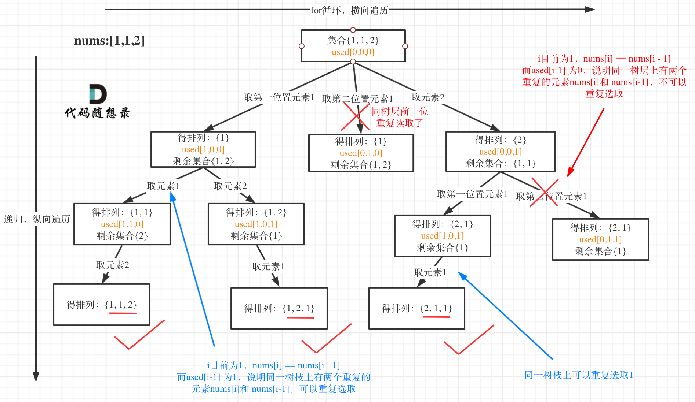

## Day29: 回溯算法part05

### 491.递增子序列

[LeetCode](https://leetcode.cn/problems/non-decreasing-subsequences/)  [文章讲解](https://programmercarl.com/0491.%E9%80%92%E5%A2%9E%E5%AD%90%E5%BA%8F%E5%88%97.html)  [视频讲解](https://www.bilibili.com/video/BV1EG4y1h78v/)

#### 题目描述：

给你一个整数数组 `nums` ，找出并返回所有该数组中不同的递增子序列，递增子序列中 **至少有两个元素** 。你可以按 **任意顺序** 返回答案。

数组中可能含有重复元素，如出现两个整数相等，也可以视作递增序列的一种特殊情况。

**示例 1：**

> 输入：nums = [4,6,7,7]
> 输出：[[4,6],[4,6,7],[4,6,7,7],[4,7],[4,7,7],[6,7],[6,7,7],[7,7]]

#### 思路：

用[4, 7, 6, 7]这个数组来举例，抽象为树形结构如图：


由于这道题目不能进行排序，因此无法采用类似 90.子集II 的去重方法。

```C++
class Solution
{
 private:
	vector<int> m_path;
	vector<vector<int>> m_result;

	void backtracking(vector<int>& nums, int startIndex)
	{
		if (m_path.size() >= 2)
		{
			m_result.push_back(m_path);
		}

		unordered_set<int> uset; // 使用set对本层元素进行去重
		for (int i = startIndex; i < nums.size(); ++i)
		{
			if (!m_path.empty() && nums[i] < m_path.back()) continue;

			if (uset.find(nums[i]) != uset.end()) continue;

			m_path.push_back(nums[i]);
			uset.insert(nums[i]); // 记录这个元素在本层用过了，本层后面不能再用了
			backtracking(nums, i + 1);
			m_path.pop_back();
		}
	}

 public:
	vector<vector<int>> findSubsequences(vector<int>& nums)
	{
		m_path.clear();
		m_result.clear();
		backtracking(nums, 0);
		return m_result;
	}
};
```

### 46.全排列

[LeetCode](https://leetcode.cn/problems/permutations/)  [文章讲解](https://programmercarl.com/0046.%E5%85%A8%E6%8E%92%E5%88%97.html)  [视频讲解](https://www.bilibili.com/video/BV19v4y1S79W/)

#### 题目描述：

给定一个不含重复数字的数组 `nums` ，返回其 *所有可能的全排列* 。你可以 **按任意顺序** 返回答案。

**示例 1：**

> 输入：nums = [1,2,3]
> 输出：[[1,2,3],[1,3,2],[2,1,3],[2,3,1],[3,1,2],[3,2,1]]

**示例 2：**

> 输入：nums = [0,1]
> 输出：[[0,1],[1,0]]

#### 我的解法：

每次 for 循环从 0 开始，同时使用一个 `used` 数组记录已经被使用过的元素。


```C++
class Solution
{
 private:
	vector<int> path;
	vector<vector<int>> result;

	void backtracking(const vector<int>& nums, vector<bool>& used)
	{
		if (path.size() == nums.size())
		{
			result.push_back(path);
			return;
		}

		for (int i = 0; i < nums.size(); ++i)
		{
			if(used[i]) continue;

			path.push_back(nums[i]);
			used[i] = true;
			backtracking(nums,  used);
			path.pop_back();
			used[i] = false;
		}
	}

 public:
	vector<vector<int>> permute(const vector<int>& nums)
	{
		path.clear();
		result.clear();
		vector<bool> used(nums.size(), false);
		backtracking(nums, used);
		return result;
	}
};
```

### 47.全排列 II

[LeetCode](https://leetcode.cn/problems/permutations-ii/ )  [文章讲解](https://programmercarl.com/0047.%E5%85%A8%E6%8E%92%E5%88%97II.html)  [视频讲解](https://www.bilibili.com/video/BV1R84y1i7Tm/)

#### 题目描述：

给定一个可包含重复数字的序列 `nums` ，***按任意顺序*** 返回所有不重复的全排列。

**示例 1：**

> 输入：nums = [1,1,2]
> 输出：
[[1,1,2],
 [1,2,1],
 [2,1,1]]

**示例 2：**

> 输入：nums = [1,2,3]
> 输出：[[1,2,3],[1,3,2],[2,1,3],[2,3,1],[3,1,2],[3,2,1]]

#### 我的解法：

每次 for 循环从 0 开始，同时使用一个 `used` 数组记录已经被使用过的元素。

本题排序不会干扰结果，去重采用类似  90.子集II 的去重方法，先对数组排列，然后使用 used 数组记录树层重复的元素。

以示例中的 [1,1,2]为例 （为了方便举例，已经排序）抽象为一棵树，去重过程如图：



```C++
class Solution
{
 private:
	vector<int> path;
	vector<vector<int>> result;

	void backtracking(vector<int>& nums, vector<bool>& used)
	{
		if (path.size() == nums.size())
		{
			result.push_back(path);
			return;
		}

		for (int i = 0; i < nums.size(); ++i)
		{
			if (used[i]) continue;

			if (i > 0 && nums[i] == nums[i - 1] && !used[i - 1]) continue;

			path.push_back(nums[i]);
			used[i] = true;
			backtracking(nums, used);
			path.pop_back();
			used[i] = false;
		}
	}

 public:
	vector<vector<int>> permuteUnique(vector<int>& nums)
	{
		path.clear();
		result.clear();
		sort(nums.begin(), nums.end());
		vector<bool> used(nums.size(), false);
		backtracking(nums, used);
		return result;
	}
};
```

### 今日总结

第一道题陷进去了，由于不能进行排序，因此重复的元素不一定在相邻的位置，采用  `i > 0 && nums[i] == nums[i - 1] && !used[i - 1]`进行判断无法彻底去重，需要采用数组或者set哈希表。第二第三题成功提交通过了。
