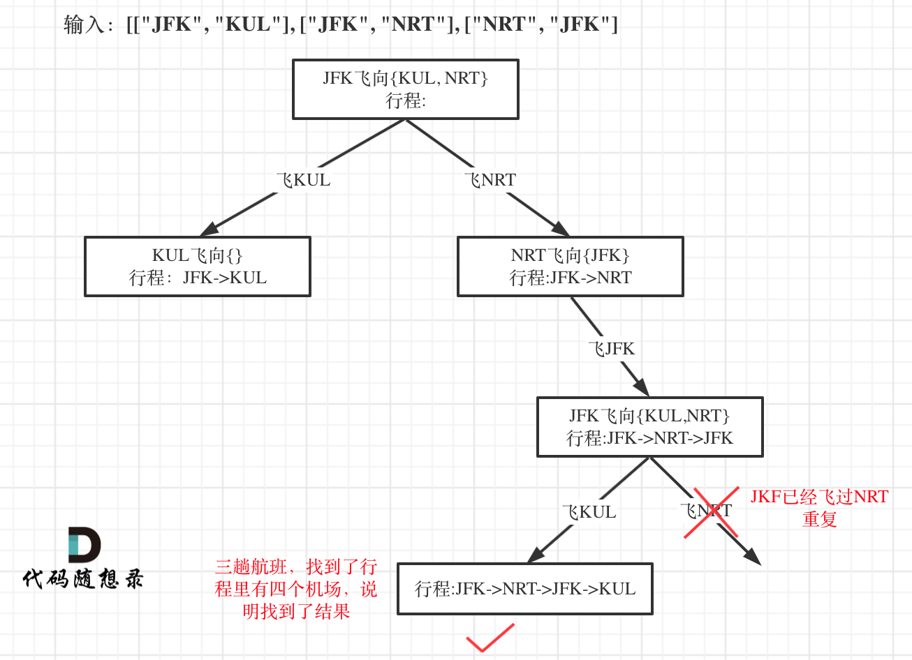
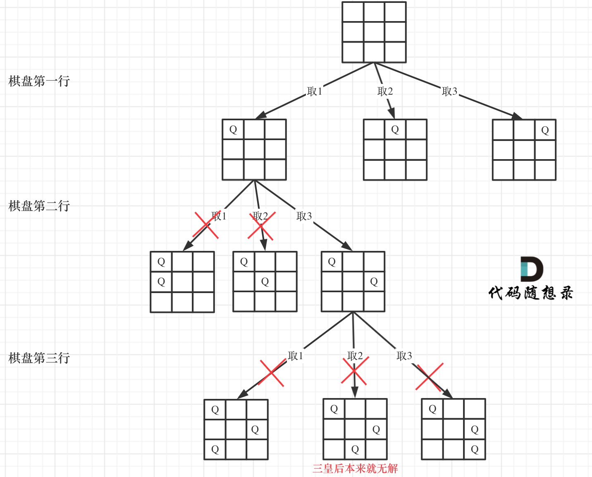

## Day30: 回溯算法part06

### 332.重新安排行程

[LeetCode](https://leetcode.cn/problems/reconstruct-itinerary/)  [文章讲解](https://programmercarl.com/0332.%E9%87%8D%E6%96%B0%E5%AE%89%E6%8E%92%E8%A1%8C%E7%A8%8B.html)

#### 题目描述：

给你一份航线列表 `tickets` ，其中 `tickets[i] = [fromi, toi]` 表示飞机出发和降落的机场地点。请你对该行程进行重新规划排序。

所有这些机票都属于一个从 `JFK`（肯尼迪国际机场）出发的先生，所以该行程必须从 `JFK` 开始。如果存在多种有效的行程，请你按字典排序返回最小的行程组合。

- 例如，行程 `["JFK", "LGA"]` 与 `["JFK", "LGB"]` 相比就更小，排序更靠前。

假定所有机票至少存在一种合理的行程。且所有的机票 必须都用一次 且 只能用一次。

**示例 1：**


> 输入：tickets = [["MUC","LHR"],["JFK","MUC"],["SFO","SJC"],["LHR","SFO"]]
> 输出：["JFK","MUC","LHR","SFO","SJC"]

**示例 2：**


> 输入：tickets = [["JFK","SFO"],["JFK","ATL"],["SFO","ATL"],["ATL","JFK"],["ATL","SFO"]]
> 输出：["JFK","ATL","JFK","SFO","ATL","SFO"]
> 解释：另一种有效的行程是 ["JFK","SFO","ATL","JFK","ATL","SFO"] ，但是它字典排序更大更靠后。

#### 我的解法（未通过）：

存在的问题

- 每次都需要重新遍历 used 数组，效率不高
- 有多种解法，字母序靠前排在前面无法解决

```C++
class Solution
{
 private:
	vector<string> path = { "JFK" };
	vector<string> result = { "JFK" };

	void backtracking(vector<vector<string>>& tickets, vector<bool>& used)
	{
		int flag = 0;
		for(auto it : used)
		{
			if(it) flag++;
		}
		if(flag == used.size())
		{
			result = path;
			return;
		}

		for (int i = 0; i < tickets.size(); ++i)
		{
			if (tickets[i][0] == path.back() && !used[i])
			{
				path.push_back(tickets[i][1]);
				used[i] = true;
				backtracking(tickets, used);
				path.pop_back();
				used[i] = false;
			}
			else
				continue;
		}
	}

 public:
	vector<string> findItinerary(vector<vector<string>>& tickets)
	{
		result = { "JFK" };
		vector<bool> used(tickets.size(), false);
		backtracking(tickets, used);
		return result;
	}
};
```

#### 参考解法：

**这道题目有几个难点：**

1. 一个行程中，如果航班处理不好容易变成一个圈，成为死循环
2. 有多种解法，字母序靠前排在前面，让很多同学望而退步，如何该记录映射关系呢 ？
3. 使用回溯法（也可以说深搜） 的话，那么终止条件是什么呢？
4. 搜索的过程中，如何遍历一个机场所对应的所有机场。

##### 如何理解死循环

对于死循环，举一个有重复机场的例子：


出发机场和到达机场也会重复的，**如果在解题的过程中没有对集合元素处理好，就会死循环。**

##### 记录映射关系

一个机场映射多个机场，机场之间要靠字母序排列。一个机场映射多个机场，可以使用std::unordered_map；如果让多个机场之间再有顺序的话，就是用std::map 或者std::multimap 或者 std::multiset。

这样存放映射关系可以定义为 `unordered_map<string, multiset<string>> targets` 或者 `unordered_map<string, map<string, int>> targets`。

含义如下：

unordered_map<string, multiset> targets：unordered_map<出发机场, 到达机场的集合> targets

unordered_map<string, map<string, int>> targets：unordered_map<出发机场, map<到达机场, 航班次数>> targets

这两个结构，选择了后者，因为如果使用`unordered_map<string, multiset<string>> targets` 遍历multiset的时候，不能删除元素，一旦删除元素，迭代器就失效了。

**由于出发机场和到达机场是会重复的，搜索的过程没及时删除目的机场就会死循环。**

所以搜索的过程中就是要不断的删multiset里的元素，那么推荐使用`unordered_map<string, map<string, int>> targets`。

在遍历 `unordered_map<出发机场, map<到达机场, 航班次数>> targets`的过程中，**可以使用"航班次数"这个字段的数字做相应的增减，来标记到达机场是否使用过了。**

如果“航班次数”大于零，说明目的地还可以飞，如果“航班次数”等于零说明目的地不能飞了，而不用对集合做删除元素或者增加元素的操作。

##### 树状结构

以输入：[["JFK", "KUL"], ["JFK", "NRT"], ["NRT", "JFK"]为例，抽象为树形结构如下：



##### 回溯三部曲

- 递归函数参数

使用`unordered_map<string, map<string, int>> targets;` 来记录航班的映射关系，定义为全局变量。

参数里还需要ticketNum，表示有多少个航班（终止条件会用上）。

代码如下：

```cpp
// unordered_map<出发机场, map<到达机场, 航班次数>> targets
unordered_map<string, map<string, int>> targets;
bool backtracking(int ticketNum, vector<string>& result) {
```

**注意函数返回值用的是bool！**因为只需要找到一个行程，就是在树形结构中唯一的一条通向叶子节点的路线。

- 递归终止条件

拿题目中的示例为例，输入: [["MUC", "LHR"], ["JFK", "MUC"], ["SFO", "SJC"], ["LHR", "SFO"]] ，这是有4个航班，那么只要找出一种行程，行程里的机场个数是5就可以了。

所以终止条件是：回溯遍历的过程中，遇到的机场个数，如果达到了（航班数量+1），那么就找到了一个行程，把所有航班串在一起了。

代码如下：

```cpp
if (result.size() == ticketNum + 1) {
    return true;
}
```

- 单层搜索的逻辑

遍历过程如下：

```cpp
for (pair<const string, int>& target : targets[result[result.size() - 1]]) {
    if (target.second > 0 ) { // 记录到达机场是否飞过了
        result.push_back(target.first);
        target.second--;
        if (backtracking(ticketNum, result)) return true;
        result.pop_back();
        target.second++;
    }
}
```

可以看出 通过`unordered_map<string, map<string, int>> targets`里的int字段来判断 这个集合里的机场是否使用过，这样避免了直接去删元素。

##### 完整代码

```cpp
class Solution
{
 private:
    // unordered_map<出发机场, map<到达机场, 航班次数>> targets
    unordered_map<string, map<string, int>> targets;
    bool backtracking(int ticketNum, vector<string>& result)
    {
       if (result.size() == ticketNum + 1)
       {
          return true;
       }

       for (pair<const string, int>& target : targets[result.back()])
       {
          if (target.second > 0)
          {
             // 记录到达机场是否飞过了
             result.push_back(target.first);
             target.second--;
             if (backtracking(ticketNum, result)) return true;
             result.pop_back();
             target.second++;
          }
       }
       return false;
    }
 public:
    vector<string> findItinerary(vector<vector<string>>& tickets)
    {
       targets.clear();
       vector<string> result;
       for (const vector<string>& vec : tickets)
       {
          targets[vec[0]][vec[1]]++; // 记录映射关系
       }
       result.push_back("JFK"); // 起始机场
       backtracking(tickets.size(), result);
       return result;
    }
};
```

### 51. N皇后

[LeetCode](https://leetcode.cn/problems/n-queens/)  [文章讲解](https://programmercarl.com/0051.N%E7%9A%87%E5%90%8E.html)  [视频讲解](https://www.bilibili.com/video/BV1Rd4y1c7Bq/)

#### 题目描述：

按照国际象棋的规则，皇后可以攻击与之处在同一行或同一列或同一斜线上的棋子。

**n 皇后问题** 研究的是如何将 `n` 个皇后放置在 `n×n` 的棋盘上，并且使皇后彼此之间不能相互攻击。

给你一个整数 `n` ，返回所有不同的 **n 皇后问题** 的解决方案。

每一种解法包含一个不同的 **n 皇后问题** 的棋子放置方案，该方案中 `'Q'` 和 `'.'` 分别代表了皇后和空位。

**示例 1：**


> 输入：n = 4
> 输出：[[".Q..","...Q","Q...","..Q."],["..Q.","Q...","...Q",".Q.."]]
> 解释：如上图所示，4 皇后问题存在两个不同的解法。

#### 参考解法：

皇后们的约束条件：

1. 不能同行
2. 不能同列
3. 不能同斜线

搜索皇后的位置，可以抽象为一棵。例如一个 3 * 3 的棋盘，将搜索过程抽象为一棵树：



从图中，可以看出，二维矩阵中矩阵的高就是这棵树的高度，矩阵的宽就是树形结构中每一个节点的宽度。那么用皇后们的约束条件，来回溯搜索这棵树，**只要搜索到了树的叶子节点，说明就找到了皇后们的合理位置了**。

##### 回溯三部曲

- 递归函数参数

定义全局变量二维数组result来记录最终结果。

参数n是棋盘的大小，然后用row来记录当前遍历到棋盘的第几层了。

代码如下：

```cpp
vector<vector<string>> result;
void backtracking(int n, int row, vector<string>& chessboard) {
```

- 递归终止条件

当递归到棋盘最底层（也就是叶子节点）的时候，就可以收集结果并返回了。

代码如下：

```cpp
if (row == n) {
    result.push_back(chessboard);
    return;
}
```

- 单层搜索的逻辑

递归深度就是row控制棋盘的行，每一层里for循环的col控制棋盘的列，一行一列，确定了放置皇后的位置。

每次都是要从新的一行的起始位置开始搜，所以都是从0开始。

代码如下：

```cpp
for (int col = 0; col < n; col++) {
    if (isValid(row, col, chessboard, n)) { // 验证合法就可以放
        chessboard[row][col] = 'Q'; // 放置皇后
        backtracking(n, row + 1, chessboard);
        chessboard[row][col] = '.'; // 回溯，撤销皇后
    }
}
```

- 验证棋盘是否合法

按照如下标准去重：

1. 不能同行
2. 不能同列
3. 不能同斜线 （45度和135度角）

**注意**：往 (0, 0) 方向检测即可，因为 (row, col) 以下的位置没有皇后

代码如下：

```cpp
bool isValid(int row, int col, vector<string>& chessboard, int n) {
    // 检查列
    for (int i = 0; i < row; i++) { // 这是一个剪枝
        if (chessboard[i][col] == 'Q') {
            return false;
        }
    }
    // 检查 45度角是否有皇后
    for (int i = row - 1, j = col - 1; i >=0 && j >= 0; i--, j--) {
        if (chessboard[i][j] == 'Q') {
            return false;
        }
    }
    // 检查 135度角是否有皇后
    for(int i = row - 1, j = col + 1; i >= 0 && j < n; i--, j++) {
        if (chessboard[i][j] == 'Q') {
            return false;
        }
    }
    return true;
}
```

在这份代码中，细心的同学可以发现为什么没有在同行进行检查呢？

因为在单层搜索的过程中，每一层递归，只会选for循环（也就是同一行）里的一个元素，所以不用去重了。

##### 整体代码

```cpp
class Solution
{
 private:
    vector<vector<string>> result;
    // n 为输入的棋盘大小
    // row 是当前递归到棋盘的第几行了
    void backtracking(int n, int row, vector<string>& chessboard)
    {
       if (row == n)
       {
          result.push_back(chessboard);
          return;
       }
       for (int col = 0; col < n; col++)
       {
          if (isValid(row, col, chessboard, n))
          { // 验证合法就可以放
             chessboard[row][col] = 'Q'; // 放置皇后
             backtracking(n, row + 1, chessboard);
             chessboard[row][col] = '.'; // 回溯，撤销皇后
          }
       }
    }
    bool isValid(int row, int col, vector<string>& chessboard, int n)
    {
       // 检查列
       for (int i = 0; i < row; i++)
       {
          // 这是一个剪枝
          if (chessboard[i][col] == 'Q') return false;
       }
       // 检查 45度角是否有皇后
       for (int i = row - 1, j = col - 1; i >= 0 && j >= 0; i--, j--)
       {
          if (chessboard[i][j] == 'Q') return false;
       }
       // 检查 135度角是否有皇后
       for (int i = row - 1, j = col + 1; i >= 0 && j < n; i--, j++)
       {
          if (chessboard[i][j] == 'Q') return false;
       }
       return true;
    }
 public:
    vector<vector<string>> solveNQueens(int n)
    {
       result.clear();
       std::vector<std::string> chessboard(n, std::string(n, '.'));
       backtracking(n, 0, chessboard);
       return result;
    }
};
```

### 37. 解数独

[LeetCode](https://leetcode.cn/problems/sudoku-solver/)  [文章讲解](https://programmercarl.com/0037.%E8%A7%A3%E6%95%B0%E7%8B%AC.html)  [视频讲解](https://www.bilibili.com/video/BV1TW4y1471V/)

#### 题目描述：

编写一个程序，通过填充空格来解决数独问题。

数独的解法需 **遵循如下规则**：

1. 数字 `1-9` 在每一行只能出现一次。
2. 数字 `1-9` 在每一列只能出现一次。
3. 数字 `1-9` 在每一个以粗实线分隔的 `3x3` 宫内只能出现一次。（请参考示例图）

数独部分空格内已填入了数字，空白格用 `'.'` 表示。

**示例 1：**


> 输入：board = [["5","3",".",".","7",".",".",".","."],["6",".",".","1","9","5",".",".","."],[".","9","8",".",".",".",".","6","."],["8",".",".",".","6",".",".",".","3"],["4",".",".","8",".","3",".",".","1"],["7",".",".",".","2",".",".",".","6"],[".","6",".",".",".",".","2","8","."],[".",".",".","4","1","9",".",".","5"],[".",".",".",".","8",".",".","7","9"]]
> 输出：[["5","3","4","6","7","8","9","1","2"],["6","7","2","1","9","5","3","4","8"],["1","9","8","3","4","2","5","6","7"],["8","5","9","7","6","1","4","2","3"],["4","2","6","8","5","3","7","9","1"],["7","1","3","9","2","4","8","5","6"],["9","6","1","5","3","7","2","8","4"],["2","8","7","4","1","9","6","3","5"],["3","4","5","2","8","6","1","7","9"]]
> 解释：输入的数独如上图所示，唯一有效的解决方案如下所示：
> 
> 

#### 参考解法：

**本题中棋盘的每一个位置都要放一个数字（而N皇后是一行只放一个皇后），并检查数字是否合法，解数独的树形结构要比N皇后更宽更深**。因为这个树形结构太大了，抽取一部分，如图所示：


##### 回溯三部曲

- 递归函数以及参数

递归函数的返回值需要是bool类型，因为解数独找到一个符合的条件（就在树的叶子节点上）立刻就返回，相当于找从根节点到叶子节点一条唯一路径，所以需要使用bool返回值，记录是否遍历到了叶子节点。

代码如下：

```cpp
bool backtracking(vector<vector<char>>& board)
```

- 递归终止条件

递归的下一层的棋盘一定比上一层的棋盘多一个数，等数填满了棋盘自然就终止（填满当然好了，说明找到结果了），所以不需要终止条件！遍历整个树形结构寻找可能的叶子节点就立刻返回。

- 递归单层搜索逻辑

**一个for循环遍历棋盘的行，一个for循环遍历棋盘的列，一行一列确定下来之后，递归遍历这个位置放9个数字的可能性！**

代码如下：

```cpp
bool backtracking(vector<vector<char>>& board) {
    for (int i = 0; i < board.size(); i++) {        // 遍历行
        for (int j = 0; j < board[0].size(); j++) { // 遍历列
            if (board[i][j] != '.') continue;
            for (char k = '1'; k <= '9'; k++) {     // (i, j) 这个位置放k是否合适
                if (isValid(i, j, k, board)) {
                    board[i][j] = k;                // 放置k
                    if (backtracking(board)) return true; // 如果找到合适一组立刻返回
                    board[i][j] = '.';              // 回溯，撤销k
                }
            }
            return false;                           // 9个数都试完了，都不行，那么就返回false
        }
    }
    return true; // 遍历完没有返回false，说明找到了合适棋盘位置了
}
```

**注意这里return false的地方，这里放return false 是有讲究的**。

因为如果一行一列确定下来了，这里尝试了9个数都不行，说明这个棋盘找不到解决数独问题的解！

那么会直接返回， **这也就是为什么没有终止条件也不会永远填不满棋盘而无限递归下去！**

##### 判断棋盘是否合法

判断棋盘是否合法有如下三个维度：

- 同行是否重复
- 同列是否重复
- 9宫格里是否重复

代码如下：

```cpp
bool isValid(int row, int col, char val, vector<vector<char>>& board) {
    for (int i = 0; i < 9; i++) { // 判断行里是否重复
        if (board[row][i] == val) {
            return false;
        }
    }
    for (int j = 0; j < 9; j++) { // 判断列里是否重复
        if (board[j][col] == val) {
            return false;
        }
    }
    int startRow = (row / 3) * 3;
    int startCol = (col / 3) * 3;
    for (int i = startRow; i < startRow + 3; i++) { // 判断9方格里是否重复
        for (int j = startCol; j < startCol + 3; j++) {
            if (board[i][j] == val ) {
                return false;
            }
        }
    }
    return true;
}
```

##### 整体代码

```cpp
class Solution {
 private:
    bool backtracking(vector<vector<char>>& board) {
       for (int i = 0; i < board.size(); i++) {        // 遍历行
          for (int j = 0; j < board[0].size(); j++) { // 遍历列
             if (board[i][j] == '.') {
                for (char k = '1'; k <= '9'; k++) {     // (i, j) 这个位置放k是否合适
                   if (isValid(i, j, k, board)) {
                      board[i][j] = k;                // 放置k
                      if (backtracking(board)) return true; // 如果找到合适一组立刻返回
                      board[i][j] = '.';              // 回溯，撤销k
                   }
                }
                return false;  // 9个数都试完了，都不行，那么就返回false
             }
          }
       }
       return true; // 遍历完没有返回false，说明找到了合适棋盘位置了
    }
    bool isValid(int row, int col, char val, vector<vector<char>>& board) {
       for (int i = 0; i < 9; i++) { // 判断行里是否重复
          if (board[row][i] == val) {
             return false;
          }
       }
       for (int j = 0; j < 9; j++) { // 判断列里是否重复
          if (board[j][col] == val) {
             return false;
          }
       }
       int startRow = (row / 3) * 3;
       int startCol = (col / 3) * 3;
       for (int i = startRow; i < startRow + 3; i++) { // 判断9方格里是否重复
          for (int j = startCol; j < startCol + 3; j++) {
             if (board[i][j] == val ) {
                return false;
             }
          }
       }
       return true;
    }
 public:
    void solveSudoku(vector<vector<char>>& board) {
       backtracking(board);
    }
};
```

### 回溯算法总结

**回溯是递归的副产品，只要有递归就会有回溯**，所以回溯法也经常和二叉树遍历，深度优先搜索混在一起，因为这两种方式都是用了递归。

回溯法就是暴力搜索，并不是什么高效的算法，最多再剪枝一下。

回溯算法能解决如下问题：

- 组合问题：N个数里面按一定规则找出k个数的集合
- 排列问题：N个数按一定规则全排列，有几种排列方式
- 切割问题：一个字符串按一定规则有几种切割方式
- 子集问题：一个N个数的集合里有多少符合条件的子集
- 棋盘问题：N皇后，解数独等等

通过回溯三部曲来分析回溯算法，以及回溯法的模板：

```text
void backtracking(参数) {
    if (终止条件) {
        存放结果;
        return;
    }

    for (选择：本层集合中元素（树中节点孩子的数量就是集合的大小）) {
        处理节点;
        backtracking(路径，选择列表); // 递归
        回溯，撤销处理结果
    }
}
```


### 今日总结

三道题目都有点难，都是略有一点思路，但是总是代码没写出来。
