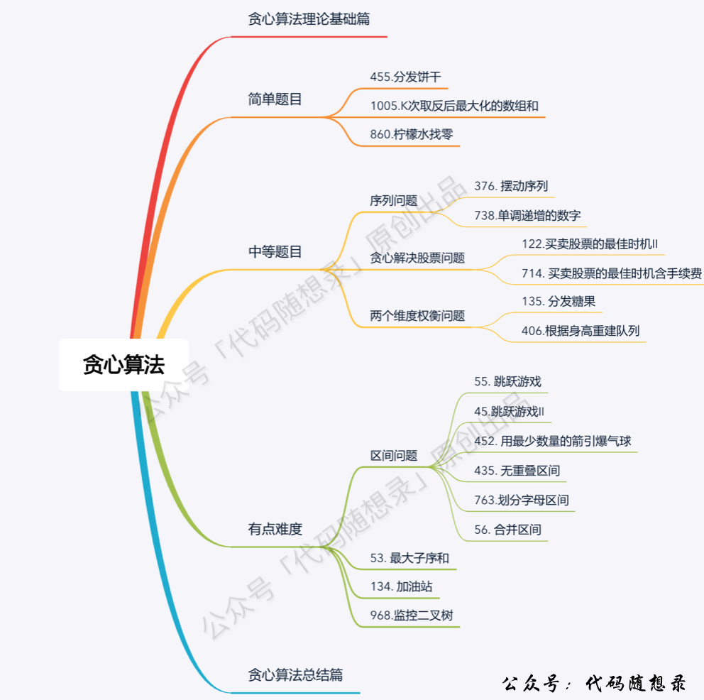

## Day31: 贪心算法part01

### 贪心算法理论基础

**贪心的本质是选择每一阶段的局部最优，从而达到全局最优**。

题目分类大纲如下：



#### 贪心一般解题步骤

贪心算法一般分为如下四步：

- 将问题分解为若干个子问题
- 找出适合的贪心策略
- 求解每一个子问题的最优解
- 将局部最优解堆叠成全局最优解

这个四步其实过于理论化了，我们平时在做贪心类的题目 很难去按照这四步去思考，真是有点“鸡肋”。因为**贪心没有固定的套路，说白了就是常识性推导加上举反例**。

做题的时候，只要想清楚 局部最优 是什么，如果推导出全局最优，其实就够了。

### 455.分发饼干
[LeetCode](https://leetcode.cn/problems/assign-cookies/)  [文章讲解](https://programmercarl.com/0455.%E5%88%86%E5%8F%91%E9%A5%BC%E5%B9%B2.html)  [视频讲解](https://www.bilibili.com/video/BV1MM411b7cq/)

#### 题目描述：

假设你是一位很棒的家长，想要给你的孩子们一些小饼干。但是，每个孩子最多只能给一块饼干。

对每个孩子 `i`，都有一个胃口值 `g[i]`，这是能让孩子们满足胃口的饼干的最小尺寸；并且每块饼干 `j`，都有一个尺寸 `s[j]` 。如果 `s[j] >= g[i]`，我们可以将这个饼干 `j` 分配给孩子 `i` ，这个孩子会得到满足。你的目标是尽可能满足越多数量的孩子，并输出这个最大数值。

**示例 1:**

> 输入: g = [1,2,3], s = [1,1]
> 输出: 1
> 解释: 
> 你有三个孩子和两块小饼干，3个孩子的胃口值分别是：1,2,3。
> 虽然你有两块小饼干，由于他们的尺寸都是1，你只能让胃口值是1的孩子满足。
> 所以你应该输出1。

#### 我的解法：

每次使用最小的饼干，满足胃口最小的小孩。

```C++
class Solution
{
 public:
	int findContentChildren(vector<int>& g, vector<int>& s)
	{
		// 首先进行排序
		sort(g.begin(), g.end());
		sort(s.begin(), s.end());

		int count = 0;
		for (int j = 0; count < g.size() && j < s.size(); j++)
		{
			// 每次使用最小的饼干满足孩子
			// 不满足就取下一个饼干
			if (s[j] >= g[count])
			{
				count++;
			}
		}

		return count;
	}
};
```

### 376. 摆动序列
[LeetCode](https://leetcode.cn/problems/wiggle-subsequence/)  [文章讲解](https://programmercarl.com/0376.%E6%91%86%E5%8A%A8%E5%BA%8F%E5%88%97.html)  [视频讲解](https://www.bilibili.com/video/BV17M411b7NS/)

#### 题目描述：

如果连续数字之间的差严格地在正数和负数之间交替，则数字序列称为 **摆动序列 。**第一个差（如果存在的话）可能是正数或负数。仅有一个元素或者含两个不等元素的序列也视作摆动序列。

- 例如， `[1, 7, 4, 9, 2, 5]` 是一个 **摆动序列** ，因为差值 `(6, -3, 5, -7, 3)` 是正负交替出现的。
- 相反，`[1, 4, 7, 2, 5]` 和 `[1, 7, 4, 5, 5]` 不是摆动序列，第一个序列是因为它的前两个差值都是正数，第二个序列是因为它的最后一个差值为零。

**子序列** 可以通过从原始序列中删除一些（也可以不删除）元素来获得，剩下的元素保持其原始顺序。

给你一个整数数组 `nums` ，返回 `nums` 中作为 **摆动序列** 的 **最长子序列的长度** 。

**示例 1：**

> 输入：nums = [1,7,4,9,2,5]
> 输出：6
> 解释：整个序列均为摆动序列，各元素之间的差值为 (6, -3, 5, -7, 3) 。

**示例 2：**

> 输入：nums = [1,17,5,10,13,15,10,5,16,8]
> 输出：7
> 解释：这个序列包含几个长度为 7 摆动序列。
> 其中一个是 [1, 17, 10, 13, 10, 16, 8] ，各元素之间的差值为 (16, -7, 3, -3, 6, -8) 。

#### 贪心算法思路：

本题要求通过从原始序列中删除一些（也可以不删除）元素来获得子序列，剩下的元素保持其原始顺序。用示例二来举例，如图所示：


**局部最优：删除单调坡度上的节点（不包括单调坡度两端的节点），那么这个坡度就可以有两个局部峰值**。

**整体最优：整个序列有最多的局部峰值，从而达到最长摆动序列**。

局部最优推出全局最优，并举不出反例，那么试试贪心！

（为方便表述，以下说的峰值都是指局部峰值）

**实际操作上，其实连删除的操作都不用做，因为题目要求的是最长摆动子序列的长度，所以只需要统计数组的峰值数量就可以了（相当于是删除单一坡度上的节点，然后统计长度）**

**这就是贪心所贪的地方，让峰值尽可能的保持峰值，然后删除单一坡度上的节点**

在计算是否有峰值的时候，知道遍历的下标 i ，计算 prediff（nums[i] - nums[i-1]） 和 curdiff（nums[i+1] - nums[i]），如果`prediff < 0 && curdiff > 0` 或者 `prediff > 0 && curdiff < 0` 此时就有波动就需要统计。

这是本题的一个大题思路，但本题要考虑三种情况：

1. 情况一：上下坡中有平坡
2. 情况二：数组首尾两端
3. 情况三：单调坡中有平坡

##### 情况一：上下坡中有平坡

例如 [1,2,2,2,1]这样的数组，如图：


它的摇摆序列长度是多少呢？ **其实是长度是 3**，也就是我们在删除的时候 要不删除左面的三个 2，要不就删除右边的三个 2。

如图，可以统一规则，删除左边的三个 2：


在图中，当 i 指向第一个 2 的时候，`prediff > 0 && curdiff = 0` ，当 i 指向最后一个 2 的时候 `prediff = 0 && curdiff < 0`。

如果我们采用，删左面三个 2 的规则，那么 当 `prediff = 0 && curdiff < 0` 也要记录一个峰值，因为他是把之前相同的元素都删掉留下的峰值。

所以我们记录峰值的条件应该是： `(preDiff <= 0 && curDiff > 0) || (preDiff >= 0 && curDiff < 0)`，为什么这里允许 prediff == 0 ，就是为了 上面我说的这种情况

##### 情况二：数组首尾两端

所以本题统计峰值的时候，数组最左面和最右面如何统计呢？

题目中说了，如果只有两个不同的元素，那摆动序列也是 2。

例如序列[2,5]，如果靠统计差值来计算峰值个数就需要考虑数组最左面和最右面的特殊情况。

因为在计算 prediff（nums[i] - nums[i-1]） 和 curdiff（nums[i+1] - nums[i]）的时候，至少需要三个数字才能计算，而数组只有两个数字。

这里我们可以写死，就是 如果只有两个元素，且元素不同，那么结果为 2。

不写死的话，如何和我们的判断规则结合在一起呢？

可以假设，数组最前面还有一个数字，那这个数字应该是什么呢？

之前我们在 讨论 情况一：相同数字连续 的时候， prediff = 0 ，curdiff < 0 或者 >0 也记为波谷。

那么为了规则统一，针对序列[2,5]，可以假设为[2,2,5]，这样它就有坡度了即 preDiff = 0，如图：


针对以上情形，result 初始为 1（默认最右面有一个峰值），此时 curDiff > 0 && preDiff <= 0，那么 result++（计算了左面的峰值），最后得到的 result 就是 2（峰值个数为 2 即摆动序列长度为 2）

##### 情况三：单调坡中有平坡

如果在一个单调坡度上有平坡，例如[1,2,2,2,3,4]，如图：


图中，我们可以看出，版本一的代码在三个地方记录峰值，但其实结果因为是 2，因为 单调中的平坡 不能算峰值（即摆动）。

之所以版本一会出问题，是因为我们实时更新了 prediff。

那么我们应该什么时候更新 prediff 呢？

我们只需要在 这个坡度 摆动变化的时候，更新 prediff 就行，这样 prediff 在 单调区间有平坡的时候 就不会发生变化，造成我们的误判。

##### 整体代码

```cpp
class Solution {
public:
    int wiggleMaxLength(vector<int>& nums) {
        if (nums.size() <= 1) return nums.size();
        int curDiff = 0; // 当前一对差值
        int preDiff = 0; // 前一对差值
        int result = 1;  // 记录峰值个数，序列默认序列最右边有一个峰值
        for (int i = 0; i < nums.size() - 1; i++) {
            curDiff = nums[i + 1] - nums[i];
            // 出现峰值
            if ((preDiff <= 0 && curDiff > 0) || (preDiff >= 0 && curDiff < 0)) {
                result++;
                preDiff = curDiff; // 注意这里，只在摆动变化的时候更新prediff
            }
        }
        return result;
    }
};
```

### 53. 最大子序和
[LeetCode](https://leetcode.cn/problems/maximum-subarray/)  [文章讲解](https://programmercarl.com/0053.%E6%9C%80%E5%A4%A7%E5%AD%90%E5%BA%8F%E5%92%8C.html)  [视频讲解](https://www.bilibili.com/video/BV1aY4y1Z7ya/)

#### 题目描述：

给你一个整数数组 `nums` ，请你找出一个具有最大和的连续子数组（子数组最少包含一个元素），返回其最大和。

**子数组** 是数组中的一个连续部分。

**示例 1：**

> 输入：nums = [-2,1,-3,4,-1,2,1,-5,4]
> 输出：6
> 解释：连续子数组 [4,-1,2,1] 的和最大，为 6 。

**示例 2：**

> 输入：nums = [1]
> 输出：1

**示例 3：**

> 输入：nums = [5,4,-1,7,8]
> 输出：23

#### 贪心解法：

如果 -2 1 在一起，计算起点的时候，一定是从 1 开始计算，因为负数只会拉低总和，这就是贪心贪的地方！

局部最优：当前“连续和”为负数的时候立刻放弃，从下一个元素重新计算“连续和”，因为负数加上下一个元素 “连续和”只会越来越小。

全局最优：选取最大“连续和”

**局部最优的情况下，并记录最大的“连续和”，可以推出全局最优**。

从代码角度上来讲：遍历 nums，从头开始用 sum 累积，如果 sum 一旦加上 nums[i]变为负数，那么就应该从 nums[i+1]开始从 0 累积 sum 了，因为已经变为负数的 sum ，只会拖累总和。

**这相当于是暴力解法中的不断调整最大子序和区间的起始位置**。

区间的终止位置，其实就是如果 count 取到最大值了，及时记录下来了。例如如下代码：

```text
if (count > result) result = count;
```

**这样相当于是用 result 记录最大子序和区间和（变相的算是调整了终止位置）**。

如动画所示：


##### 整体代码

```C++
class Solution
{
 public:
	int maxSubArray(vector<int>& nums)
	{
		int result = INT_MIN;
		int sum = 0;
		for (int num : nums)
		{
			sum += num;
			// 取区间累计的最大值（相当于不断确定最大子序终止位置）
			if (sum > result) result = sum;
			// 相当于重置最大子序起始位置，因为遇到负数一定是拉低总和
			if (sum < 0) sum = 0;
		}
		return result;
	}
};
```
### 今日总结

第一题较为简单，提交通过了。第二题陷入对删除操作的误区了，题目只需要求数量，而不是具体的数组结果，只需要记录即可。第三题一点思路没有，有点难，看完解答直呼精妙。