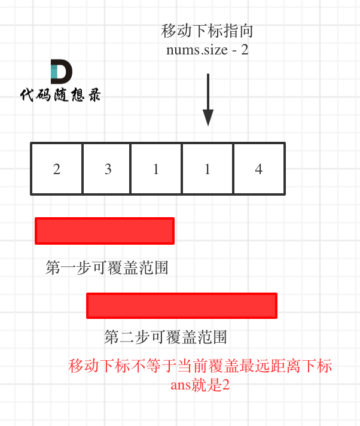

## Day32: 贪心算法part02

### 122.买卖股票的最佳时机 II

[LeetCode](https://leetcode.cn/problems/best-time-to-buy-and-sell-stock-ii/)  [文章讲解](https://programmercarl.com/0122.%E4%B9%B0%E5%8D%96%E8%82%A1%E7%A5%A8%E7%9A%84%E6%9C%80%E4%BD%B3%E6%97%B6%E6%9C%BAII.html)  [视频讲解](https://www.bilibili.com/video/BV1ev4y1C7na/)

#### 题目描述：

给你一个整数数组 `prices` ，其中 `prices[i]` 表示某支股票第 `i` 天的价格。

在每一天，你可以决定是否购买和/或出售股票。你在任何时候 **最多** 只能持有 **一股** 股票。你也可以先购买，然后在 **同一天** 出售。

返回 *你能获得的 **最大** 利润* 。

**示例 1：**

> 输入：prices = [7,1,5,3,6,4]
> 输出：7
> 解释：在第 2 天（股票价格 = 1）的时候买入，在第 3 天（股票价格 = 5）的时候卖出, 这笔交易所能获得利润 = 5 - 1 = 4 。
>      随后，在第 4 天（股票价格 = 3）的时候买入，在第 5 天（股票价格 = 6）的时候卖出, 这笔交易所能获得利润 = 6 - 3 = 3 。
>      总利润为 4 + 3 = 7 。

**示例 2：**

> 输入：prices = [1,2,3,4,5]
> 输出：4
> 解释：在第 1 天（股票价格 = 1）的时候买入，在第 5 天 （股票价格 = 5）的时候卖出, 这笔交易所能获得利润 = 5 - 1 = 4 。
>      总利润为 4 。

**示例 3：**

> 输入：prices = [7,6,4,3,1]
> 输出：0
> 解释：在这种情况下, 交易无法获得正利润，所以不参与交易可以获得最大利润，最大利润为 0 。

#### 我的解法：

每当有后面一天的价格比今天高时，才买入，等到价格下降就卖出。

```C++
class Solution
{
 public:
	int maxProfit(vector<int>& prices)
	{

		int price = 0;
		int profit = 0;

		for (int i = 0; i < prices.size() - 1; i++)
		{
			// 后一天比今天高，买入点
			if (prices[i] < prices[i + 1])
			{
				// 买入
				price = prices[i];
				i++;

				// 等到下降的那一天，寻找卖的时机
				while (i < prices.size() - 1 && prices[i] < prices[i + 1])
				{
					i++;
				}

				// 记录一次买卖的利润
				profit += prices[i] - price;
			}
		}

		return profit;
	}
};
```

#### 贪心思路

**局部最优：收集每天的正利润，全局最优：求得最大利润**。

收集每天的正利润就可以，**收集正利润的区间，就是股票买卖的区间，而我们只需要关注最终利润，不需要记录区间**。

```cpp
class Solution {
public:
    int maxProfit(vector<int>& prices) {
        int result = 0;
        for (int i = 1; i < prices.size(); i++) {
            result += max(prices[i] - prices[i - 1], 0);
        }
        return result;
    }
};
```

### 55. 跳跃游戏

[LeetCode](https://leetcode.cn/problems/jump-game/)  [文章讲解](https://programmercarl.com/0055.%E8%B7%B3%E8%B7%83%E6%B8%B8%E6%88%8F.html)  [视频讲解](https://www.bilibili.com/video/BV1VG4y1X7kB/)

#### 题目描述：

给你一个非负整数数组 `nums` ，你最初位于数组的 **第一个下标** 。数组中的每个元素代表你在该位置可以跳跃的最大长度。

判断你是否能够到达最后一个下标，如果可以，返回 `true` ；否则，返回 `false` 。

**示例 1：**

> 输入：nums = [2,3,1,1,4]
> 输出：true
> 解释：可以先跳 1 步，从下标 0 到达下标 1, 然后再从下标 1 跳 3 步到达最后一个下标。

**示例 2：**

> 输入：nums = [3,2,1,0,4]
> 输出：false
> 解释：无论怎样，总会到达下标为 3 的位置。但该下标的最大跳跃长度是 0 ， 所以永远不可能到达最后一个下标。

#### 我的解法：

使用一个`count`记录当前还能走的步数，如果没到终点之前变为了0，表示无法走到终点。

```C++
class Solution
{
 public:
	bool canJump(vector<int>& nums)
	{
		int count = 0;    // 记录当前还能往后走的步数
		for (int i = 0; i < nums.size(); i++)
		{
			// 更新当前能走的步数
			count = max(nums[i], count);

			// 不是终点位置，但是还能走的步数为 0，表示已经无法走到终点了
			if (i != nums.size() - 1 && count == 0) return false;
			// 向后移动一格
			count--;
		}

		return true;
	}
};
```

#### 贪心思路

跳几步无所谓，关键在于可跳的覆盖范围！

**那么这个问题就转化为跳跃覆盖范围究竟可不可以覆盖到终点！**

每次移动取最大跳跃步数（得到最大的覆盖范围），每移动一个单位，就更新最大覆盖范围。

**贪心算法局部最优解：每次取最大跳跃步数（取最大覆盖范围），整体最优解：最后得到整体最大覆盖范围，看是否能到终点**。

如图：


##### 整体代码：

```cpp
class Solution {
public:
    bool canJump(vector<int>& nums) {
        int cover = 0;
        if (nums.size() == 1) return true; // 只有一个元素，就是能达到
        for (int i = 0; i <= cover; i++) { // 注意这里是小于等于cover
            cover = max(i + nums[i], cover);
            if (cover >= nums.size() - 1) return true; // 说明可以覆盖到终点了
        }
        return false;
    }
};
```

### 45.跳跃游戏 II

[LeetCode](https://leetcode.cn/problems/jump-game-ii/)  [文章讲解](https://programmercarl.com/0045.%E8%B7%B3%E8%B7%83%E6%B8%B8%E6%88%8FII.html)  [视频讲解](https://www.bilibili.com/video/BV1Y24y1r7XZ/)

#### 题目描述：

给定一个长度为 `n` 的 **0 索引**整数数组 `nums`。初始位置为 `nums[0]`。

每个元素 `nums[i]` 表示从索引 `i` 向前跳转的最大长度。换句话说，如果你在 `nums[i]` 处，你可以跳转到任意 `nums[i + j]` 处:

- `0 <= j <= nums[i]` 
- `i + j < n`

返回到达 `nums[n - 1]` 的最小跳跃次数。生成的测试用例可以到达 `nums[n - 1]`。

**示例 1:**

> 输入: nums = [2,3,1,1,4]
> 输出: 2
> 解释: 跳到最后一个位置的最小跳跃数是 2。
>      从下标为 0 跳到下标为 1 的位置，跳 1 步，然后跳 3 步到达数组的最后一个位置。

**示例 2:**

> 输入: nums = [2,3,0,1,4]
> 输出: 2

#### 贪心思路：

贪心的思路，局部最优：当前可移动距离尽可能多走，如果还没到终点，步数再加一。整体最优：一步尽可能多走，从而达到最少步数。

思路虽然是这样，但在写代码的时候还不能真的能跳多远就跳多远，那样就不知道下一步最远能跳到哪里了。

**所以真正解题的时候，要从覆盖范围出发，不管怎么跳，覆盖范围内一定是可以跳到的，以最小的步数增加覆盖范围，覆盖范围一旦覆盖了终点，得到的就是最少步数！**

**这里需要统计两个覆盖范围，当前这一步的最大覆盖和下一步最大覆盖**。

如果移动下标达到了当前这一步的最大覆盖最远距离了，还没有到终点的话，那么就必须再走一步来增加覆盖范围，直到覆盖范围覆盖了终点。

如图：


**图中覆盖范围的意义在于，只要红色的区域，最多两步一定可以到！（不用管具体怎么跳，反正一定可以跳到）**

##### 方式一

从图中可以看出来，就是移动下标达到了当前覆盖的最远距离下标时，步数就要加一，来增加覆盖距离。最后的步数就是最少步数。

这里还是有个特殊情况需要考虑，当移动下标达到了当前覆盖的最远距离下标时

- 如果当前覆盖最远距离下标不是是集合终点，步数就加一，还需要继续走。
- 如果当前覆盖最远距离下标就是是集合终点，步数不用加一，因为不能再往后走了。

C++代码如下：（详细注释）

```cpp
// 版本一
class Solution {
public:
    int jump(vector<int>& nums) {
        if (nums.size() == 1) return 0;
        int curDistance = 0;    // 当前覆盖最远距离下标
        int ans = 0;            // 记录走的最大步数
        int nextDistance = 0;   // 下一步覆盖最远距离下标
        for (int i = 0; i < nums.size(); i++) {
            nextDistance = max(nums[i] + i, nextDistance);  // 更新下一步覆盖最远距离下标
            if (i == curDistance) {                         // 遇到当前覆盖最远距离下标
                ans++;                                  // 需要走下一步
                curDistance = nextDistance;             // 更新当前覆盖最远距离下标（相当于加油了）
                if (nextDistance >= nums.size() - 1) break;  // 当前覆盖最远距到达集合终点，不用做ans++操作了，直接结束
            }
        }
        return ans;
    }
};
```

##### 方式二

 依然是贪心，思路和方法一差不多，代码可以简洁一些。

**针对于方法一的特殊情况，可以统一处理**，即：移动下标只要遇到当前覆盖最远距离的下标，直接步数加一，不考虑是不是终点的情况。

想要达到这样的效果，只要让移动下标，最大只能移动到 nums.size - 2 的地方就可以了。

因为当移动下标指向 nums.size - 2 时：

- 如果移动下标等于当前覆盖最大距离下标， 需要再走一步（即 ans++），因为最后一步一定是可以到的终点。（题目假设总是可以到达数组的最后一个位置），如图： 
- 如果移动下标不等于当前覆盖最大距离下标，说明当前覆盖最远距离就可以直接达到终点了，不需要再走一步。如图：



代码如下：

```cpp
// 版本二
class Solution {
public:
    int jump(vector<int>& nums) {
        int curDistance = 0;    // 当前覆盖的最远距离下标
        int ans = 0;            // 记录走的最大步数
        int nextDistance = 0;   // 下一步覆盖的最远距离下标
        for (int i = 0; i < nums.size() - 1; i++) { // 注意这里是小于nums.size() - 1，这是关键所在
            nextDistance = max(nums[i] + i, nextDistance); // 更新下一步覆盖的最远距离下标
            if (i == curDistance) {                 // 遇到当前覆盖的最远距离下标
                curDistance = nextDistance;         // 更新当前覆盖的最远距离下标
                ans++;
            }
        }
        return ans;
    }
};
```

**其精髓在于控制移动下标 i 只移动到 nums.size() - 2 的位置**，所以移动下标只要遇到当前覆盖最远距离的下标，直接步数加一，不用考虑别的了。

### 今日总结

第一第二题提交通过了，第三题有点没想到。感觉贪心的思想还是没有很get到。
