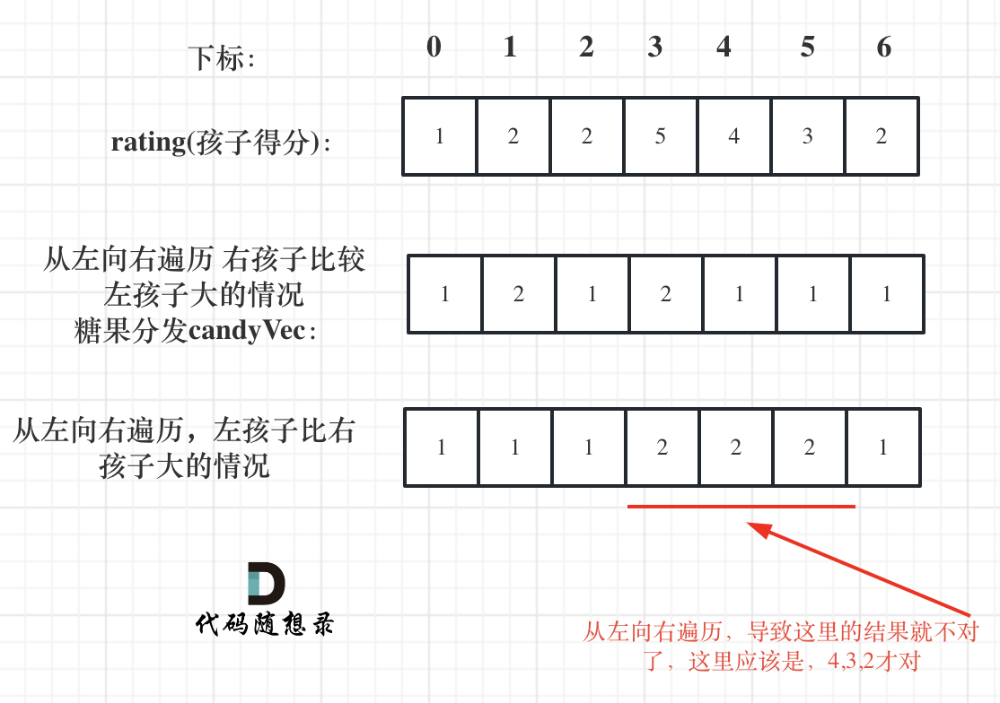

## Day34: 贪心算法part03

### 1005.K次取反后最大化的数组和

[LeetCode](https://leetcode.cn/problems/maximize-sum-of-array-after-k-negations/)  [文章讲解](https://programmercarl.com/1005.K%E6%AC%A1%E5%8F%96%E5%8F%8D%E5%90%8E%E6%9C%80%E5%A4%A7%E5%8C%96%E7%9A%84%E6%95%B0%E7%BB%84%E5%92%8C.html)  [视频讲解](https://www.bilibili.com/video/BV138411G7LY/)

#### 题目描述：

给你一个整数数组 `nums` 和一个整数 `k` ，按以下方法修改该数组：

- 选择某个下标 `i` 并将 `nums[i]` 替换为 `-nums[i]` 。

重复这个过程恰好 `k` 次。可以多次选择同一个下标 `i` 。

以这种方式修改数组后，返回数组 **可能的最大和** 。

**示例 1：**

> 输入：nums = [4,2,3], k = 1
> 输出：5
> 解释：选择下标 1 ，nums 变为 [4,-2,3] 。

**示例 2：**

> 输入：nums = [3,-1,0,2], k = 3
> 输出：6
> 解释：选择下标 (1, 2, 2) ，nums 变为 [3,1,0,2] 。

**示例 3：**

> 输入：nums = [2,-3,-1,5,-4], k = 2
> 输出：13
> 解释：选择下标 (1, 4) ，nums 变为 [2,3,-1,5,4] 。

#### 贪心思路：

局部最优：只找数值最小的正整数进行反转，当前数值和可以达到最大（例如正整数数组{5, 3, 1}，反转1 得到-1 比 反转5得到的-5 大多了），全局最优：整个 数组和 达到最大。

本题的解题步骤为：

- 第一步：将数组按照绝对值大小从大到小排序，**注意要按照绝对值的大小**
- 第二步：从前向后遍历，遇到负数将其变为正数，同时K--
- 第三步：如果K还大于0，那么反复转变数值最小的元素，将K用完
- 第四步：求和

```C++
class Solution
{
	static bool cmp(int a, int b)
	{
		return abs(a) > abs(b);
	}

 public:
	int largestSumAfterKNegations(vector<int>& nums, int k)
	{
		sort(nums.begin(), nums.end(), cmp);

		for (int& num : nums)
		{
			if (num < 0 && k > 0)
			{
				num *= -1;
				k--;
			}
		}

		if (k % 2 == 1) nums.back() *= -1;
		int sum = 0;
		for (int num : nums)
		{
			sum += num;
		}

		return sum;
	}
};
```

### 134. 加油站

[LeetCode](https://leetcode.cn/problems/gas-station/)  [文章讲解](https://programmercarl.com/0134.%E5%8A%A0%E6%B2%B9%E7%AB%99.html)  [视频讲解](https://www.bilibili.com/video/BV1jA411r7WX/)

#### 题目描述：

在一条环路上有 `n` 个加油站，其中第 `i` 个加油站有汽油 `gas[i]` 升。

你有一辆油箱容量无限的的汽车，从第 `i` 个加油站开往第 `i+1` 个加油站需要消耗汽油 `cost[i]` 升。你从其中的一个加油站出发，开始时油箱为空。

给定两个整数数组 `gas` 和 `cost` ，如果你可以按顺序绕环路行驶一周，则返回出发时加油站的编号，否则返回 `-1` 。如果存在解，则 **保证** 它是 **唯一** 的。

**示例 1:**

> 输入: gas = [1,2,3,4,5], cost = [3,4,5,1,2]
> 输出: 3
> 解释:
> 从 3 号加油站(索引为 3 处)出发，可获得 4 升汽油。此时油箱有 = 0 + 4 = 4 升汽油
> 开往 4 号加油站，此时油箱有 4 - 1 + 5 = 8 升汽油
> 开往 0 号加油站，此时油箱有 8 - 2 + 1 = 7 升汽油
> 开往 1 号加油站，此时油箱有 7 - 3 + 2 = 6 升汽油
> 开往 2 号加油站，此时油箱有 6 - 4 + 3 = 5 升汽油
> 开往 3 号加油站，你需要消耗 5 升汽油，正好足够你返回到 3 号加油站。
> 因此，3 可为起始索引。

**示例 2:**

> 输入: gas = [2,3,4], cost = [3,4,3]
> 输出: -1
> 解释:
> 你不能从 0 号或 1 号加油站出发，因为没有足够的汽油可以让你行驶到下一个加油站。
> 我们从 2 号加油站出发，可以获得 4 升汽油。 此时油箱有 = 0 + 4 = 4 升汽油
> 开往 0 号加油站，此时油箱有 4 - 3 + 2 = 3 升汽油
> 开往 1 号加油站，此时油箱有 3 - 3 + 3 = 3 升汽油
> 你无法返回 2 号加油站，因为返程需要消耗 4 升汽油，但是你的油箱只有 3 升汽油。
> 因此，无论怎样，你都不可能绕环路行驶一周。

#### 我的解法：

如果一个加油站到下一个加油站还有剩余的油，就从这加油站开始模拟一次行走。

```C++
class Solution
{
 public:
	int canCompleteCircuit(vector<int>& gas, vector<int>& cost)
	{
		for (int i = 0; i < gas.size(); i++)
		{
			if (gas[i] > 0 && gas[i] - cost[i] >= 0)
			{
				// 有剩油的加油站就统计
				int res_gas = 0;
				for (int j = i; j < (gas.size() + i); ++j)
				{
					res_gas += gas[j % gas.size()] - cost[j % gas.size()];

					// 无法完成
					if (res_gas < 0)
					{
						// 就从下一个加油站开始重新尝试
						i = j;
						break;
					}
				}

				if (res_gas >= 0)	return i;
			}
		}

		return -1;
	}
};
```

#### 贪心思路

如果总油量减去总消耗大于等于零那么一定可以跑完一圈，说明 各个站点的加油站 剩油量`rest[i]`相加一定是大于等于零的。

每个加油站的剩余量`rest[i]`为`gas[i] - cost[i]`。

`i`从0开始累加`rest[i]`，和记为`curSum`，一旦`curSum`小于零，说明`[0, i]`区间都不能作为起始位置，因为这个区间选择任何一个位置作为起点，到i这里都会断油，那么起始位置从`i+1`算起，再从0计算`curSum`。该思想类似 [122.买卖股票的最佳时机 II](https://programmercarl.com/0122.%E4%B9%B0%E5%8D%96%E8%82%A1%E7%A5%A8%E7%9A%84%E6%9C%80%E4%BD%B3%E6%97%B6%E6%9C%BAII.html)。

如图：


那么为什么一旦[0，i] 区间和为负数，起始位置就可以是i+1呢，i+1后面就不会出现更大的负数？

如果出现更大的负数，就是更新i，那么起始位置又变成新的i+1了。

那有没有可能 [0，i] 区间 选某一个作为起点，累加到 i这里 curSum是不会小于零呢？ 如图：


如果 curSum<0 说明 区间和1 + 区间和2 < 0， 那么 假设从上图中的位置开始计数curSum不会小于0的话，就是 区间和2>0。

区间和1 + 区间和2 < 0 同时 区间和2>0，只能说明区间和1 < 0， 那么就会从假设的箭头初就开始从新选择其实位置了。

**那么局部最优：当前累加rest[i]的和curSum一旦小于0，起始位置至少要是i+1，因为从i之前开始一定不行。全局最优：找到可以跑一圈的起始位置**。

局部最优可以推出全局最优，找不出反例，试试贪心！

C++代码如下：

```cpp
class Solution {
public:
    int canCompleteCircuit(vector<int>& gas, vector<int>& cost) {
        int curSum = 0;
        int totalSum = 0;
        int start = 0;
        for (int i = 0; i < gas.size(); i++) {
            curSum += gas[i] - cost[i];
            totalSum += gas[i] - cost[i];
            if (curSum < 0) {   // 当前累加rest[i]和 curSum一旦小于0
                start = i + 1;  // 起始位置更新为i+1
                curSum = 0;     // curSum从0开始
            }
        }
        if (totalSum < 0) return -1; // 说明怎么走都不可能跑一圈了
        return start;
    }
};
```

- 时间复杂度：O(n)
- 空间复杂度：O(1)

### 135. 分发糖果

[LeetCode](https://leetcode.cn/problems/candy/)  [文章讲解](https://programmercarl.com/0135.%E5%88%86%E5%8F%91%E7%B3%96%E6%9E%9C.html)  [视频讲解](https://www.bilibili.com/video/BV1ev4y1r7wN/)

#### 题目描述：

`n` 个孩子站成一排。给你一个整数数组 `ratings` 表示每个孩子的评分。

你需要按照以下要求，给这些孩子分发糖果：

- 每个孩子至少分配到 `1` 个糖果。
- 相邻两个孩子评分更高的孩子会获得更多的糖果。

请你给每个孩子分发糖果，计算并返回需要准备的 **最少糖果数目** 。

**示例 1：**

> 输入：ratings = [1,0,2]
> 输出：5
> 解释：你可以分别给第一个、第二个、第三个孩子分发 2、1、2 颗糖果。

**示例 2：**

> 输入：ratings = [1,2,2]
> 输出：4
> 解释：你可以分别给第一个、第二个、第三个孩子分发 1、2、1 颗糖果。
     第三个孩子只得到 1 颗糖果，这满足题面中的两个条件。

#### 贪心思路：

这道题目一定是要确定一边之后，再确定另一边，例如比较每一个孩子的左边，然后再比较右边，**如果两边一起考虑一定会顾此失彼**。采用两次贪心的策略：

- 一次是从左到右遍历，只比较右边孩子评分比左边大的情况。
- 一次是从右到左遍历，只比较左边孩子评分比右边大的情况。

先确定右边评分大于左边的情况（也就是从前向后遍历）

此时局部最优：只要右边评分比左边大，右边的孩子就多一个糖果，全局最优：相邻的孩子中，评分高的右孩子获得比左边孩子更多的糖果

局部最优可以推出全局最优。

如果ratings[i] > ratings[i - 1] 那么[i]的糖 一定要比[i - 1]的糖多一个，所以贪心：candyVec[i] = candyVec[i - 1] + 1

代码如下：

```cpp
// 从前向后
for (int i = 1; i < ratings.size(); i++) {
    if (ratings[i] > ratings[i - 1]) candyVec[i] = candyVec[i - 1] + 1;
}
```

如图：


再确定左孩子大于右孩子的情况（从后向前遍历）

因为 rating[5]与rating[4]的比较 要利用上 rating[5]与rating[6]的比较结果，所以 要从后向前遍历。

如果从前向后遍历，rating[5]与rating[4]的比较 就不能用上 rating[5]与rating[6]的比较结果了 。如图：



**确定左孩子大于右孩子的情况一定要从后向前遍历！**

如果 ratings[i] > ratings[i + 1]，此时candyVec[i]（第i个小孩的糖果数量）就有两个选择了，一个是candyVec[i + 1] + 1（从右边这个加1得到的糖果数量），一个是candyVec[i]（之前比较右孩子大于左孩子得到的糖果数量）。

那么又要贪心了，局部最优：取candyVec[i + 1] + 1 和 candyVec[i] 最大的糖果数量，保证第i个小孩的糖果数量既大于左边的也大于右边的。全局最优：相邻的孩子中，评分高的孩子获得更多的糖果。

局部最优可以推出全局最优。

所以就取candyVec[i + 1] + 1 和 candyVec[i] 最大的糖果数量，**candyVec[i]只有取最大的才能既保持对左边candyVec[i - 1]的糖果多，也比右边candyVec[i + 1]的糖果多**。

如图：


所以该过程代码如下：

```cpp
// 从后向前
for (int i = ratings.size() - 2; i >= 0; i--) {
    if (ratings[i] > ratings[i + 1] ) {
        candyVec[i] = max(candyVec[i], candyVec[i + 1] + 1);
    }
}
```

整体代码如下：

```cpp
class Solution {
public:
    int candy(vector<int>& ratings) {
        vector<int> candyVec(ratings.size(), 1);
        // 从前向后
        for (int i = 1; i < ratings.size(); i++) {
            if (ratings[i] > ratings[i - 1]) candyVec[i] = candyVec[i - 1] + 1;
        }
        // 从后向前
        for (int i = ratings.size() - 2; i >= 0; i--) {
            if (ratings[i] > ratings[i + 1] ) {
                candyVec[i] = max(candyVec[i], candyVec[i + 1] + 1);
            }
        }
        // 统计结果
        int result = 0;
        for (int i = 0; i < candyVec.size(); i++) result += candyVec[i];
        return result;
    }
};
```

- 时间复杂度: O(n)
- 空间复杂度: O(n)

### 今日总结

贪心算法的题目就像脑筋急转弯，想到了就好简单，就想不到就好难。。。
