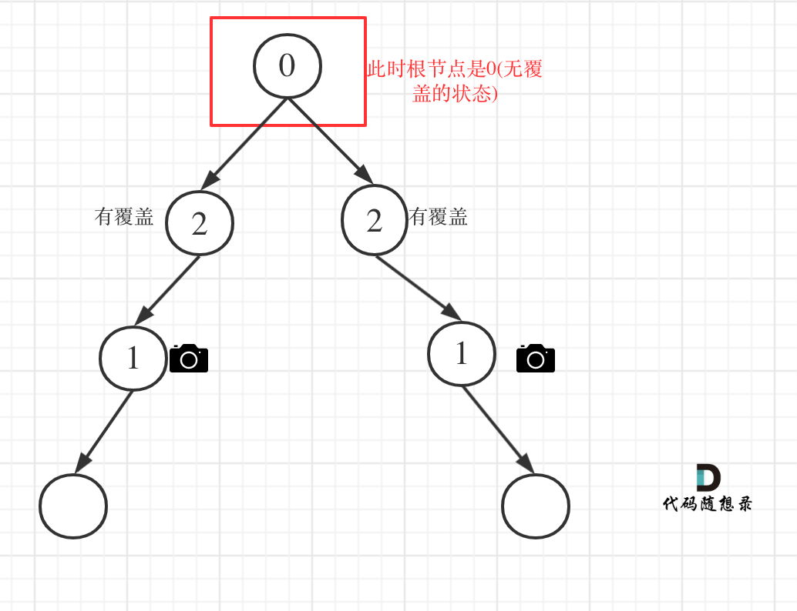

## Day37: 贪心算法part06

### 738.单调递增的数字

[LeetCode](https://leetcode.cn/problems/monotone-increasing-digits/)  [文章讲解](https://programmercarl.com/0738.%E5%8D%95%E8%B0%83%E9%80%92%E5%A2%9E%E7%9A%84%E6%95%B0%E5%AD%97.html)  [视频讲解](https://www.bilibili.com/video/BV1Kv4y1x7tP/)

#### 题目描述：

当且仅当每个相邻位数上的数字 `x` 和 `y` 满足 `x <= y` 时，我们称这个整数是**单调递增**的。

给定一个整数 `n` ，返回 *小于或等于 `n` 的最大数字，且数字呈 **单调递增*** 。

**示例 1:**

> 输入: n = 10
> 输出: 9

**示例 2:**

> 输入: n = 1234
> 输出: 1234

**示例 3:**

> 输入: n = 332
> 输出: 299

#### 我的解法（暴力解法）：

判断是否为单调递增的数组，不是就自减1。

```C++
class Solution
{
 public:
	bool isIncreasing(int num)
	{
		int pre = INT_MAX;
		while (num)
		{
			if (num % 10 <= pre)
			{
				pre = num % 10;
				num /= 10;
			}
			else
			{
				return false;
			}
		}
		return true;
	}

	int monotoneIncreasingDigits(int n)
	{
		while (!isIncreasing(n))
		{
			n--;
		}
		return n;
	}
};
```

#### 贪心思路

例如：98，一旦出现strNum[i - 1] > strNum[i]的情况（非单调递增），首先想让strNum[i - 1]--，然后strNum[i]给为9，这样这个整数就是89，即小于98的最大的单调递增整数。

这一点如果想清楚了，这道题就好办了。

此时是从前向后遍历还是从后向前遍历呢？

从前向后遍历的话，遇到strNum[i - 1] > strNum[i]的情况，让strNum[i - 1]减一，但此时如果strNum[i - 1]减一了，可能又小于strNum[i - 2]。

这么说有点抽象，举个例子，数字：332，从前向后遍历的话，那么就把变成了329，此时2又小于了第一位的3了，真正的结果应该是299。

那么从后向前遍历，就可以重复利用上次比较得出的结果了，从后向前遍历332的数值变化为：332 -> 329 -> 299

确定了遍历顺序之后，那么此时局部最优就可以推出全局，找不出反例，试试贪心。

代码如下：

```cpp
class Solution {
public:
    int monotoneIncreasingDigits(int N) {
        string strNum = to_string(N);
        // flag用来标记赋值9从哪里开始
        // 设置为这个默认值，为了防止第二个for循环在flag没有被赋值的情况下执行
        int flag = strNum.size();
        for (int i = strNum.size() - 1; i > 0; i--) {
            if (strNum[i - 1] > strNum[i] ) {
                flag = i;
                strNum[i - 1]--;
            }
        }
        for (int i = flag; i < strNum.size(); i++) {
            strNum[i] = '9';
        }
        return stoi(strNum);
    }
};
```

- 时间复杂度：O(n)，n 为数字长度
- 空间复杂度：O(n)，需要一个字符串，转化为字符串操作更方便

### 968.监控二叉树

[LeetCode](https://leetcode.cn/problems/binary-tree-cameras/)  [文章讲解](https://programmercarl.com/0968.%E7%9B%91%E6%8E%A7%E4%BA%8C%E5%8F%89%E6%A0%91.html)  [视频讲解](https://www.bilibili.com/video/BV1SA411U75i/)

#### 题目描述：

给定一个二叉树，我们在树的节点上安装摄像头。

节点上的每个摄影头都可以监视**其父对象、自身及其直接子对象。**

计算监控树的所有节点所需的最小摄像头数量。

**示例 1：**


> 输入：[0,0,null,0,0]
> 输出：1
> 解释：如图所示，一台摄像头足以监控所有节点。

**示例 2：**


> 输入：[0,0,null,0,null,0,null,null,0]
> 输出：2
> 解释：需要至少两个摄像头来监视树的所有节点。 上图显示了摄像头放置的有效位置之一。

**提示：**

1. 给定树的节点数的范围是 `[1, 1000]`。
2. 每个节点的值都是 0。

#### 贪心思路：

从题目中示例，其实可以得到启发，**我们发现题目示例中的摄像头都没有放在叶子节点上！**

这是很重要的一个线索，摄像头可以覆盖上中下三层，如果把摄像头放在叶子节点上，就浪费的一层的覆盖。

所以把摄像头放在叶子节点的父节点位置，才能充分利用摄像头的覆盖面积。

为什么不从头结点开始看起呢，为啥要从叶子节点看呢？

因为头结点放不放摄像头也就省下一个摄像头， 叶子节点放不放摄像头省下了的摄像头数量是指数阶别的。

**所以我们要从下往上看，局部最优：让叶子节点的父节点安摄像头，所用摄像头最少，整体最优：全部摄像头数量所用最少！**

局部最优推出全局最优，找不出反例，那么就按照贪心来！

此时，大体思路就是从低到上，先给叶子节点父节点放个摄像头，然后隔两个节点放一个摄像头，直至到二叉树头结点。

此时这道题目还有两个难点：

1. 二叉树的遍历
2. 如何隔两个节点放一个摄像头

##### 确定遍历顺序

在二叉树中如何从低向上推导呢？

可以使用后序遍历也就是左右中的顺序，这样就可以在回溯的过程中从下到上进行推导了。

后序遍历代码如下：

```cpp
int traversal(TreeNode* cur) {

    // 空节点，该节点有覆盖
    if (终止条件) return ;

    int left = traversal(cur->left);    // 左
    int right = traversal(cur->right);  // 右

    逻辑处理                            // 中
    return ;
}
```

**注意在以上代码中取了左孩子的返回值，右孩子的返回值，即left 和 right， 以后推导中间节点的状态**

##### 如何隔两个节点放一个摄像头

此时需要状态转移的公式，大家不要和动态的状态转移公式混到一起，本题状态转移没有择优的过程，就是单纯的状态转移！

来看看这个状态应该如何转移，先来看看每个节点可能有几种状态：

有如下三种：

- 该节点无覆盖
- 本节点有摄像头
- 本节点有覆盖

我们分别有三个数字来表示：

- 0：该节点无覆盖
- 1：本节点有摄像头
- 2：本节点有覆盖

大家应该找不出第四个节点的状态了。

**因为在遍历树的过程中，就会遇到空节点，那么问题来了，空节点究竟是哪一种状态呢？ 空节点表示无覆盖？ 表示有摄像头？还是有覆盖呢？**

回归本质，为了让摄像头数量最少，我们要尽量让叶子节点的父节点安装摄像头，这样才能摄像头的数量最少。

那么空节点不能是无覆盖的状态，这样叶子节点就要放摄像头了，空节点也不能是有摄像头的状态，这样叶子节点的父节点就没有必要放摄像头了，而是可以把摄像头放在叶子节点的爷爷节点上。

**所以空节点的状态只能是有覆盖，这样就可以在叶子节点的父节点放摄像头了**

接下来就是递推关系。

那么递归的终止条件应该是遇到了空节点，此时应该返回2（有覆盖），原因上面已经解释过了。

代码如下：

```cpp
// 空节点，该节点有覆盖
if (cur == NULL) return 2;
```

递归的函数，以及终止条件已经确定了，再来看单层逻辑处理。

主要有如下四类情况：

- 情况1：左右节点都有覆盖

左孩子有覆盖，右孩子有覆盖，那么此时中间节点应该就是无覆盖的状态了。

如图：


代码如下：

```cpp
// 左右节点都有覆盖
if (left == 2 && right == 2) return 0;
```

- 情况2：左右节点至少有一个无覆盖的情况

如果是以下情况，则中间节点（父节点）应该放摄像头：

- left == 0 && right == 0 左右节点无覆盖
- left == 1 && right == 0 左节点有摄像头，右节点无覆盖
- left == 0 && right == 1 左节点有无覆盖，右节点摄像头
- left == 0 && right == 2 左节点无覆盖，右节点覆盖
- left == 2 && right == 0 左节点覆盖，右节点无覆盖

这个不难理解，毕竟有一个孩子没有覆盖，父节点就应该放摄像头。

此时摄像头的数量要加一，并且return 1，代表中间节点放摄像头。

代码如下：

```cpp
if (left == 0 || right == 0) {
    result++;
    return 1;
}
```

- 情况3：左右节点至少有一个有摄像头

如果是以下情况，其实就是 左右孩子节点有一个有摄像头了，那么其父节点就应该是2（覆盖的状态）

- left == 1 && right == 2 左节点有摄像头，右节点有覆盖
- left == 2 && right == 1 左节点有覆盖，右节点有摄像头
- left == 1 && right == 1 左右节点都有摄像头

代码如下：

```cpp
if (left == 1 || right == 1) return 2;
```

**从这个代码中，可以看出，如果left == 1, right == 0 怎么办？其实这种条件在情况2中已经判断过了**，如图：


- 情况4：头结点没有覆盖

以上都处理完了，递归结束之后，可能头结点 还有一个无覆盖的情况，如图：



所以递归结束之后，还要判断根节点，如果没有覆盖，result++，代码如下：

```cpp
int minCameraCover(TreeNode* root) {
    result = 0;
    if (traversal(root) == 0) { // root 无覆盖
        result++;
    }
    return result;
}
```

以上四种情况我们分析完了，代码也差不多了，整体代码如下：

```cpp
// 版本一
class Solution {
private:
    int result;
    int traversal(TreeNode* cur) {

        // 空节点，该节点有覆盖
        if (cur == NULL) return 2;

        int left = traversal(cur->left);    // 左
        int right = traversal(cur->right);  // 右

        // 情况1
        // 左右节点都有覆盖
        if (left == 2 && right == 2) return 0;

        // 情况2
        // left == 0 && right == 0 左右节点无覆盖
        // left == 1 && right == 0 左节点有摄像头，右节点无覆盖
        // left == 0 && right == 1 左节点有无覆盖，右节点摄像头
        // left == 0 && right == 2 左节点无覆盖，右节点覆盖
        // left == 2 && right == 0 左节点覆盖，右节点无覆盖
        if (left == 0 || right == 0) {
            result++;
            return 1;
        }

        // 情况3
        // left == 1 && right == 2 左节点有摄像头，右节点有覆盖
        // left == 2 && right == 1 左节点有覆盖，右节点有摄像头
        // left == 1 && right == 1 左右节点都有摄像头
        // 其他情况前段代码均已覆盖
        if (left == 1 || right == 1) return 2;

        // 以上代码我没有使用else，主要是为了把各个分支条件展现出来，这样代码有助于读者理解
        // 这个 return -1 逻辑不会走到这里。
        return -1;
    }

public:
    int minCameraCover(TreeNode* root) {
        result = 0;
        // 情况4
        if (traversal(root) == 0) { // root 无覆盖
            result++;
        }
        return result;
    }
};
```

在以上代码的基础上，再进行精简，代码如下：

```cpp
// 版本二
class Solution {
private:
    int result;
    int traversal(TreeNode* cur) {
        if (cur == NULL) return 2;
        int left = traversal(cur->left);    // 左
        int right = traversal(cur->right);  // 右
        if (left == 2 && right == 2) return 0;
        else if (left == 0 || right == 0) {
            result++;
            return 1;
        } else return 2;
    }
public:
    int minCameraCover(TreeNode* root) {
        result = 0;
        if (traversal(root) == 0) { // root 无覆盖
            result++;
        }
        return result;
    }
};
```

- 时间复杂度: O(n)，需要遍历二叉树上的每个节点
- 空间复杂度: O(n)

大家可能会惊讶，居然可以这么简短，**其实就是在版本一的基础上，使用else把一些情况直接覆盖掉了**。

在网上关于这道题解可以搜到很多这种神级别的代码，但都没讲不清楚，如果直接看代码的话，指定越看越晕，**所以建议大家对着版本一的代码一步一步来，版本二中看不中用！**。

### 贪心算法总结

1. 贪心很简单，就是常识？

贪心思路往往很巧妙，并不简单。

2. 贪心有没有固定的套路？

贪心无套路，也没有框架之类的，需要多看多练培养感觉才能想到贪心的思路。

3. 究竟什么题目是贪心呢？

Carl个人认为：如果找出局部最优并可以推出全局最优，就是贪心，如果局部最优都没找出来，就不是贪心，可能是单纯的模拟。（并不是权威解读，一家之辞哈）

但我们也不用过于强调什么题目是贪心，什么不是贪心，那就太学术了，毕竟学会解题就行了。

4. 如何知道局部最优推出全局最优，有数学证明么？

在做贪心题的过程中，如果再来一个数据证明，其实没有必要，手动模拟一下，如果找不出反例，就试试贪心。面试中，代码写出来跑过测试用例即可，或者自己能自圆其说理由就行了

就像是 要用一下 1 + 1 = 2，没有必要再证明一下 1 + 1 究竟为什么等于 2。（例子极端了点，但是这个道理）

贪心专题汇聚为一张图：


### 今日总结

今天的题目有点难，完全没有想到。
