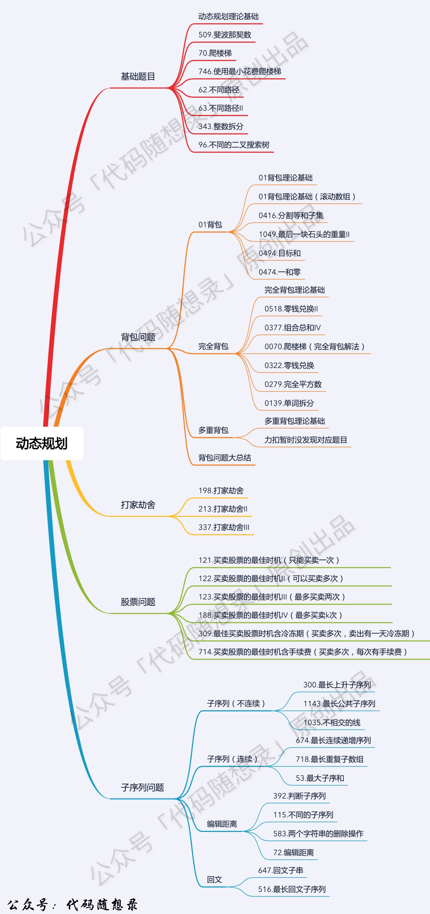

## Day38: 动态规划part01

### 动态规划理论基础

动态规划，英文：Dynamic Programming，简称DP，如果某一问题有很多重叠子问题，使用动态规划是最有效的。

#### 动态规划的解题步骤

做动规题目的时候，经常会陷入一个误区，就是以为把状态转移公式背下来，照葫芦画瓢改改，就开始写代码，甚至把题目AC之后，都不太清楚dp[i]表示的是什么。状态转移公式（递推公式）是很重要，但动规不仅仅只有递推公式。

**对于动态规划问题，我将拆解为如下五步曲，这五步都搞清楚了，才能说把动态规划真的掌握了！**

1. 确定dp数组（dp table）以及下标的含义
2. 确定递推公式
3. dp数组如何初始化
4. 确定遍历顺序
5. 举例推导dp数组

为什么要先确定递推公式，然后在考虑初始化呢？

**因为一些情况是递推公式决定了dp数组要如何初始化！**

#### 动态规划应该如何debug

**找问题的最好方式就是把dp数组打印出来，看看究竟是不是按照自己思路推导的！**

**做动规的题目，写代码之前一定要把状态转移在dp数组的上具体情况模拟一遍，心中有数，确定最后推出的是想要的结果**。

然后再写代码，如果代码没通过就打印dp数组，看看是不是和自己预先推导的哪里不一样。

如果打印出来和自己预先模拟推导是一样的，那么就是自己的递归公式、初始化或者遍历顺序有问题了。

如果和自己预先模拟推导的不一样，那么就是代码实现细节有问题。

**这样才是一个完整的思考过程，而不是一旦代码出问题，就毫无头绪的东改改西改改，最后过不了，或者说是稀里糊涂的过了**。

其实可以自己先思考这三个问题：

- 这道题目我举例推导状态转移公式了么？
- 我打印dp数组的日志了么？
- 打印出来了dp数组和我想的一样么？

**如果这灵魂三问自己都做到了，基本上这道题目也就解决了**，或者更清晰的知道自己究竟是哪一点不明白，是状态转移不明白，还是实现代码不知道该怎么写，还是不理解遍历dp数组的顺序。

#### 动态规划刷题大纲



### 509. 斐波那契数 

[LeetCode](https://leetcode.cn/problems/fibonacci-number/)  [文章讲解](https://programmercarl.com/0509.%E6%96%90%E6%B3%A2%E9%82%A3%E5%A5%91%E6%95%B0.html)  [视频讲解](https://www.bilibili.com/video/BV1f5411K7mo/)

#### 题目描述：

**斐波那契数** （通常用 `F(n)` 表示）形成的序列称为 **斐波那契数列** 。该数列由 `0` 和 `1` 开始，后面的每一项数字都是前面两项数字的和。也就是：

> F(0) = 0，F(1) = 1
> F(n) = F(n - 1) + F(n - 2)，其中 n > 1

给定 `n` ，请计算 `F(n)` 。

**示例 1：**

> 输入：n = 2
> 输出：1
> 解释：F(2) = F(1) + F(0) = 1 + 0 = 1

**示例 2：**

> 输入：n = 3
> 输出：2
> 解释：F(3) = F(2) + F(1) = 1 + 1 = 2

**示例 3：**

> 输入：n = 4
> 输出：3
> 解释：F(4) = F(3) + F(2) = 2 + 1 = 3

#### 我的解法：

使用一个数组记录每次的结果，然后分情况输出。

**动规五部曲**：

这里我们要用一个一维dp数组来保存递归的结果

1. 确定dp数组以及下标的含义

dp[i]的定义为：第i个数的斐波那契数值是dp[i]

2. 确定递推公式

为什么这是一道非常简单的入门题目呢？

**因为题目已经把递推公式直接给我们了：状态转移方程 dp[i] = dp[i - 1] + dp[i - 2];**

3. dp数组如何初始化

**题目中把如何初始化也直接给我们了，如下：**

```text
dp[0] = 0;
dp[1] = 1;
```

4. 确定遍历顺序

从递归公式dp[i] = dp[i - 1] + dp[i - 2];中可以看出，dp[i]是依赖 dp[i - 1] 和 dp[i - 2]，那么遍历的顺序一定是从前到后遍历的

5. 举例推导dp数组

按照这个递推公式dp[i] = dp[i - 1] + dp[i - 2]，我们来推导一下，当N为10的时候，dp数组应该是如下的数列：

0 1 1 2 3 5 8 13 21 34 55

如果代码写出来，发现结果不对，就把dp数组打印出来看看和我们推导的数列是不是一致的。

```C++
class Solution
{
 public:
	int fib(int n)
	{
		vector<int> dp;
		dp.push_back(1);
		dp.push_back(1);

		while (dp.size() < n)
		{
			dp.push_back(dp[dp.size() - 2] + dp[dp.size() - 1]);
		}

		if (n == 0) return 0;
		if (n <= 2) return 1;

		return dp[n - 1];
	}
};
```

#### 进一步优化：

```cpp
class Solution {
public:
    int fib(int N) {
        if (N <= 1) return N;
        vector<int> dp(N + 1);
        dp[0] = 0;
        dp[1] = 1;
        for (int i = 2; i <= N; i++) {
            dp[i] = dp[i - 1] + dp[i - 2];
        }
        return dp[N];
    }
};
```

### 70. 爬楼梯

[LeetCode](https://leetcode.cn/problems/climbing-stairs/)  [文章讲解](https://programmercarl.com/0070.%E7%88%AC%E6%A5%BC%E6%A2%AF.html)  [视频讲解](https://www.bilibili.com/video/BV17h411h7UH/)

#### 题目描述：

假设你正在爬楼梯。需要 `n` 阶你才能到达楼顶。

每次你可以爬 `1` 或 `2` 个台阶。你有多少种不同的方法可以爬到楼顶呢？

**示例 1：**

> 输入：n = 2
> 输出：2
> 解释：有两种方法可以爬到楼顶。
>
> 1. 1 阶 + 1 阶
> 2. 2 阶

**示例 2：**

> 输入：n = 3
> 输出：3
> 解释：有三种方法可以爬到楼顶。
>
> 1. 1 阶 + 1 阶 + 1 阶
> 2. 1 阶 + 2 阶
> 3. 2 阶 + 1 阶

#### 解法思路：

**动规五部曲**：

定义一个一维数组来记录不同楼层的状态

1. 确定dp数组以及下标的含义

dp[i]： 爬到第i层楼梯，有dp[i]种方法

2. 确定递推公式

如何可以推出dp[i]呢？

从dp[i]的定义可以看出，dp[i] 可以有两个方向推出来。

首先是dp[i - 1]，上i-1层楼梯，有dp[i - 1]种方法，那么再一步跳一个台阶就是dp[i]。

还有就是dp[i - 2]，上i-2层楼梯，有dp[i - 2]种方法，那么再一步跳两个台阶就是dp[i]。

那么dp[i]就是 dp[i - 1]与dp[i - 2]之和！

所以dp[i] = dp[i - 1] + dp[i - 2] 。

3. dp数组如何初始化

再回顾一下dp[i]的定义：爬到第i层楼梯，有dp[i]种方法。

需要注意的是：题目中说了n是一个正整数，题目根本就没说n有为0的情况。

所以本题其实就不应该讨论dp[0]的初始化！

dp[1] = 1，dp[2] = 2

4. 确定遍历顺序

从递推公式dp[i] = dp[i - 1] + dp[i - 2];中可以看出，遍历顺序一定是从前向后遍历的

5. 举例推导dp数组

举例当n为5的时候，dp table（dp数组）应该是这样的


如果代码出问题了，就把dp table 打印出来，看看究竟是不是和自己推导的一样。

**此时大家应该发现了，这不就是斐波那契数列么！**

唯一的区别是，没有讨论dp[0]应该是什么，因为dp[0]在本题没有意义！

```cpp
class Solution {
public:
    int climbStairs(int n) {
        if (n <= 1) return n; // 因为下面直接对dp[2]操作了，防止空指针
        vector<int> dp(n + 1);
        dp[1] = 1;
        dp[2] = 2;
        for (int i = 3; i <= n; i++) { // 注意i是从3开始的
            dp[i] = dp[i - 1] + dp[i - 2];
        }
        return dp[n];
    }
};
```

### 746. 使用最小花费爬楼梯

[LeetCode](https://leetcode.cn/problems/min-cost-climbing-stairs/)  [文章讲解](https://programmercarl.com/0746.%E4%BD%BF%E7%94%A8%E6%9C%80%E5%B0%8F%E8%8A%B1%E8%B4%B9%E7%88%AC%E6%A5%BC%E6%A2%AF.html)  [视频讲解](https://www.bilibili.com/video/BV16G411c7yZ/)

#### 题目描述：

给你一个整数数组 `cost` ，其中 `cost[i]` 是从楼梯第 `i` 个台阶向上爬需要支付的费用。一旦你支付此费用，即可选择向上爬一个或者两个台阶。

你可以选择从下标为 `0` 或下标为 `1` 的台阶开始爬楼梯。

请你计算并返回达到楼梯顶部的最低花费。

**示例 1：**

> 输入：cost = [10,15,20]
> 输出：15
> 解释：你将从下标为 1 的台阶开始。
> - 支付 15 ，向上爬两个台阶，到达楼梯顶部。
> 总花费为 15 。

**示例 2：**

> 输入：cost = [1,100,1,1,1,100,1,1,100,1]
> 输出：6
> 解释：你将从下标为 0 的台阶开始。
>
> - 支付 1 ，向上爬两个台阶，到达下标为 2 的台阶。
> - 支付 1 ，向上爬两个台阶，到达下标为 4 的台阶。
> - 支付 1 ，向上爬两个台阶，到达下标为 6 的台阶。
> - 支付 1 ，向上爬一个台阶，到达下标为 7 的台阶。
> - 支付 1 ，向上爬两个台阶，到达下标为 9 的台阶。
> - 支付 1 ，向上爬一个台阶，到达楼梯顶部。
> 总花费为 6 。

#### 解法思路：

1. 确定dp数组以及下标的含义

使用动态规划，就要有一个数组来记录状态，本题只需要一个一维数组dp[i]就可以了。

**dp[i]的定义：到达第i台阶所花费的最少体力为dp[i]**。

2. 确定递推公式

**可以有两个途径得到dp[i]，一个是dp[i-1] 一个是dp[i-2]**。

dp[i - 1] 跳到 dp[i] 需要花费 dp[i - 1] + cost[i - 1]。

dp[i - 2] 跳到 dp[i] 需要花费 dp[i - 2] + cost[i - 2]。

一定是选最小的，所以dp[i] = min(dp[i - 1] + cost[i - 1], dp[i - 2] + cost[i - 2]);

3. dp数组如何初始化

只初始化dp[0]和dp[1]就够了，其他的最终都是dp[0]dp[1]推出。

题目描述中明确说了 “你可以选择从下标为 0 或下标为 1 的台阶开始爬楼梯。” 也就是说 到达 第 0 个台阶是不花费的，但从 第0 个台阶 往上跳的话，需要花费 cost[0]。

所以初始化 dp[0] = 0，dp[1] = 0;

4. 确定遍历顺序

最后一步，递归公式有了，初始化有了，如何遍历呢？

因为是模拟台阶，而且dp[i]由dp[i-1]dp[i-2]推出，所以是从前到后遍历cost数组就可以了。

> **但是稍稍有点难度的动态规划，其遍历顺序并不容易确定下来**。 例如：01背包，都知道两个for循环，一个for遍历物品嵌套一个for遍历背包容量，那么为什么不是一个for遍历背包容量嵌套一个for遍历物品呢？ 以及在使用一维dp数组的时候遍历背包容量为什么要倒序呢？

5. 举例推导dp数组

拿示例2：cost = [1, 100, 1, 1, 1, 100, 1, 1, 100, 1] ，来模拟一下dp数组的状态变化，如下：


```cpp
class Solution {
public:
    int minCostClimbingStairs(vector<int>& cost) {
        vector<int> dp(cost.size() + 1);
        dp[0] = 0; // 默认第一步都是不花费体力的
        dp[1] = 0;
        for (int i = 2; i <= cost.size(); i++) {
            dp[i] = min(dp[i - 1] + cost[i - 1], dp[i - 2] + cost[i - 2]);
        }
        return dp[cost.size()];
    }
};
```

### 今日总结

初识动态规划，完全陌生，动态规划五部曲要好好把握~！
