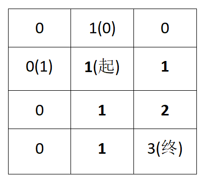

## Day39: 动态规划part02

### 62.不同路径

[LeetCode](https://leetcode.cn/problems/unique-paths/)  [文章讲解](https://programmercarl.com/0062.%E4%B8%8D%E5%90%8C%E8%B7%AF%E5%BE%84.html)  [视频讲解](https://www.bilibili.com/video/BV1ve4y1x7Eu/)

#### 题目描述：

一个机器人位于一个 `m x n` 网格的左上角 （起始点在下图中标记为 “Start” ）。

机器人每次只能向下或者向右移动一步。机器人试图达到网格的右下角（在下图中标记为 “Finish” ）。

问总共有多少条不同的路径？

**示例 1：**


> 输入：m = 3, n = 7
> 输出：28

**示例 2：**

> 输入：m = 3, n = 2
> 输出：3
> 解释：
> 从左上角开始，总共有 3 条路径可以到达右下角。
>
> 1. 向右 -> 向下 -> 向下
> 2. 向下 -> 向下 -> 向右
> 3. 向下 -> 向右 -> 向下

**示例 3：**

> 输入：m = 7, n = 3
> 输出：28

**示例 4：**

> 输入：m = 3, n = 3
> 输出：6

#### 我的解法：

**动规五部曲**：

dp(m)(n) = dp(m-1)(n) + dp(m)(n-1) 

定义一个二维数组来记录网格的状态

1. **确定dp数组以及下标的含义**

`dp[i][j]`： 走到`(i,j)`，有`dp[i][j]`种方法，`(1, 1)`为起点，`(m,n)`为终点

2. **确定递推公式**

`dp[i][j]` 可以有两个方向推出来。

首先是`dp[i-1][j]`，走到`(i-1, j)`，有`dp[i-1][j]`种方法，那么再往右走一步就是`dp[i][j]`。

还有就是`dp[i][j-1]`，走到`(i, j-1)`，有`dp[i][j-1]`种方法，那么再往下走一步`dp[i][j]`。

那么`dp[i][j]`就是 `dp[i-1][j]`与`dp[i][j-1]`之和！

所以`dp[i][j]=dp[i-1][j]+dp[i][j-1]` 。

3. **dp数组如何初始化**

正常的思路应该是：`dp[1][1]=0`,`dp[1][2]=1`,`dp[2][1]=1`，但是考虑到需要进行逐行遍历。因此更好的初始化应该是`dp[0][1]=1`或者`dp[1][0]=1`，需要注意的是，按照实际意义`dp[1][1]=0`，但是这种初始化会导致`dp[1][1]=1`.

4. **确定遍历顺序**

先行后列，逐行遍历

5. **举例推导dp数组**

举例当`m=3,n=2`的时候，dp table（dp数组）应该是这样的



```C++
class Solution
{
 public:
	int uniquePaths(int m, int n)
	{
		vector<vector<int>> dp(m+1, vector<int>(n+1));
		dp[0][1] = 1; // 或者 dp[1][0] = 1; 作为初始化

		for (int i = 1; i <= m; i++)
		{
			for (int j = 1; j <= n; j++)
			{
				dp[i][j] = dp[i - 1][j] + dp[i][j - 1];
			}
		}

		return dp[m][n];
	}
};
```

#### 参考解法：

机器人从`(0 , 0)` 位置出发，到`(m - 1, n - 1)`终点。

按照动规五部曲来分析：

1. 确定dp数组（dp table）以及下标的含义

`dp[i][j]` ：表示从`（0 ，0）`出发，到`(i, j)` 有`dp[i][j]`条不同的路径。

2. 确定递推公式

想要求`dp[i][j]`，只能有两个方向来推导出来，即`dp[i - 1][j]` 和 `dp[i][j - 1]`。

此时在回顾一下 `dp[i - 1][j]` 表示啥，是从`(0, 0)`的位置到`(i - 1, j)`有几条路径，`dp[i][j - 1]`同理。

那么很自然，`dp[i][j] = dp[i - 1][j] + dp[i][j - 1]`，因为`dp[i][j]`只有这两个方向过来。

3. dp数组的初始化

如何初始化呢，首先`dp[i][0]`一定都是1，因为从`(0, 0)`的位置到`(i, 0)`的路径只有一条，那么`dp[0][j]`也同理。

所以初始化代码为：

```text
for (int i = 0; i < m; i++) dp[i][0] = 1;
for (int j = 0; j < n; j++) dp[0][j] = 1;
```

4. 确定遍历顺序

这里要看一下递推公式`dp[i][j] = dp[i - 1][j] + dp[i][j - 1]`，`dp[i][j]`都是从其上方和左方推导而来，那么从左到右一层一层遍历就可以了。

这样就可以保证推导dp[i][j]的时候，`dp[i - 1][j]` 和 `dp[i][j - 1]`一定是有数值的。

5. 举例推导dp数组

如图所示：


```cpp
class Solution {
public:
    int uniquePaths(int m, int n) {
        vector<vector<int>> dp(m, vector<int>(n, 0));
        for (int i = 0; i < m; i++) dp[i][0] = 1;
        for (int j = 0; j < n; j++) dp[0][j] = 1;
        for (int i = 1; i < m; i++) {
            for (int j = 1; j < n; j++) {
                dp[i][j] = dp[i - 1][j] + dp[i][j - 1];
            }
        }
        return dp[m - 1][n - 1];
    }
};
```

### 63.不同路径 II

[LeetCode](https://leetcode.cn/problems/unique-paths-ii/)  [文章讲解](https://programmercarl.com/0063.%E4%B8%8D%E5%90%8C%E8%B7%AF%E5%BE%84II.html)  [视频讲解](https://www.bilibili.com/video/BV1Ld4y1k7c6/)

#### 题目描述：

一个机器人位于一个 `m x n` 网格的左上角 （起始点在下图中标记为 “Start” ）。

机器人每次只能向下或者向右移动一步。机器人试图达到网格的右下角（在下图中标记为 “Finish”）。

现在考虑网格中有障碍物。那么从左上角到右下角将会有多少条不同的路径？

网格中的障碍物和空位置分别用 `1` 和 `0` 来表示。

**示例 1：**


> 输入：obstacleGrid = [[0,0,0],[0,1,0],[0,0,0]]
> 输出：2
> 解释：3x3 网格的正中间有一个障碍物。
> 从左上角到右下角一共有 2 条不同的路径：
> 1. 向右 -> 向右 -> 向下 -> 向下
> 2. 向下 -> 向下 -> 向右 -> 向右

**示例 2：**


> 输入：obstacleGrid = [[0,1],[0,0]]
> 输出：1

#### 我的解法：

思路同上一题一模一样，唯一的区别就是当`(i,j)`存在障碍物时，`dp[i][j]=0`，也就是无法达到该点

```C++
class Solution
{
 public:
	int uniquePathsWithObstacles(vector<vector<int>>& obstacleGrid)
	{
		int m = obstacleGrid.size();
		int n = obstacleGrid[0].size();

		vector<vector<int>> dp(m + 1, vector<int>(n + 1));
		dp[0][1] = 1; // 或者 dp[1][0] = 1; 作为初始化

		for (int i = 1; i <= m; i++)
		{
			for (int j = 1; j <= n; j++)
			{
				// 没有障碍
				if (obstacleGrid[i - 1][j - 1] != 1)
					dp[i][j] = dp[i - 1][j] + dp[i][j - 1];
					// 有障碍
				else
					dp[i][j] = 0;
			}
		}

		return dp[m][n];
	}
};
```

### 今日总结

动态规划小入门，今日两题都AC了。
