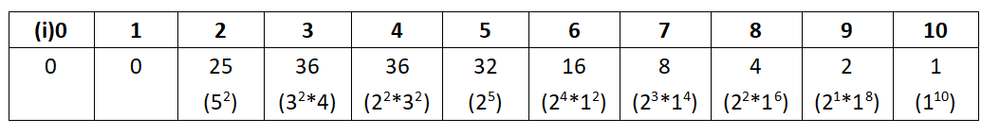
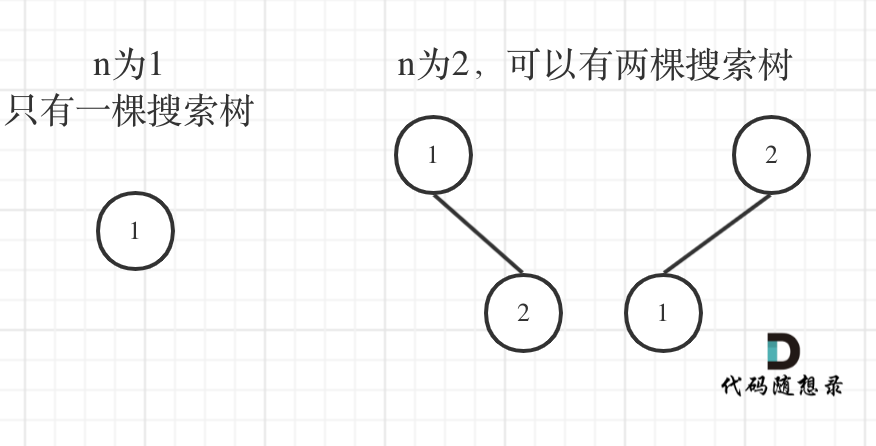

## Day41: 动态规划part03

### 343. 整数拆分

[LeetCode](https://leetcode.cn/problems/integer-break/)  [文章讲解](https://programmercarl.com/0343.%E6%95%B4%E6%95%B0%E6%8B%86%E5%88%86.html)  [视频讲解](https://www.bilibili.com/video/BV1Mg411q7YJ/)

#### 题目描述：

给定一个正整数 n ，将其拆分为 k 个 正整数 的和（ k >= 2 ），并使这些整数的乘积最大化。返回 你可以获得的最大乘积 。

**示例 1:**

> 输入: n = 2
> 输出: 1
> 解释: 2 = 1 + 1, 1 × 1 = 1

**示例 2:**

> 输入: n = 10
> 输出: 36
> 解释: 10 = 3 + 3 + 4, 3 × 3 × 4 = 36

#### 我的解法(强行动态规划)：

**动规五部曲**：

定义一个一维数组来记录乘积

1. **确定dp数组以及下标的含义**

`dp[i]`：拆分为`i`个数的最大乘积

2. **确定递推公式**

`m=n%i`,`num=n/i`,dp[i]=num^(i-m)^*(num+1)^m^

数字平均分配后，其乘积最大

3. **dp数组如何初始化**

无需初始化

4. **确定遍历顺序**

`i`从2到`n`

5. **举例推导dp数组**

举例当`n=10`的时候，dp table（dp数组）应该是这样的



```C++
class Solution
{
 public:
	int integerBreak(int n)
	{
		vector<int> dp(n + 1);
		for (int i = 2; i <= n; i++)
		{
			int m = n % i;
			int num = n / i;
			dp[i] = pow(num, i - m) * pow(num + 1, m);
		}

		// 取最大的dp数组值
		int result = INT_MIN;
		for (auto num : dp)
		{
			if (num > result) result = num;
		}

		return result;
	}
};
```

#### 参考解法：

动规五部曲，分析如下：

1. **确定dp数组以及下标的含义**

`dp[i]`：分拆数字`i`，可以得到的最大乘积为`dp[i]`。

2. **确定递推公式**

可以想 `dp[i]`最大乘积是怎么得到的呢？

其实可以从1遍历`j`，然后有两种渠道得到`dp[i]`.

一个是`j * (i - j)` 直接相乘。

一个是`j * dp[i - j]`，相当于是拆分`(i - j)`，对这个拆分不理解的话，可以回想dp数组的定义。

**那有同学问了，j怎么就不拆分呢？**

j是从1开始遍历，拆分j的情况，在遍历j的过程中其实都计算过了。那么从1遍历j，比较`(i - j) * j`和`dp[i - j] * j` 取最大的。

递推公式：`dp[i] = max(dp[i], max((i - j) * j, dp[i - j] * j))`;

也可以这么理解，`j * (i - j)` 是单纯的把整数拆分为两个数相乘，而`j * dp[i - j]`是拆分成两个以及两个以上的个数相乘。

那么在取最大值的时候，为什么还要比较dp[i]呢？

因为在递推公式推导的过程中，每次计算dp[i]，取最大的而已。

3. **dp数组如何初始化**

不少同学应该疑惑，dp[0] dp[1]应该初始化多少呢？

拆分0和拆分1的最大乘积是多少？这是无解的。

这里只初始化dp[2] = 1，从dp[i]的定义来说，拆分数字2，得到的最大乘积是1。

4. **确定遍历顺序**

确定遍历顺序，先来看看递归公式：`dp[i] = max(dp[i], max((i - j) * j, dp[i - j] * j))`;

dp[i] 是依靠 dp[i - j]的状态，所以遍历i一定是从前向后遍历，先有dp[i - j]再有dp[i]。

所以遍历顺序为：

```cpp
for (int i = 3; i <= n ; i++) {
    for (int j = 1; j < i - 1; j++) {
        dp[i] = max(dp[i], max((i - j) * j, dp[i - j] * j));
    }
}
```

注意 枚举j的时候，是从1开始的。从0开始的话，那么让拆分一个数拆个0，求最大乘积就没有意义了。

j的结束条件是 j < i - 1 ，其实 j < i 也是可以的，不过可以节省一步，例如让j = i - 1，的话，其实在 j = 1的时候，这一步就已经拆出来了，重复计算，所以 j < i - 1

至于 i是从3开始，这样dp[i - j]就是dp[2]正好可以通过我们初始化的数值求出来。

更优化一步，可以这样：

```cpp
for (int i = 3; i <= n ; i++) {
    for (int j = 1; j <= i / 2; j++) {
        dp[i] = max(dp[i], max((i - j) * j, dp[i - j] * j));
    }
}
```

因为拆分一个数n 使之乘积最大，那么一定是拆分成m个近似相同的子数相乘才是最大的。

例如 6 拆成 3 * 3， 10 拆成 3 * 3 * 4。 100的话 也是拆成m个近似数组的子数 相乘才是最大的。

只不过我们不知道m究竟是多少而已，但可以明确的是m一定大于等于2，既然m大于等于2，也就是 最差也应该是拆成两个相同的 可能是最大值。

那么 j 遍历，只需要遍历到 n/2 就可以，后面就没有必要遍历了，一定不是最大值。

至于 “拆分一个数n 使之乘积最大，那么一定是拆分成m个近似相同的子数相乘才是最大的” 这个我就不去做数学证明了，感兴趣的同学，可以自己证明。

5. **举例推导dp数组**

举例当n为10 的时候，dp数组里的数值，如下：


```cpp
class Solution {
public:
    int integerBreak(int n) {
        vector<int> dp(n + 1);
        dp[2] = 1;
        for (int i = 3; i <= n ; i++) {
            for (int j = 1; j <= i / 2; j++) {
                dp[i] = max(dp[i], max((i - j) * j, dp[i - j] * j));
            }
        }
        return dp[n];
    }
};
```

### 96. 不同的二叉搜索树

[LeetCode](https://leetcode.cn/problems/unique-binary-search-trees/)  [文章讲解](https://programmercarl.com/0096.%E4%B8%8D%E5%90%8C%E7%9A%84%E4%BA%8C%E5%8F%89%E6%90%9C%E7%B4%A2%E6%A0%91.html)  [视频讲解](https://www.bilibili.com/video/BV1eK411o7QA/)

#### 题目描述：

给你一个整数 `n` ，求恰由 `n` 个节点组成且节点值从 `1` 到 `n` 互不相同的 **二叉搜索树** 有多少种？返回满足题意的二叉搜索树的种数。

 **提示：**

- `1 <= n <= 19`

**示例 1：**


> 输入：n = 3
> 输出：5

**示例 2：**

> 输入：n = 1
> 输出：1

#### 参考解法：

应该先举几个例子，画画图，看看有没有什么规律，如图：



n为1的时候有一棵树，n为2有两棵树，这个是很直观的。


来看看n为3的时候，有哪几种情况。

当1为头结点的时候，其右子树有两个节点，看这两个节点的布局，是不是和 n 为2的时候两棵树的布局是一样的啊！

（可能有同学问了，这布局不一样啊，节点数值都不一样。别忘了我们就是求不同树的数量，并不用把搜索树都列出来，所以不用关心其具体数值的差异）

当3为头结点的时候，其左子树有两个节点，看这两个节点的布局，是不是和n为2的时候两棵树的布局也是一样的啊！

当2为头结点的时候，其左右子树都只有一个节点，布局是不是和n为1的时候只有一棵树的布局也是一样的啊！

发现到这里，其实我们就找到了重叠子问题了，其实也就是发现可以通过dp[1] 和 dp[2] 来推导出来dp[3]的某种方式。

思考到这里，这道题目就有眉目了。

dp[3]，就是 元素1为头结点搜索树的数量 + 元素2为头结点搜索树的数量 + 元素3为头结点搜索树的数量

元素1为头结点搜索树的数量 = 右子树有2个元素的搜索树数量 * 左子树有0个元素的搜索树数量

元素2为头结点搜索树的数量 = 右子树有1个元素的搜索树数量 * 左子树有1个元素的搜索树数量

元素3为头结点搜索树的数量 = 右子树有0个元素的搜索树数量 * 左子树有2个元素的搜索树数量

有2个元素的搜索树数量就是dp[2]。

有1个元素的搜索树数量就是dp[1]。

有0个元素的搜索树数量就是dp[0]。

所以dp[3] = dp[2] * dp[0] + dp[1] * dp[1] + dp[0] * dp[2]

如图所示：


此时我们已经找到递推关系了，那么可以用动规五部曲再系统分析一遍。

1. **确定dp数组（dp table）以及下标的含义**

**dp[i] ： 1到i为节点组成的二叉搜索树的个数为dp[i]**。

也可以理解是i个不同元素节点组成的二叉搜索树的个数为dp[i] ，都是一样的。

以下分析如果想不清楚，就来回想一下dp[i]的定义

2. **确定递推公式**

在上面的分析中，其实已经看出其递推关系， `dp[i] += dp[以j为头结点左子树节点数量] * dp[以j为头结点右子树节点数量]`

j相当于是头结点的元素，从1遍历到i为止。

所以递推公式：dp[i] += dp[j - 1] * dp[i - j]; ，j-1 为j为头结点左子树节点数量，i-j 为以j为头结点右子树节点数量

3. **dp数组如何初始化**

初始化，只需要初始化dp[0]就可以了，推导的基础，都是dp[0]。

那么dp[0]应该是多少呢？

从定义上来讲，空节点也是一棵二叉树，也是一棵二叉搜索树，这是可以说得通的。所以初始化dp[0] = 1

4. **确定遍历顺序**

首先一定是遍历节点数，从递归公式：`dp[i] += dp[j - 1] * dp[i - j]`可以看出，节点数为`i`的状态是依靠 `i`之前节点数的状态。

那么遍历`i`里面每一个数作为头结点的状态，用`j`来遍历。

代码如下：

```cpp
for (int i = 1; i <= n; i++) {
    for (int j = 1; j <= i; j++) {
        dp[i] += dp[j - 1] * dp[i - j];
    }
}
```

5. **举例推导dp数组**

n为5时候的dp数组状态如图：


综上分析完毕，C++代码如下：

```cpp
class Solution {
public:
    int numTrees(int n) {
        vector<int> dp(n + 1);
        dp[0] = 1;
        for (int i = 1; i <= n; i++) {
            for (int j = 1; j <= i; j++) {
                dp[i] += dp[j - 1] * dp[i - j];
            }
        }
        return dp[n];
    }
};
```

### 今日总结

今天有点小难，第一道题纯暴力方法，第二道题完全没思路。
