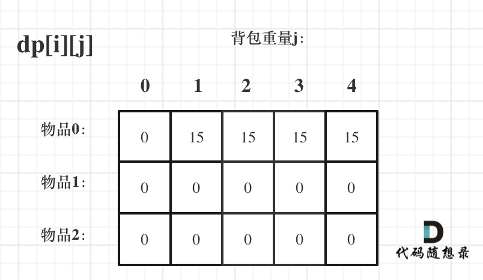
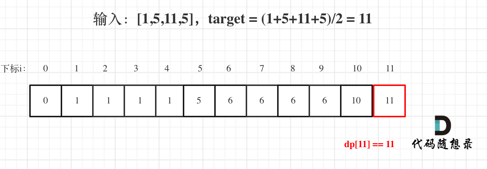

## Day42: 动态规划part04

### 背包问题理论基础

对于面试的话，其实掌握01背包，和完全背包，就够用了，最多可以再来一个多重背包。


而完全背包又是也是01背包稍作变化而来，即：完全背包的物品数量是无限的。

**所以背包问题的理论基础重中之重是01背包，一定要理解透！**

### 01背包

[卡码网](https://kamacoder.com/problempage.php?pid=1046)  [文章讲解1](https://programmercarl.com/%E8%83%8C%E5%8C%85%E7%90%86%E8%AE%BA%E5%9F%BA%E7%A1%8001%E8%83%8C%E5%8C%85-1.html) [文章讲解2](https://programmercarl.com/%E8%83%8C%E5%8C%85%E7%90%86%E8%AE%BA%E5%9F%BA%E7%A1%8001%E8%83%8C%E5%8C%85-2.html)

**题目描述**：

有`n`件物品和一个最多能背重量为`w` 的背包。第`i`件物品的重量是`weight[i]`，得到的价值是`value[i]` 。**每件物品只能用一次**，求解将哪些物品装入背包里物品价值总和最大。


每一件物品其实只有两个状态，取或者不取，所以可以使用回溯法搜索出所有的情况，那么时间复杂度就是$o(2^n)$，这里的n表示物品数量。

**所以暴力的解法是指数级别的时间复杂度。进而才需要动态规划的解法来进行优化！**

例如，背包最大重量为4。物品为：

|       | 重量 | 价值 |
| ----- | ---- | ---- |
| 物品0 | 1    | 15   |
| 物品1 | 3    | 20   |
| 物品2 | 4    | 30   |

问背包能背的物品最大价值是多少？

#### 二维dp数组01背包

依然动规五部曲分析一波。

1. **确定dp数组以及下标的含义**

对于背包问题，有一种写法， 是使用二维数组，即**`dp[i][j]` 表示从下标为`[0-i]`的物品里任意取，放进容量为j的背包，价值总和最大是多少**。如图：


2. **确定递推公式**

那么可以有两个方向推出来`dp[i][j]`，

- **不放物品i**：由`dp[i - 1][j]`推出，即背包容量为`j`，里面不放物品i的最大价值，此时`dp[i][j]`就是`dp[i - 1][j]`。(其实就是当物品i的重量大于背包`j`的重量时，物品`i`无法放进背包中，所以背包内的价值依然和前面相同。
- **放物品i**：由`dp[i - 1][j - weight[i]]`推出，`dp[i - 1][j - weight[i]]` 为背包容量为`j - weight[i]`的时候不放物品`i`的最大价值，那么`dp[i - 1][j - weight[i]] + value[i]` （物品`i`的价值），就是背包放物品`i`得到的最大价值

所以递归公式： `dp[i][j] = max(dp[i - 1][j], dp[i - 1][j - weight[i]] + value[i])`;

3. **dp数组如何初始化**

首先从`dp[i][j]`的定义出发，如果背包容量`j`为0的话，即`dp[i][0]`，无论是选取哪些物品，背包价值总和一定为0。如图：


在看其他情况。

状态转移方程 `dp[i][j] = max(dp[i - 1][j], dp[i - 1][j - weight[i]] + value[i])`; 可以看出`i` 是由 `i-1` 推导出来，那么`i`为0的时候就一定要初始化。

`dp[0][j]`，即：`i`为0，存放编号0的物品的时候，各个容量的背包所能存放的最大价值。

那么很明显当 `j < weight[0]`的时候，`dp[0][j]` 应该是 0，因为背包容量比编号0的物品重量还小。

当`j >= weight[0]`时，`dp[0][j]` 应该是`value[0]`，因为背包容量放足够放编号0物品。

代码初始化如下：

```text
for (int j = 0 ; j < weight[0]; j++) {  // 当然这一步，如果把dp数组预先初始化为0了
    dp[0][j] = 0;
}
// 正序遍历
for (int j = weight[0]; j <= bagweight; j++) {
    dp[0][j] = value[0];
}
```

此时dp数组初始化情况如图所示：


`dp[0][j]` 和 `dp[i][0]` 都已经初始化了，那么其他下标应该初始化多少呢？

其实从递归公式： `dp[i][j] = max(dp[i - 1][j], dp[i - 1][j - weight[i]] + value[i])`; 可以看出`dp[i][j]` 是由左上方数值推导出来了，那么 其他下标初始为什么数值都可以，因为都会被覆盖。

但只不过一开始就统一把dp数组统一初始为0，更方便一些。

如图：



最后初始化代码如下：

```text
// 初始化 dp
vector<vector<int>> dp(weight.size(), vector<int>(bagweight + 1, 0));
for (int j = weight[0]; j <= bagweight; j++) {
    dp[0][j] = value[0];
}
```

4. **确定遍历顺序**

在如下图中，可以看出，有两个遍历的维度：物品与背包重量


那么问题来了，**先遍历 物品还是先遍历背包重量呢？**

**其实都可以！！ 但是先遍历物品更好理解**。

先给出先遍历物品，然后遍历背包重量的代码。

```text
// weight数组的大小 就是物品个数
for(int i = 1; i < weight.size(); i++) { // 遍历物品
    for(int j = 0; j <= bagweight; j++) { // 遍历背包容量
        if (j < weight[i]) dp[i][j] = dp[i - 1][j];
        else dp[i][j] = max(dp[i - 1][j], dp[i - 1][j - weight[i]] + value[i]);
    }
}
```

**先遍历背包，再遍历物品，也是可以的！（注意我这里使用的二维dp数组）**

例如这样：

```text
// weight数组的大小 就是物品个数
for(int j = 0; j <= bagweight; j++) { // 遍历背包容量
    for(int i = 1; i < weight.size(); i++) { // 遍历物品
        if (j < weight[i]) dp[i][j] = dp[i - 1][j];
        else dp[i][j] = max(dp[i - 1][j], dp[i - 1][j - weight[i]] + value[i]);
    }
}
```

为什么也是可以的呢？

**要理解递归的本质和递推的方向**。

`dp[i][j] = max(dp[i - 1][j], dp[i - 1][j - weight[i]] + value[i])`; 递归公式中可以看出`dp[i][j]`是靠`dp[i-1][j]`和`dp[i - 1][j - weight[i]]`推导出来的。

`dp[i-1][j]`和`dp[i - 1][j - weight[i]]` 都在`dp[i][j]`的左上角方向（包括正上方向），那么先遍历物品，再遍历背包的过程如图所示：


再来看看先遍历背包，再遍历物品呢，如图：


**大家可以看出，虽然两个for循环遍历的次序不同，但是`dp[i`][j]所需要的数据就是左上角，根本不影响`dp[i][j]`公式的推导！**

但先遍历物品再遍历背包这个顺序更好理解。

**其实背包问题里，两个for循环的先后循序是非常有讲究的，理解遍历顺序其实比理解推导公式难多了**。

5. **举例推导dp数组**

来看一下对应的dp数组的数值，如图：


最终结果就是`dp[2][4]`。本题力扣上没有原题，可以去[卡码网第46题](https://kamacoder.com/problempage.php?pid=1046)去练习，代码如下：

```cpp
//二维dp数组实现
#include <bits/stdc++.h>
using namespace std;

int n, bagweight;// bagweight代表行李箱空间
void solve() {
    vector<int> weight(n, 0); // 存储每件物品所占空间
    vector<int> value(n, 0);  // 存储每件物品价值
    for(int i = 0; i < n; ++i) {
        cin >> weight[i];
    }
    for(int j = 0; j < n; ++j) {
        cin >> value[j];
    }
    // dp数组, dp[i][j]代表行李箱空间为j的情况下,从下标为[0, i]的物品里面任意取,能达到的最大价值
    vector<vector<int>> dp(weight.size(), vector<int>(bagweight + 1, 0));

    // 初始化, 因为需要用到dp[i - 1]的值
    // j < weight[0]已在上方被初始化为0
    // j >= weight[0]的值就初始化为value[0]
    for (int j = weight[0]; j <= bagweight; j++) {
        dp[0][j] = value[0];
    }

    for(int i = 1; i < weight.size(); i++) { // 遍历科研物品
        for(int j = 0; j <= bagweight; j++) { // 遍历行李箱容量
            // 如果装不下这个物品,那么就继承dp[i - 1][j]的值
            if (j < weight[i]) dp[i][j] = dp[i - 1][j];
            // 如果能装下,就将值更新为 不装这个物品的最大值 和 装这个物品的最大值 中的 最大值
            // 装这个物品的最大值由容量为j - weight[i]的包任意放入序号为[0, i - 1]的最大值 + 该物品的价值构成
            else dp[i][j] = max(dp[i - 1][j], dp[i - 1][j - weight[i]] + value[i]);
        }
    }
    cout << dp[weight.size() - 1][bagweight] << endl;
}

int main() {
    while(cin >> n >> bagweight) {
        solve();
    }
    return 0;
}
```

#### 一维dp数组（滚动数组）

对于背包问题其实状态都是可以压缩的。

在使用二维数组的时候，递推公式：`dp[i][j] = max(dp[i - 1][j], dp[i - 1][j - weight[i]] + value[i])`;

**其实可以发现如果把`dp[i - 1]`那一层拷贝到`dp[i]`上，表达式完全可以是：`dp[i][j] = max(dp[i][j], dp[i][j - weight[i]] + value[i])`;**

**与其把`dp[i - 1]`这一层拷贝到`dp[i]`上，不如只用一个一维数组了**，只用`dp[j]`（一维数组，也可以理解是一个滚动数组）。

这就是滚动数组的由来，需要满足的条件是上一层可以重复利用，直接拷贝到当前层。

**`dp[i][j]` 表示从下标为`[0-i]`的物品里任意取，放进容量为`j`的背包，价值总和最大是多少**。一定要时刻记住这里i和j的含义

动规五部曲分析如下：

1. **确定dp数组的定义**

在一维dp数组中，dp[j]表示：容量为j的背包，所背的物品价值可以最大为dp[j]。

2. **一维dp数组的递推公式**

`dp[j]`为 容量为`j`的背包所背的最大价值，那么如何推导`dp[j]`呢？

`dp[j]`可以通过`dp[j - weight[i]]`推导出来，`dp[j - weight[i]]`表示容量为`j - weight[i]`的背包所背的最大价值。

`dp[j - weight[i]] + value[i]` 表示 容量为 `j - 物品i重量` 的背包 加上 `物品i的价值`。（也就是容量为j的背包，放入物品i了之后的价值即：dp[j]）

此时`dp[j]`有两个选择，一个是取自己`dp[j]` 相当于 二维dp数组中的`dp[i-1][j]`，即不放物品`i`，一个是取`dp[j - weight[i]] + value[i]`，即放物品`i`，指定是取最大的，毕竟是求最大价值，

所以递归公式为：

```text
dp[j] = max(dp[j], dp[j - weight[i]] + value[i]);
```

可以看出相对于二维dp数组的写法，就是把dp[i][j]中i的维度去掉了。

3. **一维dp数组如何初始化**

`dp[j]`表示：容量为j的背包，所背的物品价值可以最大为dp[j]，那么dp[0]就应该是0，因为背包容量为0所背的物品的最大价值就是0。

那么dp数组除了下标0的位置，初始为0，其他下标应该初始化多少呢？

看一下递归公式：`dp[j] = max(dp[j], dp[j - weight[i]] + value[i])`;

dp数组在推导的时候一定是取价值最大的数，如果题目给的价值都是正整数那么非0下标都初始化为0就可以了。

**这样才能让dp数组在递归公式的过程中取的最大的价值，而不是被初始值覆盖了**。

那么我假设物品价值都是大于0的，所以dp数组初始化的时候，都初始为0就可以了。

4. **一维dp数组遍历顺序**

代码如下：

```text
for(int i = 0; i < weight.size(); i++) { // 遍历物品
    for(int j = bagWeight; j >= weight[i]; j--) { // 遍历背包容量
        dp[j] = max(dp[j], dp[j - weight[i]] + value[i]);
    }
}
```

**这里大家发现和二维dp的写法中，遍历背包的顺序是不一样的！**

二维dp遍历的时候，背包容量是从小到大，而一维dp遍历的时候，背包是从大到小。

为什么呢？

**倒序遍历是为了保证物品i只被放入一次！**。但如果一旦正序遍历了，那么物品0就会被重复加入多次！

举一个例子：物品0的重量weight[0] = 1，价值value[0] = 15

如果正序遍历

dp[1] = dp[1 - weight[0]] + value[0] = 15

dp[2] = dp[2 - weight[0]] + value[0] = 30

此时dp[2]就已经是30了，意味着物品0，被放入了两次，所以不能正序遍历。

为什么倒序遍历，就可以保证物品只放入一次呢？

倒序就是先算dp[2]

dp[2] = dp[2 - weight[0]] + value[0] = 15 （dp数组已经都初始化为0）

dp[1] = dp[1 - weight[0]] + value[0] = 15

所以从后往前循环，每次取得状态不会和之前取得状态重合，这样每种物品就只取一次了。

**那么问题又来了，为什么二维dp数组遍历的时候不用倒序呢？**

因为对于二维dp，`dp[i][j]`都是通过上一层即`dp[i - 1][j]`计算而来，本层的`dp[i`][j]并不会被覆盖！

**再来看看两个嵌套for循环的顺序，代码中是先遍历物品嵌套遍历背包容量，那可不可以先遍历背包容量嵌套遍历物品呢？**

不可以！

因为一维dp的写法，背包容量一定是要倒序遍历（原因上面已经讲了），如果遍历背包容量放在上一层，那么每个`dp[j]`就只会放入一个物品，即：背包里只放入了一个物品。

倒序遍历的原因是，本质上还是一个对二维数组的遍历，并且右下角的值依赖上一层左上角的值，因此需要保证左边的值仍然是上一层的，从右向左覆盖。

（这里如果读不懂，就再回想一下`dp[j]`的定义，或者就把两个for循环顺序颠倒一下试试！）

**所以一维dp数组的背包在遍历顺序上和二维其实是有很大差异的！**，这一点大家一定要注意。

5. **举例推导dp数组**

一维dp，分别用物品0，物品1，物品2 来遍历背包，最终得到结果如下：


本题力扣上没有原题，可以去[卡码网第46题](https://kamacoder.com/problempage.php?pid=1046)去练习，题意是一样的，代码如下：

```cpp
// 一维dp数组实现
#include <iostream>
#include <vector>
using namespace std;

int main() {
    // 读取 M 和 N
    int M, N;
    cin >> M >> N;

    vector<int> costs(M);
    vector<int> values(M);

    for (int i = 0; i < M; i++) {
        cin >> costs[i];
    }
    for (int j = 0; j < M; j++) {
        cin >> values[j];
    }

    // 创建一个动态规划数组dp，初始值为0
    vector<int> dp(N + 1, 0);

    // 外层循环遍历每个类型的研究材料
    for (int i = 0; i < M; ++i) {
        // 内层循环从 N 空间逐渐减少到当前研究材料所占空间
        for (int j = N; j >= costs[i]; --j) {
            // 考虑当前研究材料选择和不选择的情况，选择最大值
            dp[j] = max(dp[j], dp[j - costs[i]] + values[i]);
        }
    }

    // 输出dp[N]，即在给定 N 行李空间可以携带的研究材料最大价值
    cout << dp[N] << endl;

    return 0;
}
```

可以看出，一维dp 的01背包，要比二维简洁的多！ 初始化 和 遍历顺序相对简单了。

### 416. 分割等和子集

[LeetCode](https://leetcode.cn/problems/partition-equal-subset-sum/)  [文章讲解](https://programmercarl.com/0416.%E5%88%86%E5%89%B2%E7%AD%89%E5%92%8C%E5%AD%90%E9%9B%86.html)  [视频讲解](https://www.bilibili.com/video/BV1rt4y1N7jE/)

#### 题目描述：

给你一个 **只包含正整数** 的 **非空** 数组 `nums` 。请你判断是否可以将这个数组分割成两个子集，使得两个子集的元素和相等。

**示例 1：**

> 输入：nums = [1,5,11,5]
> 输出：true
> 解释：数组可以分割成 [1, 5, 5] 和 [11] 。

**示例 2：**


> 输入：nums = [1,2,3,5]
> 输出：false
> 解释：数组不能分割成两个元素和相等的子集。

#### 参考解法：

本题要求集合里能否出现总和为 sum / 2 的子集。那么来一一对应一下本题，看看背包问题如何来解决。

**只有确定了如下四点，才能把01背包问题套到本题上来。**

- 背包的体积为sum / 2
- 背包要放入的商品（集合里的元素）重量为 元素的数值，价值也为元素的数值
- 背包如果正好装满，说明找到了总和为 sum / 2 的子集。
- 背包中每一个元素是不可重复放入。

以上分析完，就可以套用01背包，来解决这个问题了。

动规五部曲分析如下：

1. **确定dp数组以及下标的含义**

01背包中，`dp[j]` 表示： 容量为`j`的背包，所背的物品价值最大可以为`dp[j]`。

本题中每一个元素的数值既是重量，也是价值。

**套到本题，`dp[j]`表示 背包总容量（所能装的总重量）是`j`，放进物品后，背的最大重量为`dp[j]`**。

那么如果背包容量为`target`， `dp[target]`就是装满 背包之后的重量，所以 当 `dp[target] == target` 的时候，背包就装满了。

2. **确定递推公式**

01背包的递推公式为：`dp[j] = max(dp[j], dp[j - weight[i]] + value[i])`;

本题，相当于背包里放入数值，那么物品i的重量是`nums[i]`，其价值也是`nums[i]`。

所以递推公式：`dp[j] = max(dp[j], dp[j - nums[i]] + nums[i])`;

3. **dp数组如何初始化**

从dp[j]的定义来看，首先dp[0]一定是0。

如果题目给的价值都是正整数那么非0下标都初始化为0就可以了，如果题目给的价值有负数，那么非0下标就要初始化为负无穷。

**这样才能让dp数组在递推的过程中取得最大的价值，而不是被初始值覆盖了**。

本题题目中 只包含正整数的非空数组，所以非0下标的元素初始化为0就可以了。

4. **确定遍历顺序**

**如果使用一维dp数组，物品遍历的for循环放在外层，遍历背包的for循环放在内层，且内层for循环倒序遍历**！

代码如下：

```cpp
// 开始 01背包
for(int i = 0; i < nums.size(); i++) {
    for(int j = target; j >= nums[i]; j--) { // 每一个元素一定是不可重复放入，所以从大到小遍历
        dp[j] = max(dp[j], dp[j - nums[i]] + nums[i]);
    }
}
```

5. **举例推导dp数组**

`dp[j]`的数值一定是小于等于j的。

**如果`dp[j] == j` 说明，集合中的子集总和正好可以凑成总和j，理解这一点很重要。**

用例1，输入[1,5,11,5] 为例，如图：



最后dp[11] == 11，说明可以将这个数组分割成两个子集，使得两个子集的元素和相等。

```C++
class Solution
{
 public:
	bool canPartition(vector<int>& nums)
	{
		// 求和，获得 target 值
		int sum = 0;
		for (auto num : nums)
		{
			sum += num;
		}

		if (sum % 2 != 0) return false;	// sum 不是 2 的倍数则无法分割
		int target = sum / 2;

		// 开始 01背包
		vector<int> dp(target + 1);
		for (int num : nums)
		{
			// 每一个元素一定是不可重复放入，所以从大到小遍历
			// j >= num 保证取 dp[j - num] 合法
			for (int j = target; j >= num; j--)
			{
				dp[j] = max(dp[j], dp[j - num] + num);
			}
		}

		// 集合中的元素正好可以凑成总和target
		if (dp[target] == target) return true;
		return false;
	}
};
```

### 今日总结

初识背包问题，牢记dp数组的含义以及递推过程！