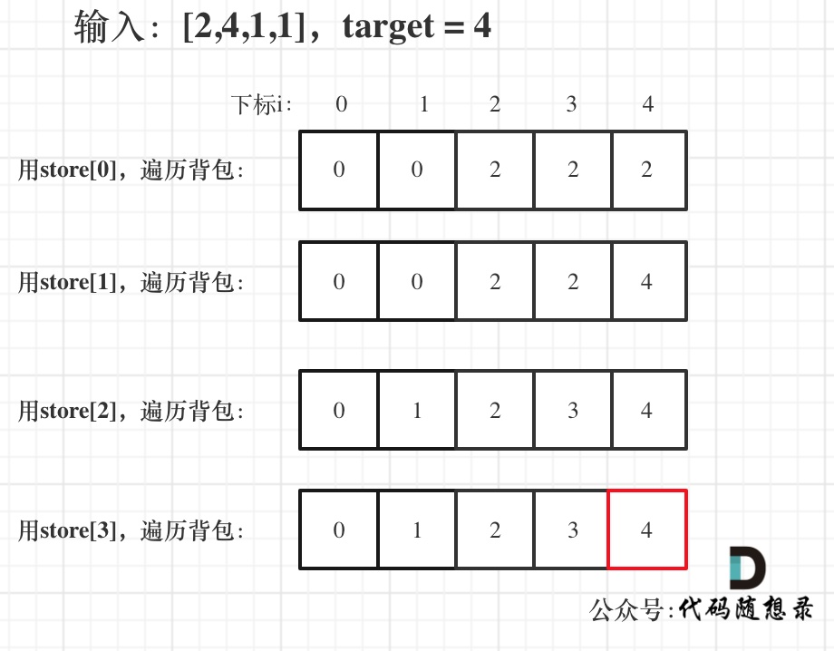
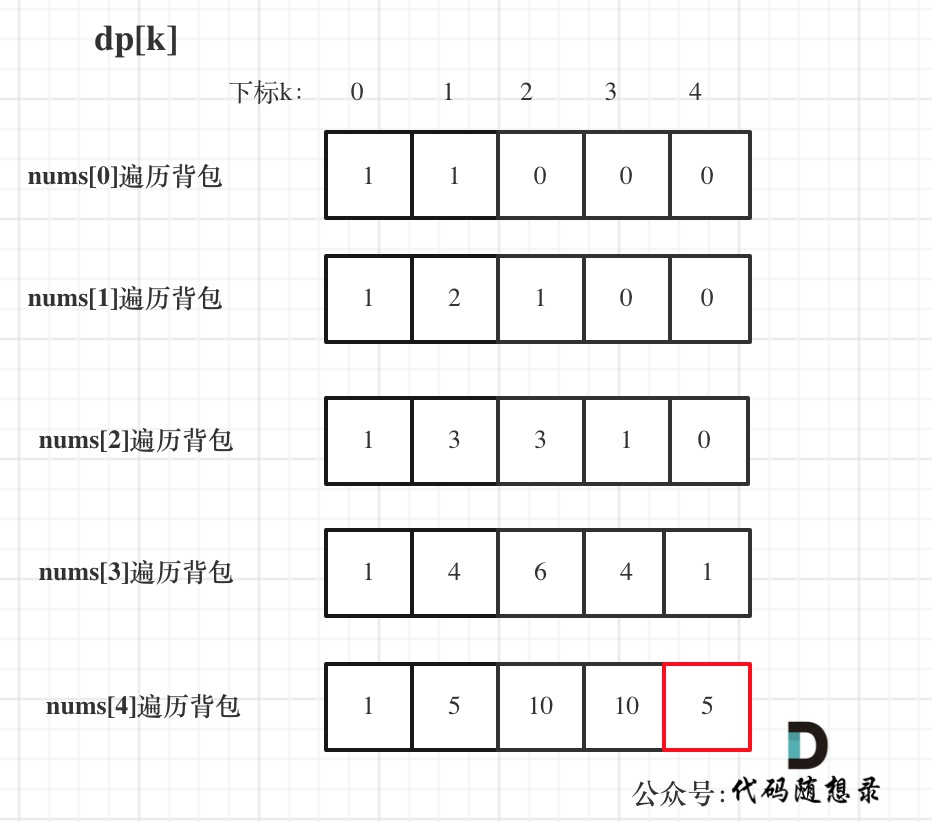

## Day43: 动态规划part05

### 1049.最后一块石头的重量II

[LeetCode](https://leetcode.cn/problems/last-stone-weight-ii/)  [文章讲解](https://programmercarl.com/1049.%E6%9C%80%E5%90%8E%E4%B8%80%E5%9D%97%E7%9F%B3%E5%A4%B4%E7%9A%84%E9%87%8D%E9%87%8FII.html)  [视频讲解](https://www.bilibili.com/video/BV14M411C7oV/)

#### 题目描述：

有一堆石头，用整数数组 `stones` 表示。其中 `stones[i]` 表示第 `i` 块石头的重量。

每一回合，从中选出**任意两块石头**，然后将它们一起粉碎。假设石头的重量分别为 `x` 和 `y`，且 `x <= y`。那么粉碎的可能结果如下：

- 如果 `x == y`，那么两块石头都会被完全粉碎；
- 如果 `x != y`，那么重量为 `x` 的石头将会完全粉碎，而重量为 `y` 的石头新重量为 `y-x`。

最后，**最多只会剩下一块** 石头。返回此石头 **最小的可能重量** 。如果没有石头剩下，就返回 `0`。

**示例 1：**

> 输入：stones = [2,7,4,1,8,1]
> 输出：1
> 解释：
> 组合 2 和 4，得到 2，所以数组转化为 [2,7,1,8,1]，
> 组合 7 和 8，得到 1，所以数组转化为 [2,1,1,1]，
> 组合 2 和 1，得到 1，所以数组转化为 [1,1,1]，
> 组合 1 和 1，得到 0，所以数组转化为 [1]，这就是最优值。

**示例 2：**

> 输入：stones = [31,26,33,21,40]
> 输出：5

#### 参考解法：

本题其实就是尽量让石头分成重量相同的两堆，相撞之后剩下的石头最小，**这样就化解成01背包问题了**。与[416. 分割等和子集](https://programmercarl.com/0416.分割等和子集.html)非常像了。本题物品的重量为`stones[i]`，物品的价值也为`stones[i]`。对应着01背包里的物品重量`weight[i]`和 物品价值`value[i]`。

**动规五步曲**：

1. **确定dp数组以及下标的含义**

**dp[j]表示容量（这里说容量更形象，其实就是重量）为j的背包，最多可以背最大重量为dp[j]**。

相对于 01背包，本题中，石头的重量是 stones[i]，石头的价值也是 stones[i] ，可以 “最多可以装的价值为 dp[j]” == “最多可以背的重量为dp[j]”

2. **确定递推公式**

01背包的递推公式为：`dp[j] = max(dp[j], dp[j - weight[i]] + value[i])`;

本题则是：**`dp[j] = max(dp[j], dp[j - stones[i]] + stones[i])`;**

3. **dp数组如何初始化**

本题题目中 只包含正整数的非空数组，所以非0下标的元素初始化为0就可以了。

4. **确定遍历顺序**

使用一维dp数组，物品遍历的for循环放在外层，遍历背包的for循环放在内层，且内层for循环倒序遍历！

代码如下：

```cpp
for (int i = 0; i < stones.size(); i++) { // 遍历物品
    for (int j = target; j >= stones[i]; j--) { // 遍历背包
        dp[j] = max(dp[j], dp[j - stones[i]] + stones[i]);
    }
}
```

5. **举例推导dp数组**

举例，输入：[2,4,1,1]，此时target = (2 + 4 + 1 + 1)/2 = 4 ，dp数组状态图如下：



最后dp[target]里是容量为target的背包所能背的最大重量。

那么分成两堆石头，一堆石头的总重量是dp[target]，另一堆就是sum - dp[target]。

**在计算target的时候，target = sum / 2 因为是向下取整，所以sum - dp[target] 一定是大于等于dp[target]的**。

那么相撞之后剩下的最小石头重量就是 (sum - dp[target]) - dp[target]。

以上分析完毕，C++代码如下：

```cpp
class Solution
{
 public:
	int lastStoneWeightII(vector<int>& stones)
	{
		int sum = 0;
		for (int stone : stones)
			sum += stone;

		int target = sum / 2;
		vector<int> dp(target + 1);

		for (int stone : stones)
		{ // 遍历物品
			for (int j = target; j >= stone; j--)
			{ // 遍历背包
				dp[j] = max(dp[j], dp[j - stone] + stone);
			}
		}
		return sum - dp[target] - dp[target];
	}
};
```

### 494.目标和

[LeetCode](https://leetcode.cn/problems/target-sum/)  [文章讲解](https://programmercarl.com/0494.%E7%9B%AE%E6%A0%87%E5%92%8C.html)  [视频讲解](https://www.bilibili.com/video/BV1o8411j73x/)

#### 题目描述：

给你一个非负整数数组 `nums` 和一个整数 `target` 。

向数组中的每个整数前添加 `'+'` 或 `'-'` ，然后串联起所有整数，可以构造一个 **表达式** ：

- 例如，`nums = [2, 1]` ，可以在 `2` 之前添加 `'+'` ，在 `1` 之前添加 `'-'` ，然后串联起来得到表达式 `"+2-1"` 。

返回可以通过上述方法构造的、运算结果等于 `target` 的不同 **表达式** 的数目。

**示例 1：**

> 输入：nums = [1,1,1,1,1], target = 3
> 输出：5
> 解释：一共有 5 种方法让最终目标和为 3 。
> -1 + 1 + 1 + 1 + 1 = 3
> +1 - 1 + 1 + 1 + 1 = 3
> +1 + 1 - 1 + 1 + 1 = 3
> +1 + 1 + 1 - 1 + 1 = 3
> +1 + 1 + 1 + 1 - 1 = 3

**示例 2：**

> 输入：nums = [1], target = 1
> 输出：1

#### 我的解法(回溯算法)：

```C++
class Solution
{
 public:
	int result = 0;

	void backtracking(vector<int>& nums, int startIndex, int currentSum, int target)
	{
		if (startIndex == nums.size())
		{
			if (currentSum == target)
			{
				result++;
			}
			return;
		}

		// 每次取+或者-即可，不需要使用for循环
		backtracking(nums, startIndex + 1, currentSum + nums[startIndex], target); // 添加 +
		backtracking(nums, startIndex + 1, currentSum - nums[startIndex], target); // 添加 -
	}

	int findTargetSumWays(vector<int>& nums, int target)
	{
		result = 0;
		backtracking(nums, 0, 0, target);
		return result;
	}
};
```

#### 参考解法(动态规划)：

如何转化为01背包问题呢。

假设加法的总和为`x`，那么减法对应的总和就是`sum - x`。所以我们要求的是 `x - (sum - x) = target`

**此时问题就转化为，装满容量为`x`的背包，有几种方法**。

这里的`x`，就是`bagSize`，也就是我们后面要求的背包容量。

`(target + sum) / 2` 计算的过程中向下取整会有影响，例如`sum` 是5，`target` 是2的话其实就是无解的，所以：

```cpp
if ((target + sum) % 2 == 1) return 0; // 此时没有方案
```

同时，如果target的绝对值已经大于sum，那么也是没有方案的。

```cpp
if (abs(target) > sum) return 0; // 此时没有方案
```

再回归到01背包问题，为什么是01背包呢？因为每个物品（题目中的1）只用一次！这次和之前遇到的背包问题不一样了，之前都是求容量为`j`的背包，最多能装多少。本题则是装满有几种方法。其实这就是一个组合问题了。

1. **确定dp数组以及下标的含义**

`dp[j]` 表示：填满`j`（包括`j`）这么大容积的包，有`dp[j]`种方法

2. **确定递推公式**

有哪些来源可以推出`dp[j]`呢？

只要搞到`nums[i]`，凑成`dp[j]`就有`dp[j - nums[i]]` 种方法。			

例如：dp[j]，j 为5，

- 已经有一个1（nums[i]） 的话，有 dp[4]种方法 凑成 容量为5的背包。
- 已经有一个2（nums[i]） 的话，有 dp[3]种方法 凑成 容量为5的背包。
- 已经有一个3（nums[i]） 的话，有 dp[2]中方法 凑成 容量为5的背包
- 已经有一个4（nums[i]） 的话，有 dp[1]中方法 凑成 容量为5的背包
- 已经有一个5 （nums[i]）的话，有 dp[0]中方法 凑成 容量为5的背包

那么凑整dp[5]有多少方法呢，也就是把 所有的 dp[j - nums[i]] 累加起来。

所以求组合类问题的公式，都是类似这种：

```text
dp[j] += dp[j - nums[i]]
```

**这个公式在后面在讲解背包解决排列组合问题的时候还会用到！**

3. **dp数组如何初始化**

从递推公式可以看出，在初始化的时候dp[0] 一定要初始化为1，因为dp[0]是在公式中一切递推结果的起源，如果dp[0]是0的话，递推结果将都是0。

dp[j]其他下标对应的数值也应该初始化为0，从递推公式也可以看出，dp[j]要保证是0的初始值，才能正确的由dp[j - nums[i]]推导出来。

4. **确定遍历顺序**

对于01背包问题一维dp的遍历，nums放在外循环，target在内循环，且内循环倒序。

5. **举例推导dp数组**

输入：nums: [1, 1, 1, 1, 1], target: 3

bagSize = (target + sum) / 2 = (3 + 5) / 2 = 4

dp数组状态变化如下：



```cpp
class Solution2
{
 public:
    int findTargetSumWays(vector<int>& nums, int target)
    {
       // 获取背包的尺寸
       int sum = 0;
       for (auto num : nums)
       {
          sum += num;
       }
       if (abs(target) > sum) return 0; // 此时没有方案
       if ((target + sum) % 2 == 1) return 0; // 此时没有方案
       int bagSize = (sum + target) / 2;

       // 开始01背包
       vector<int> dp(bagSize + 1);
       dp[0] = 1;
       for (int num : nums)
       {
          for (int j = bagSize; j >= num; j--)
          {
             dp[j] += dp[j - num];
          }
       }

       return dp[bagSize];
    }
};
```

### 474.一和零

[LeetCode](https://leetcode.cn/problems/ones-and-zeroes/)  [文章讲解](https://programmercarl.com/0474.%E4%B8%80%E5%92%8C%E9%9B%B6.html)  [视频讲解](https://www.bilibili.com/video/BV1rW4y1x7ZQ/)

#### 题目描述：

给你一个二进制字符串数组 `strs` 和两个整数 `m` 和 `n` 。

请你找出并返回 `strs` 的最大子集的长度，该子集中 **最多** 有 `m` 个 `0` 和 `n` 个 `1` 。

如果 `x` 的所有元素也是 `y` 的元素，集合 `x` 是集合 `y` 的 **子集** 。

**示例 1：**

> 输入：strs = ["10", "0001", "111001", "1", "0"], m = 5, n = 3
> 输出：4
> 解释：最多有 5 个 0 和 3 个 1 的最大子集是 {"10","0001","1","0"} ，因此答案是 4 。
> 其他满足题意但较小的子集包括 {"0001","1"} 和 {"10","1","0"} 。{"111001"} 不满足题意，因为它含 4 个 1 ，大于 n 的值 3 。

**示例 2：**

> 输入：strs = ["10", "0", "1"], m = 1, n = 1
> 输出：2
> 解释：最大的子集是 {"0", "1"} ，所以答案是 2 。

#### 参考解法：

**本题中strs 数组里的元素就是物品，每个物品都是一个！而m 和 n相当于是一个背包，两个维度的背包**。

理解成多重背包的主要是把m和n混淆为物品了，感觉这是不同数量的物品，所以以为是多重背包。多重背包是每个物品，数量不同的情况。但本题其实是01背包问题！只不过这个背包有两个维度，一个是m 一个是n，而不同长度的字符串就是不同大小的待装物品。

**动规五部曲**：

1. **确定dp数组（dp table）以及下标的含义**

**`dp[i][j]`：最多有i个0和j个1的strs的最大子集的大小为`dp[i][j]`**。

2. 确定递推公式

`dp[i][j]` 可以由前一个strs里的字符串推导出来，strs里的字符串有zeroNum个0，oneNum个1。

`dp[i][j]` 就可以是 `dp[i - zeroNum][j - oneNum] + 1`。

然后我们在遍历的过程中，取`dp[i][j]`的最大值。

所以递推公式：`dp[i][j] = max(dp[i][j], dp[i - zeroNum][j - oneNum] + 1)`;

此时可以回想一下01背包的递推公式：`dp[j] = max(dp[j], dp[j - weight[i]] + value[i])`;

对比一下就会发现，字符串的zeroNum和oneNum相当于物品的重量（weight[i]），字符串本身的个数相当于物品的价值（value[i]）。

**这就是一个典型的01背包！** 只不过物品的重量有了两个维度而已。

3. dp数组如何初始化

01背包的dp数组初始化为0就可以。因为物品价值不会是负数，初始为0，保证递推的时候dp[i][j]不会被初始值覆盖。

4. 确定遍历顺序

01背包是外层for循环遍历物品，内层for循环遍历背包容量且从后向前遍历！

那么本题也是，物品就是strs里的字符串，背包容量就是题目描述中的m和n。

代码如下：

```cpp
for (string str : strs) { // 遍历物品
    int oneNum = 0, zeroNum = 0;
    for (char c : str) {
        if (c == '0') zeroNum++;
        else oneNum++;
    }
    for (int i = m; i >= zeroNum; i--) { // 遍历背包容量且从后向前遍历！
        for (int j = n; j >= oneNum; j--) {
            dp[i][j] = max(dp[i][j], dp[i - zeroNum][j - oneNum] + 1);
        }
    }
}
```

有同学可能想，那个遍历背包容量的两层for循环先后循序有没有什么讲究？

没讲究，都是物品重量的一个维度，先遍历哪个都行！

5. 举例推导dp数组

以输入：["10","0001","111001","1","0"]，m = 3，n = 3为例

最后dp数组的状态如下所示：


以上动规五部曲分析完毕，C++代码如下：

```cpp
class Solution
{
 public:
	int findMaxForm(vector<string>& strs, int m, int n)
	{
		vector<vector<int>> dp(m + 1, vector<int>(n + 1, 0)); // 默认初始化0
		for (const string& str : strs)
		{ // 遍历物品
			int oneNum = 0, zeroNum = 0;
			for (char c : str)
			{
				if (c == '0') zeroNum++;
				else oneNum++;
			}
			for (int i = m; i >= zeroNum; i--)
			{ // 遍历背包容量且从后向前遍历！
				for (int j = n; j >= oneNum; j--)
				{
					dp[i][j] = max(dp[i][j], dp[i - zeroNum][j - oneNum] + 1);
				}
			}
		}
		return dp[m][n];
	}
};
```

### 今日总结

今天的题目有些抽象，根据题意很难想到跟背包问题有关。

##### 小结

0-1背包的多种应用：

- [纯 0 - 1 背包](https://programmercarl.com/背包理论基础01背包-2.html)是求 给定背包容量 装满背包 的最大价值是多少。
- [416. 分割等和子集](https://programmercarl.com/0416.分割等和子集.html)是求 给定背包容量，能不能装满这个背包。
- [1049. 最后一块石头的重量 II](https://programmercarl.com/1049.最后一块石头的重量II.html)是求 给定背包容量，尽可能装，最多能装多少
- [494. 目标和](https://programmercarl.com/0494.目标和.html)是求 给定背包容量，装满背包有多少种方法。
- [474. 一和零](https://programmercarl.com/0474.%E4%B8%80%E5%92%8C%E9%9B%B6.html)本题是求 给定背包容量，装满背包最多有多少个物品。
