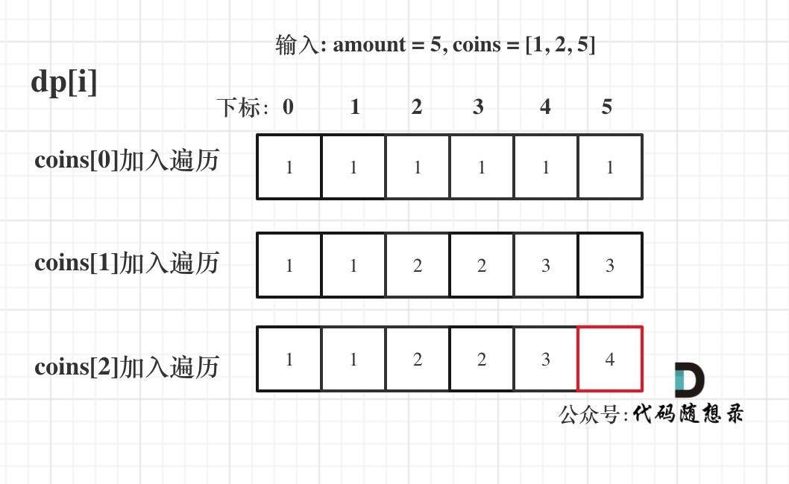

## Day44: 动态规划part06

### 完全背包

[卡码网](https://kamacoder.com/problempage.php?pid=1052)  [文章讲解](https://programmercarl.com/%E8%83%8C%E5%8C%85%E9%97%AE%E9%A2%98%E7%90%86%E8%AE%BA%E5%9F%BA%E7%A1%80%E5%AE%8C%E5%85%A8%E8%83%8C%E5%8C%85.html)

**题目描述**：

有N件物品和一个最多能背重量为W的背包。第i件物品的重量是weight[i]，得到的价值是value[i] 。**每件物品都有无限个（也就是可以放入背包多次）**，求解将哪些物品装入背包里物品价值总和最大。

**完全背包和01背包问题唯一不同的地方就是，每种物品有无限件**。

例：背包最大重量为4。

物品为：

|       | 重量 | 价值 |
| ----- | ---- | ---- |
| 物品0 | 1    | 15   |
| 物品1 | 3    | 20   |
| 物品2 | 4    | 30   |

每件商品都有无限个，问背包能背的物品最大价值是多少？

**01背包和完全背包唯一不同就是体现在遍历顺序上**

回顾一下01背包的核心代码

```cpp
for(int i = 0; i < weight.size(); i++) { // 遍历物品
    for(int j = bagWeight; j >= weight[i]; j--) { // 遍历背包容量
        dp[j] = max(dp[j], dp[j - weight[i]] + value[i]);
    }
}
```

01背包内嵌的循环是从大到小遍历，为了保证每个物品仅被添加一次。

而完全背包的物品是可以添加多次的，所以要从小到大去遍历，即：

```cpp
// 先遍历物品，再遍历背包
for(int i = 0; i < weight.size(); i++) { // 遍历物品
    for(int j = weight[i]; j <= bagWeight ; j++) { // 遍历背包容量
        dp[j] = max(dp[j], dp[j - weight[i]] + value[i]);
    }
}
```

dp状态图如下：


**还有一个很重要的问题，为什么遍历物品在外层循环，遍历背包容量在内层循环？**

01背包中二维dp数组的两个for遍历的先后循序是可以颠倒了，一维dp数组的两个for循环先后循序一定是先遍历物品，再遍历背包容量。

**在完全背包中，对于一维dp数组来说，其实两个for循环嵌套顺序是无所谓的！**

因为dp[j] 是根据 下标j之前所对应的dp[j]计算出来的。 只要保证下标j之前的dp[j]都是经过计算的就可以了。

遍历物品在外层循环，遍历背包容量在内层循环，状态如图：


遍历背包容量在外层循环，遍历物品在内层循环，状态如图：


完全背包中，两个for循环的先后循序，都不影响计算dp[j]所需要的值（这个值就是下标j之前所对应的dp[j]）。

先遍历背包在遍历物品，代码如下：

```cpp
// 先遍历背包，再遍历物品
for(int j = 0; j <= bagWeight; j++) { // 遍历背包容量
    for(int i = 0; i < weight.size(); i++) { // 遍历物品
        if (j - weight[i] >= 0) dp[j] = max(dp[j], dp[j - weight[i]] + value[i]);
    }
    cout << endl;
}
```

本题力扣上没有原题，以去[卡码网第52题](https://kamacoder.com/problempage.php?pid=1052)去练习，C++代码如下：

```cpp
#include <iostream>
#include <vector>
using namespace std;

// 先遍历背包，再遍历物品
void test_CompletePack(vector<int> weight, vector<int> value, int bagWeight) {
    vector<int> dp(bagWeight + 1, 0);

    for(int j = 0; j <= bagWeight; j++) { // 遍历背包容量
        for(int i = 0; i < weight.size(); i++) { // 遍历物品
            if (j - weight[i] >= 0) dp[j] = max(dp[j], dp[j - weight[i]] + value[i]);
        }
    }
    cout << dp[bagWeight] << endl;
}
int main() {
    int N, V;
    cin >> N >> V;
    vector<int> weight;
    vector<int> value;
    for (int i = 0; i < N; i++) {
        int w;
        int v;
        cin >> w >> v;
        weight.push_back(w);
        value.push_back(v);
    }
    test_CompletePack(weight, value, V);
    return 0;
}
```

### 518.零钱兑换II

[LeetCode](https://leetcode.cn/problems/coin-change-ii/)  [文章讲解](https://programmercarl.com/0518.%E9%9B%B6%E9%92%B1%E5%85%91%E6%8D%A2II.html)  [视频讲解](https://www.bilibili.com/video/BV1KM411k75j/)

#### 题目描述：

给你一个整数数组 `coins` 表示不同面额的硬币，另给一个整数 `amount` 表示总金额。

请你计算并返回可以凑成总金额的硬币组合数。如果任何硬币组合都无法凑出总金额，返回 `0` 。

假设每一种面额的硬币有无限个。 

题目数据保证结果符合 32 位带符号整数。

**示例 1：**
> 输入：amount = 5, coins = [1, 2, 5]
> 输出：4
> 解释：有四种方式可以凑成总金额：
> 5=5
> 5=2+2+1
> 5=2+1+1+1
> 5=1+1+1+1+1

**示例 2：**

> 输入：amount = 3, coins = [2]
> 输出：0
> 解释：只用面额 2 的硬币不能凑成总金额 3 。

**示例 3：**

> 输入：amount = 10, coins = [10] 
> 输出：1

#### 我的解法：

**纯完全背包是凑成背包最大价值是多少，而本题是要求凑成总金额的物品组合个数！**

注意题目描述中是凑成总金额的硬币组合数，为什么强调是组合数呢？

例如示例一：

5 = 2 + 2 + 1

5 = 2 + 1 + 2

这是一种组合，都是 2 2 1。

如果问的是排列数，那么上面就是两种排列了。

**组合不强调元素之间的顺序，排列强调元素之间的顺序**。 

**动规五步曲**：

1. **确定dp数组以及下标的含义**

dp[j]：凑成总金额j的货币组合数为dp[j]

2. **确定递推公式**

dp[j] 就是所有的dp[j - coins[i]]（考虑coins[i]的情况）相加。

所以递推公式：`dp[j] += dp[j - coins[i]]`;

3. **dp数组如何初始化**

首先dp[0]一定要为1，dp[0] = 1是 递归公式的基础。如果dp[0] = 0 的话，后面所有推导出来的值都是0了。

dp[0]=1还说明了一种情况：如果正好选了coins[i]后，也就是j-coins[i] == 0的情况表示这个硬币刚好能选，此时dp[0]为1表示只选coins[i]存在这样的一种选法。

4. **确定遍历顺序**

因为纯完全背包求得装满背包的最大价值是多少，和凑成总和的元素有没有顺序没关系，即：有顺序也行，没有顺序也行！

而本题要求凑成总和的组合数，元素之间明确要求没有顺序。

所以纯完全背包是能凑成总和就行，不用管怎么凑的。

本题是求凑出来的方案个数，且每个方案个数是为组合数。

那么本题，两个for循环的先后顺序可就有说法了。

先来看 外层for循环遍历物品（钱币），内层for遍历背包（金钱总额）的情况。

代码如下：

```cpp
for (int i = 0; i < coins.size(); i++) { // 遍历物品
    for (int j = coins[i]; j <= amount; j++) { // 遍历背包容量
        dp[j] += dp[j - coins[i]];
    }
}
```

假设：coins[0] = 1，coins[1] = 5。

那么就是先把1加入计算，然后再把5加入计算，得到的方法数量只有{1, 5}这种情况。而不会出现{5, 1}的情况。

**所以这种遍历顺序中dp[j]里计算的是组合数！**

如果把两个for交换顺序，代码如下：

```cpp
for (int j = 0; j <= amount; j++) { // 遍历背包容量
    for (int i = 0; i < coins.size(); i++) { // 遍历物品
        if (j - coins[i] >= 0) dp[j] += dp[j - coins[i]];
    }
}
```

背包容量的每一个值，都是经过 1 和 5 的计算，包含了{1, 5} 和 {5, 1}两种情况。

**此时dp[j]里算出来的就是排列数！**

5. **举例推导dp数组**

输入: amount = 5, coins = [1, 2, 5] ，dp状态图如下：



```C++
class Solution
{
 public:
	int change(int amount, vector<int>& coins)
	{
		vector<int> dp(amount + 1);
		dp[0] = 1;
		for (int i = 0; i < coins.size(); i++)
		{
			for (int j = 1; j <= amount; j++)
			{
				if (j >= coins[i]) dp[j] += dp[j - coins[i]];
			}
		}
		return dp[amount];
	}
};
```

### 377. 组合总和 Ⅳ

[LeetCode](https://leetcode.cn/problems/combination-sum-iv/)  [文章讲解](https://programmercarl.com/0377.%E7%BB%84%E5%90%88%E6%80%BB%E5%92%8C%E2%85%A3.html)  [视频讲解](https://www.bilibili.com/video/BV1V14y1n7B6/)

#### 题目描述：

给你一个由 **不同** 整数组成的数组 `nums` ，和一个目标整数 `target` 。请你从 `nums` 中找出并返回总和为 `target` 的元素组合的个数。

题目数据保证答案符合 32 位整数范围。

**示例 1：**

> 输入：nums = [1,2,3], target = 4
> 输出：7
> 解释：
> 所有可能的组合为：
> (1, 1, 1, 1)
> (1, 1, 2)
> (1, 2, 1)
> (1, 3)
> (2, 1, 1)
> (2, 2)
> (3, 1)
> 请注意，顺序不同的序列被视作不同的组合。

**示例 2：**

> 输入：nums = [9], target = 3
> 输出：0

#### 我的解法1(回溯算法)：

回溯算法，提交超时

```C++
class Solution
{
 public:
	int result = 0;

	void backtracking(vector<int>& nums, int target, int sum)
	{
		if(sum > target) return;
		if (sum == target)
		{
			result++;
			return;
		}

		for (int i = 0; i < nums.size(); i++)
		{
			backtracking(nums, target, sum + nums[i]);
		}
	}

	int combinationSum4(vector<int>& nums, int target)
	{
		result = 0;
		backtracking(nums, target, 0);
		return result;
	}
};
```

#### 动态规划：

本题题目描述说是求组合，但又说是可以元素相同顺序不同的组合算两个组合，**其实就是求排列！**

组合不强调顺序，(1,5)和(5,1)是同一个组合。

排列强调顺序，(1,5)和(5,1)是两个不同的排列。

**动规五部曲**：

1. **确定dp数组以及下标的含义**

**dp[i]: 凑成目标正整数为i的排列个数为dp[i]**

2. **确定递推公式**

求装满背包有几种方法，递推公式一般都是`dp[j] += dp[j - nums[i]]`;

3. **dp数组如何初始化**

dp[0]要初始化为1，这样递归其他dp[j]的时候才会有数值基础。

非0下标的dp[j]初始化为0，这样才不会影响dp[j]累加所有的dp[j - nums[i]]。

4. **确定遍历顺序**

个数可以不限使用，说明这是一个完全背包。

得到的集合是排列，说明需要考虑元素之间的顺序。

**如果求组合数就是外层for循环遍历物品，内层for遍历背包**。

**如果求排列数就是外层for遍历背包，内层for循环遍历物品**。

如果把遍历nums（物品）放在外循环，遍历target的作为内循环的话，举一个例子：计算dp[4]的时候，结果集只有 {1,3} 这样的集合，不会有{3,1}这样的集合，因为nums遍历放在外层，3只能出现在1后面！

所以本题遍历顺序最终遍历顺序：**target（背包）放在外循环，将nums（物品）放在内循环，内循环从前到后遍历**。

5. **举例来推导dp数组**

例如：


```cpp
class Solution2
{
 public:
    int combinationSum4(vector<int>& nums, int target)
    {
       vector<int> dp(target + 1);
       dp[0] = 1;

       for (int j = 1; j <= target; j++)
       {
          for (int i = 0; i < nums.size(); i++)
          {
             if (j - nums[i] >= 0 && dp[j] < INT_MAX - dp[j - nums[i]])
                dp[j] += dp[j - nums[i]];
          }
       }
       return dp[target];
    }
};
```

C++测试用例有两个数相加超过int的数据，所以需要在if里加上dp[j] < INT_MAX - dp[j - num]。

### 今日总结

两道题虽然提交通过了，但是理解得还不是很深刻。
