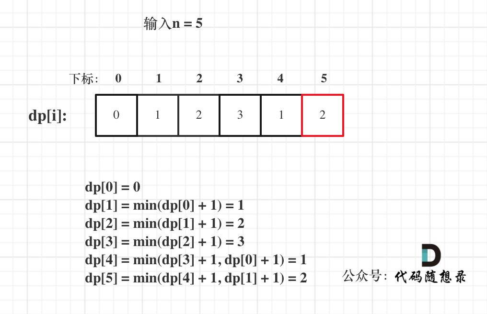

## Day50: 动态规划part07

### 卡码网：57. 爬楼梯

[卡码网](https://kamacoder.com/problempage.php?pid=1067)  [文章讲解](https://programmercarl.com/0070.%E7%88%AC%E6%A5%BC%E6%A2%AF%E5%AE%8C%E5%85%A8%E8%83%8C%E5%8C%85%E7%89%88%E6%9C%AC.html)

#### 题目描述：

假设你正在爬楼梯。需要 n 阶你才能到达楼顶。 

每次你可以爬至多m (1 <= m < n)个台阶。你有多少种不同的方法可以爬到楼顶呢？ 

注意：给定 n 是一个正整数。

#### 我的解法：

可以爬的台阶数即为物品nums=[1,2,...,m]

**动规五步曲**：

1. **确定dp数组以及下标的含义**

**dp[i]：爬到有i个台阶的楼顶，有dp[i]种方法**。

2. **确定递推公式**

本题dp[i]有几种来源，dp[i - 1]，dp[i - 2]，dp[i - 3] 等等，即：dp[i - j]

那么递推公式为：`dp[i] += dp[i - j]`

3. **dp数组如何初始化**

首先dp[0]一定要为1，dp[0] = 1是 递归公式的基础。如果dp[0] = 0 的话，后面所有推导出来的值都是0了。

4. **确定遍历顺序**

这是背包里求排列问题，即：**1、2 步 和 2、1 步都是上三个台阶，但是这两种方法不一样！**

所以需将target放在外循环，将nums放在内循环。

每一步可以走多次，这是完全背包，内循环需要从前向后遍历。

5. **举例推导dp数组**

略

```C++
#include <iostream>
#include <vector>
#include <cmath>
using namespace std;

// 先遍历背包，再遍历物品
void climbingStairs(int m, int n)
{
	vector<int> dp(n + 1, 0);
	dp[0] = 1;

	// 遍历背包容量
	for (int i = 1; i <= n; i++)
	{
		// 遍历物品
		for (int j = 1; j <= m; j++)
		{
			if (i >= j) dp[i] += dp[i - j];
		}
	}
	cout << dp[n] << endl;
}

int main()
{
	int m, n;
	cin >> n >> m;
	climbingStairs(m, n);
	return 0;
}
```

### 322. 零钱兑换

[LeetCode](https://leetcode.cn/problems/coin-change/)  [文章讲解](https://programmercarl.com/0322.%E9%9B%B6%E9%92%B1%E5%85%91%E6%8D%A2.html)  [视频讲解](https://www.bilibili.com/video/BV14K411R7yv/)

#### 题目描述：

给你一个整数数组 `coins` ，表示不同面额的硬币；以及一个整数 `amount` ，表示总金额。

计算并返回可以凑成总金额所需的 **最少的硬币个数** 。如果没有任何一种硬币组合能组成总金额，返回 `-1` 。

你可以认为每种硬币的数量是无限的。

**示例 1：**

> 输入：coins = [1, 2, 5], amount = 11
> 输出：3 
> 解释：11 = 5 + 5 + 1

**示例 2：**

> 输入：coins = [2], amount = 3
> 输出：-1

**示例 3：**

> 输入：coins = [1], amount = 0
> 输出：0

#### 我的解法：

题目中说每种硬币的数量是无限的，可以看出是典型的完全背包问题。

动规五部曲分析如下：

1. **确定dp数组以及下标的含义**

**dp[j]：凑足总额为j所需钱币的最少个数为dp[j]**

2. **确定递推公式**

凑足总额为`j - coins[i]`的最少个数为`dp[j - coins[i]]`，那么只需要加上一个钱币`coins[i]`即`dp[j - coins[i]] + 1`就是`dp[j]`（考虑`coins[i]`）

所以`dp[j]` 要取所有 `dp[j - coins[i]] + 1` 中最小的。

递推公式：`dp[j] = min(dp[j - coins[i]] + 1, dp[j])`;

3. **dp数组如何初始化**

首先凑足总金额为0所需钱币的个数一定是0，那么`dp[0] = 0`;

其他下标对应的数值呢？

考虑到递推公式的特性，`dp[j]`必须**初始化为一个最大的数**，否则就会在`min(dp[j - coins[i]] + 1, dp[j])`比较的过程中被初始值覆盖。所以下标非0的元素都是应该是最大值。

代码如下：

```text
vector<int> dp(amount + 1, INT_MAX);
dp[0] = 0;
```

4. **确定遍历顺序**

本题求钱币最小个数，**那么钱币有顺序和没有顺序都可以，都不影响钱币的最小个数**。所以本题并不强调集合是组合还是排列。

**如果求组合数就是外层for循环遍历物品，内层for遍历背包**。

**如果求排列数就是外层for遍历背包，内层for循环遍历物品**。

**所以本题的两个for循环的关系是：外层for循环遍历物品，内层for遍历背包或者外层for遍历背包，内层for循环遍历物品都是可以的！**

本题钱币数量可以无限使用，那么是完全背包。所以遍历的内循环是正序

综上所述，遍历顺序为：coins（物品）放在外循环，target（背包）在内循环。且内循环正序。

5. **举例推导dp数组**

以输入：coins = [1, 2, 5], amount = 5为例


dp[amount]为最终结果。

以上分析完毕，C++ 代码如下：

```cpp
class Solution {
public:
    int coinChange(vector<int>& coins, int amount) {
        vector<int> dp(amount + 1, INT_MAX);
        dp[0] = 0;
        for (int i = 0; i < coins.size(); i++) { // 遍历物品
            for (int j = coins[i]; j <= amount; j++) { // 遍历背包
                if (dp[j - coins[i]] != INT_MAX) { // 如果dp[j - coins[i]]是初始值则跳过
                    dp[j] = min(dp[j - coins[i]] + 1, dp[j]);
                }
            }
        }
        if (dp[amount] == INT_MAX) return -1;
        return dp[amount];
    }
};
```

### 279.完全平方数

[LeetCode](https://leetcode.cn/problems/perfect-squares/)  [文章讲解](https://programmercarl.com/0279.%E5%AE%8C%E5%85%A8%E5%B9%B3%E6%96%B9%E6%95%B0.html)  [视频讲解](https://www.bilibili.com/video/BV12P411T7Br/)

#### 题目描述：

给你一个整数 `n` ，返回 *和为 `n` 的完全平方数的最少数量* 。

**完全平方数** 是一个整数，其值等于另一个整数的平方；换句话说，其值等于一个整数自乘的积。例如，`1`、`4`、`9` 和 `16` 都是完全平方数，而 `3` 和 `11` 不是。

**示例 1：**

> 输入：n = 12
> 输出：3 
> 解释：12 = 4 + 4 + 4

**示例 2：**

> 输入：n = 13
> 输出：2
> 解释：13 = 4 + 9

#### 我的解法：

动规五部曲分析如下：

1. **确定dp数组以及下标的含义**

**dp[j]：和为j所需完全平方数最少个数为dp[j]**

2. **确定递推公式**

dp[j] 可以由dp[j - i * i]推出， dp[j - i * i] + 1 便可以凑成dp[j]。

此时我们要选择最小的dp[j]，所以递推公式：dp[j] = min(dp[j - i * i] + 1, dp[j]);

3. **dp数组如何初始化**

dp[0]表示 和为0的完全平方数的最小数量，那么dp[0]一定是0。

其他下标对应的数值呢？

从递归公式dp[j] = min(dp[j - i * i] + 1, dp[j]);中可以看出每次dp[j]都要选最小的，**所以非0下标的dp[j]一定要初始为最大值，这样dp[j]在递推的时候才不会被初始值覆盖**。

```text
vector<int> dp(amount + 1, INT_MAX);
dp[0] = 0;
```

4. **确定遍历顺序**

对于完全背包，如果求组合数就是外层for循环遍历物品，内层for遍历背包；如果求排列数就是外层for遍历背包，内层for循环遍历物品。

本题求和为n最小个数，所以本题并不强调集合是组合还是排列。

**所以本题外层for遍历背包，内层for遍历物品，还是外层for遍历物品，内层for遍历背包，都是可以的！**

5. **举例推导dp数组**

已输入n为5例，dp状态图如下：



dp[0] = 0 dp[1] = min(dp[0] + 1) = 1 dp[2] = min(dp[1] + 1) = 2 dp[3] = min(dp[2] + 1) = 3 dp[4] = min(dp[3] + 1, dp[0] + 1) = 1 dp[5] = min(dp[4] + 1, dp[1] + 1) = 2

最后的dp[n]为最终结果。

```C++
class Solution
{
 public:
	int numSquares(int n)
	{
		vector<int> dp(n + 1, INT_MAX);
		dp[0] = 0;
		for (int i = 1; i * i <= n; i++)
		{
			for (int j = i * i; j <= n; j++)
			{
				if (dp[j - i * i] != INT_MAX)
				{
					dp[j] = min(dp[j - i * i] + 1, dp[j]);
				}
			}
		}

		return dp[n];
	}
};
```

### 今日总结

第二题想复杂了，进一步理解了对于完全背包的遍历顺序的问题。
