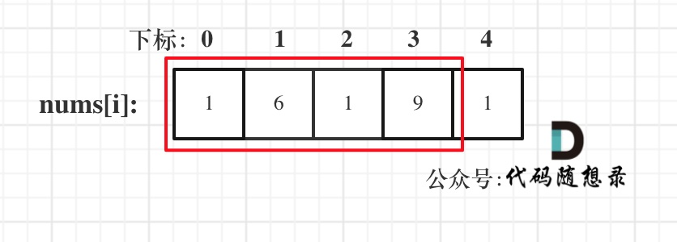

## Day52: 动态规划part09

### 198.打家劫舍

[LeetCode](https://leetcode.cn/problems/house-robber/)  [文章讲解](https://programmercarl.com/0198.%E6%89%93%E5%AE%B6%E5%8A%AB%E8%88%8D.html)  [视频讲解](https://www.bilibili.com/video/BV1Te411N7SX/)

#### 题目描述：

你是一个专业的小偷，计划偷窃沿街的房屋。每间房内都藏有一定的现金，影响你偷窃的唯一制约因素就是相邻的房屋装有相互连通的防盗系统，**如果两间相邻的房屋在同一晚上被小偷闯入，系统会自动报警**。

给定一个代表每个房屋存放金额的非负整数数组，计算你 **不触动警报装置的情况下** ，一夜之内能够偷窃到的最高金额。

**示例 1：**

> 输入：[1,2,3,1]
> 输出：4
> 解释：偷窃 1 号房屋 (金额 = 1) ，然后偷窃 3 号房屋 (金额 = 3)。
>      偷窃到的最高金额 = 1 + 3 = 4 。

**示例 2：**

> 输入：[2,7,9,3,1]
> 输出：12
> 解释：偷窃 1 号房屋 (金额 = 2), 偷窃 3 号房屋 (金额 = 9)，接着偷窃 5 号房屋 (金额 = 1)。
>      偷窃到的最高金额 = 2 + 9 + 1 = 12 。

#### 我的解法：

**动规五部曲**：

当前房屋偷与不偷取决于 前一个房屋和前两个房屋是否被偷了。所以这里就更感觉到，当前状态和前面状态会有一种依赖关系，那么这种依赖关系都是动规的递推公式。

动规五部曲分析如下：

1. **确定dp数组（dp table）以及下标的含义**

**dp[i]：考虑下标i（包括i）以内的房屋，最多可以偷窃的金额为dp[i]**。

2. **确定递推公式**

决定`dp[i]`的因素就是第`i`房间偷还是不偷。如果偷第`i`房间，那么`dp[i] = dp[i - 2] + nums[i]` ，即：第i-1房一定是不考虑的，找出 下标`i-2`（包括i-2）以内的房屋，最多可以偷窃的金额为`dp[i-2]` 加上第i房间偷到的钱。

如果不偷第i房间，那么dp[i] = dp[i - 1]，即考 虑i-1房，然后dp[i]取最大值，即**`dp[i] = max(dp[i - 2] + nums[i], dp[i - 1])`**;

3. **dp数组如何初始化**

从递推公式dp[i] = max(dp[i - 2] + nums[i], dp[i - 1]);可以看出，递推公式的基础就是dp[0] 和 dp[1]

从dp[i]的定义上来讲，dp[0] 一定是 nums[0]，dp[1]就是nums[0]和nums[1]的最大值即：dp[1] = max(nums[0], nums[1]);

```cpp
vector<int> dp(nums.size());
dp[0] = nums[0];
dp[1] = max(nums[0], nums[1]);
```

4. **确定遍历顺序**

dp[i] 是根据dp[i - 2] 和 dp[i - 1] 推导出来的，那么一定是从前到后遍历！

代码如下：

```cpp
for (int i = 2; i < nums.size(); i++) {
    dp[i] = max(dp[i - 2] + nums[i], dp[i - 1]);
}
```

5. **举例推导dp数组**

以示例二，输入[2,7,9,3,1]为例。


红框dp[nums.size() - 1]为结果。

```C++
class Solution
{
 public:
	int rob(vector<int>& nums)
	{
		if (nums.size() == 1) return nums[0];

		vector<int> dp(nums.size());
		dp[0] = nums[0];
		dp[1] = max(nums[0], nums[1]);

		for (int i = 2; i < nums.size(); i++)
		{
			dp[i] = max(dp[i - 2] + nums[i], dp[i - 1]);
		}
		return dp[nums.size() - 1];
	}
};
```

### 213.打家劫舍II

[LeetCode](https://leetcode.cn/problems/house-robber-ii/)  [文章讲解](https://programmercarl.com/0213.%E6%89%93%E5%AE%B6%E5%8A%AB%E8%88%8DII.html)  [视频讲解](https://www.bilibili.com/video/BV1oM411B7xq/)

#### 题目描述：

你是一个专业的小偷，计划偷窃沿街的房屋，每间房内都藏有一定的现金。这个地方所有的房屋都 **围成一圈** ，这意味着第一个房屋和最后一个房屋是紧挨着的。同时，相邻的房屋装有相互连通的防盗系统，**如果两间相邻的房屋在同一晚上被小偷闯入，系统会自动报警** 。

给定一个代表每个房屋存放金额的非负整数数组，计算你 **在不触动警报装置的情况下** ，今晚能够偷窃到的最高金额。

**示例 1：**

> 输入：nums = [2,3,2]
> 输出：3
> 解释：你不能先偷窃 1 号房屋（金额 = 2），然后偷窃 3 号房屋（金额 = 2）, 因为他们是相邻的。

**示例 2：**

> 输入：nums = [1,2,3,1]
> 输出：4
> 解释：你可以先偷窃 1 号房屋（金额 = 1），然后偷窃 3 号房屋（金额 = 3）。
>      偷窃到的最高金额 = 1 + 3 = 4 。

#### 我的解法：

对于一个数组，成环的话主要有如下三种情况：

- 情况一：考虑不包含首尾元素


- 情况二：考虑包含首元素，不包含尾元素



- 情况三：考虑包含尾元素，不包含首元素


**而情况二 和 情况三 都包含了情况一了，所以只考虑情况二和情况三就可以了**。

代码如下：

```cpp
class Solution
{
 public:
	int sub_rob(vector<int>& nums, int begin, int end)
	{
		if (end - begin == 0) return nums[begin];

		vector<int> dp(nums.size());
		dp[begin] = nums[begin];
		dp[begin + 1] = max(nums[begin], nums[begin + 1]);
		for (int i = begin + 2; i <= end; i++)
		{
			dp[i] = max(dp[i - 2] + nums[i], dp[i - 1]);
		}
		return dp[end];
	}

	int rob(vector<int>& nums)
	{
		if (nums.size() == 0) return 0;
		if (nums.size() == 1) return nums[0];
		return max(sub_rob(nums, 0, nums.size() - 2),
			sub_rob(nums, 1, nums.size() - 1));
	}
};
```

### 337.打家劫舍 III

[LeetCode](https://leetcode.cn/problems/house-robber-iii/)  [文章讲解](https://programmercarl.com/0337.%E6%89%93%E5%AE%B6%E5%8A%AB%E8%88%8DIII.html)  [视频讲解](https://www.bilibili.com/video/BV1H24y1Q7sY/)

#### 题目描述：

小偷又发现了一个新的可行窃的地区。这个地区只有一个入口，我们称之为 `root` 。

除了 `root` 之外，每栋房子有且只有一个“父“房子与之相连。一番侦察之后，聪明的小偷意识到“这个地方的所有房屋的排列类似于一棵二叉树”。 如果 **两个直接相连的房子在同一天晚上被打劫** ，房屋将自动报警。

给定二叉树的 `root` 。返回 ***在不触动警报的情况下** ，小偷能够盗取的最高金额* 。

**示例 1:**


> 输入: root = [3,2,3,null,3,null,1]
> 输出: 7 
> 解释: 小偷一晚能够盗取的最高金额 3 + 3 + 1 = 7

**示例 2:**


> 输入: root = [3,4,5,1,3,null,1]
> 输出: 9
> 解释: 小偷一晚能够盗取的最高金额 4 + 5 = 9

#### 参考解法：

对于树的话，首先就要想到遍历方式，前中后序（深度优先搜索）还是层序遍历（广度优先搜索）。

**本题一定是要后序遍历，因为通过递归函数的返回值来做下一步计算**。

与198.打家劫舍，213.打家劫舍II一样，关键是要讨论当前节点抢还是不抢。如果抢了当前节点，两个孩子就不能动，如果没抢当前节点，就可以考虑抢左右孩子。

对于本题来说，动态规划其实就是使用状态转移容器来记录状态的变化，这里可以使用一个长度为2的数组，记录当前节点偷与不偷所得到的的最大金钱。

**这道题目算是树形dp的入门题目，因为是在树上进行状态转移，在讲解二叉树的时候说过递归三部曲，那么下面以递归三部曲为框架，其中融合动规五部曲的内容来进行讲解**。

1. **确定递归函数的参数和返回值**

这里要求一个节点 偷与不偷的两个状态所得到的金钱，那么返回值就是一个长度为2的数组。

参数为当前节点，代码如下：

```cpp
vector<int> traversal(TreeNode* cur) {
```

其实这里的返回数组就是dp数组。所以dp数组（dp table）以及下标的含义：下标为0记录偷该节点所得到的的最大金钱，下标为1记录不偷该节点所得到的的最大金钱。

**所以本题dp数组就是一个长度为2的数组！在递归的过程中，系统栈会保存每一层递归的参数，即每一个节点都有一个长度为2的dp数组**。

2. **确定终止条件**

在遍历的过程中，如果遇到空节点的话，很明显，无论偷还是不偷都是0，所以就返回

```text
if (cur == NULL) return vector<int>{0, 0};
```

这也相当于dp数组的初始化

3. **确定遍历顺序**

首先明确的是使用后序遍历。 因为要通过递归函数的返回值来做下一步计算。

通过递归左节点，得到左节点偷与不偷的金钱。

通过递归右节点，得到右节点偷与不偷的金钱。

代码如下：

```cpp
// 下标0：偷，下标1：不偷
vector<int> leftdp = traversal(node->left); // 左
vector<int> rightdp = traversal(node->right); // 右
```

4. **确定单层递归的逻辑**

如果是偷当前节点，那么左右孩子就不能偷，`val1 = cur->val + left[0] + right[0]`;

如果不偷当前节点，那么左右孩子就可以偷，至于到底偷不偷一定是选一个最大的，所以：`val2 = max(left[0], left[1]) + max(right[0], right[1])`;

最后当前节点的状态就是{val1, val2}; 即：{偷当前节点得到的最大金钱，不偷当前节点得到的最大金钱}

代码如下：

```cpp
// 后序遍历
vector<int> leftdp = traversal(node->left); // 左
vector<int> rightdp = traversal(node->right); // 右

// 中
int val1 = node->val + leftdp[1] + rightdp[1];	// 使用本节点
int val2 = max(leftdp[0], leftdp[1]) + max(rightdp[0], rightdp[1]); // 不使用本节点

return { val1, val2 };
```

5. 举例推导dp数组

以示例1为例，dp数组状态如下：（**注意用后序遍历的方式推导**）


**最后头结点就是 取下标0 和 下标1的最大值就是偷得的最大金钱**。

```cpp
class Solution
{
 public:
	// 0: 使用本节点，1: 不使用本节点
	vector<int> traversal(TreeNode* node)
	{
		if (node == nullptr) return { 0, 0 };

		// 后序遍历
		vector<int> leftdp = traversal(node->left); // 左
		vector<int> rightdp = traversal(node->right); // 右

		// 中
		int val1 = node->val + leftdp[1] + rightdp[1];	// 使用本节点
		int val2 = max(leftdp[0], leftdp[1]) + max(rightdp[0], rightdp[1]); // 不使用本节点

		return { val1, val2 };
	}

	int rob(TreeNode* root)
	{
		vector<int> result = traversal(root);
		return max(result[0], result[1]);
	}
};
```

### 今日总结

前两题差不多AC了，第三题树形dp第一次接触，没有做出来。
