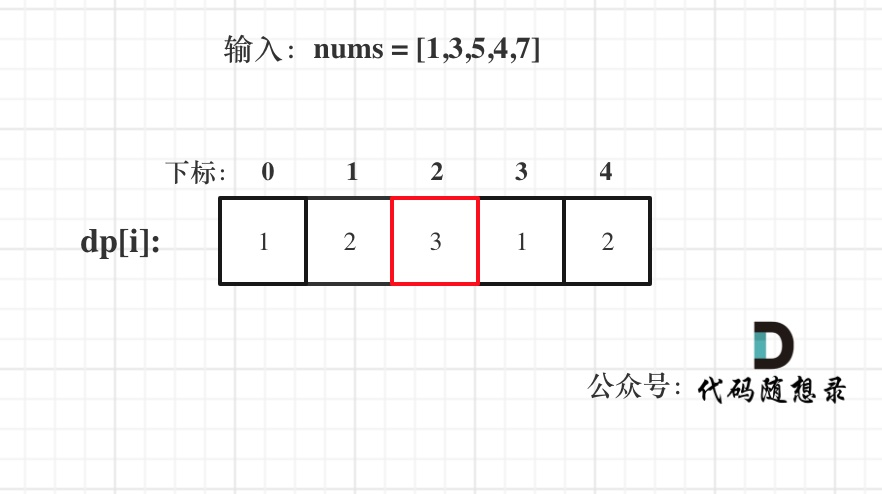

## Day56: 动态规划part13

### 300.最长递增子序列

[LeetCode](https://leetcode.cn/problems/longest-increasing-subsequence/)  [文章讲解](https://programmercarl.com/0300.%E6%9C%80%E9%95%BF%E4%B8%8A%E5%8D%87%E5%AD%90%E5%BA%8F%E5%88%97.html)  [视频讲解](https://www.bilibili.com/video/BV1ng411J7xP/)

#### 题目描述：

给你一个整数数组 `nums` ，找到其中最长严格递增子序列的长度。

**子序列**·是由数组派生而来的序列，删除（或不删除）数组中的元素而不改变其余元素的顺序。例如，`[3,6,2,7]` 是数组 `[0,3,1,6,2,2,7]` 的子序列。

**示例 1：**

> 输入：nums = [10,9,2,5,3,7,101,18]
> 输出：4
> 解释：最长递增子序列是 [2,3,7,101]，因此长度为 4 。

**示例 2：**

> 输入：nums = [0,1,0,3,2,3]
> 输出：4

**示例 3：**

> 输入：nums = [7,7,7,7,7,7,7]
> 输出：1

#### 参考解法：

**动规五部曲**：

1. **dp[i]的定义**

本题中，正确定义dp数组的含义十分重要。

**`dp[i]`表示`i`之前包括`i`的以`nums[i]`结尾的最长递增子序列的长度**

为什么一定表示 “以nums[i]结尾的最长递增子序” ，因为在 做 递增比较的时候，如果比较 nums[j] 和 nums[i] 的大小，那么两个递增子序列一定分别以nums[j]为结尾 和 nums[i]为结尾， 要不然这个比较就没有意义了，不是尾部元素的比较那么 如何算递增呢。

2. **状态转移方程**

位置`i`的最长升序子序列等于`j`从0到`i-1`各个位置的最长升序子序列 + 1 的最大值。

所以：`if (nums[i] > nums[j]) dp[i] = max(dp[i], dp[j] + 1);`

**注意这里不是要`dp[i]` 与 `dp[j] + 1`进行比较，而是取`dp[j] + 1`的最大值**。

3. **dp[i]的初始化**

每一个`i`，对应的`dp[i]`（即最长递增子序列）起始大小至少都是1.

4. **确定遍历顺序**

`dp[i]` 是有0到`i-1`各个位置的最长递增子序列 推导而来，那么遍历`i`一定是从前向后遍历。

`j`其实就是遍历0到`i-1`，那么是从前到后，还是从后到前遍历都无所谓，只要吧 0 到 `i-1` 的元素都遍历了就行了。 所以默认习惯 从前向后遍历。

遍历i的循环在外层，遍历j则在内层，代码如下：

```cpp
for (int i = 1; i < nums.size(); i++) {
    for (int j = 0; j < i; j++) {
        if (nums[i] > nums[j]) dp[i] = max(dp[i], dp[j] + 1);
    }
    if (dp[i] > result) result = dp[i]; // 取长的子序列
}
```

5. **举例推导dp数组**

输入：[0,1,0,3,2]，dp数组的变化如下：


```cpp
class Solution
{
 public:
	int lengthOfLIS(vector<int>& nums)
	{
		int len = nums.size();
		vector<int> dp(len, 1);
		int result = 0;
		for (int i = 1; i < len; i++)
		{
			for (int j = 0; j < i; j++)
			{
				if (nums[i] > nums[j])
				{
					dp[i] = max(dp[i], dp[j] + 1);
				}
			}
			result = max(result, dp[i]);
		}
		return result;
	}
};
```

### 674. 最长连续递增序列

[LeetCode](https://leetcode.cn/problems/longest-continuous-increasing-subsequence/)  [文章讲解](https://programmercarl.com/0674.%E6%9C%80%E9%95%BF%E8%BF%9E%E7%BB%AD%E9%80%92%E5%A2%9E%E5%BA%8F%E5%88%97.html)  [视频讲解](https://www.bilibili.com/video/BV1bD4y1778v/)

#### 题目描述：

给定一个未经排序的整数数组，找到最长且 **连续递增的子序列**，并返回该序列的长度。

**连续递增的子序列** 可以由两个下标 `l` 和 `r`（`l < r`）确定，如果对于每个 `l <= i < r`，都有 `nums[i] < nums[i + 1]` ，那么子序列 `[nums[l], nums[l + 1], ..., nums[r - 1], nums[r]]` 就是连续递增子序列。

**示例 1：**

> 输入：nums = [1,3,5,4,7]
> 输出：3
> 解释：最长连续递增序列是 [1,3,5], 长度为3。
> 尽管 [1,3,5,7] 也是升序的子序列, 但它不是连续的，因为 5 和 7 在原数组里被 4 隔开。 

**示例 2：**

> 输入：nums = [2,2,2,2,2]
> 输出：1
> 解释：最长连续递增序列是 [2], 长度为1。

#### 我的解法：

每当发现前一个数比当前数小，就统计连续递增子序列的长度，取最长的长度。

```C++
class Solution
{
 public:
	int findLengthOfLCIS(vector<int>& nums)
	{
		int result = 1;
		for (int i = 1; i < nums.size();)
		{
			int temp = 1;
			while ((i < nums.size()) && (nums[i] > nums[i - 1]))
			{
				temp++;
				i++;
			}
			result = max(result, temp);
			i++;
		}
		return result;
	}
};
```

#### 动态规划解法：

动规五部曲分析如下：

1. **确定dp数组（dp table）以及下标的含义**

**dp[i]：以下标i为结尾的连续递增的子序列长度为dp[i]**。

注意这里的定义，一定是以下标i为结尾，并不是说一定以下标0为起始位置。

2. **确定递推公式**

如果 `nums[i] > nums[i - 1]`，那么以 `i` 为结尾的连续递增的子序列长度 一定等于 以`i - 1`为结尾的连续递增的子序列长度 + 1 。

即：`dp[i] = dp[i - 1] + 1`;

**注意与[300.最长递增子序列](https://programmercarl.com/0300.最长上升子序列.html)的区别！**

因为本题要求连续递增子序列，所以就只要比较`nums[i]`与`nums[i - 1]`，而不用去比较`nums[j]`与`nums[i]` （j是在0到i之间遍历）。

既然不用`j`了，那么也不用两层for循环，本题一层for循环就行，比较`nums[i]` 和 `nums[i - 1]`。

3. **dp数组如何初始化**

以下标`i`为结尾的连续递增的子序列长度最少也应该是1，即就是nums[i]这一个元素，所以dp[i]应该初始1。

4. **确定遍历顺序**

从递推公式上可以看出， `dp[i + 1]`依赖`dp[i]`，所以一定是从前向后遍历。

```cpp
for (int i = 1; i < nums.size(); i++) {
    if (nums[i] > nums[i - 1]) { // 连续记录
        dp[i] = dp[i - 1] + 1;
    }
}
```

5. **举例推导dp数组**

已输入nums = [1,3,5,4,7]为例，dp数组状态如下：



**注意这里要取dp[i]里的最大值！**

```cpp
class Solution2
{
 public:
    int findLengthOfLCIS(vector<int>& nums)
    {
       int len = nums.size();
       vector<int> dp(len, 1);
       int result = 1;

       for (int i = 1; i < len; i++)
       {
          if (nums[i] > nums[i - 1]) dp[i] = dp[i - 1] + 1;
          result = max(result, dp[i]);
       }
       return result;
    }
};
```

### 718. 最长重复子数组

[LeetCode](https://leetcode.cn/problems/maximum-length-of-repeated-subarray/)  [文章讲解](https://programmercarl.com/0718.%E6%9C%80%E9%95%BF%E9%87%8D%E5%A4%8D%E5%AD%90%E6%95%B0%E7%BB%84.html)  [视频讲解](https://www.bilibili.com/video/BV178411H7hV/)

#### 题目描述：

给两个整数数组 `nums1` 和 `nums2` ，返回 *两个数组中 **公共的** 、长度最长的子数组的长度* 。

**示例 1：**

> 输入：nums1 = [1,2,3,2,1], nums2 = [3,2,1,4,7]
> 输出：3
> 解释：长度最长的公共子数组是 [3,2,1] 。

**示例 2：**

> 输入：nums1 = [0,0,0,0,0], nums2 = [0,0,0,0,0]
> 输出：5

#### 我的解法：

注意题目中说的子数组，其实就是连续子序列。

要求两个数组中最长重复子数组，如果是暴力的解法 只需要先两层for循环确定两个数组起始位置，然后再来一个循环可以是for或者while，来从两个起始位置开始比较，取得重复子数组的长度。

本题其实是动规解决的经典题目，用二维数组可以记录两个字符串的所有比较情况，这样就比较好推 递推公式了。 动规五部曲分析如下：

1. **确定dp数组（dp table）以及下标的含义**

`dp[i][j]` ：以下标`i - 1`为结尾的A，和以下标`j - 1`为结尾的B，最长重复子数组长度为`dp[i][j]`。 （**特别注意**： “以下标i - 1为结尾的A” 标明一定是 以A[i-1]为结尾的字符串 ）

`dp[i][j]`的定义也就决定着，在遍历`dp[i][j]`的时候`i` 和 `j`都要从1开始。

如果定义`dp[i][j]`为 以下标i为结尾的A，和以下标j 为结尾的B，最长重复子数组长度，实现起来就麻烦一点，需要单独处理初始化部分。

2. **确定递推公式**

根据`dp[i][j]`的定义，`dp[i][j]`的状态只能由`dp[i - 1][j - 1]`推导出来。

即当A[i - 1] 和B[j - 1]相等的时候，`dp[i][j] = dp[i - 1][j - 1] + 1`;

根据递推公式可以看出，遍历i 和 j 要从1开始！

3. **dp数组如何初始化**

根据`dp[i][j]`的定义，`dp[i][0]` 和`dp[0][j]`其实都是没有意义的！

但`dp[i][0]` 和`dp[0][j]`要初始值，因为 为了方便递归公式`dp[i][j] = dp[i - 1][j - 1] + 1`;

所以`dp[i][0]` 和`dp[0][j]`初始化为0。

举个例子A[0]如果和B[0]相同的话，`dp[1][1] = dp[0][0] + 1`，只有`dp[0][0]`初始为0，正好符合递推公式逐步累加起来。

4. **确定遍历顺序**

外层for循环遍历A，内层for循环遍历B。外层for循环遍历B，内层for循环遍历A也行。

同时题目要求长度最长的子数组的长度。所以在遍历的时候顺便把`dp[i][j]`的最大值记录下来。

代码如下：

```cpp
for (int i = 1; i <= nums1.size(); i++) {
    for (int j = 1; j <= nums2.size(); j++) {
        if (nums1[i - 1] == nums2[j - 1]) {
            dp[i][j] = dp[i - 1][j - 1] + 1;
        }
        if (dp[i][j] > result) result = dp[i][j];
    }
}
```

5. **举例推导dp数组**

拿示例1中，A: [1,2,3,2,1]，B: [3,2,1,4,7]为例，画一个dp数组的状态变化，如下：


以上五部曲分析完毕，C++代码如下：

```cpp
class Solution
{
 public:
	int findLength(vector<int>& nums1, vector<int>& nums2)
	{
		int len1 = nums1.size();
		int len2 = nums2.size();
		int result = 0;
		vector<vector<int>> dp(len1 + 1, vector<int>(len2 + 1, 0));
		for (int i = 1; i <= len1; i++)
		{
			for (int j = 1; j <= len2; j++)
			{
				if (nums1[i - 1] == nums2[j - 1])
				{
					dp[i][j] = dp[i - 1][j - 1] + 1;
					result = max(result, dp[i][j]);
				}
			}
		}
		return result;
	}
};
```

#### 滚动数组：

在如下图中：


可以看出`dp[i][j]`都是由`dp[i - 1][j - 1]`推出。那么压缩为一维数组，也就是`dp[j]`都是由`dp[j - 1]`推出。

也就是相当于可以把上一层`dp[i - 1][j]`拷贝到下一层`dp[i][j]`来继续用。

**此时遍历B数组的时候，就要从后向前遍历，这样避免重复覆盖**。

```cpp
// 版本二
class Solution {
public:
    int findLength(vector<int>& A, vector<int>& B) {
        vector<int> dp(vector<int>(B.size() + 1, 0));
        int result = 0;
        for (int i = 1; i <= A.size(); i++) {
            for (int j = B.size(); j > 0; j--) {
                if (A[i - 1] == B[j - 1]) {
                    dp[j] = dp[j - 1] + 1;
                } else dp[j] = 0; // 注意这里不相等的时候要有赋0的操作
                if (dp[j] > result) result = dp[j];
            }
        }
        return result;
    }
};
```

### 今日总结

子序列问题，最后一题二维dp居然自己做出来了。
