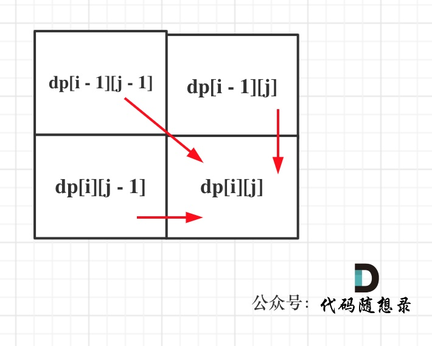
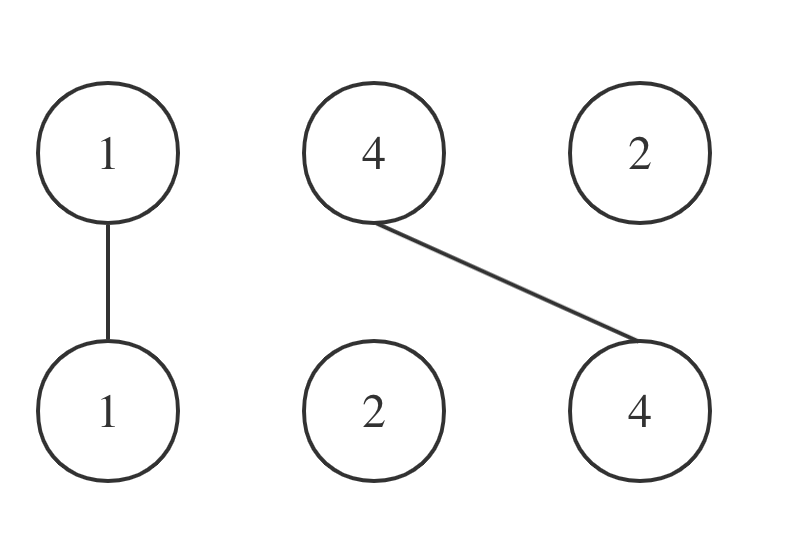

## Day57: 动态规划part14

### 1143.最长公共子序列

[LeetCode](https://leetcode.cn/problems/longest-common-subsequence/)  [文章讲解](https://programmercarl.com/1143.%E6%9C%80%E9%95%BF%E5%85%AC%E5%85%B1%E5%AD%90%E5%BA%8F%E5%88%97.html)  [视频讲解](https://www.bilibili.com/video/BV1ye4y1L7CQ/)

#### 题目描述：

给定两个字符串 `text1` 和 `text2`，返回这两个字符串的最长 **公共子序列** 的长度。如果不存在 **公共子序列** ，返回 `0` 。

一个字符串的 **子序列** 是指这样一个新的字符串：它是由原字符串在不改变字符的相对顺序的情况下删除某些字符（也可以不删除任何字符）后组成的新字符串。

- 例如，`"ace"` 是 `"abcde"` 的子序列，但 `"aec"` 不是 `"abcde"` 的子序列。

两个字符串的 **公共子序列** 是这两个字符串所共同拥有的子序列。

**示例 1：**

> 输入：text1 = "abcde", text2 = "ace" 
> 输出：3 
> 解释：最长公共子序列是 "ace" ，它的长度为 3 。

**示例 2：**

> 输入：text1 = "abc", text2 = "abc"
> 输出：3
> 解释：最长公共子序列是 "abc" ，它的长度为 3 。

**示例 3：**

> 输入：text1 = "abc", text2 = "def"
> 输出：0
> 解释：两个字符串没有公共子序列，返回 0 。

#### 我的解法：

动规五部曲分析如下：

1. **确定dp数组（dp table）以及下标的含义**

`dp[i][j]`：长度为`[0, i - 1]`的字符串text1与长度为`[0, j - 1]`的字符串text2的最长公共子序列为`dp[i][j]`

定义长度为[0, i - 1]的字符串text1，就是简化dp数组第一行和第一列的初始化逻辑。

2. **确定递推公式**

主要就是两大情况： `text1[i - 1]` 与 `text2[j - 1]`相同，`text1[i - 1]`与`text2[j - 1]`不相同

如果`text1[i - 1]` 与 `text2[j - 1]`相同，那么找到了一个公共元素，所以`dp[i][j] = dp[i - 1][j - 1] + 1`;

如果`text1[i - 1] 与 text2[j - 1]`不相同，那就看看`text1[0, i - 2]`与`text2[0, j - 1]`的最长公共子序列 和 `text1[0, i - 1]`与`text2[0, j - 2]`的最长公共子序列，取最大的。

即：`dp[i][j] = max(dp[i - 1][j], dp[i][j - 1])`;

代码如下：

```cpp
if (text1[i - 1] == text2[j - 1]) {
    dp[i][j] = dp[i - 1][j - 1] + 1;
} else {
    dp[i][j] = max(dp[i - 1][j], dp[i][j - 1]);
}
```

3. **dp数组如何初始化**

`test1[0, i-1]`和空串的最长公共子序列自然是0，所以`dp[i][0] = 0`;

同理`dp[0][j]`也是0。

其他下标都是随着递推公式逐步覆盖，初始为多少都可以，那么就统一初始为0。

```text
vector<vector<int>> dp(text1.size() + 1, vector<int>(text2.size() + 1, 0));
```

4. **确定遍历顺序**

从递推公式，可以看出，有三个方向可以推出`dp[i][j]`，如图：



那么为了在递推的过程中，这三个方向都是经过计算的数值，所以要从前向后，从上到下来遍历这个矩阵。

5. **举例推导dp数组**

以输入：text1 = "abcde", text2 = "ace" 为例，dp状态如图：


最后红框`dp[text1.size()][text2.size()]`为最终结果

```cpp
class Solution
{
 public:
	int longestCommonSubsequence(const string& text1, const string& text2)
	{
		int len1 = text1.size();
		int len2 = text2.size();
		vector<vector<int>> dp(len1 + 1, vector<int>(len2 + 1, 0));
		for (int i = 1; i <= len1; i++)
		{
			for (int j = 1; j <= len2; j++)
			{
				if (text1[i - 1] == text2[j - 1])
					dp[i][j] = dp[i - 1][j - 1] + 1;
				else
					dp[i][j] = max(dp[i][j - 1], dp[i - 1][j]);
			}
		}
		return dp[len1][len2];
	}
};
```

###  1035. 不相交的线

[LeetCode](https://leetcode.cn/problems/uncrossed-lines/)  [文章讲解](https://programmercarl.com/1035.%E4%B8%8D%E7%9B%B8%E4%BA%A4%E7%9A%84%E7%BA%BF.html)  [视频讲解](https://www.bilibili.com/video/BV1h84y1x7MP/)

#### 题目描述：

在两条独立的水平线上按给定的顺序写下 `nums1` 和 `nums2` 中的整数。

现在，可以绘制一些连接两个数字 `nums1[i]` 和 `nums2[j]` 的直线，这些直线需要同时满足满足：

-  `nums1[i] == nums2[j]`
- 且绘制的直线不与任何其他连线（非水平线）相交。

请注意，连线即使在端点也不能相交：每个数字只能属于一条连线。

以这种方法绘制线条，并返回可以绘制的最大连线数。

**示例 1：**


> 输入：nums1 = [1,4,2], nums2 = [1,2,4]
> 输出：2
> 解释：可以画出两条不交叉的线，如上图所示。 
> 但无法画出第三条不相交的直线，因为从 nums1[1]=4 到 nums2[2]=4 的直线将与从 nums1[2]=2 到 nums2[1]=2 的直线相交。

**示例 2：**

> 输入：nums1 = [2,5,1,2,5], nums2 = [10,5,2,1,5,2]
> 输出：3

**示例 3：**

> 输入：nums1 = [1,3,7,1,7,5], nums2 = [1,9,2,5,1]
> 输出：2

#### 我的解法：

绘制一些连接两个数字 A[i] 和 B[j] 的直线，只要 A[i] == B[j]，且直线不能相交！

直线不能相交，这就是说明在字符串A中 找到一个与字符串B相同的子序列，且这个子序列不能改变相对顺序，只要相对顺序不改变，链接相同数字的直线就不会相交。

拿示例一A = [1,4,2], B = [1,2,4]为例，相交情况如图：



其实也就是说A和B的最长公共子序列是[1,4]，长度为2。 这个公共子序列指的是相对顺序不变（即数字4在字符串A中数字1的后面，那么数字4也应该在字符串B数字1的后面）

这么分析完之后，可以发现：**本题说是求绘制的最大连线数，其实就是求两个字符串的最长公共子序列的长度！**

那么本题就和[1143.最长公共子序列](https://programmercarl.com/1143.%E6%9C%80%E9%95%BF%E5%85%AC%E5%85%B1%E5%AD%90%E5%BA%8F%E5%88%97.html)就是一样一样的了。

```C++
class Solution
{
 public:
	int maxUncrossedLines(vector<int>& nums1, vector<int>& nums2)
	{
		int len1 = nums1.size();
		int len2 = nums2.size();
		vector<vector<int>> dp(len1 + 1, vector<int>(len2 + 1, 0));
		for (int i = 1; i <= len1; i++)
		{
			for (int j = 1; j <= len2; j++)
			{
				if (nums1[i - 1] == nums2[j - 1])
					dp[i][j] = dp[i - 1][j - 1] + 1;
				else
					dp[i][j] = max(dp[i - 1][j], dp[i][j - 1]);

			}
		}
		return dp[len1][len2];
	}
};
```

### 53. 最大子序和

[LeetCode](https://leetcode.cn/problems/maximum-subarray/)  [文章讲解](https://programmercarl.com/0053.%E6%9C%80%E5%A4%A7%E5%AD%90%E5%BA%8F%E5%92%8C%EF%BC%88%E5%8A%A8%E6%80%81%E8%A7%84%E5%88%92%EF%BC%89.html)  [视频讲解](https://www.bilibili.com/video/BV19V4y1F7b5/)

#### 题目描述：

给你一个整数数组 `nums` ，请你找出一个具有最大和的连续子数组（子数组最少包含一个元素），返回其最大和。

**子数组** 是数组中的一个连续部分。

**示例 1：**

> 输入：nums = [-2,1,-3,4,-1,2,1,-5,4]
> 输出：6
> 解释：连续子数组 [4,-1,2,1] 的和最大，为 6 。

**示例 2：**

> 输入：nums = [1]
> 输出：1

**示例 3：**

> 输入：nums = [5,4,-1,7,8]
> 输出：23

#### 我的解法：

动规五部曲如下：

1. **确定dp数组（dp table）以及下标的含义**

**dp[i]：包括下标i（以nums[i]为结尾）的最大连续子序列和为dp[i]**。

2. **确定递推公式**

`dp[i]`只有两个方向可以推出来：

- `dp[i - 1] + nums[i]`，即：`nums[i]`加入当前连续子序列和
- `nums[i]`，即：从头开始计算当前连续子序列和

一定是取最大的，所以`dp[i] = max(dp[i - 1] + nums[i], nums[i])`;

3. **dp数组如何初始化**

从递推公式可以看出来`dp[i]`是依赖于`dp[i - 1]`的状态，`dp[0]`就是递推公式的基础。

根据`dp[i]`的定义，很明显`dp[0]`应为`nums[0]`即`dp[0] = nums[0]`。

4. **确定遍历顺序**

递推公式中`dp[i]`依赖于`dp[i - 1]`的状态，需要从前向后遍历。

5. 举例推导dp数组

以示例一为例，输入：nums = [-2,1,-3,4,-1,2,1,-5,4]，对应的dp状态如下： 

**注意最后的结果可不是dp[nums.size() - 1]！** ，而是dp[6]，即dp数组中的最大值。

```C++
class Solution
{
 public:
	int maxSubArray(vector<int>& nums)
	{
		vector<int> dp(nums.size(), 0);
		dp[0] = nums[0];
		int result = nums[0];
		for (int i = 1; i < nums.size(); i++)
		{
			dp[i] = max(dp[i - 1] + nums[i], nums[i]);
			result = max(result, dp[i]);
		}

		return result;
	}
};
```

### 今日总结

今天题目的情况都没有想完整。
