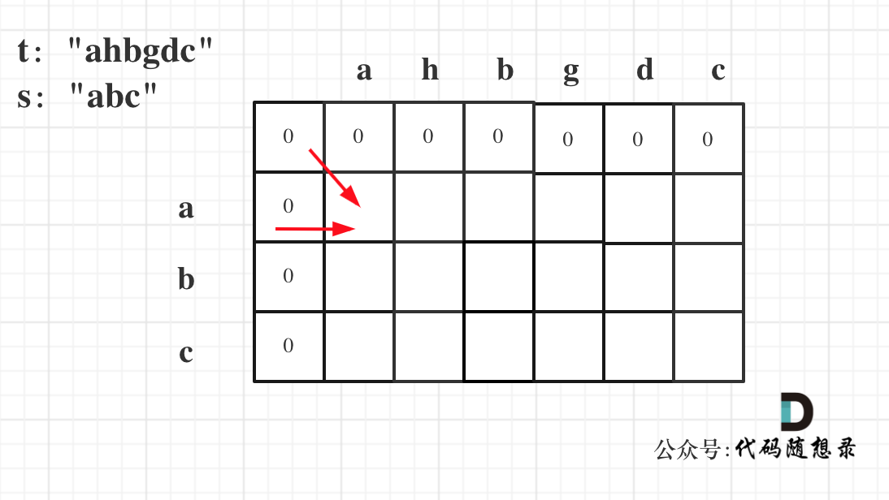
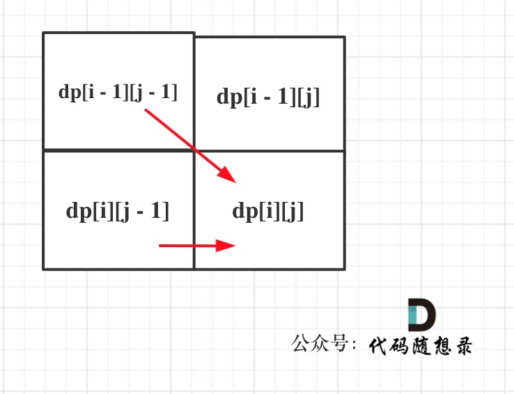

## Day58: 动态规划part15

### 392.判断子序列

[LeetCode](https://leetcode.cn/problems/is-subsequence/)  [文章讲解](https://programmercarl.com/0392.%E5%88%A4%E6%96%AD%E5%AD%90%E5%BA%8F%E5%88%97.html)  [视频讲解](https://www.bilibili.com/video/BV1tv4y1B7ym/)

#### 题目描述：

给定字符串 **s** 和 **t** ，判断 **s** 是否为 **t** 的子序列。

字符串的一个子序列是原始字符串删除一些（也可以不删除）字符而不改变剩余字符相对位置形成的新字符串。（例如，`"ace"`是`"abcde"`的一个子序列，而`"aec"`不是）。

**进阶：**

如果有大量输入的 S，称作 S1, S2, ... , Sk 其中 k >= 10亿，你需要依次检查它们是否为 T 的子序列。在这种情况下，你会怎样改变代码？

**示例 1：**

> 输入：s = "abc", t = "ahbgdc"
> 输出：true

**示例 2：**

> 输入：s = "axc", t = "ahbgdc"
> 输出：false

#### 我的解法（双指针法）：

```C++
// 双指针法
class Solution
{
 public:
	bool isSubsequence(const string& s, const string& t)
	{
		int j = 0;
		for (int i = 0; i < t.size() && j < s.size(); i++)
		{
			if (t[i] == s[j]) j++;
		}

		if (j == s.size()) return true;
		return false;
	}
};
```

#### 动态规划：

**掌握本题的动态规划解法是对后面要讲解的编辑距离的题目打下基础**。

动态规划五部曲分析如下：

1. **确定dp数组（dp table）以及下标的含义**

**`dp[i][j]` 表示以下标`i-1`为结尾的字符串s，和以下标`j-1`为结尾的字符串t（便于初始化），相同子序列的长度为`dp[i][j]`**。

注意这里是判断s是否为t的子序列。即t的长度是大于等于s的。

2. **确定递推公式**

在确定递推公式的时候，首先要考虑如下两种操作，整理如下：

- `if (s[i - 1] == t[j - 1])`
  - t中找到了一个字符在s中也出现了，那么`dp[i][j] = dp[i - 1][j - 1] + 1`
- `if (s[i - 1] != t[j - 1])`
  - 相当于t要删除元素，继续匹配，t如果把当前元素`t[j - 1]`删除，那么`dp[i][j]` 的数值就是 看`s[i - 1]`与 `t[j - 2]`的比较结果了，即：`dp[i][j] = dp[i][j - 1]`;

`if (s[i - 1] != t[j - 1])`，此时相当于t要删除元素，t如果把当前元素`t[j - 1]`删除，那么`dp[i][j]` 的数值就是 看`s[i - 1]`与 `t[j - 2]`的比较结果了，即：`dp[i][j] = dp[i][j - 1]`;

其实这里和 [1143.最长公共子序列](https://programmercarl.com/1143.最长公共子序列.html)的递推公式基本那就是一样的，区别就是 本题 如果删元素一定是字符串t，而 [1143.最长公共子序列](https://programmercarl.com/1143.最长公共子序列.html)是两个字符串都可以删元素。

3. **dp数组如何初始化**

从递推公式可以看出`dp[i][j]`都是依赖于`dp[i - 1][j - 1]` 和 `dp[i][j - 1]`，所以`dp[0][0]`和`dp[i][0]`是一定要初始化的。

在定义`dp[i][j]`含义的时候为什么要**表示以下标`i-1`为结尾的字符串s，和以下标`j-1`为结尾的字符串t，相同子序列的长度为`dp[i][j]`**，因为这样的定义在dp二维矩阵中可以留出初始化的区间，如图：



如果要是定义的`dp[i][j]`是以下标`i`为结尾的字符串s和以下标`j`为结尾的字符串t，初始化就比较麻烦了。

`dp[i][0]` 表示以下标`i-1`为结尾的字符串，与空字符串的相同子序列长度，所以为`dp[0][j]`同理。

```cpp
vector<vector<int>> dp(s.size() + 1, vector<int>(t.size() + 1, 0));
```

4. **确定遍历顺序**

同理从递推公式可以看出`dp[i][j]`都是依赖于`dp[i - 1][j - 1]` 和 `dp[i][j - 1]`，那么遍历顺序也应该是从上到下，从左到右

如图所示：



5. **举例推导dp数组**

以示例一为例，输入：s = "abc", t = "ahbgdc"，dp状态转移图如下：


`dp[i][j]`表示以下标`i-1`为结尾的字符串s和以下标`j-1`为结尾的字符串t 相同子序列的长度，所以如果`dp[s.size()][t.size()]` 与 字符串s的长度相同说明：s与t的最长相同子序列就是s，那么s 就是 t 的子序列。

图中`dp[s.size()][t.size()] = 3`， 而`s.size()` 也为3。所以s是t 的子序列，返回true。

### 115.不同的子序列

[LeetCode](https://leetcode.cn/problems/distinct-subsequences/)  [文章讲解](https://programmercarl.com/0115.%E4%B8%8D%E5%90%8C%E7%9A%84%E5%AD%90%E5%BA%8F%E5%88%97.html)  [视频讲解](https://www.bilibili.com/video/BV1fG4y1m75Q/)

#### 题目描述：

给你两个字符串 `s` 和 `t` ，统计并返回在 `s` 的 **子序列** 中 `t` 出现的个数，结果需要对 109 + 7 取模。

**示例 1：**

> 输入：s = "rabbbit", t = "rabbit"
> 输出：3
> 解释：
> 如下所示, 有 3 种可以从 s 中得到 "rabbit" 的方案。
> **rabb**b**it**
> **ra**b**bbit**
> **rab**b**bit**

**示例 2：**

> 输入：s = "babgbag", t = "bag"
> 输出：5
> 解释：
> 如下所示, 有 5 种可以从 s 中得到 "bag" 的方案。 
> **ba**b**g**bag
> **ba**bgba**g**
> **b**abgb**ag**
> ba**b**gb**ag**
> babg**bag**

#### 参考解法：

这道题目如果不是子序列，而是要求连续序列的，那就可以考虑用KMP。

这道题目相对于72. 编辑距离，简单了不少，因为本题相当于只有删除操作，不用考虑替换增加之类的。

动规五部曲分析如下：

1. **确定dp数组（dp table）以及下标的含义**

`dp[i][j]`：以`i-1`为结尾的s子序列中出现以`j-1`为结尾的t的个数为`dp[i][j]`。定义为`i-1`，`j-1` 同样是为了方便初始化。

2. **确定递推公式**

1. 确定递推公式

这一类问题，基本是要分析两种情况

- `s[i - 1]` 与 `t[j - 1]`相等
- `s[i - 1]` 与 `t[j - 1]` 不相等

当`s[i - 1]` 与 `t[j - 1]`相等时，`dp[i][j]`可以有两部分组成。

一部分是用`s[i - 1]`来匹配，那么个数为`dp[i - 1][j - 1]`。即不需要考虑当前s子串和t子串的最后一位字母，所以只需要 `dp[i-1][j-1]`。

一部分是不用`s[i - 1]`来匹配，个数为`dp[i - 1][j]`。

**为什么还要考虑 不用`s[i - 1]`来匹配，都相同了指定要匹配啊**。

例如： s：bagg 和 t：bag ，`s[3]` 和 `t[2]`是相同的，但是字符串s也可以不用`s[3]`来匹配，即用`s[0]s[1]s[2]`组成的bag。

当然也可以用`s[3]`来匹配，即：`s[0]s[1]s[3]`组成的bag。

所以当`s[i - 1]` 与 `t[j - 1]`相等时，`dp[i][j] = dp[i - 1][j - 1] + dp[i - 1][j]`;

当`s[i - 1]` 与 `t[j - 1]`不相等时，`dp[i][j]`只有一部分组成，不用`s[i - 1]`来匹配（就是模拟在s中删除这个元素），即：`dp[i - 1][j]`

所以递推公式为：`dp[i][j] = dp[i - 1][j]`;

因为求的是 s 中有多少个 t，而不是 求t中有多少个s，所以只考虑 s中删除元素的情况，即 不用`s[i - 1]`来匹配 的情况。

3. **dp数组如何初始化**

从递推公式`dp[i][j] = dp[i - 1][j - 1] + dp[i - 1][j]`; 和 `dp[i][j] = dp[i - 1][j]`; 中可以看出`dp[i][j]` 是从上方和左上方推导而来，如图：，那么 `dp[i][0]` 和`dp[0][j]`是一定要初始化的。


每次当初始化的时候，都要回顾一下dp[i][j]的定义，不要凭感觉初始化。

`dp[i][0]`表示什么呢？

`dp[i][0]` 表示：以`i-1`为结尾的s可以随便删除元素，出现空字符串的个数。

那么`dp[i][0]`一定都是1，因为也就是把以`i-1`为结尾的s，删除所有元素，出现空字符串的个数就是1。

再来看`dp[0][j]`，`dp[0][j]`：空字符串s可以随便删除元素，出现以`j-1`为结尾的字符串t的个数。

那么`dp[0][j]`一定都是0，s如论如何也变成不了t。

最后就要看一个特殊位置了，即：`dp[0][0]` 应该是多少。

`dp[0][0]`应该是1，空字符串s，可以删除0个元素，变成空字符串t。

初始化分析完毕，代码如下：

```cpp
vector<vector<long long>> dp(s.size() + 1, vector<long long>(t.size() + 1));
for (int i = 0; i <= s.size(); i++) dp[i][0] = 1;
for (int j = 1; j <= t.size(); j++) dp[0][j] = 0; // 其实这行代码可以和dp数组初始化的时候放在一起，但我为了凸显初始化的逻辑，所以还是加上了。
```

4. **确定遍历顺序**

从递推公式`dp[i][j] = dp[i - 1][j - 1] + dp[i - 1][j]`; 和 `dp[i][j] = dp[i - 1][j]`; 中可以看出`dp[i][j]`都是根据左上方和正上方推出来的。


所以遍历的时候一定是从上到下，从左到右，这样保证`dp[i][j]`可以根据之前计算出来的数值进行计算。

代码如下：

```cpp
for (int i = 1; i <= s.size(); i++) {
    for (int j = 1; j <= t.size(); j++) {
        if (s[i - 1] == t[j - 1]) {
            dp[i][j] = dp[i - 1][j - 1] + dp[i - 1][j];
        } else {
            dp[i][j] = dp[i - 1][j];
        }
    }
}
```

5. **举例推导dp数组**

以s："baegg"，t："bag"为例，推导dp数组状态如下：


如果写出来的代码怎么改都通过不了，不妨把dp数组打印出来，看一看，是不是这样的。

动规五部曲分析完毕，代码如下：

```cpp
class Solution
{
 public:
	int numDistinct(const string& s, const string& t)
	{
		vector<vector<uint64_t>> dp(s.size() + 1, vector<uint64_t>(t.size() + 1, 0));
		// 初始化
		for (int i = 0; i < s.size(); i++)
			dp[i][0] = 1;

		for (int i = 1; i <= s.size(); i++)
		{
			for (int j = 1; j <= t.size(); j++)
			{
				if (s[i - 1] == t[j - 1])
					dp[i][j] = dp[i - 1][j] + dp[i - 1][j - 1];
				else
					dp[i][j] = dp[i - 1][j];
			}
		}
		return dp[s.size()][t.size()];
	}
};
```

#### 今日总结

第一题能自己写出来，第二题要注意dp数组的含义，推导过程。
