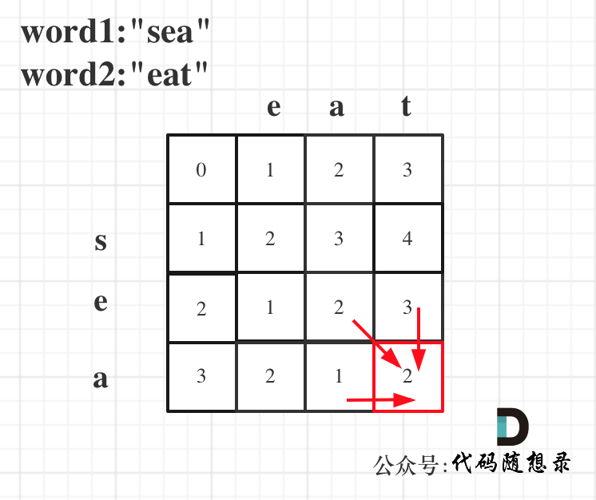
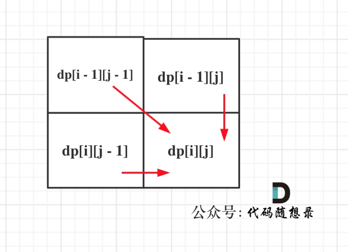
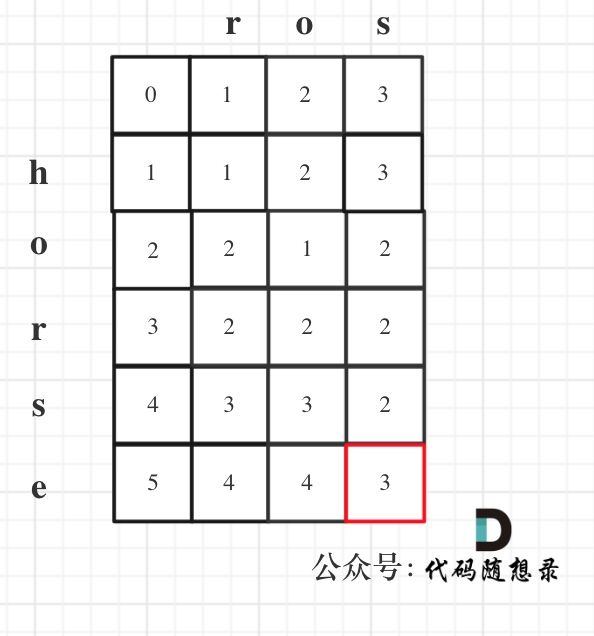

## Day59: 动态规划part16

### 583. 两个字符串的删除操作

[LeetCode](https://leetcode.cn/problems/delete-operation-for-two-strings/)  [文章讲解](https://programmercarl.com/0583.%E4%B8%A4%E4%B8%AA%E5%AD%97%E7%AC%A6%E4%B8%B2%E7%9A%84%E5%88%A0%E9%99%A4%E6%93%8D%E4%BD%9C.html)  [视频讲解](https://www.bilibili.com/video/BV1we4y157wB/)

#### 题目描述：

给定两个单词 `word1` 和 `word2` ，返回使得 `word1` 和 `word2` **相同**所需的**最小步数**。

**每步** 可以删除任意一个字符串中的一个字符。

**示例 1：**

> 输入: word1 = "sea", word2 = "eat"
> 输出: 2
> 解释: 第一步将 "sea" 变为 "ea" ，第二步将 "eat "变为 "ea"

**示例  2:**

> 输入：word1 = "leetcode", word2 = "etco"
> 输出：4

#### 我的解法：

即，两个字符串中相同字符的个数，两个字符串均可以删除字符

动态规划五部曲分析如下：

1. **确定dp数组（dp table）以及下标的含义**

**`dp[i][j]` 表示以下标`i-1`为结尾的字符串`word1`，和以下标`j-1`为结尾的字符串`word2`（便于初始化），相同子序列的长度为`dp[i][j]`**。

2. **确定递推公式**

在确定递推公式的时候，首先要考虑如下两种操作，整理如下：

- `if (word1[i - 1] == word2[j - 1])`
  - `word1`中找到了一个字符在`word2`中也出现了，那么`dp[i][j] = dp[i - 1][j - 1] + 1`
- `if (word1[i - 1] != word2[j - 1])`
  - 相当于`word1`或者`word2`要删除元素，继续匹配，`word1`如果把当前元素`word1[i - 1]`删除，那么`dp[i][j]` 的数值就是 看`word1[i - 2]`与 `word2[j - 1]`的比较结果了，即：`dp[i][j] = dp[i - 1][j]`; 同理，`word2`如果把当前元素`word1[j - 1]`删除，即：`dp[i][j] = dp[i][j - 1]`

3. **dp数组如何初始化**

从递推公式可以看出`dp[i][j]`都是依赖于`dp[i - 1][j - 1]` , `dp[i][j - 1]`和`dp[i - 1][j]`，所以`dp[j][0]`和`dp[i][0]`是一定要初始化的。而由dp定义可知，均初始化为0即可。

4. **确定遍历顺序**

同理从递推公式可以看出`dp[i][j]`都是依赖于`dp[i - 1][j - 1]` , `dp[i][j - 1]`和`dp[i - 1][j]`，那么遍历顺序也应该是从上到下，从左到右

5. **举例推导dp数组**

略

```C++
class Solution
{
 public:
	int minDistance(const string& word1, const string& word2)
	{
		vector<vector<int>> dp(word1.size() + 1, vector<int>(word2.size() + 1, 0));
		for (int i = 1; i <= word1.size(); i++)
		{
			for (int j = 1; j <= word2.size(); j++)
			{
				if (word1[i - 1] == word2[j - 1])
					dp[i][j] = dp[i - 1][j - 1] + 1;
				else
					dp[i][j] = max(dp[i - 1][j], dp[i][j - 1]);
			}
		}
		// 最终结果为
		// word1 长度减去公共子序列长度 + word2 长度减去公共子序列长度
		// 即为两个字符串需要删除的总字符数
		return (word1.size() - dp[word1.size()][word2.size()])
			+ (word2.size() - dp[word1.size()][word2.size()]);
	}
};
```

#### 参考解法：

动规五部曲，分析如下：

1. **确定dp数组（dp table）以及下标的含义**

`dp[i][j]`：以`i-1`为结尾的字符串`word1`，和以`j-1`位结尾的字符串`word2`，想要达到相等，所需要删除元素的最少次数。

2. **确定递推公式**

- 当`word1[i - 1]` 与 `word2[j - 1]`相同的时候
- 当`word1[i - 1]` 与 `word2[j - 1]`不相同的时候

当`word1[i - 1]` 与 `word2[j - 1]`相同的时候，`dp[i][j] = dp[i - 1][j - 1]`;

当`word1[i - 1]` 与 `word2[j - 1]`不相同的时候，有三种情况：

情况一：删`word1[i - 1]`，最少操作次数为`dp[i - 1][j] + 1`

情况二：删`word2[j - 1]`，最少操作次数为`dp[i][j - 1] + 1`

情况三：同时删`word1[i - 1]`和`word2[j - 1]`，操作的最少次数为`dp[i - 1][j - 1] + 2`

那最后取最小值，所以当`word1[i - 1]` 与 `word2[j - 1]`不相同的时候，递推公式：`dp[i][j] = min({dp[i - 1][j - 1] + 2, dp[i - 1][j] + 1, dp[i][j - 1] + 1})`;

因为 `dp[i][j - 1] + 1 = dp[i - 1][j - 1] + 2`，所以递推公式可简化为：`dp[i][j] = min(dp[i - 1][j] + 1, dp[i][j - 1] + 1)`;

3. **dp数组如何初始化**

从递推公式中，可以看出来，`dp[i][0]` 和 `dp[0][j]`是一定要初始化的。

`dp[i][0]`：word2为空字符串，以`i-1`为结尾的字符串word1要删除多少个元素，才能和word2相同呢，很明显`dp[i][0] = i`。

`dp[0][j]`的话同理，所以代码如下：

```cpp
vector<vector<int>> dp(word1.size() + 1, vector<int>(word2.size() + 1));
for (int i = 0; i <= word1.size(); i++) dp[i][0] = i;
for (int j = 0; j <= word2.size(); j++) dp[0][j] = j;
```

4. **确定遍历顺序**

从递推公式 `dp[i][j] = min(dp[i - 1][j - 1] + 2, min(dp[i - 1][j], dp[i][j - 1]) + 1)`; 和`dp[i][j] = dp[i - 1][j - 1]`可以看出`dp[i][j]`都是根据左上方、正上方、正左方推出来的。

所以遍历的时候一定是从上到下，从左到右，这样保证`dp[i][j]`可以根据之前计算出来的数值进行计算。

5. **举例推导dp数组**

以word1:"sea"，word2:"eat"为例，推导dp数组状态图如下：



以上分析完毕，代码如下：

```cpp
class Solution2
{
 public:
	int minDistance(string word1, string word2)
	{
		vector<vector<int>> dp(word1.size() + 1, vector<int>(word2.size() + 1));
		for (int i = 0; i <= word1.size(); i++) dp[i][0] = i;
		for (int j = 0; j <= word2.size(); j++) dp[0][j] = j;
		for (int i = 1; i <= word1.size(); i++)
		{
			for (int j = 1; j <= word2.size(); j++)
			{
				if (word1[i - 1] == word2[j - 1])
					dp[i][j] = dp[i - 1][j - 1];
				else
					dp[i][j] = min(dp[i - 1][j] + 1, dp[i][j - 1] + 1);
			}
		}
		return dp[word1.size()][word2.size()];
	}
};
```

### 72. 编辑距离

[LeetCode](https://leetcode.cn/problems/edit-distance/)  [文章讲解](https://programmercarl.com/0072.%E7%BC%96%E8%BE%91%E8%B7%9D%E7%A6%BB.html)  [视频讲解](https://www.bilibili.com/video/BV1qv4y1q78f/)

#### 题目描述：

给你两个单词 `word1` 和 `word2`， *请返回将 `word1` 转换成 `word2` 所使用的最少操作数* 。

你可以对一个单词进行如下三种操作：

- 插入一个字符
- 删除一个字符
- 替换一个字符

**示例 1：**

> 输入：word1 = "horse", word2 = "ros"
> 输出：3
> 解释：
> horse -> rorse (将 'h' 替换为 'r')
> rorse -> rose (删除 'r')
> rose -> ros (删除 'e')

**示例 2：**

> 输入：word1 = "intention", word2 = "execution"
> 输出：5
> 解释：
> intention -> inention (删除 't')
> inention -> enention (将 'i' 替换为 'e')
> enention -> exention (将 'n' 替换为 'x')
> exention -> exection (将 'n' 替换为 'c')
> exection -> execution (插入 'u')

#### 我的解法：

动态规划五部曲分析如下：

1. **确定dp数组（dp table）以及下标的含义**

**`dp[i][j]` 表示以下标`i-1`为结尾的字符串`word1`，和以下标`j-1`为结尾的字符串`word2`（便于初始化），转换成相同的字符串需要最少的操作数（编辑距离）为`dp[i][j]`**。

2. **确定递推公式**

在确定递推公式的时候，首先要考虑如下两种操作，整理如下：

- `if (word1[i - 1] == word2[j - 1])`
  - 说明不用任何编辑，那么`dp[i][j] = dp[i - 1][j - 1]`
  
- `if (word1[i - 1] != word2[j - 1])`
  
  - **操作一**：`word1`删除一个元素，那么就是以下标`i - 2`为结尾的`word1` 与 `j-1`为结尾的`word2`的最近编辑距离 再加上一个操作。即 `dp[i][j] = dp[i - 1][j] + 1;`
  - **操作二**：`word2`删除一个元素，那么就是以下标`i - 1`为结尾的`word1` 与 `j-2`为结尾的`word2`的最近编辑距离 再加上一个操作。即 `dp[i][j] = dp[i][j - 1] + 1;`
  - 增加操作？**`word2`添加一个元素，相当于`word1`删除一个元素**，例如 `word1 = "ad" ，word2 = "a"`，`word1`删除元素`'d'` 和 `word2`添加一个元素`'d'`，变成`word1="a", word2="ad"`， 最终的操作数是一样！
  - **操作三**：替换元素，`word1`替换`word1[i - 1]`，使其与`word2[j - 1]`相同，此时不用增删加元素。`if (word1[i - 1] == word2[j - 1])`的时候操作 是 `dp[i][j] = dp[i - 1][j - 1]`, 那么只需要一次替换的操作，就可以让 `word1[i - 1]` 和 `word2[j - 1]` 相同。
  - **递推公式**：`dp[i][j] = min(dp[i - 1][j - 1], min(dp[i - 1][j], dp[i][j - 1]) + 1`;

3. **dp数组如何初始化**

`dp[i][0]` ：以下标`i-1`为结尾的字符串`word1`，和空字符串`word2`，最近编辑距离为`dp[i][0]`。

那么`dp[i][0]`就应该是`i`，对`word1`里的元素全部做删除操作，即：`dp[i][0] = i`;

同理`dp[0][j] = j`;

4. **确定遍历顺序**

可以看出`dp[i][j]`是依赖左方，上方和左上方元素的，如图：



所以在dp矩阵中一定是从左到右从上到下去遍历。

5. **举例推导dp数组**

以示例1为例，输入：`word1 = "horse", word2 = "ros"`为例，dp矩阵状态图如下：



```C++
class Solution
{
 public:
	int minDistance(const string& word1, const string& word2)
	{
		vector<vector<int>> dp(word1.size() + 1, vector<int>(word2.size() + 1));

		// 初始化
		for (int i = 0; i <= word1.size(); i++)
			dp[i][0] = i;
		for (int j = 0; j <= word2.size(); j++)
			dp[0][j] = j;

		for (int i = 1; i <= word1.size(); i++)
		{
			for (int j = 1; j <= word2.size(); j++)
			{
				if (word1[i - 1] == word2[j - 1])
					dp[i][j] = dp[i - 1][j - 1];
				else
					dp[i][j] = min(dp[i - 1][j - 1] + 1, min(dp[i - 1][j] + 1, dp[i][j - 1] + 1));
			}
		}
		return dp[word1.size()][word2.size()];
	}
};
```

### 今日总结

经过昨天的题目练习，今天的两道题直接秒了，爽！
