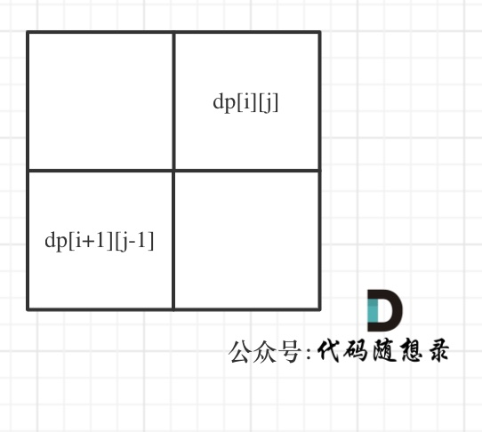
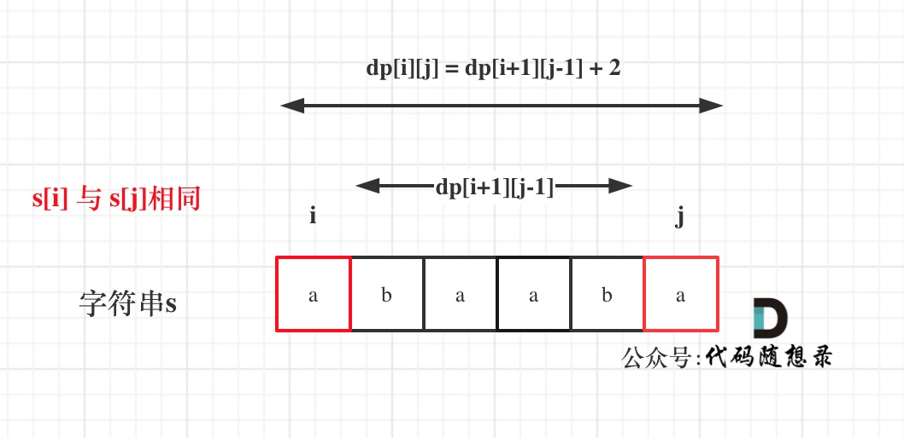
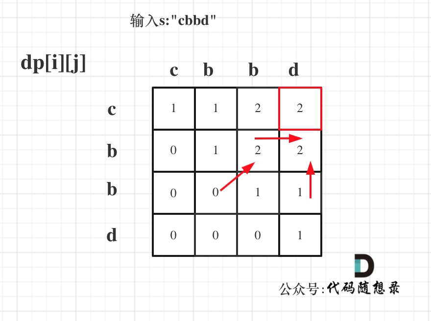
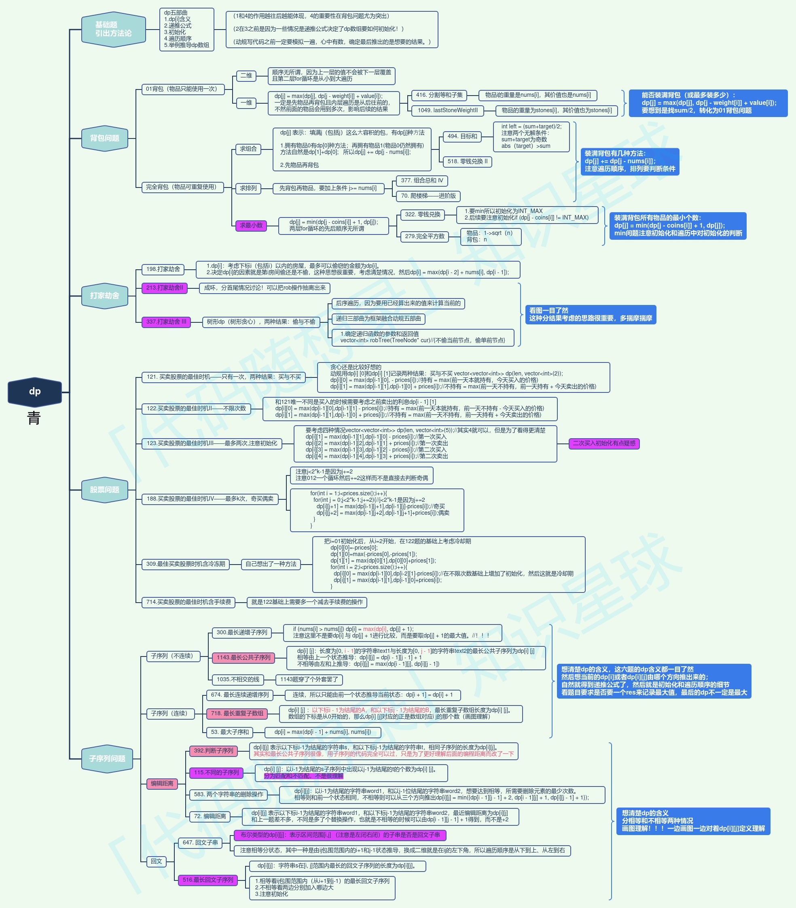

## Day60: 动态规划part17

### 647. 回文子串

[LeetCode](https://leetcode.cn/problems/palindromic-substrings/)  [文章讲解]()  [视频讲解]()

#### 题目描述：

给你一个字符串 `s` ，请你统计并返回这个字符串中 **回文子串** 的数目。

**回文字符串** 是正着读和倒过来读一样的字符串。

**子字符串** 是字符串中的由连续字符组成的一个序列。

具有不同开始位置或结束位置的子串，即使是由相同的字符组成，也会被视作不同的子串。

**示例 1：**

> 输入：s = "abc"
> 输出：3
> 解释：三个回文子串: "a", "b", "c"

**示例 2：**

> 输入：s = "aaa"
> 输出：6
> 解释：6个回文子串: "a", "a", "a", "aa", "aa", "aaa"

#### 动态规划解法：

动规五部曲：

1. **确定dp数组（dp table）以及下标的含义**

在定义dp数组的时候 很自然就会想题目求什么，就如何定义dp数组。绝大多数题目确实是这样，不过本题如果定义，`dp[i]` 为 下标`i`结尾的字符串有 `dp[i]`个回文串的话，会发现很难找到递归关系。

`dp[i]` 和 `dp[i-1]` ，`dp[i + 1]` 看上去都没啥关系。

所以要看回文串的性质。 如图：


在判断字符串`S`是否是回文，那么如果知道 `s[1]`，`s[2]`，`s[3]` 这个子串是回文的，那么只需要比较 `s[0]`和`s[4]`这两个元素是否相同，如果相同的话，这个字符串`s` 就是回文串。

那么此时是不是能找到一种递归关系，也就是判断一个子字符串（字符串的下标范围`[i,j]`）是否回文，依赖于，子字符串（下表范围`[i + 1, j - 1]`） 是否是回文。

所以为了明确这种递归关系，dp数组是要定义成一个二维dp数组。

布尔类型的`dp[i][j]`：表示区间范围`[i,j]` （注意是左闭右闭）的子串是否是回文子串，如果是`dp[i][j]`为true，否则为false。

2. **确定递推公式**

在确定递推公式时，就要分析如下几种情况。

整体上是两种，就是`s[i]`与`s[j]`相等，`s[i]`与`s[j]`不相等这两种。

当`s[i]`与`s[j]`不相等，那没啥好说的了，`dp[i][j]`一定是false。

当`s[i]`与`s[j]`相等时，这就复杂一些了，有如下三种情况

- 情况一：下标`i` 与 `j`相同，同一个字符例如`a`，当然是回文子串
- 情况二：下标`i` 与 `j`相差为1，例如`aa`，也是回文子串
- 情况三：下标：`i` 与 `j`相差大于1的时候，例如`cabac`，此时`s[i]`与`s[j]`已经相同了，看`i`到`j`区间是不是回文子串就看`aba`是不是回文就可以了，那么`aba`的区间就是 `i+1` 与 `j-1`区间，这个区间是不是回文就看`dp[i + 1][j - 1]`是否为true。

以上三种情况分析完了，那么递归公式如下：

```cpp
if (s[i] == s[j]) 
{
    if (j - i <= 1) 
    { // 情况一 和 情况二
        result++;
        dp[i][j] = true;
    } 
    else if (dp[i + 1][j - 1]) 
    { // 情况三
        result++;
        dp[i][j] = true;
    }
}
```

result就是统计回文子串的数量。

注意这里没有列出当`s[i]`与`s[j]`不相等的时候，因为在下面`dp[i][j]`初始化的时候，就初始为false。

3. **dp数组如何初始化**

所有`dp[i][j]`初始化为false

4. **确定遍历顺序**

首先从递推公式中可以看出，情况三是根据`dp[i + 1][j - 1]`是否为true，再对`dp[i][j]`进行赋值true的。

`dp[i + 1][j - 1]` 在 `dp[i][j]`的左下角，如图：



如果这矩阵是从上到下，从左到右遍历，那么会用到没有计算过的`dp[i + 1][j - 1]`，也就是根据不确定是不是回文的区间`[i+1,j-1]`，来判断了`[i,j]`是不是回文，那结果一定是不对的。

**所以一定要从下到上，从左到右遍历，这样保证`dp[i + 1][j - 1]`都是经过计算的**。

有的代码实现是优先遍历列，然后遍历行，其实也是一个道理，都是为了保证`dp[i + 1][j - 1]`都是经过计算的。

代码如下：

```cpp
for (int i = s.size() - 1; i >= 0; i--) 
{  // 注意遍历顺序
    for (int j = i; j < s.size(); j++) 
    {
        if (s[i] == s[j]) 
        {
            if (j - i <= 1) 
            { // 情况一 和 情况二
                result++;
                dp[i][j] = true;
            } 
            else if (dp[i + 1][j - 1]) 
            { // 情况三
                result++;
                dp[i][j] = true;
            }
        }
    }
}
```

5. **举例推导dp数组**

举例，输入："aaa"，`dp[i][j]`状态如下：


图中有6个true，所以就是有6个回文子串。

**注意因为`dp[i][j]`的定义，所以`j`一定是大于等于i的，那么在填充`dp[i][j]`的时候一定是只填充右上半部分**。

```cpp
class Solution
{
 public:
	int countSubstrings(const string& str)
	{
		vector<vector<bool>> dp(str.size(), vector<bool>(str.size(), false));
		int result = 0;
		for (int i = str.size() - 1; i >= 0; i--)
		{
			for (int j = i; j < str.size(); j++)
			{
				if (str[i] == str[j])
				{
					if (j - i <= 1)
					{
						dp[i][j] = true;
						result++;
					}
					else if (dp[i + 1][j - 1])
					{
						dp[i][j] = true;
						result++;
					}
				}
			}
		}
		return result;
	}
};
```

#### 双指针法：

由于dp数组，动态规划的空间复杂度是偏高的。

对于一下双指针法，首先确定回文串，就是找中心然后向两边扩散看是不是对称的就可以了。

**在遍历中心点的时候，要注意中心点有两种情况**。

一个元素可以作为中心点，两个元素也可以作为中心点。

**这两种情况可以放在一起计算，但分别计算思路更清晰，可以分别计算**，代码如下：

```C++
class Solution2
{
 public:
	int countSubstrings(const string& s)
	{
		int result = 0;
		for (int i = 0; i < s.size(); i++)
		{
			result += extend(s, i, i, s.size()); // 以i为中心
			result += extend(s, i, i + 1, s.size()); // 以i和i+1为中心
		}
		return result;
	}

	int extend(const string& s, int i, int j, int n)
	{
		int res = 0;
		while (i >= 0 && j < n && s[i] == s[j])
		{
			i--;
			j++;
			res++;
		}
		return res;
	}
};
```

### 516. 最长回文子序列

[LeetCode](https://leetcode.cn/problems/longest-palindromic-subsequence/)  [文章讲解](https://programmercarl.com/0516.%E6%9C%80%E9%95%BF%E5%9B%9E%E6%96%87%E5%AD%90%E5%BA%8F%E5%88%97.html)  [视频讲解](https://www.bilibili.com/video/BV1d8411K7W6/)

#### 题目描述：

给你一个字符串 `s` ，找出其中最长的回文子序列，并返回该序列的长度。

子序列定义为：不改变剩余字符顺序的情况下，删除某些字符或者不删除任何字符形成的一个序列。

**示例 1：**

> 输入：s = "bbbab"
> 输出：4
> 解释：一个可能的最长回文子序列为 "bbbb" 。

**示例 2：**

> 输入：s = "cbbd"
> 输出：2
> 解释：一个可能的最长回文子序列为 "bb" 。

#### 动规解法：

**回文子串是要连续的，回文子序列可不是连续的！** 回文子串，回文子序列都是动态规划经典题目。

动规五部曲分析如下：

1. **确定dp数组（dp table）以及下标的含义**

**`dp[i][j]`：字符串`s`在`[i, j]`范围内最长的回文子序列的长度为`dp[i][j]`**。

2. **确定递推公式**

在判断回文子串的题目中，关键逻辑就是看`s[i]`与`s[j]`是否相同。

整体上是两种，就是`s[i]`与`s[j]`相等，`s[i]`与`s[j]`不相等这两种。

当`s[i]`与`s[j]`相等时，这就复杂一些了，有如下三种情况

- 情况一：下标`i` 与 `j`相同，同一个字符例如`a`，此时`dp[i][j] = 1`
- 情况二：下标`i` 与 `j`相差为1，例如`aa`，此时`dp[i][j] = 2`
- 情况三：下标：`i` 与 `j`相差大于1的时候，那么`dp[i][j] = dp[i + 1][j - 1] + 2`; 如图： 

如果`s[i]`与`s[j]`不相同，说明`s[i]`和`s[j]`的同时加入 并不能增加`[i,j]`区间回文子序列的长度，那么分别加入`s[i]`、`s[j]`看看哪一个可以组成最长的回文子序列。

加入`s[j]`的回文子序列长度为`dp[i + 1][j]`。

加入`s[i]`的回文子序列长度为`dp[i][j - 1]`。

那么`dp[i][j]`一定是取最大的，即：`dp[i][j] = max(dp[i + 1][j], dp[i][j - 1])`;


3. **dp数组如何初始化**

由于在递归公式中已经考虑了所有情况，因此dp数组全部初始化为0即可。

4. **确定遍历顺序**

从递归公式中，可以看出，`dp[i][j]` 依赖于 `dp[i + 1][j - 1]` ，`dp[i + 1][j]` 和 `dp[i][j - 1]`，如图：


**所以遍历`i`的时候一定要从下到上遍历，这样才能保证下一行的数据是经过计算的**。

`j`的话，可以正常从左向右遍历。

5. **举例推导dp数组**

输入s:"cbbd" 为例，dp数组状态如图：



红色框即：`dp[0][s.size() - 1]`; 为最终结果。

```C++
class Solution
{
 public:
	int longestPalindromeSubseq(const string& s)
	{
		vector<vector<int>> dp(s.size(), vector<int>(s.size(), 0));
		for (int i = s.size() - 1; i >= 0; i--)
		{
			for (int j = i; j < s.size(); j++)
			{
				if (s[i] == s[j])
				{
					if (i == j)
						dp[i][j] = 1;
					else if (j == i + 1)
						dp[i][j] = 2;
					else
						dp[i][j] = dp[i + 1][j - 1] + 2;
				}
				else
				{
					dp[i][j] = max(dp[i][j - 1], dp[i + 1][j]);
				}
			}
		}
		return dp[0][s.size() - 1];
	}
};
```

### 动态规划总结


动规五部曲分别为：

1. 确定dp数组（dp table）以及下标的含义

2. 确定递推公式

3. dp数组如何初始化

4. 确定遍历顺序

5. 举例推导dp数组

关于动规，还有 树形DP（打家劫舍系列里有一道），数位DP，区间DP ，概率型DP，博弈型DP，状态压缩dp等等等，面试中出现的概率非常低。



### 今日总结

动态规划完结！核心要点，dp数组的含义以及递推公式！
