## Day62: 单调栈part01

### 单调栈理论基础

单调栈本质上还是一个栈，但是保持其中的元素是递增或者递减的。

1. 什么时候用单调栈呢？

**通常是一维数组，要寻找任一个元素的右边或者左边第一个比自己大或者小的元素的位置，此时就要想到可以用单调栈了**。时间复杂度为O(n)。

2. 那么单调栈的原理是什么呢？为什么时间复杂度是O(n)就可以找到每一个元素的右边第一个比它大的元素位置呢？

**单调栈的本质是空间换时间**，因为在遍历的过程中需要用一个栈来记录右边第一个比当前元素高的元素，优点是整个数组只需要遍历一次。

**更直白来说，就是用一个栈来记录我们遍历过的元素**，因为遍历数组的时候，不知道之前都遍历了哪些元素，以至于遍历一个元素找不到是不是之前遍历过一个更小的，所以需要用一个容器（这里用单调栈）来记录遍历过的元素。

3. 在使用单调栈的时候首先要明确如下几点：

- 单调栈里存放的元素是什么？

- 单调栈里元素是递增呢？ 还是递减呢？**顺序的描述为 从栈头到栈底的顺序**

### 739. 每日温度

[LeetCode](https://leetcode.cn/problems/daily-temperatures/)  [文章讲解](https://programmercarl.com/0739.%E6%AF%8F%E6%97%A5%E6%B8%A9%E5%BA%A6.html)  [视频讲解](https://www.bilibili.com/video/BV1my4y1Z7jj/)

#### 题目描述：

给定一个整数数组 `temperatures` ，表示每天的温度，返回一个数组 `answer` ，其中 `answer[i]` 是指对于第 `i` 天，下一个更高温度出现在几天后。如果气温在这之后都不会升高，请在该位置用 `0` 来代替。

**示例 1:**

> 输入: temperatures = [73,74,75,71,69,72,76,73]
> 输出: [1,1,4,2,1,1,0,0]

**示例 2:**

> 输入: temperatures = [30,40,50,60]
> 输出: [1,1,1,0]

**示例 3:**

> 输入: temperatures = [30,60,90]
> 输出: [1,1,0]

#### 我的解法：

暴力解法，两层for循环遍历，理所当然超时。

```cpp
class Solution
{
 public:
    vector<int> dailyTemperatures(vector<int>& temperatures)
    {
       vector<int> result(temperatures.size(), 0);
       for (int i = 0; i < temperatures.size(); i++)
       {
          for (int j = i + 1; j < temperatures.size(); j++)
          {
             if (temperatures[j] > temperatures[i])
             {
                result[i] = j - i;
                break;
             }
          }
       }
       return result;
    }
};
```

#### 参考解法：

本题其实就是找找到一个元素右边第一个比自己大的元素，此时就应该想到用单调栈了。

本题单调栈里只需要存放元素的下标`i`就可以了，如果需要使用对应的元素，直接`T[i]`就可以获取。

同时要使用递增循序（再强调一下是指从栈头到栈底的顺序），因为只有递增的时候，栈里要加入一个元素i的时候，才知道栈顶元素在数组中右面第一个比栈顶元素大的元素是`i`。

即：如果求一个元素右边第一个更大元素，单调栈就是递增的，如果求一个元素右边第一个更小元素，单调栈就是递减的。

使用单调栈主要有三个判断条件。

- 当前遍历的元素`T[i]`小于栈顶元素`T[st.top()]`的情况
- 当前遍历的元素`T[i]`等于栈顶元素`T[st.top()]`的情况
- 当前遍历的元素`T[i]`大于栈顶元素`T[st.top()]`的情况

**把这三种情况分析清楚了，也就理解透彻了**。

------

接下来用temperatures = [73, 74, 75, 71, 71, 72, 76, 73]为例来逐步分析，输出应该是 [1, 1, 4, 2, 1, 1, 0, 0]。

首先先将第一个遍历元素加入单调栈

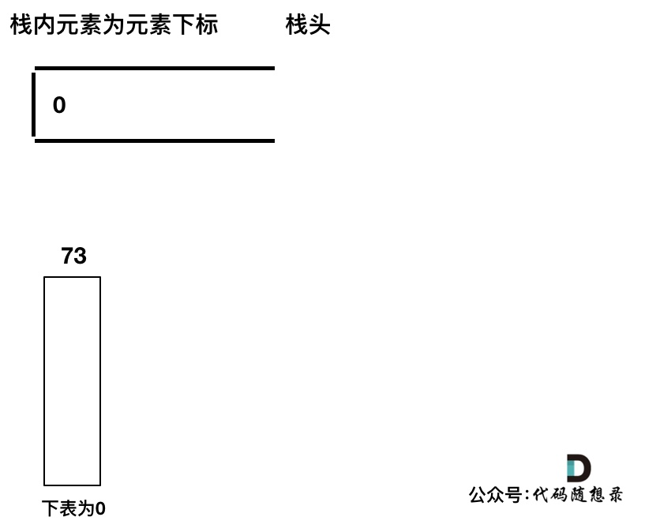

------

加入`T[1] = 74`，因为`T[1] > T[0]`（当前遍历的元素`T[i]`大于栈顶元素`T[st.top()]`的情况）。

要保持一个递增单调栈（从栈头到栈底），所以将`T[0]`弹出，`T[1]`加入，此时`result`数组可以记录了，`result[0] = 1`，即`T[0]`右面第一个比`T[0]`大的元素是`T[1]`。

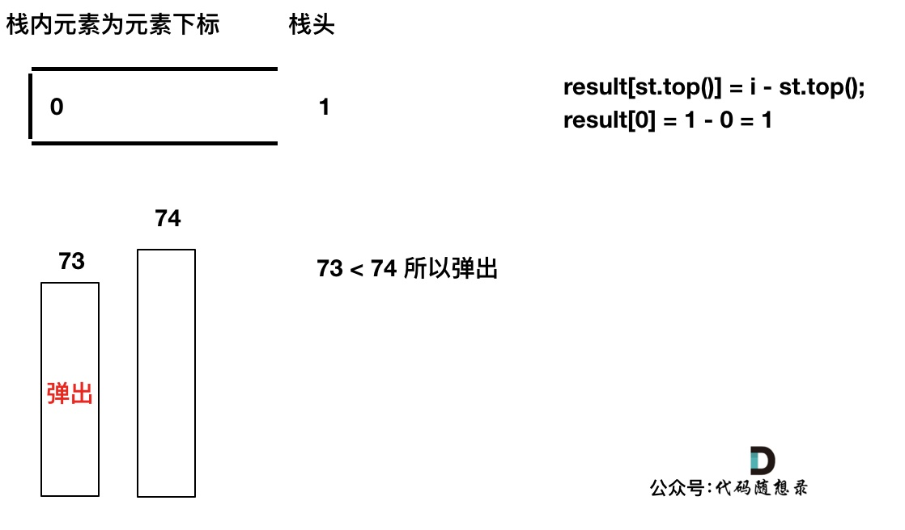

------

加入`T[2]`，同理，`T[1]`弹出

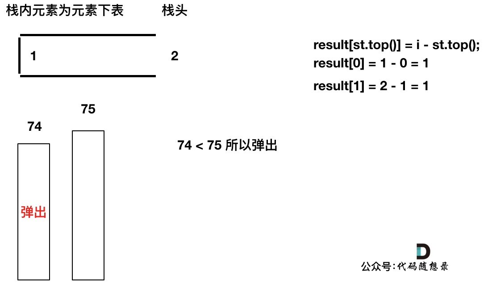

------

加入`T[3]`，`T[3] < T[2]` （当前遍历的元素`T[i]`小于栈顶元素`T[st.top()]`的情况），加`T[3]`加入单调栈。

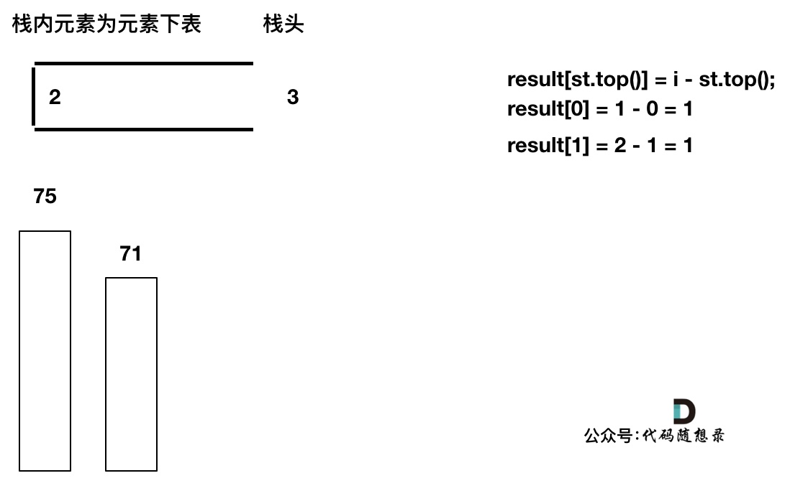

------

加入`T[4]`，`T[4] == T[3]` （当前遍历的元素`T[i]`等于栈顶元素`T[st.top()]`的情况），此时依然要加入栈，不用计算距离，因为要求的是右面第一个大于本元素的位置，而不是大于等于！

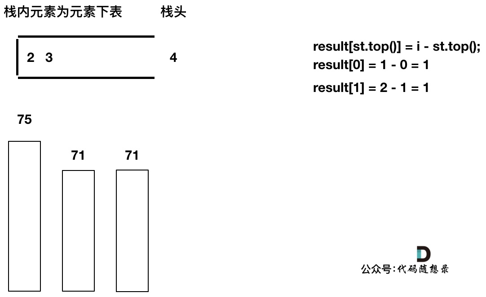

------

加入`T[5]`，`T[5]` > `T[4]` （当前遍历的元素`T[i]`大于栈顶元素`T[st.top()]`的情况），将`T[4]`弹出，同时计算距离，更新`result` 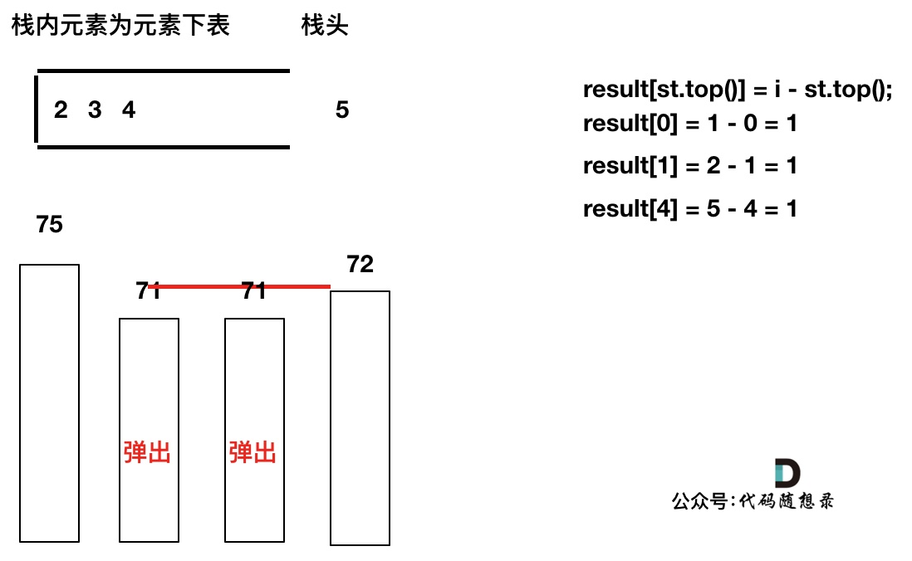

------

`T[4]`弹出之后， `T[5]` > `T[3]` （当前遍历的元素`T[i]`大于栈顶元素`T[st.top()]`的情况），将`T[3]`继续弹出，同时计算距离，更新`result` 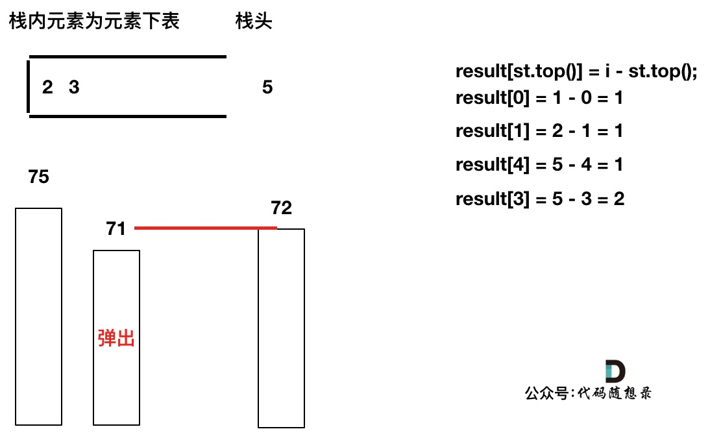

------

直到发现`T[5]`小于`T[st.top()]`，终止弹出，将`T[5]`加入单调栈

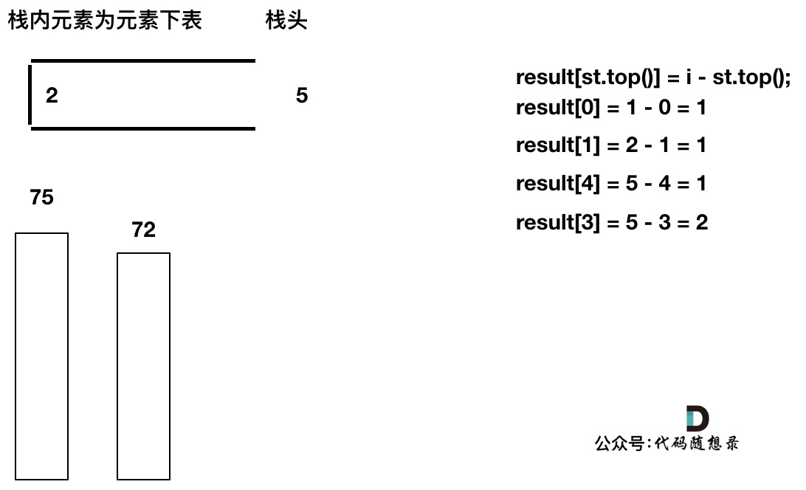

------

加入`T[6]`，同理，需要将栈里的`T[5]`，`T[2]`弹出

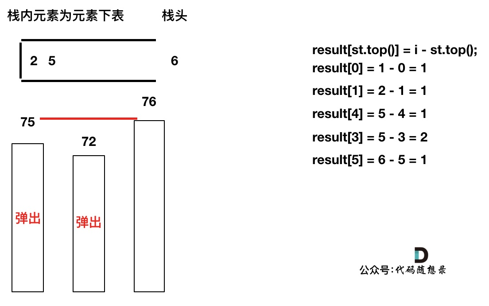

------

同理，继续弹出

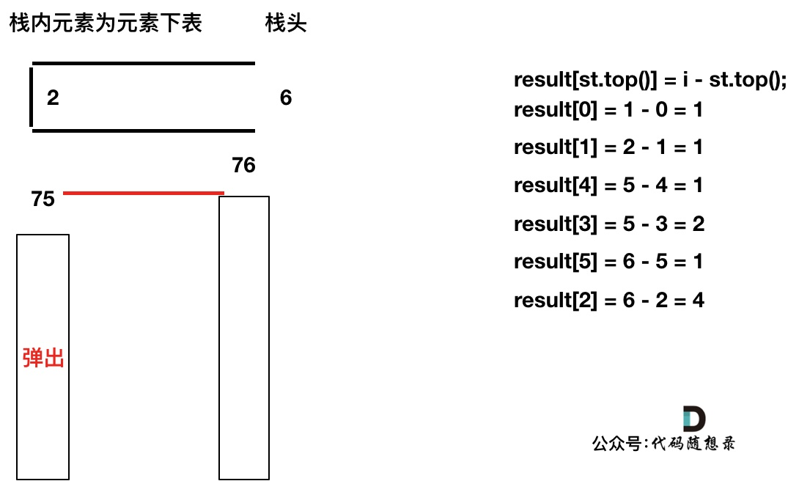

------

此时栈里只剩下了`T[6]`

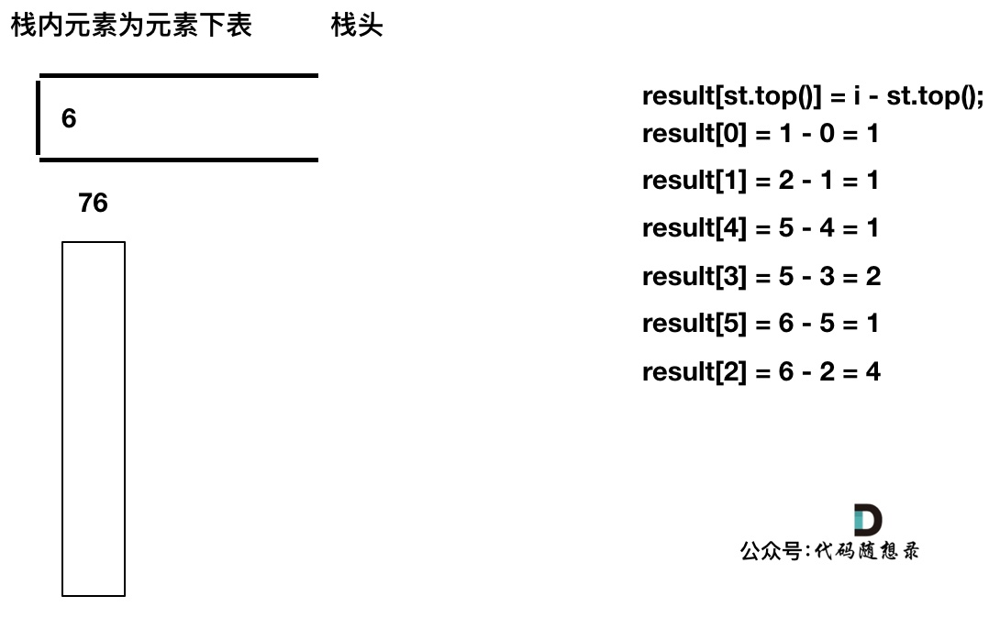

------

加入`T[7]`， `T[7]` < `T[6]` 直接入栈，这就是最后的情况，`result`数组也更新完了。


通过以上过程，就会发现：只有单调栈递增（从栈口到栈底顺序），就是求右边第一个比自己大的，单调栈递减的话，就是求右边第一个比自己小的。

```cpp
class Solution
{
 public:
	vector<int> dailyTemperatures(vector<int>& temperatures)
	{
		vector<int> result(temperatures.size(), 0);
		stack<int> st;
		st.push(0);
		for (int i = 1; i < temperatures.size(); i++)
		{
			// 情况三
			while (!st.empty() && temperatures[i] > temperatures[st.top()])
			{
				result[st.top()] = i - st.top();
				st.pop();
			}

			// 情况一、二
			// 同时，情况三也需要push
			st.push(i);
		}

		return result;
	}
};
```

### 496. 下一个更大元素 I

[LeetCode](https://leetcode.cn/problems/next-greater-element-i/)  [文章讲解](https://programmercarl.com/0496.%E4%B8%8B%E4%B8%80%E4%B8%AA%E6%9B%B4%E5%A4%A7%E5%85%83%E7%B4%A0I.html)  [视频讲解](https://www.bilibili.com/video/BV1jA411m7dX/)

#### 题目描述：

`nums1` 中数字 `x` 的 **下一个更大元素** 是指 `x` 在 `nums2` 中对应位置 **右侧** 的 **第一个** 比 `x` 大的元素。

给你两个 **没有重复元素** 的数组 `nums1` 和 `nums2` ，下标从 **0** 开始计数，其中`nums1` 是 `nums2` 的子集。

对于每个 `0 <= i < nums1.length` ，找出满足 `nums1[i] == nums2[j]` 的下标 `j` ，并且在 `nums2` 确定 `nums2[j]` 的 **下一个更大元素** 。如果不存在下一个更大元素，那么本次查询的答案是 `-1` 。

返回一个长度为 `nums1.length` 的数组 `ans` 作为答案，满足 `ans[i]` 是如上所述的 **下一个更大元素** 。

**示例 1：**

> 输入：nums1 = [4,1,2], nums2 = [1,3,4,2].
> 输出：[-1,3,-1]
> 解释：nums1 中每个值的下一个更大元素如下所述：
>
> - 4 ，用加粗斜体标识，nums2 = [1,3,**4**,2]。不存在下一个更大元素，所以答案是 -1 。
> - 1 ，用加粗斜体标识，nums2 = [**1**,3,4,2]。下一个更大元素是 3 。
> - 2 ，用加粗斜体标识，nums2 = [1,3,4,**2**]。不存在下一个更大元素，所以答案是 -1 。

**示例 2：**

> 输入：nums1 = [2,4], nums2 = [1,2,3,4].
> 输出：[3,-1]
> 解释：nums1 中每个值的下一个更大元素如下所述：
>
> - 2 ，用加粗斜体标识，nums2 = [1,**2**,3,4]。下一个更大元素是 3 。
> - 4 ，用加粗斜体标识，nums2 = [1,2,3,**4**]。不存在下一个更大元素，所以答案是 -1 。

#### 我的解法：

思路跟 [739. 每日温度](https://programmercarl.com/0739.%E6%AF%8F%E6%97%A5%E6%B8%A9%E5%BA%A6.html)差不多，区别在于多了一个for循环，寻找每次`result[j]`的位置。

```C++
class Solution
{
 public:
	vector<int> nextGreaterElement(vector<int>& nums1, vector<int>& nums2)
	{
		vector<int> result(nums1.size(), -1);
		stack<int> st;
		st.push(0);
		for (int i = 1; i < nums2.size(); i++)
		{
			while (!st.empty() && nums2[i] > nums2[st.top()])
			{
                // 额外需要一个for循环
				for (int j = 0; j < nums1.size(); j++)
				{
					if (nums1[j] == nums2[st.top()])
					{
						result[j] = nums2[i];
						break;
					}
				}
				st.pop();
			}
			st.push(i);
		}
		return result;
	}
};
```

#### 参考解法：

从题目示例中可以看出最后是要求`nums1`的每个元素在`nums2`中下一个比当前元素大的元素，那么就要定义一个和`nums1`一样大小的数组`result`来存放结果。

**这么定义这个result数组初始化应该为多少呢？**

题目说如果不存在对应位置就输出 -1 ，所以result数组如果某位置没有被赋值，那么就应该是是-1，所以就初始化为-1。

在遍历`nums2`的过程中，要判断`nums2[i]`是否在`nums1`中出现过，因为最后是要根据`nums1`元素的下标来更新`result`数组。

**注意题目中说是两个没有重复元素 的数组 nums1 和 nums2**。

没有重复元素，就可以用`map`来做映射了。根据数值快速找到下标，还可以判断`nums2[i]`是否在`nums1`中出现过。

C++中，当要使用集合来解决哈希问题的时候，优先使用unordered_set，因为它的查询和增删效率是最优的。

那么预处理代码如下:

```cpp
unordered_map<int, int> umap; // key:下标元素，value：下标
for (int i = 0; i < nums1.size(); i++)
    umap[nums1[i]] = i;
```

使用单调栈，首先要想单调栈是从大到小还是从小到大。

本题和 [739. 每日温度](https://programmercarl.com/0739.%E6%AF%8F%E6%97%A5%E6%B8%A9%E5%BA%A6.html)是一样的。

栈头到栈底的顺序，要从小到大，也就是保持栈里的元素为递增顺序。只要保持递增，才能找到右边第一个比自己大的元素。

接下来就要分析如下三种情况，一定要分析清楚。

1. 情况一：当前遍历的元素`T[i]`小于栈顶元素`T[st.top()]`的情况

此时满足递增栈（栈头到栈底的顺序），所以直接入栈。

2. 情况二：当前遍历的元素`T[i]`等于栈顶元素`T[st.top()]`的情况

如果相等的话，依然直接入栈，因为要求的是右边第一个比自己大的元素，而不是大于等于！

3. 情况三：当前遍历的元素`T[i]`大于栈顶元素`T[st.top()]`的情况

此时如果入栈就不满足递增栈了，这也是找到右边第一个比自己大的元素的时候。

判断栈顶元素是否在`nums1`里出现过，（注意栈里的元素是`nums2`的元素），如果出现过，开始记录结果。

记录结果这块逻辑有一点小绕，要清楚，此时栈顶元素在`nums2`数组中右面第一个大的元素是`nums2[i]`（即当前遍历元素）。

```cpp
class Solution2
{
 public:
	vector<int> nextGreaterElement(vector<int>& nums1, vector<int>& nums2)
	{
		unordered_map<int, int> umap; // key:下标元素，value：下标
		for (int i = 0; i < nums1.size(); i++)
			umap[nums1[i]] = i;

		vector<int> result(nums1.size(), -1);
		stack<int> st;
		st.push(0);
		for (int i = 1; i < nums2.size(); i++)
		{
			while (!st.empty() && nums2[i] > nums2[st.top()])
			{
				// 看map里是否存在这个元素
				if (umap.find(nums2[st.top()])!=umap.end())
				{
					// 根据map找到nums2[st.top()] 在 nums1中的下标
					result[umap[nums2[st.top()]]] = nums2[i];
				}
				st.pop();
			}
			st.push(i);
		}
		return result;
	}
};
```

### 今日总结

第一次真正接触单调栈，使用单调栈记录遍历过的元素，总体来说不是特别难。
