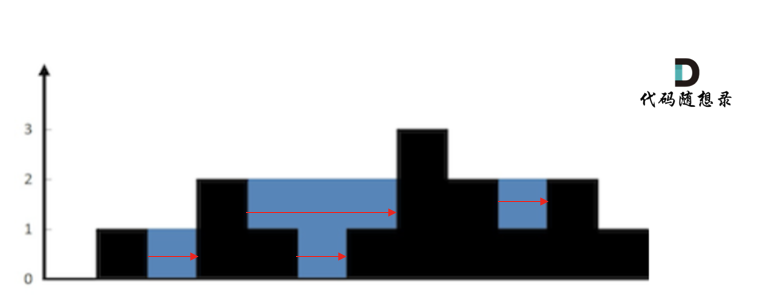

## Day63: 单调栈part02

### 503. 下一个更大元素 II

[LeetCode](https://leetcode.cn/problems/next-greater-element-ii/)  [文章讲解](https://programmercarl.com/0503.%E4%B8%8B%E4%B8%80%E4%B8%AA%E6%9B%B4%E5%A4%A7%E5%85%83%E7%B4%A0II.html)  [视频讲解](https://www.bilibili.com/video/BV15y4y1o7Dw/)

#### 题目描述：

给定一个循环数组 `nums` （ `nums[nums.length - 1]` 的下一个元素是 `nums[0]` ），返回 *`nums` 中每个元素的 **下一个更大元素*** 。

数字 `x` 的 **下一个更大的元素** 是按数组遍历顺序，这个数字之后的第一个比它更大的数，这意味着你应该循环地搜索它的下一个更大的数。如果不存在，则输出 `-1` 。

**示例 1:**

> 输入: nums = [1,2,1]
> 输出: [2,-1,2]
> 解释: 第一个 1 的下一个更大的数是 2；
> 数字 2 找不到下一个更大的数； 
> 第二个 1 的下一个最大的数需要循环搜索，结果也是 2。

**示例 2:**

> 输入: nums = [1,2,3,4,3]
> 输出: [2,3,4,-1,4]

#### 参考解法：

处理循环数组，直接把两个数组拼接在一起，然后使用单调栈求下一个最大值

将两个nums数组拼接在一起，使用单调栈计算出每一个元素的下一个最大值，最后再把结果集即result数组resize到原数组大小就可以了。

这种写法确实比较直观，但做了很多无用操作，例如修改了nums数组，而且最后还要把result数组resize回去。

resize倒是不费时间，是O(1)的操作，但扩充nums数组相当于多了一个O(n)的操作。

其实也可以不扩充nums，而是在遍历的过程中模拟走了两边nums。


```cpp
class Solution
{
 public:
	vector<int> nextGreaterElements(vector<int>& nums)
	{
		vector<int> result(nums.size(), -1);
		stack<int> st;
		st.push(0);
        // 模拟走了两边nums
		for (int i = 0; i < nums.size() * 2; i++)
		{
			while (!st.empty() && nums[i % nums.size()] > nums[st.top()])
			{
				result[st.top()] = nums[i % nums.size()];
				st.pop();
			}
			st.push(i % nums.size());
		}
		return result;
	}
};
```

### 42. 接雨水

[LeetCode](https://leetcode.cn/problems/trapping-rain-water/)  [文章讲解](https://programmercarl.com/0042.%E6%8E%A5%E9%9B%A8%E6%B0%B4.html)  [视频讲解](https://www.bilibili.com/video/BV1uD4y1u75P/)

#### 题目描述：

给定 `n` 个非负整数表示每个宽度为 `1` 的柱子的高度图，计算按此排列的柱子，下雨之后能接多少雨水。

**示例 1：**


> 输入：height = [0,1,0,2,1,0,1,3,2,1,2,1]
> 输出：6
> 解释：上面是由数组 [0,1,0,2,1,0,1,3,2,1,2,1] 表示的高度图，在这种情况下，可以接 6 个单位的雨水（蓝色部分表示雨水）。 

**示例 2：**

> 输入：height = [4,2,0,3,2,5]
> 输出：9

#### 暴力解法：

首先要明确，要按照行来计算，还是按照列来计算。

按照行来计算如图： 

按照列来计算如图： 

按照列来计算，比较容易理解。

首先，**如果按照列来计算的话，宽度一定是1了，再把每一列的雨水的高度求出来就可以了。**

可以看出每一列雨水的高度，取决于，min(该列 左侧最高的柱子, 右侧最高的柱子)。

只要从头遍历一遍所有的列，然后求出每一列雨水的体积，相加之后就是总雨水的体积了。

首先从头遍历所有的列，并且**要注意第一个柱子和最后一个柱子不接雨水**，代码如下：

```cpp
class Solution
{
 public:
	int trap(vector<int>& height)
	{
		int sum = 0;
		for (int i = 0; i < height.size(); i++)
		{
			// 第一个柱子和最后一个柱子不接雨水
			if (i == 0 || i == height.size() - 1) continue;

			int rHeight = height[i]; // 记录右边柱子的最高高度
			int lHeight = height[i]; // 记录左边柱子的最高高度
			for (int r = i + 1; r < height.size(); r++)
			{
				if (height[r] > rHeight) rHeight = height[r];
			}
			for (int l = i - 1; l >= 0; l--)
			{
				if (height[l] > lHeight) lHeight = height[l];
			}
			int h = min(lHeight, rHeight) - height[i];
			if (h > 0) sum += h;
		}
		return sum;
	}
};
```

因为每次遍历列的时候，还要向两边寻找最高的列，所以时间复杂度为O(n^2)，空间复杂度为O(1)，暴力解法提交超时了。

#### 暴力解法优化：

在暴力解法中，只要记录左边柱子的最高高度 和 右边柱子的最高高度，就可以计算当前位置的雨水面积，这就是通过列来计算。

当前列雨水面积：`min(左边柱子的最高高度，记录右边柱子的最高高度) - 当前柱子高度`。

为了得到两边的最高高度，使用了双指针来遍历，每到一个柱子都向两边遍历一遍，这其实是有重复计算的。把每一个位置的左边最高高度记录在一个数组上（`maxLeft`），右边最高高度记录在一个数组上（`maxRight`），这样就避免了重复计算。

当前位置，左边的最高高度是前一个位置的左边最高高度和本高度的最大值。

即从左向右遍历：`maxLeft[i] = max(height[i], maxLeft[i - 1])`;

从右向左遍历：`maxRight[i] = max(height[i], maxRight[i + 1])`;

```cpp
class Solution2
{
 public:
	int trap(vector<int>& height)
	{
		if (height.size() <= 2) return 0;
		vector<int> maxLeft(height.size(), 0);
		vector<int> maxRight(height.size(), 0);
		int size = maxRight.size();

		// 记录每个柱子左边柱子最大高度
		maxLeft[0] = height[0];
		for (int i = 1; i < size; i++)
		{
			maxLeft[i] = max(height[i], maxLeft[i - 1]);
		}
		// 记录每个柱子右边柱子最大高度
		maxRight[size - 1] = height[size - 1];
		for (int i = size - 2; i >= 0; i--)
		{
			maxRight[i] = max(height[i], maxRight[i + 1]);
		}
		// 求和
		int sum = 0;
		for (int i = 0; i < size; i++)
		{
			int count = min(maxLeft[i], maxRight[i]) - height[i];
			if (count > 0) sum += count;
		}
		return sum;
	}
};
```

#### 单调栈解法：

这道题目，正需要寻找一个元素，右边最大元素以及左边最大元素，来计算雨水面积。

那么本题使用单调栈有如下几个问题：

1. 首先单调栈是按照行方向来计算雨水，如图：


知道这一点，后面的就可以理解了。

2. 使用单调栈内元素的顺序

从大到小还是从小到大呢？

从栈头（元素从栈头弹出）到栈底的顺序应该是从小到大的顺序。

因为一旦发现添加的柱子高度大于栈头元素了，此时就出现凹槽了，栈头元素就是凹槽底部的柱子，栈头第二个元素就是凹槽左边的柱子，而添加的元素就是凹槽右边的柱子。

如图：


3. 遇到相同高度的柱子怎么办。

遇到相同的元素，更新栈内下标，就是将栈里元素（旧下标）弹出，将新元素（新下标）加入栈中。

例如 5 5 1 3 这种情况。如果添加第二个5的时候就应该将第一个5的下标弹出，把第二个5添加到栈中。

**因为要求宽度的时候 如果遇到相同高度的柱子，需要使用最右边的柱子来计算宽度**。

如图所示：


4. 栈里要保存什么数值

使用单调栈，也是通过 长 * 宽 来计算雨水面积的。

长就是通过柱子的高度来计算，宽是通过柱子之间的下标来计算，

栈里就存放下标就行，想要知道对应的高度，通过`height[stack.top()]` 就知道弹出的下标对应的高度了。

##### 单调栈处理逻辑

以下逻辑主要就是三种情况

- 情况一：当前遍历的元素（柱子）高度小于栈顶元素的高度 `height[i] < height[st.top()]`
- 情况二：当前遍历的元素（柱子）高度等于栈顶元素的高度 `height[i] == height[st.top()]`
- 情况三：当前遍历的元素（柱子）高度大于栈顶元素的高度 `height[i] > height[st.top()]`

先将下标0的柱子加入到栈中，`st.push(0);`。 栈中存放遍历过的元素，所以先将下标0加进来。

然后开始从下标1开始遍历所有的柱子，`for (int i = 1; i < height.size(); i++)`。

如果当前遍历的元素（柱子）高度小于栈顶元素的高度，就把这个元素加入栈中，因为栈里本来就要保持从小到大的顺序（从栈头到栈底）。

```text
if (height[i] < height[st.top()])  st.push(i);
```

如果当前遍历的元素（柱子）高度等于栈顶元素的高度，要更新栈顶元素，因为遇到相相同高度的柱子，需要使用最右边的柱子来计算宽度。

```text
if (height[i] == height[st.top()]) 
{ // 例如 5 5 1 7 这种情况
  st.pop();
  st.push(i);
}
```

如果当前遍历的元素（柱子）高度大于栈顶元素的高度，此时就出现凹槽了，如图所示：


取栈顶元素，将栈顶元素弹出，这个就是凹槽的底部，也就是中间位置，下标记为mid，对应的高度为`height[mid]`（就是图中的高度1）。

此时的栈顶元素`st.top()`，就是凹槽的左边位置，下标为`st.top()`，对应的高度为`height[st.top()]`（就是图中的高度2）。

当前遍历的元素`i`，就是凹槽右边的位置，下标为`i`，对应的高度为`height[i]`（就是图中的高度3）。

此时可以发现其实就是**栈顶和栈顶的下一个元素以及要入栈的元素，三个元素来接水！**

那么雨水高度是 min(凹槽左边高度, 凹槽右边高度) - 凹槽底部高度，代码为：`int h = min(height[st.top()], height[i]) - height[mid];`

雨水的宽度是 凹槽右边的下标 - 凹槽左边的下标 - 1（因为只求中间宽度），代码为：`int w = i - st.top() - 1 ;`

当前凹槽雨水的体积就是：`h * w`。

> **那万一凹槽左边或者右边有更高的高度，那么雨水的高度就求得不对了啊？比如 3 2 0 2 3 ，计算到2 0 2 会得出雨水高度只有2。**
>
> 注意单调栈解法是按行计算的：
> 
>
> 第一轮是会得到2这个结果，但是还有第一个3还在栈内，还有一次对3进行计算，就会在0这个位置再求得一个1的高度，总高度就会是2+1得到3.

求当前凹槽雨水的体积代码如下：

```cpp
while (!st.empty() && height[i] > height[st.top()]) 
{ // 注意这里是while，持续跟新栈顶元素
    int mid = st.top();
    st.pop();
    if (!st.empty()) 
    {
        int h = min(height[st.top()], height[i]) - height[mid];
        int w = i - st.top() - 1; // 注意减一，只求中间宽度
        sum += h * w;
    }
}
```

关键部分讲完了，整体代码如下：

```cpp
class Solution3
{
 public:
	int trap(vector<int>& height)
	{
		stack<int> st; // 存着下标，计算的时候用下标对应的柱子高度
		st.push(0);
		int sum = 0;
		for (int i = 1; i < height.size(); i++)
		{
			if (height[i] < height[st.top()])
			{     // 情况一
				st.push(i);
			}
			if (height[i] == height[st.top()])
			{  // 情况二
				st.pop(); // 其实这一句可以不加，效果是一样的，但处理相同的情况的思路却变了。
				st.push(i);
			}
			else
			{
				// 情况三
				while (!st.empty() && height[i] > height[st.top()])
				{ // 注意这里是while
					int mid = st.top();
					st.pop();
					if (!st.empty())
					{
						int h = min(height[st.top()], height[i]) - height[mid];
						int w = i - st.top() - 1; // 注意减一，只求中间宽度
						sum += h * w;
					}
				}
				st.push(i);
			}
		}
		return sum;
	}
};
```

以上代码冗余了一些，但是思路是清晰的，将代码精简一下，如下：

```cpp
class Solution4
{
 public:
	int trap(vector<int>& height)
	{
		stack<int> st;
		st.push(0);
		int sum = 0;
		for (int i = 1; i < height.size(); i++)
		{
			while (!st.empty() && height[i] > height[st.top()])
			{
				int mid = st.top();
				st.pop();
				if (!st.empty())
				{
					int h = min(height[st.top()], height[i]) - height[mid];
					int w = i - st.top() - 1;
					sum += h * w;
				}
			}
			st.push(i);
		}
		return sum;
	}
};
```

精简之后的代码，就看不出去三种情况的处理了，貌似好像只处理的情况三，其实是把情况一和情况二融合了。 这样的代码不太利于理解。

### 今日总结

处理循环数组可以进行拼接或者拆分，具体看场景。

接雨水，如雷贯耳！~

雨水 = min(左边最高, 右边最高) - 当前高度
