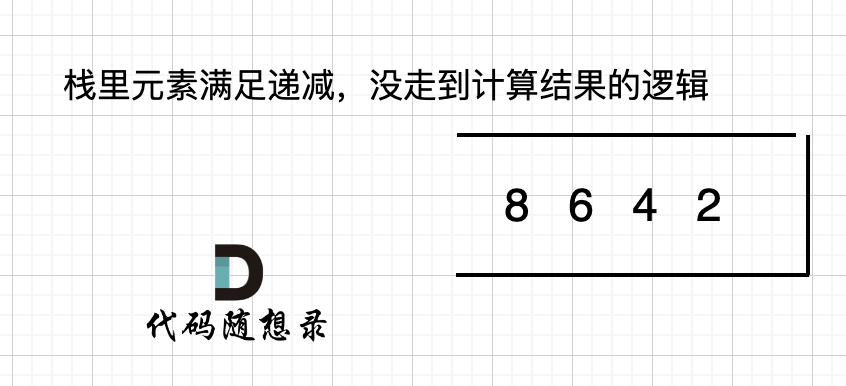
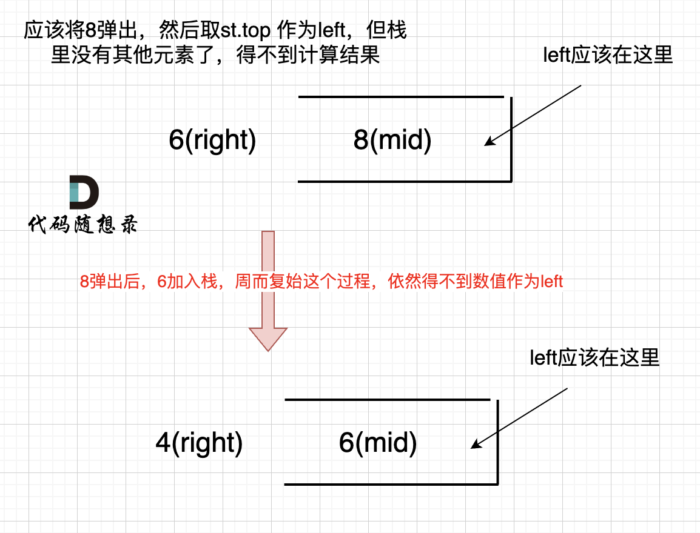

## Day64: 单调栈part03

### 84. 柱状图中最大的矩形

[LeetCode](https://leetcode.cn/problems/largest-rectangle-in-histogram/)  [文章讲解](https://programmercarl.com/0084.%E6%9F%B1%E7%8A%B6%E5%9B%BE%E4%B8%AD%E6%9C%80%E5%A4%A7%E7%9A%84%E7%9F%A9%E5%BD%A2.html)  [视频讲解](https://www.bilibili.com/video/BV1Ns4y1o7uB/)

#### 题目描述：

给定 *n* 个非负整数，用来表示柱状图中各个柱子的高度。每个柱子彼此相邻，且宽度为 1 。

求在该柱状图中，能够勾勒出来的矩形的最大面积。

**示例 1:**


> 输入：heights = [2,1,5,6,2,3]
> 输出：10
> 解释：最大的矩形为图中红色区域，面积为 10

**示例 2：**


> 输入： heights = [2,4]
> 输出： 4

#### 暴力解法：

本题和[42. 接雨水](https://programmercarl.com/0042.接雨水.html)，是遥相呼应的两道题目，原理上有很多相同的地方，但细节上又有差异，更可以加深对单调栈的理解！

每遍历到一个`heights`，取其左边和右边比`heights`小的元素，宽度即为两者之间的距离，高度为`heights`（正好与接雨水求凹区域相反）。

```cpp
// 暴力解法
class Solution
{
 public:
	int largestRectangleArea(vector<int>& heights)
	{
		int sum = 0;
		for (int i = 0; i < heights.size(); i++)
		{
			int left = i;
			int right = i;
			for (; left >= 0; left--)
			{
				if (heights[left] < heights[i]) break;
			}
			for (; right < heights.size(); right++)
			{
				if (heights[right] < heights[i]) break;
			}
			int w = right - left - 1;
			int h = heights[i];
			sum = max(sum, w * h);
		}
		return sum;
	}
};
```

如上代码并不能通过leetcode，超时了，因为时间复杂度是$O(n^2)$。

#### 暴力解法优化：

本题暴力解法的优化写法整体思路和[42. 接雨水 ](https://programmercarl.com/0042.接雨水.html)是一致的，但要比[42. 接雨水](https://programmercarl.com/0042.接雨水.html)难一些。

难就难在本题要记录记录每个柱子 左边第一个小于该柱子的下标，而不是左边第一个小于该柱子的高度。

所以需要循环查找，也就是下面在寻找的过程中使用了while：

```cpp
class Solution2
{
 public:
	int trap(vector<int>& height)
	{
		if (height.size() <= 2) return 0;
		vector<int> maxLeft(height.size(), 0);
		vector<int> maxRight(height.size(), 0);
		int size = maxRight.size();

		// 记录每个柱子左边柱子最大高度
		maxLeft[0] = height[0];
		for (int i = 1; i < size; i++)
		{
			maxLeft[i] = max(height[i], maxLeft[i - 1]);
		}
		// 记录每个柱子右边柱子最大高度
		maxRight[size - 1] = height[size - 1];
		for (int i = size - 2; i >= 0; i--)
		{
			maxRight[i] = max(height[i], maxRight[i + 1]);
		}
		// 求和
		int sum = 0;
		for (int i = 0; i < size; i++)
		{
			int count = min(maxLeft[i], maxRight[i]) - height[i];
			if (count > 0) sum += count;
		}
		return sum;
	}
};
```

#### 单调栈解法：

本地单调栈的解法和接雨水的题目是遥相呼应的。[42. 接雨水](https://programmercarl.com/0042.接雨水.html)是找每个柱子左右两边第一个大于该柱子高度的柱子，而本题是找每个柱子左右两边第一个小于该柱子的柱子。

**这里就涉及到了单调栈很重要的性质，就是单调栈里的顺序，是从小到大还是从大到小**。

在[42. 接雨水](https://programmercarl.com/0042.接雨水.html)中单调栈从栈头（元素从栈头弹出）到栈底的顺序应该是从小到大的顺序。

那么因为本题是要找每个柱子左右两边第一个小于该柱子的柱子，所以从栈头（元素从栈头弹出）到栈底的顺序应该是从大到小的顺序！如图：


只有栈里从大到小的顺序，才能保证栈顶元素找到左右两边第一个小于栈顶元素的柱子。

所以本题单调栈的顺序正好与接雨水反过来。

此时可以发现其实就是**栈顶和栈顶的下一个元素以及要入栈的三个元素组成了要求最大面积的高度和宽度**

理解这一点，对单调栈就掌握的比较到位了。除了栈内元素顺序和接雨水不同，剩下的逻辑就都差不多了。

主要就是分析清楚如下三种情况：

- 情况一：当前遍历的元素`heights[i]`大于栈顶元素`heights[st.top()]`的情况
- 情况二：当前遍历的元素`heights[i]`等于栈顶元素`heights[st.top()]`的情况
- 情况三：当前遍历的元素`heights[i]`小于栈顶元素`heights[st.top()]`的情况

```cpp
// 单调栈解法
class Solution3
{
 public:
	int largestRectangleArea(vector<int>& heights)
	{
		heights.insert(heights.begin(), 0); // 数组头部加入元素0
		heights.push_back(0); // 数组尾部加入元素0
		stack<int> st;
		st.push(0);
		int result = 0;
		for (int i = 1; i < heights.size(); i++)
		{
			while (!st.empty() && heights[i] < heights[st.top()])
			{
				int mid = st.top();
				st.pop();
				if (!st.empty())
				{
					int w = i - st.top() - 1;
					result = max(result, w * heights[mid]);
				}
			}
			st.push(i);
		}
		return result;
	}
};
```

其中，在 height数组前后，都加了一个元素0， 为什么这么做呢？

如果数组本身就是升序的，例如[2,4,6,8]，那么入栈之后 都是单调递减，一直都没有走 情况三 计算结果的哪一步，所以最后输出的就是0了。 如图：



那么结尾加一个0，就会让栈里的所有元素，走到情况三的逻辑。

开头为什么要加元素0？

如果数组本身是降序的，例如 [8,6,4,2]，在 8 入栈后，6 开始与8 进行比较，此时我们得到 mid（8），rigt（6），但是得不到 left。

（mid、left，right 都是对应版本一里的逻辑）

因为 将 8 弹出之后，栈里没有元素了，那么为了避免空栈取值，直接跳过了计算结果的逻辑。

之后又将6 加入栈（此时8已经弹出了），然后 就是 4 与 栈口元素 8 进行比较，周而复始，那么计算的最后结果resutl就是0。 如图所示：



所以需要在 height数组前后各加一个元素0。

### 今日总结

今天 84.柱状图中最大的矩形 与 42. 接雨水 确实很相似，但是初见真的很难想到。
