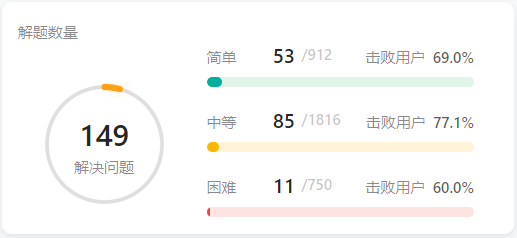
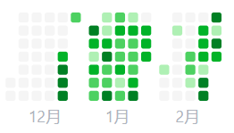
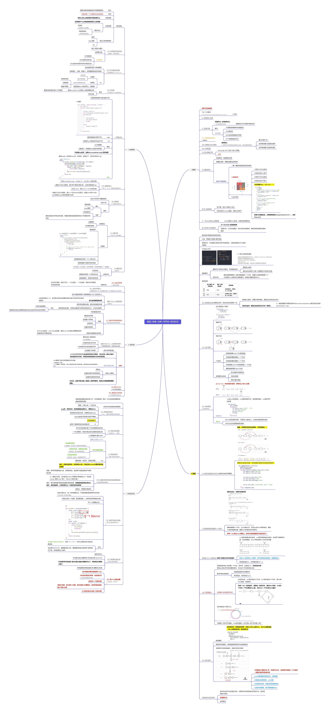

## Day65: 总结与感想

#### **代码随想录算法训练营29期**：2023-12-27 -- 2024-02-29

今年就要正式参加秋招了，之前没有系统刷过LeetCode，于是决定跟着代码随想录一起刷题。正好也是趁着寒假，免得在家里时间浪费了，什么都没干。虽然在中间有过十几天的间断（不出所料），但最终按计划完成了全部的任务，还是很有成就感的。

尽管有一些基础，但由于不是计算机专业，没有系统学过数据结构与算法，知识体系都是零零散散。这两个月的刷题可以说相当于完整地学习了一遍数据结构与算法。虽然有点懒，看似博客内容很丰富，其实大部分时候只是根据卡哥的解题思路稍作修改。但总的来说，也算是培养了一个坚持学习的好习惯吧，还是庆幸还是坚持下来了。

后面先把之前刷过的快速复盘过一下思路，然后准备二刷，背八股文，做一些项目实战。好多暑假实习已经开了，感觉时间好紧张，要学不完了，呜呜呜！希望今年暑假能够找到实习，然后秋招找到自己满意的offer！

贴一下打卡的记录：https://github.com/Wang-Jingrun/LeetCode

最后，借用 [知识星球_辰九九](https://wx.zsxq.com/dweb2/index/topic_detail/184545451452882) 大佬的图片做一个全面总结吧！

