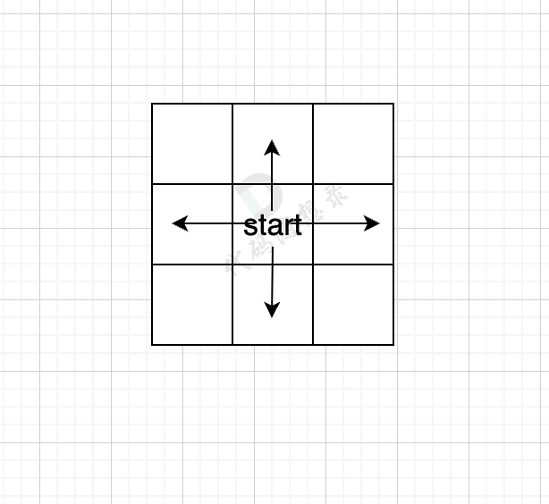
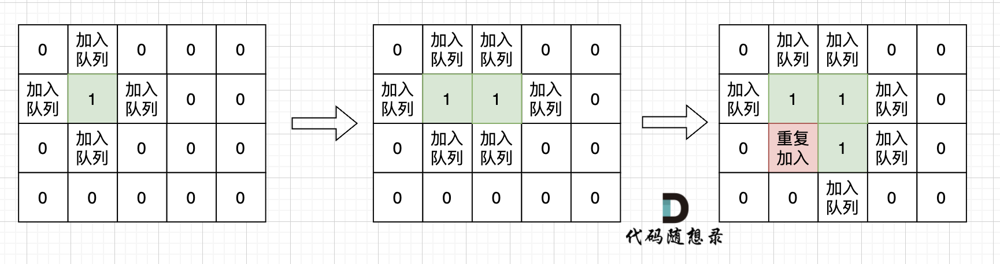

## Day66: 图论part01

### 深度优先搜索理论基础

#### dfs 与 bfs 区别

提到**深度优先搜索**（dfs），就不得不说和**广度优先搜索**（bfs）有什么区别：

- dfs是可一个方向去搜，不到黄河不回头，直到遇到绝境了，搜不下去了，再换方向（换方向的过程就涉及到了回溯）。
- bfs是先把本节点所连接的所有节点遍历一遍，走到下一个节点的时候，再把连接节点的所有节点遍历一遍，搜索方向更像是广度，四面八方的搜索过程。

#### dfs 搜索过程

如图一，是一个无向图，要搜索从节点1到节点6的所有路径。


那么dfs搜索的第一条路径是这样的： （假设第一次延默认方向，就找到了节点6），图二


此时找到了节点6，（遇到黄河了，是不是应该回头了），那么应该再去搜索其他方向了。 如图三：


路径2撤销了，改变了方向，走路径3（红色线）， 接着也找到终点6。 那么撤销路径2，改为路径3，在dfs中其实就是回溯的过程（这一点很重要，很多录友不理解dfs代码中回溯是用来干什么的）

又找到了一条从节点1到节点6的路径，又到黄河了，此时再回头，下图图四中，路径4撤销（回溯的过程），改为路径5。


又找到了一条从节点1到节点6的路径，又到黄河了，此时再回头，下图图五，路径6撤销（回溯的过程），改为路径7，路径8 和 路径7，路径9， 结果发现死路一条，都走到了自己走过的节点。


那么节点2所连接路径和节点3所链接的路径 都走过了，撤销路径只能向上回退，去选择撤销当初节点4的选择，也就是撤销路径5，改为路径10 。 如图图六：


上图演示中，其实并没有把 所有的 从节点1 到节点6的dfs（深度优先搜索）的过程都画出来，那样太冗余了，但 已经把dfs 关键的地方都涉及到了，关键就两点：

- 搜索方向，是认准一个方向搜，直到碰壁之后再换方向
- 换方向是撤销原路径，改为节点链接的下一个路径，回溯的过程。

#### 代码框架

正是因为dfs搜索可一个方向，并需要回溯，所以用递归的方式来实现是最方便的。

```cpp
void dfs(参数) {
    处理节点
    dfs(图，选择的节点); // 递归
    回溯，撤销处理结果
}
```

在[二叉树章节](https://programmercarl.com/二叉树理论基础.html)的中，二叉树的递归法其实就是dfs，而二叉树的迭代法，就是bfs（广度优先搜索）

所以**dfs，bfs其实是基础搜索算法，也广泛应用与其他数据结构与算法中**。

回顾一下 [回溯法](https://programmercarl.com/回溯算法理论基础.html) 的代码框架：

```cpp
void backtracking(参数) {
    if (终止条件) {
        存放结果;
        return;
    }
    for (选择：本层集合中元素（树中节点孩子的数量就是集合的大小）) {
        处理节点;
        backtracking(路径，选择列表); // 递归
        回溯，撤销处理结果
    }
}
```

回溯算法，其实就是dfs的过程，这里给出dfs的代码框架：

```cpp
void dfs(参数) {
    if (终止条件) {
        存放结果;
        return;
    }

    for (选择：本节点所连接的其他节点) {
        处理节点;
        dfs(图，选择的节点); // 递归
        回溯，撤销处理结果
    }
}
```

#### 深搜三部曲

1. **确认递归函数，参数**

```cpp
void dfs(参数)
```

通常递归的时候，递归搜索需要了解哪些参数，其实也可以在写递归函数的时候，发现需要什么参数，再去补充就可以。

一般情况，深搜需要 二维数组数组结构保存所有路径，需要一维数组保存单一路径，这种保存结果的数组，可以定义一个全局变量，避免让我们的函数参数过多。

例如这样：

```cpp
vector<vector<int>> result; // 保存符合条件的所有路径
vector<int> path; // 起点到终点的路径
void dfs (图，目前搜索的节点)  
```

2. **确认终止条件**

终止条件很重要，dfs的代码之所以容易死循环，栈溢出等等这些问题，都是因为终止条件没有想清楚。

```cpp
if (终止条件) {
    存放结果;
    return;
}
```

终止添加不仅是结束本层递归，同时也是收获结果的时候。

另外，其实很多dfs写法，没有写终止条件，其实终止条件写在了下面dfs递归的逻辑里了，也就是不符合条件，直接不会向下递归。

3. **处理目前搜索节点出发的路径**

一般这里就是一个for循环的操作，去遍历 目前搜索节点 所能到的所有节点。

```cpp
for (选择：本节点所连接的其他节点) {
    处理节点;
    dfs(图，选择的节点); // 递归
    回溯，撤销处理结果
}
```

不少录友疑惑的地方，都是 dfs代码框架中for循环里分明已经处理节点了，那么 dfs函数下面 为什么还要撤销的呢。

如图七所示， 路径2 已经走到了 目的地节点6，那么 路径2 是如何撤销，然后改为 路径3呢？ 其实这就是 回溯的过程，撤销路径2，走换下一个方向。


### 797. 所有可能的路径

[LeetCode](https://leetcode.cn/problems/all-paths-from-source-to-target/)  [文章讲解](https://programmercarl.com/0797.%E6%89%80%E6%9C%89%E5%8F%AF%E8%83%BD%E7%9A%84%E8%B7%AF%E5%BE%84.html)

#### 题目描述：

给你一个有 `n` 个节点的 **有向无环图（DAG）**，请你找出所有从节点 `0` 到节点 `n-1` 的路径并输出（**不要求按特定顺序**）

 `graph[i]` 是一个从节点 `i` 可以访问的所有节点的列表（即从节点 `i` 到节点 `graph[i][j]`存在一条有向边）。

**示例 1：**


> 输入：graph = [[1,2],[3],[3],[]]
> 输出：[[0,1,3],[0,2,3]]
> 解释：有两条路径 0 -> 1 -> 3 和 0 -> 2 -> 3

**示例 2：**


> 输入：graph = [[4,3,1],[3,2,4],[3],[4],[]]
> 输出：[[0,4],[0,3,4],[0,1,3,4],[0,1,2,3,4],[0,1,4]]

#### 我的解法：

深搜三部曲：

1. **确认递归函数，参数**

首先dfs函数一定要存一个图，用来遍历的，还要存一个目前遍历的节点，定义为 `nodeIndex`

至于 单一路径，和路径集合可以放在全局变量，那么代码是这样的：

```cpp
vector<vector<int>> result; // 收集符合条件的路径
vector<int> path; // 0节点到终点的路径
// nodeIndex：目前遍历的节点
// graph：存当前的图
void dfs(vector<vector<int>>& graph, int nodeIndex)
```

2. **确认终止条件**

当目前遍历的节点 为 最后一个节点的时候，就找到了一条，从 出发点到终止点的路径。

当前遍历的节点，定义为 `nodeIndex`，最后一点节点，就是 `graph.size() - 1`（因为题目描述是找出所有从节点 0 到节点 n-1 的路径并输出）。

所以 但 `nodeIndex` 等于 `graph.size() - 1` 的时候就找到一条有效路径。 代码如下：

```cpp
// 要求从节点 0 到节点 n-1 的路径并输出，所以是 graph.size() - 1
if (nodeIndex == graph.size() - 1)
{
    result.push_back(path);
    return;
}
```

3. **处理目前搜索节点出发的路径**

接下来是走 当前遍历节点 `nodeIndex` 的下一个节点。

首先是要找到 `nodeIndex` 节点链接了哪些节点呢？ 遍历方式是这样的：

```cpp
for (int i = 0; i < graph[nodeIndex].size(); i++)  // 遍历节点n链接的所有节点
```

接下来就是将 选中的 `nodeIndex`  所连接的节点，加入到 单一路径来。

```cpp
path.push_back(graph[nodeIndex][i]); // 遍历到的节点加入到路径中来
```

例如如果 `nodeIndex`  目前是节点0，那么目前的过程就是这样的：


二维数组中，`graph[nodeIndex][i]` 都是`nodeIndex`链接的节点，当前遍历的节点就是 `graph[nodeIndex][i]` 。

进入下一层递归

```cpp
dfs(graph, graph[nodeIndex][i]); // 进入下一层递归
```

最后就是回溯的过程，撤销本次添加节点的操作。 该过程整体代码：

```cpp
for (int i = 0; i < graph[nodeIndex].size(); i++) // 遍历节点链接的所有节点
{
    path.push_back(graph[nodeIndex][i]); // 遍历到的节点加入到路径中来
    dfs(graph, graph[nodeIndex][i]); // 进入下一层递归
    path.pop_back();
}
```

本题整体代码如下：

```C++
class Solution
{
 private:
	vector<vector<int>> result; // 收集符合条件的路径
	vector<int> path; // 0节点到终点的路径
	// nodeIndex：目前遍历的节点
	// graph：存当前的图
	void dfs(vector<vector<int>>& graph, int nodeIndex)
	{
		// 要求从节点 0 到节点 n-1 的路径并输出，所以是 graph.size() - 1
		if (nodeIndex == graph.size() - 1)
		{
			result.push_back(path);
			return;
		}

		for (int i = 0; i < graph[nodeIndex].size(); i++) // 遍历节点链接的所有节点
		{
			path.push_back(graph[nodeIndex][i]); // 遍历到的节点加入到路径中来
			dfs(graph, graph[nodeIndex][i]); // 进入下一层递归
			path.pop_back();
		}
	}

 public:
	vector<vector<int>> allPathsSourceTarget(vector<vector<int>>& graph)
	{
		result.clear();
		path.clear();
		path.push_back(0);
		dfs(graph, 0);
		return result;
	}
};
```

### 广度优先搜索理论基础

广搜的搜索方式就适合于解决两个点之间的最短路径问题。

因为广搜是从起点出发，以起始点为中心一圈一圈进行搜索，一旦遇到终点，记录之前走过的节点就是一条最短路。

当然，也有一些问题是广搜 和 深搜都可以解决的，例如岛屿问题，**这类问题的特征就是不涉及具体的遍历方式，只要能把相邻且相同属性的节点标记上就行**。 

#### 广搜的过程

BFS是一圈一圈的搜索过程，但具体是怎么一圈一圈来搜呢。

用一个方格地图，假如每次搜索的方向为 上下左右（不包含斜上方），那么给出一个start起始位置，那么BFS就是从四个方向走出第一步。



如果加上一个end终止位置，那么使用BFS的搜索过程如图所示：


从图中可以看出，从start起点开始，是一圈一圈，向外搜索，方格编号1为第一步遍历的节点，方格编号2为第二步遍历的节点，第四步的时候我们找到终止点end。

正是因为BFS一圈一圈的遍历方式，所以一旦遇到终止点，那么一定是一条最短路径。

而且地图还可以有障碍，如图所示：


在第五步，第六步 只把关键的节点染色了，其他方向周边没有去染色，只要关注关键地方染色的逻辑就可以。

从图中可以看出，如果添加了障碍，第六步才能走到end终点。只要BFS只要搜到终点一定是一条最短路径。

#### 代码框架

对于BFS，需要一个容器，能保存遍历过的元素就可以，**那么用队列，还是用栈，甚至用数组，都是可以的**。

**用队列的话，就是保证每一圈都是一个方向去转，例如统一顺时针或者逆时针**。

因为队列是先进先出，加入元素和弹出元素的顺序是没有改变的。

**如果用栈的话，就是第一圈顺时针遍历，第二圈逆时针遍历，第三圈有顺时针遍历**。

因为栈是先进后出，加入元素和弹出元素的顺序改变了。

那么广搜需要注意 转圈搜索的顺序吗？ 不需要！

所以用队列，还是用栈都是可以的，但大家都习惯用队列了，**所以下面也用队列来讲，只不过并不是非要用队列，用栈也可以**。

下面给出广搜代码模板，该模板针对的就是，上面的四方格的地图： （详细注释）

```cpp
int dir[4][2] = { 0, 1, 1, 0, -1, 0, 0, -1 }; // 表示四个方向
// grid 是地图，也就是一个二维数组
// visited 标记访问过的节点，不要重复访问
// x,y 表示开始搜索节点的下标
void bfs(vector<vector<char>>& grid, vector<vector<bool>>& visited, int x, int y)
{
	queue<pair<int, int>> que; // 定义队列
	que.push({ x, y }); // 起始节点加入队列
	visited[x][y] = true; // 只要加入队列，立刻标记为访问过的节点
	// 开始遍历队列里的元素
	while (!que.empty())
	{ 
		pair<int, int> cur = que.front();
		que.pop(); // 从队列取元素
		int curx = cur.first;
		int cury = cur.second; // 当前节点坐标
		for (int i = 0; i < 4; i++)
		{ // 开始想当前节点的四个方向左右上下去遍历
			int nextx = curx + dir[i][0];
			int nexty = cury + dir[i][1]; // 获取周边四个方向的坐标
			if (nextx < 0 || nextx >= grid.size() || nexty < 0 || nexty >= grid[0].size()) continue;  // 坐标越界了，直接跳过
			if (!visited[nextx][nexty])
			{ // 如果节点没被访问过
				que.push({ nextx, nexty });  // 队列添加该节点为下一轮要遍历的节点
				visited[nextx][nexty] = true; // 只要加入队列立刻标记，避免重复访问
			}
		}
	}
}
```

### 200. 岛屿数量

[LeetCode](https://leetcode.cn/problems/number-of-islands/)  [文章讲解]()  [视频讲解]()

#### 题目描述：

给你一个由 `'1'`（陆地）和 `'0'`（水）组成的的二维网格，请你计算网格中岛屿的数量。

岛屿总是被水包围，并且每座岛屿只能由水平方向和/或竖直方向上相邻的陆地连接形成。

此外，你可以假设该网格的四条边均被水包围。

**示例 1：**

> 输入：grid = [
>   ["1","1","1","1","0"],
>   ["1","1","0","1","0"],
>   ["1","1","0","0","0"],
>   ["0","0","0","0","0"]
> ]
> 输出：1

**示例 2：**

> 输入：grid = [
>   ["1","1","0","0","0"],
>   ["1","1","0","0","0"],
>   ["0","0","1","0","0"],
>   ["0","0","0","1","1"]
> ]
> 输出：3

#### 深搜解法：

深搜三部曲：

1. **确认递归函数，参数**

首先dfs函数一定要存一个图，用来遍历的，还要存已经遍历过的节点 `visited` 布尔类型，以及当前的坐标

```cpp
void dfs(vector<vector<char>>& grid, vector<vector<bool>>& visited, int x, int y)
```

2. **确认终止条件**

当目前遍历的节点已经遍历过了或者当前的节点是水

```cpp
if (visited[x][y] || grid[x][y] == '0') return; // 终止条件：访问过的节点 或者 遇到海水
```

3. **处理目前搜索节点出发的路径**

有四个方向，如果越界则跳过

```cpp
for (int i = 0; i < direction.size(); i++)
{
    visited[x][y] = true;
    int next_x = x + direction[i][0];
    int next_y = y + direction[i][1];
    if (next_x < 0 || next_x >= grid.size() || next_y < 0 || next_y >= grid[0].size()) continue; // 越界
    dfs(grid, visited, next_x, next_y);
}
```

整体代码：

```C++
class Solution
{
 private:
	// 四个方向
	const vector<vector<int>> direction = {{ -1, 0 }, { 1, 0 }, { 0, -1 }, { 0, 1 }};
	void dfs(vector<vector<char>>& grid, vector<vector<bool>>& visited, int x, int y)
	{
		if (visited[x][y] || grid[x][y] == '0') return; // 终止条件：访问过的节点 或者 遇到海水
		visited[x][y] = true; // 标记访问过
		for (int i = 0; i < direction.size(); i++)
		{
			visited[x][y] = true;
			int next_x = x + direction[i][0];
			int next_y = y + direction[i][1];
			if (next_x < 0 || next_x >= grid.size() || next_y < 0 || next_y >= grid[0].size()) continue; // 越界
			dfs(grid, visited, next_x, next_y);
		}
	}

 public:
	int numIslands(vector<vector<char>>& grid)
	{
		int result = 0;
		// 记录遍历过的节点
		vector<vector<bool>> visited(grid.size(), vector<bool>(grid[0].size(), false));
		for (int i = 0; i < grid.size(); i++)
		{
			for (int j = 0; j < grid[i].size(); j++)
			{
				if (grid[i][j] == '1' && !visited[i][j])
				{
					dfs(grid, visited, i, j);
					result++;
				}
			}
		}
		return result;
	}
};
```

#### 广搜解法：

广搜中很重要的细节：**只要 加入队列就代表 走过，就需要标记，而不是从队列拿出来的时候再去标记走过**。

如果从队列拿出节点，再去标记这个节点走过，就会发生下图所示的结果，会导致很多节点重复加入队列。



**所以只要加入队列，立即标记该节点走过**。

完整广搜代码：

```cpp
// 广度度优先搜索版本
class Solution2
{
 private:
	// 四个方向
	const vector<vector<int>> direction = {{ -1, 0 }, { 1, 0 }, { 0, -1 }, { 0, 1 }};

	void bfs(vector<vector<char>>& grid, vector<vector<bool>>& visited, int x, int y)
	{
		queue<pair<int, int>> qu;
		qu.push({ x, y });
		visited[x][y] = true; // 只要加入队列，立刻标记

		while (!qu.empty())
		{
			auto cur = qu.front();
			qu.pop();

			for (int i = 0; i < direction.size(); i++)
			{
				int next_x = cur.first + direction[i][0];
				int next_y = cur.second + direction[i][1];
				if (next_x < 0 || next_x >= grid.size() || next_y < 0 || next_y >= grid[0].size()) continue;

				if (!visited[next_x][next_y] && grid[next_x][next_y] == '1')
				{
					visited[next_x][next_y] = true; // 只要加入队列，立刻标记
					qu.push({ next_x, next_y });
				}
			}
		}
	}

 public:
	int numIslands(vector<vector<char>>& grid)
	{
		int result = 0;
		vector<vector<bool>> visited(grid.size(), vector<bool>(grid[0].size(), false));

		for (int i = 0; i < grid.size(); i++)
		{
			for (int j = 0; j < grid[i].size(); j++)
			{
				if (!visited[i][j] && grid[i][j] == '1')
				{
					bfs(grid, visited, i, j); // 将与其链接的陆地都标记上 true
					result++; // 遇到没访问过的陆地，+1
				}
			}
		}
		return result;
	}
};
```

### 今日总结

第一题开始做的时候没有看清 “从节点 `0` 到节点 `n-1` 的路径并输出” 导致做复杂了，深度优先搜索本层（该节点能到的下一个节点）使用递归函数中的 for 循环控制，层与层之间的跳转通过递归函数的参数带入。

岛屿问题，深搜或广搜应用，下一个节点即该岛屿上下左右四个方向，只需要遍历过即可，不需要统计路径。
