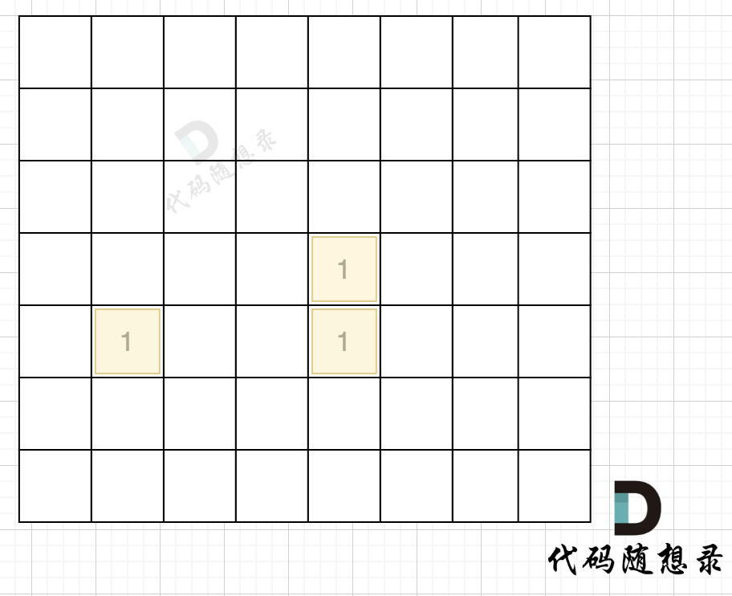

## Day67: 图论part02

### 695. 岛屿的最大面积

[LeetCode](https://leetcode.cn/problems/max-area-of-island/)  [文章讲解](https://programmercarl.com/0695.%E5%B2%9B%E5%B1%BF%E7%9A%84%E6%9C%80%E5%A4%A7%E9%9D%A2%E7%A7%AF.html)

#### 题目描述：

给你一个大小为 `m x n` 的二进制矩阵 `grid` 。

**岛屿** 是由一些相邻的 `1` (代表土地) 构成的组合，这里的「相邻」要求两个 `1` 必须在 **水平或者竖直的四个方向上** 相邻。你可以假设 `grid` 的四个边缘都被 `0`（代表水）包围着。

岛屿的面积是岛上值为 `1` 的单元格的数目。

计算并返回 `grid` 中最大的岛屿面积。如果没有岛屿，则返回面积为 `0` 。

**示例 1：**

> 
>
> 输入：grid = [
> [0,0,1,0,0,0,0,1,0,0,0,0,0],
> [0,0,0,0,0,0,0,1,1,1,0,0,0],
> [0,1,1,0,1,0,0,0,0,0,0,0,0],
> [0,1,0,0,1,1,0,0,1,0,1,0,0],
> [0,1,0,0,1,1,0,0,1,1,1,0,0],
> [0,0,0,0,0,0,0,0,0,0,1,0,0],
> [0,0,0,0,0,0,0,1,1,1,0,0,0],
> [0,0,0,0,0,0,0,1,1,0,0,0,0]]
> 输出：6
> 解释：答案不应该是 11 ，因为岛屿只能包含水平或垂直这四个方向上的 1 。

**示例 2：**

> 输入：grid = [[0,0,0,0,0,0,0,0]]
> 输出：0

#### 我的解法（深搜）：

思路类似 [200. 岛屿数量](https://programmercarl.com/0200.%E5%B2%9B%E5%B1%BF%E6%95%B0%E9%87%8F.%E6%B7%B1%E6%90%9C%E7%89%88.html)，区别在于一个统计岛屿数量 ，一个统计每个岛屿的面积。

```C++
// 深搜版本
class Solution
{
 private:
	int num_island = 0; // 记录每次深搜的岛屿面积
	// 四个方向
	const vector<vector<int>> direction = {{ -1, 0 }, { 1, 0 }, { 0, -1 }, { 0, 1 }};

	void dfs(vector<vector<int>>& grid, vector<vector<bool>>& visited, int x, int y)
	{
		if (visited[x][y] || grid[x][y] == 0) return; // 终止条件：访问过的节点 或者 遇到海水

		visited[x][y] = true; // 标记访问过
		num_island++;

		for (int i = 0; i < direction.size(); i++)
		{
			int next_x = x + direction[i][0];
			int next_y = y + direction[i][1];

			if (next_x < 0 || next_x >= grid.size() || next_y < 0 || next_y >= grid[0].size()) continue; // 越界

			dfs(grid, visited, next_x, next_y);
		}
	}

 public:
	int maxAreaOfIsland(vector<vector<int>>& grid)
	{
		int result = 0; // 记录结果
		vector<vector<bool>> visited(grid.size(), vector<bool>(grid[0].size(), false));

		for (int i = 0; i < grid.size(); i++)
		{
			for (int j = 0; j < grid[0].size(); j++)
			{
				if (!visited[i][j] && grid[i][j] == 1)
				{
					num_island = 0;
					dfs(grid, visited, i, j);
					result = max(result, num_island);
				}
			}
		}

		return result;
	}
};
```

#### 我的解法（广搜）：

思路类似 [200. 岛屿数量](https://programmercarl.com/0200.%E5%B2%9B%E5%B1%BF%E6%95%B0%E9%87%8F.%E5%B9%BF%E6%90%9C%E7%89%88.html)，区别在于一个统计岛屿数量 ，一个统计每个岛屿的面积。

```cpp
// 广搜版本
class Solution2
{
 private:
    // 四个方向
    const vector<vector<int>> direction = {{ -1, 0 }, { 1, 0 }, { 0, -1 }, { 0, 1 }};

    int bfs(vector<vector<int>>& grid, vector<vector<bool>>& visited, int x, int y)
    {
       int area = 0;
       queue<pair<int, int>> que;
       que.push({ x, y });
       visited[x][y] = true;
       area++;

       while (!que.empty())
       {
          auto cur = que.front();
          que.pop();

          for (int i = 0; i < direction.size(); i++)
          {
             int next_x = cur.first + direction[i][0];
             int next_y = cur.second + direction[i][1];

             if (next_x < 0 || next_x >= grid.size() || next_y < 0 || next_y >= grid[0].size()) continue; // 越界

             if (!visited[next_x][next_y] && grid[next_x][next_y])
             {
                visited[next_x][next_y] = true;
                area++;
                que.push({ next_x, next_y });
             }
          }
       }

       return area;
    }

 public:
    int maxAreaOfIsland(vector<vector<int>>& grid)
    {
       int result = 0; // 记录结果
       vector<vector<bool>> visited(grid.size(), vector<bool>(grid[0].size(), false));

       for (int i = 0; i < grid.size(); i++)
       {
          for (int j = 0; j < grid[0].size(); j++)
          {
             if (!visited[i][j] && grid[i][j] == 1)
                result = max(result, bfs(grid, visited, i, j));
          }
       }

       return result;
    }
};
```

### 1020. 飞地的数量

[LeetCode](https://leetcode.cn/problems/number-of-enclaves/)  [文章讲解](https://programmercarl.com/1020.%E9%A3%9E%E5%9C%B0%E7%9A%84%E6%95%B0%E9%87%8F.html)

#### 题目描述：

给你一个大小为 `m x n` 的二进制矩阵 `grid` ，其中 `0` 表示一个海洋单元格、`1` 表示一个陆地单元格。

一次 **移动** 是指从一个陆地单元格走到另一个相邻（**上、下、左、右**）的陆地单元格或跨过 `grid` 的边界。

返回网格中 **无法** 在任意次数的移动中离开网格边界的陆地单元格的数量。

**示例 1：**

> 
> 
> 输入：grid = [[0,0,0,0],[1,0,1,0],[0,1,1,0],[0,0,0,0]]
> 输出：3
> 解释：有三个 1 被 0 包围。一个 1 没有被包围，因为它在边界上。

**示例 2：**

> 
> 
> 输入：grid = [[0,1,1,0],[0,0,1,0],[0,0,1,0],[0,0,0,0]]
> 输出：0
> 解释：所有 1 都在边界上或可以到达边界。

#### 我的解法：

思路类似 [200. 岛屿数量](https://programmercarl.com/0200.%E5%B2%9B%E5%B1%BF%E6%95%B0%E9%87%8F.%E6%B7%B1%E6%90%9C%E7%89%88.html) 和 [695. 岛屿的最大面积](https://programmercarl.com/0695.%E5%B2%9B%E5%B1%BF%E7%9A%84%E6%9C%80%E5%A4%A7%E9%9D%A2%E7%A7%AF.html)，区别在于遍历越界时，添加一个标志，最后统计岛屿面积的时候排除会越界的区域，广搜版本类似。该解法在 LeetCode 上提交能通过，但是耗时较高。

```C++
// 能提交通过，但是耗时很高
class Solution
{
 private:
	// 四个方向
	vector<vector<int>> direction = {{ 0, 1 }, { 0, -1 }, { 1, 0 }, { -1, 0 }};
	bool is_enclaves = false;
	int num_island = 0;

	void dfs(vector<vector<int>>& grid, vector<vector<bool>>& visited, int x, int y)
	{
		if (visited[x][y] || grid[x][y] == 0) return;

		visited[x][y] = true;
		num_island++;

		for (int i = 0; i < direction.size(); i++)
		{
			int next_x = x + direction[i][0];
			int next_y = y + direction[i][1];

			// 发生越界，则该岛屿为飞岛，改变标志位
			if (next_x < 0 || next_x >= grid.size() || next_y < 0 || next_y >= grid[0].size())
			{
				is_enclaves = true;
				continue;
			}

			dfs(grid, visited, next_x, next_y);
		}
	}

 public:
	int numEnclaves(vector<vector<int>>& grid)
	{
		int result = 0;
		vector<vector<bool>> visited(grid.size(), vector<bool>(grid[0].size(), false));

		for (int i = 0; i < grid.size(); i++)
		{
			for (int j = 0; j < grid[0].size(); j++)
			{
				if (!visited[i][j] && grid[i][j] == 1)
				{
					is_enclaves = false;
					num_island = 0;
					dfs(grid, visited, i, j);

					if (!is_enclaves) result += num_island;
				}
			}
		}
		return result;
	}
};
```

#### 参考解法：

本题要求找到不靠边的陆地面积，那么只要从周边找到陆地然后 通过 dfs 或者 bfs 将周边靠陆地且相邻的陆地都变成海洋，然后再去重新遍历地图的时候，统计此时还剩下的陆地就可以了。

如图，在遍历地图周围四个边，靠地图四边的陆地，都为绿色，


在遇到地图周边陆地的时候，将1都变为0，此时地图为这样：



然后再去遍历这个地图，遇到有陆地的地方，去采用深搜或者广搜，边统计所有陆地。

采用深度优先搜索的代码如下：

```cpp
// 深度搜索	参考解法
class Solution2
{
 private:
	// 四个方向
	vector<vector<int>> direction = {{ 0, 1 }, { 0, -1 }, { 1, 0 }, { -1, 0 }};
	int num_island = 0;

	void dfs(vector<vector<int>>& grid, int x, int y)
	{
		if (grid[x][y] == 0) return;

		grid[x][y] = 0;
		num_island++;

		for (int i = 0; i < direction.size(); i++)
		{
			int next_x = x + direction[i][0];
			int next_y = y + direction[i][1];
			if (next_x < 0 || next_x >= grid.size() || next_y < 0 || next_y >= grid[0].size()) continue; // 发生越界

			dfs(grid, next_x, next_y);
		}
	}

 public:
	int numEnclaves(vector<vector<int>>& grid)
	{
		int n = grid.size(), m = grid[0].size();

		// 从 最左侧 和 最右侧 遍历
		for (int i = 0; i < n; i++)
		{
			if (grid[i][0] == 1) dfs(grid, i, 0);
			if (grid[i][m - 1] == 1) dfs(grid, i, m - 1);
		}

		// 从 最上边 和 最下边 遍历
		for (int j = 0; j < m; j++)
		{
			if (grid[0][j] == 1) dfs(grid, 0, j);
			if (grid[n - 1][j] == 1) dfs(grid, n - 1, j);
		}

		num_island = 0;
		for (int i = 0; i < grid.size(); i++)
		{
			for (int j = 0; j < grid[0].size(); j++)
			{
				if (grid[i][j] == 1) dfs(grid, i, j);
			}
		}
		return num_island;
	}
};
```

采用广度优先搜索的代码如下：

```cpp
// 广度搜索 参考解法
class Solution3
{
 private:
    // 四个方向
    vector<vector<int>> direction = {{ 0, 1 }, { 0, -1 }, { 1, 0 }, { -1, 0 }};
    int num_island = 0;

    void bfs(vector<vector<int>>& grid, int x, int y)
    {
       queue<pair<int, int>> que;
       grid[x][y] = 0;
       num_island++;
       que.push({ x, y });

       while (!que.empty())
       {
          auto cur = que.front();
          que.pop();

          for (int i = 0; i < direction.size(); i++)
          {
             int next_x = cur.first + direction[i][0];
             int next_y = cur.second + direction[i][1];
             if (next_x < 0 || next_x >= grid.size() || next_y < 0 || next_y >= grid[0].size()) continue; // 发生越界

             if (grid[next_x][next_y] == 1)
             {
                grid[next_x][next_y] = 0;
                num_island++;
                que.push({ next_x, next_y });
             }
          }
       }
    }

 public:
    int numEnclaves(vector<vector<int>>& grid)
    {
       int n = grid.size(), m = grid[0].size();

       // 从 最左侧 和 最右侧 遍历
       for (int i = 0; i < n; i++)
       {
          if (grid[i][0] == 1) bfs(grid, i, 0);
          if (grid[i][m - 1] == 1) bfs(grid, i, m - 1);
       }

       // 从 最上边 和 最下边 遍历
       for (int j = 0; j < m; j++)
       {
          if (grid[0][j] == 1) bfs(grid, 0, j);
          if (grid[n - 1][j] == 1) bfs(grid, n - 1, j);
       }

       num_island = 0;
       for (int i = 0; i < grid.size(); i++)
       {
          for (int j = 0; j < grid[0].size(); j++)
          {
             if (grid[i][j] == 1) bfs(grid, i, j);
          }
       }
       return num_island;
    }
};
```

### 130. 被围绕的区域

[LeetCode](https://leetcode.cn/problems/surrounded-regions/)  [文章讲解](https://programmercarl.com/0130.%E8%A2%AB%E5%9B%B4%E7%BB%95%E7%9A%84%E5%8C%BA%E5%9F%9F.html))

#### 题目描述：

给你一个 `m x n` 的矩阵 `board` ，由若干字符 `'X'` 和 `'O'` ，找到所有被 `'X'` 围绕的区域，并将这些区域里所有的 `'O'` 用 `'X'` 填充。

**示例 1：**


> 输入：board = [["X","X","X","X"],["X","O","O","X"],["X","X","O","X"],["X","O","X","X"]]
> 输出：[["X","X","X","X"],["X","X","X","X"],["X","X","X","X"],["X","O","X","X"]]
> 解释：被围绕的区间不会存在于边界上，换句话说，任何边界上的 'O' 都不会被填充为 'X'。 任何不在边界上，或不与边界上的 'O' 相连的 'O' 最终都会被填充为 'X'。如果两个元素在水平或垂直方向相邻，则称它们是“相连”的。

**示例 2：**

> 输入：board = [["X"]]
> 输出：[["X"]]

#### 我的解法：

依然是从地图周边出发，将周边空格相邻的`'O'`都做上标记，然后在遍历一遍地图，遇到 `'O'` 且没做过标记的，那么都是地图中间的`'O'`，全部改成`'X'`就行。

此题不需要定义一个 `visited` 二维数组，不用额外定义空间了，标记周边的`'O'`，可以直接改`board`的数值为其他特殊值。

步骤一：深搜或者广搜将地图周边的`'O'`全部改成`'A'`，如图所示：


步骤二：在遍历地图，将`'O'`全部改成`'X'`（地图中间的`'O'`改成了`'X'`），将`'A'`改回`'O'`（保留的地图周边的`'O'`），如图所示：


整体C++代码如下，bfs略。

```C++
class Solution
{
 private:
	// 四个方向
	vector<vector<int>> direction = {{ 0, 1 }, { 0, -1 }, { 1, 0 }, { -1, 0 }};

	void dfs(vector<vector<char>>& board, int x, int y)
	{
		if (board[x][y] != 'O') return;

		board[x][y] = 'Y';

		for (int i = 0; i < direction.size(); i++)
		{
			int next_x = x + direction[i][0];
			int next_y = y + direction[i][1];
			if (next_x < 0 || next_x >= board.size() || next_y < 0 || next_y >= board[0].size()) continue; // 发生越界

			dfs(board, next_x, next_y);
		}
	}

 public:
	void solve(vector<vector<char>>& board)
	{
		int n = board.size(), m = board[0].size();

		// 从 最左侧 和 最右侧 遍历，使用 Y 标记需要还原的位置
		for (int i = 0; i < n; i++)
		{
			if (board[i][0] == 'O') dfs(board, i, 0);
			if (board[i][m - 1] == 'O') dfs(board, i, m - 1);
		}

		// 从 最上边 和 最下边 遍历，使用 Y 标记需要还原的位置
		for (int j = 0; j < m; j++)
		{
			if (board[0][j] == 'O') dfs(board, 0, j);
			if (board[n - 1][j] == 'O') dfs(board, n - 1, j);
		}

		for (int i = 0; i < n; i++)
		{
			for (int j = 0; j < m; j++)
			{
				if (board[i][j] == 'O') board[i][j] = 'X';
				if (board[i][j] == 'Y') board[i][j] = 'O';	// 还原
			}
		}
	}
};
```

### 今日总结

今天的三道题目都AC了，都不难，是深搜或者广搜的基本应用。
