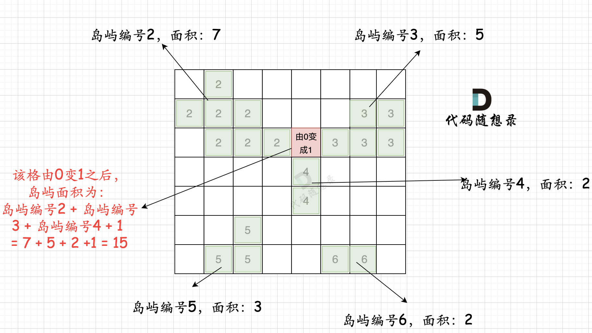
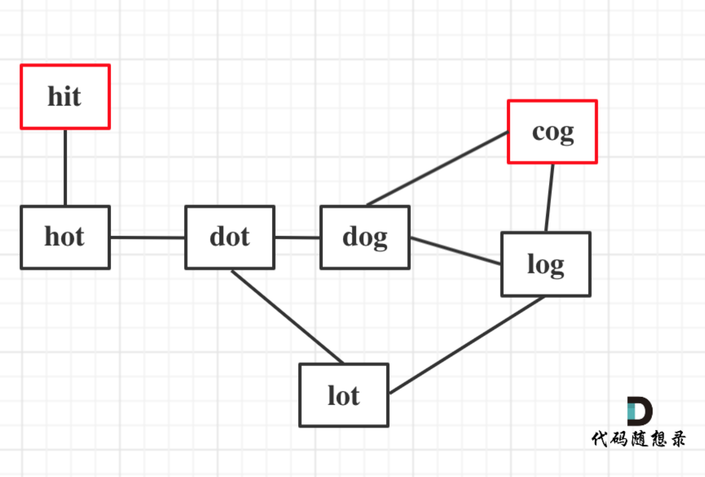

## Day68: 图论part03

### 417. 太平洋大西洋水流问题

[LeetCode](https://leetcode.cn/problems/pacific-atlantic-water-flow/)  [文章讲解](https://programmercarl.com/0417.%E5%A4%AA%E5%B9%B3%E6%B4%8B%E5%A4%A7%E8%A5%BF%E6%B4%8B%E6%B0%B4%E6%B5%81%E9%97%AE%E9%A2%98.html)

#### 题目描述：

有一个 `m × n` 的矩形岛屿，与 **太平洋** 和 **大西洋** 相邻。 **“太平洋”** 处于大陆的左边界和上边界，而 **“大西洋”** 处于大陆的右边界和下边界。

这个岛被分割成一个由若干方形单元格组成的网格。给定一个 `m x n` 的整数矩阵 `heights` ， `heights[r][c]` 表示坐标 `(r, c)` 上单元格 **高于海平面的高度** 。

岛上雨水较多，如果相邻单元格的高度 **小于或等于** 当前单元格的高度，雨水可以直接向北、南、东、西流向相邻单元格。水可以从海洋附近的任何单元格流入海洋。

返回网格坐标 `result` 的 **2D 列表** ，其中 `result[i] = [ri, ci]` 表示雨水从单元格 `(ri, ci)` 流动 **既可流向太平洋也可流向大西洋** 。

**示例 1：**

> 
> 
> 输入: heights = [[1,2,2,3,5],[3,2,3,4,4],[2,4,5,3,1],[6,7,1,4,5],[5,1,1,2,4]]
> 输出: [[0,4],[1,3],[1,4],[2,2],[3,0],[3,1],[4,0]]

**示例 2：**

> 输入: heights = [[2,1],[1,2]]
> 输出: [[0,0],[0,1],[1,0],[1,1]]

#### 参考解法：

**暴力解法**：遍历每个点，然后看这个点 能不能同时到达太平洋和大西洋。遍历每一个节点，是 m * n，遍历每一个节点的时候，都要做深搜，深搜的时间复杂度是： m * n

那么整体时间复杂度 就是 O(m^2 * n^2) ，这是一个四次方的时间复杂度。所以提交超时了

##### 优化：

反过来想，从太平洋边上的节点 逆流而上，将遍历过的节点都标记上。 从大西洋的边上节点 逆流而长，将遍历过的节点也标记上。 然后两方都标记过的节点就是既可以流太平洋也可以流大西洋的节点。

从太平洋边上节点出发，如图：


从大西洋边上节点出发，如图：


按照这样的逻辑，就可以写出如下遍历代码：（详细注释）

```C++
class Solution
{
 private:
	const int direction[4][2] = { -1, 0, 1, 0, 0, -1, 0, 1 };

	// 深度搜索
	void dfs(vector<vector<int>>& heights, vector<vector<bool>>& visited, int x, int y)
	{
		if (visited[x][y]) return;
		visited[x][y] = true;

		for (int i = 0; i < 4; i++)
		{
			int next_x = x + direction[i][0];
			int next_y = y + direction[i][1];
			if (next_x < 0 || next_x >= heights.size() || next_y < 0 || next_y >= heights[0].size()) continue; // 越界
			if (heights[x][y] > heights[next_x][next_y]) continue; // 高度不合适

			dfs(heights, visited, next_x, next_y);
		}
	}

 public:
	vector<vector<int>> pacificAtlantic(vector<vector<int>>& heights)
	{
		vector<vector<int>> result;
		int n = heights.size();
		int m = heights[0].size(); // 这里不用担心空指针，题目要求说了长宽都大于1

		// 记录从太平洋边出发，可以遍历的节点
		vector<vector<bool>> pacific(heights.size(), vector<bool>(heights[0].size(), false));
		// 记录从大西洋出发，可以遍历的节点
		vector<vector<bool>> atlantic(heights.size(), vector<bool>(heights[0].size(), 0));

		// 从最上最下行的节点出发，向高处遍历
		for (int i = 0; i < n; i++)
		{
			 dfs(heights, pacific, i, 0); // 遍历最左列，接触太平洋
			 dfs(heights, atlantic, i, m - 1); // 遍历最右列，接触大西
		}

		// 从最左最右列的节点出发，向高处遍历
		for (int j = 0; j < m; j++)
		{
			dfs(heights, pacific, 0, j); // 遍历最上行，接触太平洋
			dfs(heights, atlantic, n - 1, j); // 遍历最下行，接触大西洋
		}

		for (int i = 0; i < n; i++)
		{
			for (int j = 0; j < m; j++)
			{
				// 如果这个节点，从太平洋和大西洋出发都遍历过，就是结果
				if (pacific[i][j] && atlantic[i][j]) result.push_back({ i, j });
			}
		}
		return result;
	}
};
```

### 827.最大人工岛

[LeetCode](https://leetcode.cn/problems/making-a-large-island/)  [文章讲解](https://programmercarl.com/0827.%E6%9C%80%E5%A4%A7%E4%BA%BA%E5%B7%A5%E5%B2%9B.html)

#### 题目描述：

给你一个大小为 `n x n` 二进制矩阵 `grid` 。**最多** 只能将一格 `0` 变成 `1` 。

返回执行此操作后，`grid` 中最大的岛屿面积是多少？

**岛屿** 由一组上、下、左、右四个方向相连的 `1` 形成。

**示例 1:**

> 输入: grid = [[1, 0], [0, 1]]
> 输出: 3
> 解释: 将一格0变成1，最终连通两个小岛得到面积为 3 的岛屿。

**示例 2:**

> 输入: grid = [[1, 1], [1, 0]]
> 输出: 4
> 解释: 将一格0变成1，岛屿的面积扩大为 4。

**示例 3:**

> 输入: grid = [[1, 1], [1, 1]]
> 输出: 4
> 解释: 没有0可以让我们变成1，面积依然为 4。

#### 参考解法：

**暴力想法**：遍历地图尝试 将每一个 0 改成1，然后去搜索地图中的最大的岛屿面积。

**优化思路**：

只要用一次深搜把每个岛屿的面积记录下来就好。

第一步：一次遍历地图，得出各个岛屿的面积，并做编号记录。可以使用map记录，key为岛屿编号，value为岛屿面积 第二步：在遍历地图，遍历0的方格（因为要将0变成1），并统计该1（由0变成的1）周边岛屿面积，将其相邻面积相加在一起，遍历所有 0 之后，就可以得出 选一个0变成1 之后的最大面积。

拿如下地图的岛屿情况来举例： （1为陆地）


第一步，则遍历题目，并将岛屿到编号和面积上的统计，过程如图所示：


第二步过程如图所示：



也就是遍历每一个0的方格，并统计其相邻岛屿面积，最后取一个最大值。

```C++
class Solution
{
 private:
	const int direction[4][2] = { 1, 0, -1, 0, 0, 1, 0, -1 };
	int area = 0;

	void dfs(vector<vector<int>>& grid, vector<vector<bool>>& visited, int x, int y, int id)
	{
		if (grid[x][y] == 0 || visited[x][y]) return;

		visited[x][y] = true;
		grid[x][y] = id;
		area++;

		for (int i = 0; i < 4; i++)
		{
			int next_x = x + direction[i][0];
			int next_y = y + direction[i][1];
			if (next_x < 0 || next_x >= grid.size() || next_y < 0 || next_y >= grid[0].size()) continue; // 越界

			dfs(grid, visited, next_x, next_y, id);
		}
	}

	void bfs(vector<vector<int>>& grid, vector<vector<bool>>& visited, int x, int y, int id)
	{
		queue<pair<int, int>> qu;
		qu.push({ x, y });
		grid[x][y] = id;
		visited[x][y] = true;
		area++;

		while (!qu.empty())
		{
			auto cur = qu.front();
			qu.pop();

			for (int i = 0; i < 4; i++)
			{
				int next_x = cur.first + direction[i][0];
				int next_y = cur.second + direction[i][1];
				if (next_x < 0 || next_x >= grid.size() || next_y < 0 || next_y >= grid[0].size()) continue;

				if (!visited[next_x][next_y] && grid[next_x][next_y] == 1)
				{
					qu.push({ next_x, next_y });
					grid[next_x][next_y] = id;
					visited[next_x][next_y] = true;
					area++;
				}
			}
		}
	}

 public:
	int largestIsland(vector<vector<int>>& grid)
	{
		int n = grid.size(), m = grid[0].size();
		unordered_map<int, int> id2area;
		vector<vector<bool>> visited(n, vector<bool>(m, false));
		int result = 0;

		int id = 2; // 岛屿编号，从 2 开始
		for (int i = 0; i < n; i++)
		{
			for (int j = 0; j < m; j++)
			{
				if (grid[i][j] == 1 && !visited[i][j])
				{
					area = 0;
					// dfs(grid, visited, i, j, id);
					bfs(grid, visited, i, j, id);
					id2area[id] = area;
					id++;
					result = max(result, area);
				}
			}
		}

		unordered_set<int> visitedGrid; // 标记访问过的岛屿
		for (int i = 0; i < n; i++)
		{
			for (int j = 0; j < m; j++)
			{
				if (grid[i][j] == 0)
				{
					int count = 1; // 记录连接之后的岛屿数量
					visitedGrid.clear(); // 每次使用时，清空
					for (auto& dir : direction)
					{
						int next_x = i + dir[0];
						int next_y = j + dir[1];
						if (next_x < 0 || next_x >= grid.size() || next_y < 0 || next_y >= grid[0].size())
							continue; // 越界

						if (visitedGrid.count(grid[next_x][next_y])) continue; // 添加过的岛屿不要重复添加
						count += id2area[grid[next_x][next_y]];
						visitedGrid.insert(grid[next_x][next_y]); // 标记该岛屿已经添加过
					}
					result = max(result, count);
				}
			}
		}
		return result;
	}
};
```

### 127. 单词接龙

[LeetCode](https://leetcode.cn/problems/word-ladder/)  [文章讲解](https://programmercarl.com/0127.%E5%8D%95%E8%AF%8D%E6%8E%A5%E9%BE%99.html)

#### 题目描述：

字典 `wordList` 中从单词 `beginWord` 和 `endWord` 的 **转换序列** 是一个按下述规格形成的序列 `beginWord -> s1 -> s2 -> ... -> sk`：

- 每一对相邻的单词只差一个字母。
-  对于 `1 <= i <= k` 时，每个 `si` 都在 `wordList` 中。注意， `beginWord` 不需要在 `wordList` 中。
- `sk == endWord`

给你两个单词 `beginWord` 和 `endWord` 和一个字典 `wordList` ，返回 *从 `beginWord` 到 `endWord` 的 **最短转换序列** 中的 **单词数目*** 。如果不存在这样的转换序列，返回 `0` 。

**示例 1：**

> 输入：beginWord = "hit", endWord = "cog", wordList = ["hot","dot","dog","lot","log","cog"]
> 输出：5
> 解释：一个最短转换序列是 "hit" -> "hot" -> "dot" -> "dog" -> "cog", 返回它的长度 5。

**示例 2：**

> 输入：beginWord = "hit", endWord = "cog", wordList = ["hot","dot","dog","lot","log"]
> 输出：0
> 解释：endWord "cog" 不在字典中，所以无法进行转换。

#### 参考解法：

以示例1为例，从这个图中可以看出 hit 到 cog 的路线，不止一条，有三条，一条是最短的长度为5，两条长度为6。



本题只需要求出最短路径的长度就可以了，不用找出路径。

所以这道题要解决两个问题：

- 图中的线是如何连在一起的
- 起点和终点的最短路径长度

首先题目中并没有给出点与点之间的连线，而是要自己去连，条件是字符只能差一个，所以判断点与点之间的关系，要自己判断是不是差一个字符，如果差一个字符，那就是有链接。

然后就是求起点和终点的最短路径长度，**这里无向图求最短路，广搜最为合适，广搜只要搜到了终点，那么一定是最短的路径**。因为广搜就是以起点中心向四周扩散的搜索。

**本题如果用深搜，会比较麻烦，要在到达终点的不同路径中选则一条最短路**。 而广搜只要达到终点，一定是最短路。

另外需要有一个注意点：

- 本题是一个无向图，需要用标记位，标记着节点是否走过，否则就会死循环！
- 本题给出集合是数组型的，可以转成set结构，查找更快一些

```cpp
class Solution2
{
 public:
    int ladderLength(string beginWord, string endWord, vector<string>& wordList)
    {
       // 将vector转成unordered_set，提高查询速度
       unordered_set<string> wordSet(wordList.begin(), wordList.end());
       // 如果endWord没有在wordSet出现，直接返回0
       if (wordSet.find(endWord) == wordSet.end()) return 0;
       // 记录word是否访问过
       unordered_map<string, int> visitMap; // <word, 查询到这个word路径长度>
       // 初始化队列
       queue<string> que;
       que.push(beginWord);
       // 初始化visitMap
       visitMap.insert(pair<string, int>(beginWord, 1));

       while (!que.empty())
       {
          string word = que.front();
          que.pop();
          int path = visitMap[word]; // 这个word的路径长度
          for (int i = 0; i < word.size(); i++)
          {
             string newWord = word; // 用一个新单词替换word，因为每次置换一个字母
             for (int j = 0; j < 26; j++)
             {
                newWord[i] = j + 'a';
                if (newWord == endWord) return path + 1; // 找到了end，返回path+1
                // wordSet出现了newWord，并且newWord没有被访问过
                if (wordSet.find(newWord) != wordSet.end()
                   && visitMap.find(newWord) == visitMap.end())
                {
                   // 添加访问信息
                   visitMap.insert(pair<string, int>(newWord, path + 1));
                   que.push(newWord);
                }
             }
          }
       }
       return 0;
    }
};
```

#### 我的解法：

通过 `oneLetterDifference` 函数判断满足条件的下一个单词，同时需要一个 `visitMap` 记录已经被访问的节点和路径长度长度。提交可以通过，但是时间较长。

```C++
class Solution
{
 private:
	bool oneLetterDifference(const string& word1, const string& word2)
	{
		if (word1.size() != word2.size()) return false;

		int count = 0;
		for (int i = 0; i < word1.size(); i++)
		{
			if (word1[i] != word2[i]) count++;
		}

		if (count == 1) return true;
		return false;
	}

 public:
	int ladderLength(const string& beginWord, const string& endWord, vector<string>& wordList)
	{
		// 记录word是否访问过
		unordered_map<string, int> visitMap; // <word, 查询到这个word路径长度>

		queue<string> qu;
		qu.push(beginWord);
		visitMap[beginWord] = 1;

		while (!qu.empty())
		{
			auto curWord = qu.front();
			qu.pop();
			int path = visitMap[curWord]; // 这个word的路径长度

			for (int i = 0; i < wordList.size(); i++)
			{
				// 符合条件的下一个单词，并且没有被访问过
				if (oneLetterDifference(curWord, wordList[i]) && visitMap.find(wordList[i]) == visitMap.end())
				{
					qu.push(wordList[i]);
					visitMap[wordList[i]] = path+1;

					if (wordList[i] == endWord) return path+1;
				}
			}
		}
		return 0;
	}
};
```

### 今日总结

> ```cpp
> string str  = "test";
> queue<string> qu;
> qu.push(str);
> 
> // 错误用法
> auto& temp = qu.front();
> qu.pop();
> 
> // 正确用法
> auto temp = qu.front();
> qu.pop();
> ```
>
> 在 LeetCode 中提交会报错 `ERROR: AddressSanitizer: heap-use-after-free on address`，即 当使用`delete`关键字释放对象的内存后，该对象仍然会保留指向已经被释放内存的指针。这个指针称为**悬挂指针（Dangling Pointer）**。如果我们**试图访问已经被释放的内存**，就会触发"heap-use-after-free"错误。
>
> **猜测**：`temp`是一个引用，它引用了`qu.front()`返回的队列头部元素。然后，通过`qu.pop()`将该元素从队列中移除。这会导致`temp`成为一个悬挂指针，因为它引用的对象已经被释放。但是这个代码在自己电脑上的CLION运行没有问题，可能与编译器有关。

今天三道题虽然也都是深搜和广搜的应用，但是细节问题还是特别多的，不是很容易想出来。

**求最短路径用广度搜索！**
