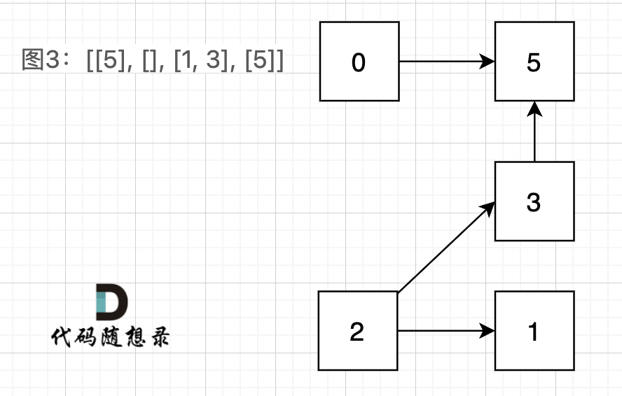
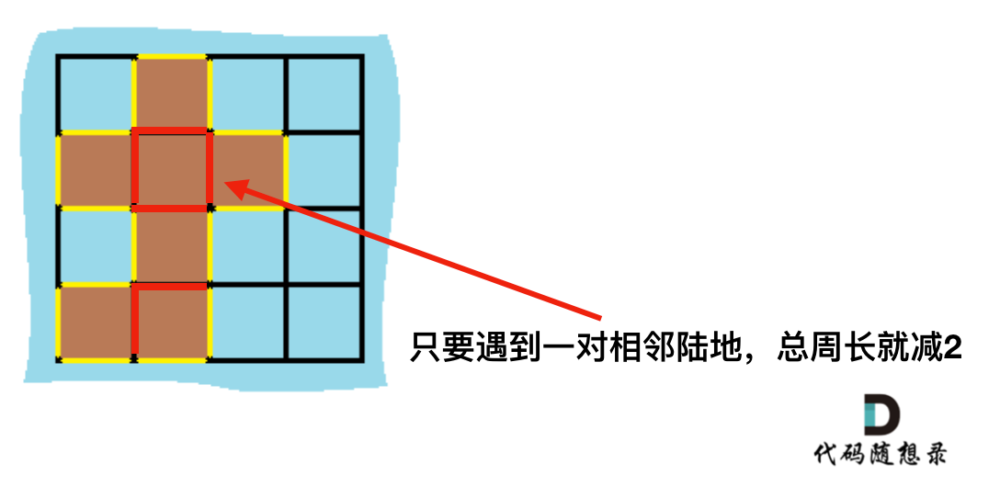

## Day69: 图论part04

### 841.钥匙和房间

[LeetCode](https://leetcode.cn/problems/keys-and-rooms/)  [文章讲解](https://programmercarl.com/0841.%E9%92%A5%E5%8C%99%E5%92%8C%E6%88%BF%E9%97%B4.html)

#### 题目描述：

有 `n` 个房间，房间按从 `0` 到 `n - 1` 编号。最初，除 `0` 号房间外的其余所有房间都被锁住。你的目标是进入所有的房间。然而，你不能在没有获得钥匙的时候进入锁住的房间。

当你进入一个房间，你可能会在里面找到一套不同的钥匙，每把钥匙上都有对应的房间号，即表示钥匙可以打开的房间。你可以拿上所有钥匙去解锁其他房间。

给你一个数组 `rooms` 其中 `rooms[i]` 是你进入 `i` 号房间可以获得的钥匙集合。如果能进入 **所有** 房间返回 `true`，否则返回 `false`。

**示例 1：**

> 输入：rooms = [[1], [2], [3], []]
> 输出：true
> 解释：
> 我们从 0 号房间开始，拿到钥匙 1。
> 之后我们去 1 号房间，拿到钥匙 2。
> 然后我们去 2 号房间，拿到钥匙 3。
> 最后我们去了 3 号房间。
> 由于我们能够进入每个房间，我们返回 true。

**示例 2：**

> 输入：rooms = [[1,3],[3,0,1],[2],[0]]
> 输出：false
> 解释：我们不能进入 2 号房间。

#### 我的解法：

**本题是有向图**，在有向图中，即使所有节点都是链接的，依然不可能从0出发遍历所有边。 例：

图3：[[5], [], [1, 3], [5]] ，如图：



本题是一个有向图搜索全路径的问题。 只能用深搜（DFS）或者广搜（BFS）来搜。

##### 广搜解法：

每经过一个没有遍历过的房间，`count` 计数加 1。遍历结束，如果 `count==room.size()`，则表明遍历完了所有房间。

```C++
class Solution
{
 public:
	bool canVisitAllRooms(vector<vector<int>>& rooms)
	{
		vector<bool> visited(rooms.size(), false); // 记录遍历过的房间
		int count = 0;    // 记录遍历了的房间数量
		queue<int> qu;    // 记录下一个 且 没有被访问的房间

		// 遍历 0 号房间
		qu.push(0);
		visited[0] = true;
		count++;

		while (!qu.empty())
		{
			int cur_room = qu.front();
			qu.pop();

			for (int i = 0; i < rooms[cur_room].size(); i++)
			{
				// 每遍历到一个没有去过的房间 count 加一
				if (!visited[rooms[cur_room][i]])
				{
					qu.push(rooms[cur_room][i]);
					visited[rooms[cur_room][i]] = true;
					count++;
				}
			}
		}

		return rooms.size() == count;
	}
};
```

##### 深搜解法：

本题是需要判断 0节点是否能到所有节点，那么就没有必要回溯去撤销操作了，只要遍历过的节点一律都标记上。

当需要搜索一条可行路径的时候，才需要回溯操作了，因为没有回溯，就没法“调头”。

先进行一遍深搜，然后遍历一遍 `visited` 数组，判断是否所有房间都进去过了。

```cpp
class Solution2
{
 private:
    // 深搜
    void dfs(vector<vector<int>>& rooms, vector<bool>& visited, int cur_room)
    {
       if (visited[cur_room]) return;

       visited[cur_room] = true;
       for (int i = 0; i < rooms[cur_room].size(); i++)
       {
          dfs(rooms, visited, rooms[cur_room][i]);
       }
    }

 public:
    bool canVisitAllRooms(vector<vector<int>>& rooms)
    {
       vector<bool> visited(rooms.size(), false);
       dfs(rooms, visited, 0);

       for (int i = 0; i < visited.size(); i++)
       {
          if (!visited[i]) return false;
       }
       return true;
    }
};
```

### 463. 岛屿的周长

[LeetCode](https://leetcode.cn/problems/island-perimeter/)  [文章讲解](https://programmercarl.com/0463.%E5%B2%9B%E5%B1%BF%E7%9A%84%E5%91%A8%E9%95%BF.html)

#### 题目描述：

给定一个 `row x col` 的二维网格地图 `grid` ，其中：`grid[i][j] = 1` 表示陆地， `grid[i][j] = 0` 表示水域。

网格中的格子 **水平和垂直** 方向相连（对角线方向不相连）。整个网格被水完全包围，但其中恰好有一个岛屿（或者说，一个或多个表示陆地的格子相连组成的岛屿）。

岛屿中没有“湖”（“湖” 指水域在岛屿内部且不和岛屿周围的水相连）。格子是边长为 1 的正方形。网格为长方形，且宽度和高度均不超过 100 。计算这个岛屿的周长。

**示例 1：**

> 
> 
> 输入：grid = [[0,1,0,0],[1,1,1,0],[0,1,0,0],[1,1,0,0]]
> 输出：16
> 解释：它的周长是上面图片中的 16 个黄色的边

**示例 2：**

> 输入：grid = [[1]]
> 输出：4

**示例 3：**

> 输入：grid = [[1,0]]
> 输出：4

#### 我的解法（dfs、bfs）：

通过观察可以发现，岛屿的边间 是由海水或者边界决定的，因此从任意一个陆地开始进行 bfs 或者 dfs，当遍历到边界或者海水时，周长加 1。

```C++
class Solution
{
 private:
	int count = 0;
	const int direction[4][2] = { 1, 0, -1, 0, 0, 1, 0, -1 };

	void dfs(vector<vector<int>>& grid, vector<vector<bool>>& visited, int x, int y)
	{
		if (visited[x][y]) return;

		if (grid[x][y] == 0)
		{
			count++;
			return;
		}

		visited[x][y] = true;
		for (int i = 0; i < 4; i++)
		{
			int next_x = x + direction[i][0];
			int next_y = y + direction[i][1];

			if (next_x < 0 || next_x >= grid.size() || next_y < 0 || next_y >= grid[0].size())
			{
				count++;
				continue;
			}

			dfs(grid, visited, next_x, next_y);
		}
	}

 public:
	int islandPerimeter(vector<vector<int>>& grid)
	{
		int n = grid.size(), m = grid[0].size();
		vector<vector<bool>> visited(n, vector<bool>(m, false));
		for (int i = 0; i < n; i++)
		{
			for (int j = 0; j < m; j++)
			{
				if (grid[i][j] == 1)
				{
					count = 0;
					dfs(grid, visited, i, j);
					return count;
				}
			}
		}
		return 0;
	}
};
```

#### 简易解法：

##### 解法一：

遍历每一个空格，遇到岛屿，计算其上下左右的情况，遇到水域或者出界的情况，就可以计算边了。

如图：


```cpp
// 遇到一个陆地就遍历其四周的情况
class Solution2
{
 public:
    const int direction[4][2] = { 1, 0, -1, 0, 0, 1, 0, -1 };
    int islandPerimeter(vector<vector<int>>& grid)
    {
       int count = 0;
       for (int i = 0; i < grid.size(); i++)
       {
          for (int j = 0; j < grid[0].size(); j++)
          {
             if (grid[i][j] == 1)
             {
                // 遍历四个方向
                for (int k = 0; k < 4; k++)
                {
                   int next_i = i + direction[k][0];
                   int next_j = j + direction[k][1];

                   // 越界或者为海水
                   if (next_i < 0
                      || next_i >= grid.size()
                      || next_j < 0
                      || next_j >= grid[0].size()
                      || grid[next_i][next_j] == 0)
                      count++;
                }
             }
          }
       }
       return count;
    }
};
```

##### 解法二：

计算出总的岛屿数量，因为有一对相邻两个陆地，边的总数就减2，那么在计算出相邻岛屿的数量就可以了。

result = 岛屿数量 * 4 - cover * 2;

如图：



```cpp
// result = 岛屿数量 * 4 - cover * 2
class Solution3
{
 public:
    const int direction[4][2] = { 1, 0, -1, 0, 0, 1, 0, -1 };
    int islandPerimeter(vector<vector<int>>& grid)
    {
       int island = 0;    // 陆地数量
       int cover = 0; // 相邻陆地数量
       for (int i = 0; i < grid.size(); i++)
       {
          for (int j = 0; j < grid[0].size(); j++)
          {
             if (grid[i][j] == 1)
             {
                island++;
                if (i - 1 >= 0 && grid[i - 1][j] == 1) cover++; // 统计上边相邻陆地
                if (j - 1 >= 0 && grid[i][j - 1] == 1) cover++; // 统计左边相邻陆地
                // 为什么没统计下边和右边？ 因为避免重复计算
             }
          }
       }
       return island * 4 - cover * 2;
    }
};
```

### 今日总结

判断能否遍历所有节点时，使用dfs不需要进行回溯；岛屿周长计算有妙法。
