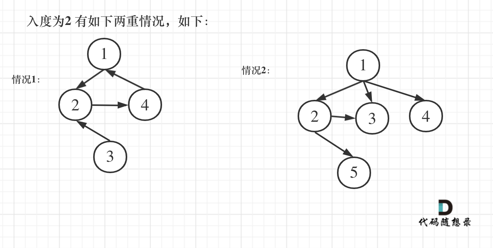

## Day70: 图论part05

### 并查集理论基础

并查集常用来解决连通性问题，就是当需要判断两个元素是否在同一个集合里的时候，就要想到用并查集。

并查集主要有两个功能：

- 将两个元素添加到一个集合中。
- 判断两个元素在不在同一个集合

#### 原理

如何将两个元素添加到同一个集合中呢？

**思路1**：可以把它们放到同一个数组里或者 set 或者 map 中，这样就表述两个元素在同一个集合。

那么问题来了，对这些元素分门别类，可不止一个集合，可能是很多集合，成百上千，那么要定义这么多个数组吗？这仅仅是一个粗略的思路，如果沿着这个思路去实现代码，非常复杂，因为管理集合还需要很多逻辑。

**思路2**：将三个元素A，B，C （分别是数字）放在同一个集合，其实就是将三个元素连通在一起，如何连通呢。

只需要用一个一维数组来表示，即：`father[A] = B`，`father[B] = C` 这样就表述 A 与 B 与 C连通了（有向连通图）。

代码如下：

```cpp
// 将v，u 这条边加入并查集
void join(int u, int v) {
    u = find(u); // 寻找u的根
    v = find(v); // 寻找v的根
    if (u == v) return; // 如果发现根相同，则说明在一个集合，不用两个节点相连直接返回
    father[v] = u;
}
```

这样可以知道 A 连通 B，因为 A 是索引下标，根据 `father[A]` 的数值就知道 A 连通 B。那怎么知道 B 连通 A呢？

因为目的是判断这三个元素是否在同一个集合里，知道 A 连通 B 就已经足够了。

这里要讲到寻根思路，只要 A ，B，C 在同一个根下就是同一个集合。

给出A元素，就可以通过 `father[A] = B`，`father[B] = C`，找到根为 C。

给出B元素，就可以通过 `father[B] = C`，找到根也为为 C，说明 A 和 B 是在同一个集合里。 其实 `find` 函数就是通过数组下标找到数组元素，一层一层寻根过程，代码如下：

```cpp
// 并查集里寻根的过程
int find(int u) {
    if (u == father[u]) return u; // 如果根就是自己，直接返回
    else return find(father[u]); // 如果根不是自己，就根据数组下标一层一层向下找
}
```

如何表示 C 也在同一个元素里呢？ 只需要 `father[C] = C`，即C的根也为C，这样就方便表示 A，B，C 都在同一个集合里了。

所以 `father` 数组初始化的时候要 `father[i] = i`，默认自己指向自己。

代码如下：

```cpp
// 并查集初始化
void init() {
    for (int i = 0; i < n; ++i) {
        father[i] = i;
    }
}
```

最后如何判断两个元素是否在同一个集合里，如果通过 `find` 函数 找到 两个元素属于同一个根的话，那么这两个元素就是同一个集合，代码如下：

```cpp
// 判断 u 和 v是否找到同一个根
bool isSame(int u, int v) {
    u = find(u);
    v = find(v);
    return u == v;
}
```

#### 路径压缩

在实现 `find` 函数的过程中，通过递归的方式，不断获取 `father` 数组下标对应的数值，最终找到这个集合的根。

搜索过程像是一个多叉树中从叶子到根节点的过程，如图：


如果这棵多叉树高度很深的话，每次 `find` 函数 去寻找跟的过程就要递归很多次。

但是只需要知道这些节点在同一个根下就可以，所以对这棵多叉树的构造只需要这样就可以了，如图：


除了根节点其他所有节点都挂载根节点下，这样在寻根的时候就很快，只需要一步，

如果、达到这样的效果，就需要 **路径压缩**，将非根节点的所有节点直接指向根节点。 那么在代码层面如何实现呢？

只需要在递归的过程中，让 `father[u]` 接住 递归函数 `find(father[u])` 的返回结果。

因为 `find` 函数向上寻找根节点，`father[u]` 表述 `u` 的父节点，那么让 `father[u]` 直接获取 `find` 函数 返回的根节点，这样就让节点 u 的父节点 变成根节点。

代码如下，注意看注释，路径压缩就一行代码：

```cpp
// 并查集里寻根的过程
int find(int u) {
    if (u == father[u]) return u;
    else return father[u] = find(father[u]); // 路径压缩
    // 等价于 father[u] = find(father[u]); return father[u];
}
```

以上代码在C++中，可以用三元表达式来精简一下，代码如下：

```cpp
int find(int u) {
    return u == father[u] ? u : father[u] = find(father[u]);
}
```

#### 代码模板

那么此时并查集的模板就出来了， 整体模板C++代码如下：

```cpp
int n = 1005; // n根据题目中节点数量而定，一般比节点数量大一点就好
vector<int> father = vector<int> (n, 0);

// 并查集初始化
void init() {
    for (int i = 0; i < n; ++i) {
        father[i] = i;
    }
}

// 并查集里寻根的过程
int find(int u) {
    return u == father[u] ? u : father[u] = find(father[u]); // 路径压缩
}

// 判断 u 和 v是否找到同一个根
bool isSame(int u, int v) {
    u = find(u);
    v = find(v);
    return u == v;
}

// 将v->u 这条边加入并查集
void join(int u, int v) {
    u = find(u); // 寻找u的根
    v = find(v); // 寻找v的根
    if (u == v) return ; // 如果发现根相同，则说明在一个集合，不用两个节点相连直接返回
    father[v] = u;
}
```

通过模板，可以知道，并查集主要有三个功能。

1. 寻找根节点，函数：`find(int u)`，也就是判断这个节点的祖先节点是哪个
2. 将两个节点接入到同一个集合，函数：`join(int u, int v)`，将两个节点连在同一个根节点上
3. 判断两个节点是否在同一个集合，函数：`isSame(int u, int v)`，就是判断两个节点是不是同一个根节点

#### 常见误区

模板中的 join 函数里的这段代码：

```cpp
u = find(u); // 寻找u的根
v = find(v); // 寻找v的根
if (u == v) return ; // 如果发现根相同，则说明在一个集合，不用两个节点相连直接返回
```

与 isSame 函数的实现是不是重复了？ 如果抽象一下呢，代码如下：

```cpp
// 判断 u 和 v是否找到同一个根
bool isSame(int u, int v) {
    u = find(u);
    v = find(v);
    return u == v;
}

// 将v->u 这条边加入并查集
void join(int u, int v) {
    if (isSame) return ; // 如果发现根相同，则说明在一个集合，不用两个节点相连直接返回
    father[v] = u;
}
```

这样写可以吗？ 好像看出去没问题，而且代码更精简了。

**其实这么写是有问题的**，在 `join` 函数中需要寻找 `u` 和 `v` 的根，然后再进行连线在一起，而不是直接 用 `u` 和 `v` 连线在一起。

举一个例子：

```text
join(1, 2);
join(3, 2);
```

此时构成的图是这样的：


此时问 1，3是否在同一个集合，调用 `join(1, 2); join(3, 2);` 很明显本意要表示 1，3是在同一个集合。

但来看一下代码逻辑，当调用 `isSame(1, 3)`的时候，`find(1)` 返回的是1，`find(3)` 返回的是3。 `return 1 == 3` 返回的是 `false`，代码说明 1 和 3 不在同一个集合，这明显不符合预期，所以问题出在哪里？

问题出在精简的代码上，即 **`join` 函数 一定要先 通过 `find` 函数寻根再进行关联**。

如果 `find` 函数是这么实现，再来看一下逻辑过程。

```cpp
void join(int u, int v) {
    u = find(u); // 寻找u的根
    v = find(v); // 寻找v的根
    if (u == v) return ; // 如果发现根相同，则说明在一个集合，不用两个节点相连直接返回
    father[v] = u;
}
```

分别将 这两对元素加入集合。

```cpp
join(1, 2);
join(3, 2);
```

当执行 `join(3, 2)` 的时候，会先通过 `find` 函数寻找 3 的根为 3，2 的根为1 （第一个`join(1, 2)`，将 2 的根设置为 1），所以最后是将1 指向 3。

构成的图是这样的：


因为在 `join` 函数里，有 `find` 函数进行寻根的过程，这样就保证元素 1，2，3 在这个有向图里是强连通的。

此时在调用  `isSame(1, 3) `的时候，`find(1)` 返回的是 3，`find(3)` 返回的也是3，`return 3 == 3` 返回的是true，即 元素 1 和 元素3 是 在同一个集合里的。

#### 模拟过程

（**凸显途径合并的过程，每一个join都要画图**）

1、`join(1, 8);`


2、`join(3, 8);`


`join(3, 8)` 在图中为什么 将 元素1 连向元素 3 而不是将 元素 8 连向 元素 3 呢？

这一点 「常见误区」标题下已经详细讲解了，因为在 `join(int u, int v)` 函数里 要分别对 u 和 v 寻根之后再进行关联。

3、`join(1, 7);`


4、`join(8, 5);`


这里 8 的根是 3，那么 5 应该指向 8 的根 3。 但 为什么 图中 8 又直接指向了 3 了呢？

**因为路经压缩了**

即如下代码在寻找跟的过程中，会有路径压缩，减少 下次查询的路径长度。

```cpp
// 并查集里寻根的过程
int find(int u) {
    return u == father[u] ? u : father[u] = find(father[u]); // 路径压缩
}
```

5、`join(2, 9);`


6、`join(6, 9);`


这里为什么是 2 指向了 6，因为 9 的根为 2，所以用2指向6。

那么对于如下函数的返回值：

```cpp
cout << isSame(8, 7) << endl;
cout << isSame(7, 2) << endl;
```

返回值分别如下，表示，8 和 7 是同一个集合，而 7 和 2 不是同一个集合。

```cpp
true
false
```

#### 复杂度分析

空间复杂度： O(n) ，申请一个father数组。

在第一次查询的时候，相当于是n叉树上从叶子节点到根节点的查询过程，时间复杂度是 logn，但路径压缩后，后面的查询操作都是O(1)，而 `join` 函数 和 `isSame` 函数 里涉及的查询操作也是一样的过程。

#### 代码封装

##### union_set.h

```cpp
#pragma once
#include <vector>
using std::vector;

class UnionSet
{
 public:
    UnionSet(int n);
    ~UnionSet() = default;

    int size() const;               // 返回 m_father 数组的大小
    int father(int u) const;        // 返回 u 的根节点
    int find(int u);                // 并查集里寻根的过程
    bool isSame(int u, int v);      // 判断 u 和 v是否找到同一个根
    void join(int u, int v);        // 将v->u 这条边加入并查集

 private:
    vector<int> m_father;
};
```

##### union_set.cpp

```cpp
#include <union_set.h>

UnionSet::UnionSet(int n)
{
    m_father.resize(n);

    // 并查集初始化
    for (int i = 0; i < m_father.size(); i++)
    {
       m_father[i] = i;
    }
}

int UnionSet::size() const
{
    return m_father.size();
}

int UnionSet::father(int u) const
{
    return m_father[u];
}

// 并查集里寻根的过程
int UnionSet::find(int u)
{
    return u == m_father[u] ? u : m_father[u] = find(m_father[u]); // 压缩路径
}

// 判断 u 和 v是否找到同一个根
bool UnionSet::isSame(int u, int v)
{
    return find(u) == find(v);
}

// 将v->u 这条边加入并查集
void UnionSet::join(int u, int v)
{
    u = find(u); // 寻找u的根
    v = find(v); // 寻找v的根
    if (u == v) return; // 如果发现根相同，则说明在一个集合，不用两个节点相连直接返回
    m_father[v] = u;
}
```

### 1971. 寻找图中是否存在路径

[LeetCode](https://leetcode.cn/problems/find-if-path-exists-in-graph/)  [文章讲解](https://programmercarl.com/1971.%E5%AF%BB%E6%89%BE%E5%9B%BE%E4%B8%AD%E6%98%AF%E5%90%A6%E5%AD%98%E5%9C%A8%E8%B7%AF%E5%BE%84.html)

#### 题目描述：

有一个具有 `n` 个顶点的 **双向** 图，其中每个顶点标记从 `0` 到 `n - 1`（包含 `0` 和 `n - 1`）。图中的边用一个二维整数数组 `edges` 表示，其中 `edges[i] = [ui, vi]` 表示顶点 `ui` 和顶点 `vi` 之间的双向边。 每个顶点对由 **最多一条** 边连接，并且没有顶点存在与自身相连的边。

请你确定是否存在从顶点 `source` 开始，到顶点 `destination` 结束的 **有效路径** 。

给你数组 `edges` 和整数 `n`、`source` 和 `destination`，如果从 `source` 到 `destination` 存在 **有效路径** ，则返回 `true`，否则返回 `false` 。

**示例 1：**


> 输入：n = 3, edges = [[0,1],[1,2],[2,0]], source = 0, destination = 2
> 输出：true
> 解释：存在由顶点 0 到顶点 2 的路径:
> 
> - 0 → 1 → 2 
> - 0 → 2

**示例 2：**


> 输入：n = 6, edges = [[0,1],[0,2],[3,5],[5,4],[4,3]], source = 0, destination = 5
> 输出：false
> 解释：不存在由顶点 0 到顶点 5 的路径.

#### 我的解法：

题目大意就是 `source` 和 `destination` 是否在一个并查集之中，使用并查集模版，挺容易的。将所有边加入并查集，最后执行 `isSame(source, destination)` 即可。

使用封装的函数版本：

```C++
#include <union_set.h>
using namespace std;

class Solution
{
 public:
	bool validPath(int n, vector<vector<int>>& edges, int source, int destination)
	{
		UnionSet uset(n); // 使用封装好的类
		for (int i = 0; i < edges.size(); i++)
		{
			uset.join(edges[i][0], edges[i][1]);
		}
		return uset.isSame(source, destination);
	}
};
```

LeetCode 提交的版本：

```cpp
// LeetCode 提交的版本
class Solution2
{
 private:
    vector<int> father;

    void init(int n)
    {
       father.clear();
       father.resize(n);

       // 并查集初始化
       for (int i = 0; i < n; i++)
       {
          father[i] = i;
       }
    }

    // 查找根节点
    int find(int u)
    {
       return u == father[u] ? u : father[u] = find(father[u]);
    }

    bool isSame(int u, int v)
    {
       return find(u) == find(v);
    }

    void join(int u, int v)
    {
       u = find(u);
       v = find(v);
       if (u == v) return;
       father[v] = u;
    }

 public:
    bool validPath(int n, vector<vector<int>>& edges, int source, int destination)
    {
       init(n);
       for (int i = 0; i < edges.size(); i++)
       {
          join(edges[i][0], edges[i][1]);
       }
       return isSame(source, destination);
    }
};
```

### 684. 冗余连接

[LeetCode](https://leetcode.cn/problems/redundant-connection/)  [文章讲解](https://programmercarl.com/0684.%E5%86%97%E4%BD%99%E8%BF%9E%E6%8E%A5.html)

#### 题目描述：

树可以看成是一个连通且 **无环** 的 **无向** 图。

给定往一棵 `n` 个节点 (节点值 `1～n`) 的树中添加一条边后的图。添加的边的两个顶点包含在 `1` 到 `n` 中间，且这条附加的边不属于树中已存在的边。图的信息记录于长度为 `n` 的二维数组 `edges` ，`edges[i] = [ai, bi]` 表示图中在 `ai` 和 `bi` 之间存在一条边。

请找出一条可以删去的边，删除后可使得剩余部分是一个有着 `n` 个节点的树。如果有多个答案，则返回数组 `edges` 中最后出现的那个。

**示例 1：**

> 
> 
> 输入: edges = [[1,2], [1,3], [2,3]]
> 输出: [2,3]

**示例 2：**

> 
> 
> 输入: edges = [[1,2], [2,3], [3,4], [1,4], [1,5]]
> 输出: [1,4]

#### 我的解法：

如果边的两个节点已经出现在同一个集合里，说明着边的两个节点已经连在一起了，再加入这条边一定就出现环了。

使用封装的函数版本：

```C++
#include <union_set.h>
using namespace std;

class Solution
{
 public:
	vector<int> findRedundantConnection(vector<vector<int>>& edges)
	{
		vector<int> result;
		UnionSet uset(edges.size() + 1); // 注意 节点是从 1 开始
		for (int i = 0; i < edges.size(); i++)
		{
			if (uset.isSame(edges[i][0], edges[i][1])) 
                return edges[i];
			uset.join(edges[i][0], edges[i][1]);
		}
		return {};
	}
};
```

LeetCode 提交的版本：

```cpp
class Solution2
{
 private:
    vector<int> father;

    void init(int n)
    {
       father.clear();
       father.resize(n);
       for (int i = 0; i < father.size(); i++)
       {
          father[i] = i;
       }
    }

    int find(int u)
    {
       return u == father[u] ? u : father[u] = find(father[u]);
    }

    bool isSame(int u, int v)
    {
       return find(u) == find(v);
    }

    void join(int u, int v)
    {
       u = find(u);
       v = find(v);
       if (u == v) return;
       father[v] = u;
    }

 public:
    vector<int> findRedundantConnection(vector<vector<int>>& edges)
    {
       vector<int> result;
       init(edges.size() + 1); // 注意 节点是从 1 开始
       for (int i = 0; i < edges.size(); i++)
       {
          if (isSame(edges[i][0], edges[i][1])) 
              return edges[i];
          join(edges[i][0], edges[i][1]);
       }
       return {};
    }
};
```

### 685.冗余连接II

[LeetCode](https://leetcode.cn/problems/redundant-connection-ii/)  [文章讲解](https://programmercarl.com/0685.%E5%86%97%E4%BD%99%E8%BF%9E%E6%8E%A5II.html)

#### 题目描述：

在本问题中，有根树指满足以下条件的 **有向** 图。该树只有一个根节点，所有其他节点都是该根节点的后继。该树除了根节点之外的每一个节点都有且只有一个父节点，而根节点没有父节点。

输入一个有向图，该图由一个有着 `n` 个节点（节点值不重复，从 `1` 到 `n`）的树及一条附加的有向边构成。附加的边包含在 `1` 到 `n` 中的两个不同顶点间，这条附加的边不属于树中已存在的边。

结果图是一个以边组成的二维数组 `edges` 。 每个元素是一对 `[ui, vi]`，用以表示 **有向** 图中连接顶点 `ui` 和顶点 `vi` 的边，其中 `ui` 是 `vi` 的一个父节点。

返回一条能删除的边，使得剩下的图是有 `n` 个节点的有根树。若有多个答案，返回最后出现在给定二维数组的答案。

**示例 1：**

> 
> 
> 输入：edges = [[1,2],[1,3],[2,3]]
> 输出：[2,3]

**示例 2：**

> 
> 
> 输入：edges = [[1,2],[2,3],[3,4],[4,1],[1,5]]
> 输出：[4,1]

#### 参考解法：

先重点读懂题目中的这句 **该图由一个有着N个节点 (节点值不重复1, 2, ..., N) 的树及一条附加的边构成。附加的边的两个顶点包含在1到N中间，这条附加的边不属于树中已存在的边。**

**这说明题目中的图原本是是一棵树，只不过在不增加节点的情况下多加了一条边！**

还有 **若有多个答案，返回最后出现在给定二维数组的答案。**这说明在两条边都可以删除的情况下，要删顺序靠后的！

那么有如下三种情况，前两种情况是出现入度为2的点，如图：



且只有一个节点入度为2，为什么不看出度呢，出度没有意义，一棵树中随便一个父节点就有多个出度。

第三种情况是没有入度为2的点，那么图中一定出现了有向环（**注意这里强调是有向环！**）

如图：


首先先计算节点的入度，即 `edges[i][1]` 表示的节点都是 箭头指向的节点，即这个几点有一个入度！ （如果想统计出度，那么就是 `edges[i][0]`）。

所以，统计入度的代码如下：

```cpp
int inDegree[N] = {0}; // 记录节点入度
n = edges.size(); // 边的数量
for (int i = 0; i < n; i++) {
    inDegree[edges[i][1]]++; // 统计入度
}
```

前两种入度为2的情况，一定是删除指向入度为2的节点的两条边其中的一条，如果删了一条，判断这个图是一个树，那么这条边就是答案，同时注意要从后向前遍历，因为如果两条边删哪一条都可以成为树，就删最后那一条。

代码如下：

```cpp
vector<int> vec; // 记录入度为2的边（如果有的话就两条边）
// 找入度为2的节点所对应的边，注意要倒序，因为优先返回最后出现在二维数组中的答案
for (int i = n - 1; i >= 0; i--) {
    if (inDegree[edges[i][1]] == 2) {
        vec.push_back(i);
    }
}
// 处理图中情况1 和 情况2
// 如果有入度为2的节点，那么一定是两条边里删一个，看删哪个可以构成树
if (vec.size() > 0) {
    if (isTreeAfterRemoveEdge(edges, vec[0])) {
        return edges[vec[0]];
    } else {
        return edges[vec[1]];
    }
}
```

在来看情况三，明确没有入度为2的情况，那么一定有向环，找到构成环的边就是要删除的边。

可以定义一个函数，代码如下：

```cpp
// 在有向图里找到删除的那条边，使其变成树，返回值就是要删除的边
vector<int> getRemoveEdge(const vector<vector<int>>& edges)
```

大家应该知道了，我们要实现两个最为关键的函数：

- `isTreeAfterRemoveEdge()` 判断删一个边之后是不是树了
- `getRemoveEdge` 确定图中一定有了有向环，那么要找到需要删除的那条边

此时应该是用到**并查集**了，并查集为什么可以判断 一个图是不是树呢？

**因为如果两个点所在的边在添加图之前如果就可以在并查集里找到了相同的根，那么这条边添加上之后 这个图一定不是树了**

本题C++代码如下：（详细注释了）

```cpp
class Solution {
private:
    static const int N = 1010; // 如题：二维数组大小的在3到1000范围内
    int father[N];
    int n; // 边的数量
    // 并查集初始化
    void init() {
        for (int i = 1; i <= n; ++i) {
            father[i] = i;
        }
    }
    // 并查集里寻根的过程
    int find(int u) {
        return u == father[u] ? u : father[u] = find(father[u]);
    }
    // 将v->u 这条边加入并查集
    void join(int u, int v) {
        u = find(u);
        v = find(v);
        if (u == v) return ;
        father[v] = u;
    }
    // 判断 u 和 v是否找到同一个根
    bool same(int u, int v) {
        u = find(u);
        v = find(v);
        return u == v;
    }
    // 在有向图里找到删除的那条边，使其变成树
    vector<int> getRemoveEdge(const vector<vector<int>>& edges) {
        init(); // 初始化并查集
        for (int i = 0; i < n; i++) { // 遍历所有的边
            if (same(edges[i][0], edges[i][1])) { // 构成有向环了，就是要删除的边
                return edges[i];
            }
            join(edges[i][0], edges[i][1]);
        }
        return {};
    }

    // 删一条边之后判断是不是树
    bool isTreeAfterRemoveEdge(const vector<vector<int>>& edges, int deleteEdge) {
        init(); // 初始化并查集
        for (int i = 0; i < n; i++) {
            if (i == deleteEdge) continue;
            if (same(edges[i][0], edges[i][1])) { // 构成有向环了，一定不是树
                return false;
            }
            join(edges[i][0], edges[i][1]);
        }
        return true;
    }
    
public:
    vector<int> findRedundantDirectedConnection(vector<vector<int>>& edges) {
        int inDegree[N] = {0}; // 记录节点入度
        n = edges.size(); // 边的数量
        for (int i = 0; i < n; i++) {
            inDegree[edges[i][1]]++; // 统计入度
        }
        vector<int> vec; // 记录入度为2的边（如果有的话就两条边）
        // 找入度为2的节点所对应的边，注意要倒序，因为优先返回最后出现在二维数组中的答案
        for (int i = n - 1; i >= 0; i--) {
            if (inDegree[edges[i][1]] == 2) {
                vec.push_back(i);
            }
        }
        // 处理图中情况1 和 情况2
        // 如果有入度为2的节点，那么一定是两条边里删一个，看删哪个可以构成树
        if (vec.size() > 0) {
            if (isTreeAfterRemoveEdge(edges, vec[0])) {
                return edges[vec[0]];
            } else {
                return edges[vec[1]];
            }
        }
        // 处理图中情况3
        // 明确没有入度为2的情况，那么一定有有向环，找到构成环的边返回就可以了
        return getRemoveEdge(edges);

    }
};
```

### 今日总结

重点理解并查集的思路，前两道题使用并查集模版很容易就能做出了，第三题有点绕，没做出来。
