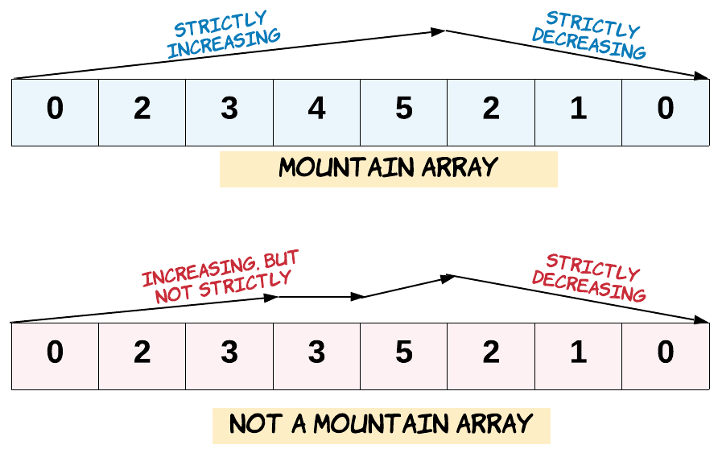

## Day71: 额外题目（数组part1）

### 1365. 有多少小于当前数字的数字

[LeetCode](https://leetcode.cn/problems/how-many-numbers-are-smaller-than-the-current-number/)  [文章讲解](https://programmercarl.com/1365.%E6%9C%89%E5%A4%9A%E5%B0%91%E5%B0%8F%E4%BA%8E%E5%BD%93%E5%89%8D%E6%95%B0%E5%AD%97%E7%9A%84%E6%95%B0%E5%AD%97.html)

#### 题目描述：

给你一个数组 `nums`，对于其中每个元素 `nums[i]`，请你统计数组中比它小的所有数字的数目。

换而言之，对于每个 `nums[i]` 你必须计算出有效的 `j` 的数量，其中 `j` 满足 `j != i` **且** `nums[j] < nums[i]` 。

以数组形式返回答案。

**示例 1：**

> 输入：nums = [8,1,2,2,3]
> 输出：[4,0,1,1,3]
> 解释： 
> 对于 nums[0]=8 存在四个比它小的数字：（1，2，2 和 3）。 
> 对于 nums[1]=1 不存在比它小的数字。
> 对于 nums[2]=2 存在一个比它小的数字：（1）。 
> 对于 nums[3]=2 存在一个比它小的数字：（1）。 
> 对于 nums[4]=3 存在三个比它小的数字：（1，2 和 2）。

**示例 2：**

> 输入：nums = [6,5,4,8]
> 输出：[2,1,0,3]

**示例 3：**

> 输入：nums = [7,7,7,7]
> 输出：[0,0,0,0]

#### 我的解法（暴力解法）：

两层 for 循环遍历，时间复杂度明显为$O(n^2)$。

```C++
// 暴力法
class Solution
{
 public:
	vector<int> smallerNumbersThanCurrent(vector<int>& nums)
	{
		vector<int> result(nums.size(), 0);
		for (int i = 0; i < nums.size(); i++)
		{
			for (int j = 0; j < nums.size(); j++)
			{
				if (nums[j] < nums[i]) result[i]++;
			}
		}
		return result;
	}
};
```

#### 哈希法：

首先要找小于当前数字的数字，那么从小到大排序之后，该数字之前的数字就都是比它小的了。

所以可以定义一个新数组，将数组排个序。

**排序之后，其实每一个数值的下标就代表这前面有几个比它小的了**。

用一个哈希表hash（本题可以就用一个数组）来做数值和下标的映射。这样就可以通过数值快速知道下标（也就是前面有几个比它小的）。

此时有一个情况，就是数值相同怎么办？

例如，数组：1 2 3 4 4 4 ，第一个数值4的下标是3，第二个数值4的下标是4了。

这里就需要一个技巧了，**在构造数组hash的时候，从后向前遍历，这样hash里存放的就是相同元素最左面的数值和下标了**。

最后在遍历原数组nums，用hash快速找到每一个数值 对应的 小于这个数值的个数。存放在将结果存放在另一个数组中。

流程如图：


```cpp
// 哈希法
class Solution2
{
 public:
    vector<int> smallerNumbersThanCurrent(vector<int>& nums)
    {
       vector<int> vec = nums;
       sort(vec.begin(), vec.end());  // 从小到大排序之后，元素下标就是小于当前数字的数字

       unordered_map<int, int> umap;
       // 从后向前，记录 vec[i] 对应的下标, 这样 umap 里存放的就是相同元素最左面的数值和下标了
       for (int i = vec.size() - 1; i >= 0; i--)
          umap[vec[i]] = i;

       // 此时 umap 里保存的每一个元素数值 对应的 小于这个数值的个数
       for (int i = 0; i < vec.size(); i++)
       {
          vec[i] = umap[nums[i]];
       }
       return vec;
    }
};
```

### 941.有效的山脉数组

[LeetCode](https://leetcode.cn/problems/valid-mountain-array/)  [文章讲解](https://programmercarl.com/0941.%E6%9C%89%E6%95%88%E7%9A%84%E5%B1%B1%E8%84%89%E6%95%B0%E7%BB%84.html)

#### 题目描述：

给定一个整数数组 `arr`，如果它是有效的山脉数组就返回 `true`，否则返回 `false`。

让我们回顾一下，如果 `arr` 满足下述条件，那么它是一个山脉数组：

- `arr.length >= 3`

- 在 `0 < i < arr.length - 1` 条件下，存在 `i` 使得：

   - `arr[0] < arr[1] < ... arr[i-1] < arr[i] `
- `arr[i] > arr[i+1] > ... > arr[arr.length - 1]`



**示例 1：**

> 输入：arr = [2,1]
> 输出：false

**示例 2：**

> 输入：arr = [3,5,5]
> 输出：false

**示例 3：**

> 输入：arr = [0,3,2,1]
> 输出：true

#### 我的解法：

首先找到最大值的下标，然后判断最大值下标左边是否递增，右边是否递减

```C++
// 暴力法
class Solution
{
 public:
	bool validMountainArray(vector<int>& arr)
	{
		if (arr.size() < 3) return false;

		int maxIndex = 0;
		for (int i = 1; i < arr.size(); i++)
		{
			if (arr[i] > arr[maxIndex]) maxIndex = i;
		}
		// 如果 maxIndex 在两端，说明不是山峰
		if (maxIndex == 0 || maxIndex == arr.size() - 1) return false;

		for (int i = 1; i < arr.size(); i++)
		{
			if (i <= maxIndex && arr[i - 1] < arr[i]) continue;
			else if (i > maxIndex && arr[i - 1] > arr[i]) continue;

			return false;
		}

		return true;
	}
};
```

#### 双指针法：

判断是山峰，主要就是要严格的保存左边到中间，和右边到中间是递增的。

这样可以使用两个指针，`left` 和 `right`，让其按照如下规则移动，如图：


**注意这里还是有一些细节，例如如下两点：**

- 因为 `left` 和 `right` 是数组下标，移动的过程中注意不要数组越界
- 如果 `left` 或者 `right` 没有移动，说明是一个单调递增或者递减的数组，依然不是山峰

```cpp
// 双指针法
class Solution2
{
 public:
    bool validMountainArray(vector<int>& arr)
    {
       if (arr.size() < 3) return false;

       int left = 0;
       int right = arr.size() - 1;

       // 注意防止越界
       while (left < arr.size() - 1 && arr[left] < arr[left + 1]) left++;

       while (right > 0 && arr[right] < arr[right - 1]) right--;

       // 如果left或者right都在起始位置，说明不是山峰
       if (left == right && left != 0 && right != arr.size() - 1) return true;
       return false;
    }
};
```

### 1207.独一无二的出现次数

[LeetCode](https://leetcode.cn/problems/unique-number-of-occurrences/)  [文章讲解](https://programmercarl.com/1207.%E7%8B%AC%E4%B8%80%E6%97%A0%E4%BA%8C%E7%9A%84%E5%87%BA%E7%8E%B0%E6%AC%A1%E6%95%B0.html)

#### 题目描述：

给你一个整数数组 `arr`，请你帮忙统计数组中每个数的出现次数。

如果每个数的出现次数都是独一无二的，就返回 `true`；否则返回 `false`。

**示例 1：**

> 输入：arr = [1,2,2,1,1,3]
> 输出：true
> 解释：在该数组中，1 出现了 3 次，2 出现了 2 次，3 只出现了 1 次。没有两个数的出现次数相同。

**示例 2：**

> 输入：arr = [1,2]
> 输出：false

**示例 3：**

> 输入：arr = [-3,0,1,-3,1,1,1,-3,10,0]
> 输出：true

#### 我的解法：

  先使用 map 统计各个数字出现次数，然后通过 set 来判断是否有重复的出现次数。

```C++
class Solution
{
 public:
	bool uniqueOccurrences(vector<int>& arr)
	{
		// 统计出现的频率
		unordered_map<int, int> umap;
		for (int i = 0; i < arr.size(); i++)
			umap[arr[i]]++;

		unordered_set<int> uset;
		for (auto it = umap.begin(); it != umap.end(); ++it)
		{
            // 有重复的出现次数，直接返回 false
			if (uset.count(it->second)) return false;

			uset.insert(it->second);
		}
		return true;
	}
};
```

### 283. 移动零

[LeetCode](https://leetcode.cn/problems/move-zeroes/)  [文章讲解](https://programmercarl.com/0283.%E7%A7%BB%E5%8A%A8%E9%9B%B6.html)

#### 题目描述：

给定一个数组 `nums`，编写一个函数将所有 `0` 移动到数组的末尾，同时保持非零元素的相对顺序。

**请注意** ，必须在不复制数组的情况下原地对数组进行操作。

**示例 1:**

> 输入: nums = [0,1,0,3,12]
> 输出: [1,3,12,0,0]

**示例 2:**

> 输入: nums = [0]
> 输出: [0]

#### 双指针法：

**相当于对整个数组移除元素0，然后slowIndex之后都是移除元素0的冗余元素，把这些元素都赋值为0就可以了**。

如动画所示：


```cpp
class Solution
{
 public:
	void moveZeroes(vector<int>& nums)
	{
		int slowIndex = 0;
		for (int fastIndex = 0; fastIndex < nums.size(); fastIndex++)
		{
			if (nums[fastIndex] != 0) nums[slowIndex++] = nums[fastIndex];
		}
		
		// 将slowIndex之后的冗余元素赋值为0
		for (int i = slowIndex; i < nums.size(); i++)
			nums[i] = 0;
	}
};
```

精简版：

```C++
class Solution {
public:
    void moveZeroes(vector<int>& nums) 
    {
        for(int i = 0, j = 0; j < nums.size(); j++)
        {
            if(nums[j] != 0)
            {
                swap(nums[i], nums[j]);
                i++;
            }
        }
    }
};
```

### 189. 轮转数组
[LeetCode](https://leetcode.cn/problems/rotate-array/)  [文章讲解](https://programmercarl.com/0189.%E6%97%8B%E8%BD%AC%E6%95%B0%E7%BB%84.html)

#### 题目描述：

给定一个整数数组 `nums`，将数组中的元素向右轮转 `k` 个位置，其中 `k` 是非负数。

**示例 1:**

> 输入: nums = [1,2,3,4,5,6,7], k = 3
> 输出: [5,6,7,1,2,3,4]
> 解释:
> 向右轮转 1 步: [7,1,2,3,4,5,6]
> 向右轮转 2 步: [6,7,1,2,3,4,5]
> 向右轮转 3 步: [5,6,7,1,2,3,4]

**示例 2:**

> 输入：nums = [-1,-100,3,99], k = 2
> 输出：[3,99,-1,-100]
> 解释: 
> 向右轮转 1 步: [99,-1,-100,3]
> 向右轮转 2 步: [3,99,-1,-100]

#### 我的解法：

使用了一个额外的数组，需要的结果就是 `[vec.size() - k, vec.size() + k)` 之间的范围，下标使用 `i % vec.size()` 。

```C++
class Solution
{
 public:
	void rotate(vector<int>& nums, int k)
	{
		vector<int> vec = nums;

		for (int i = vec.size() - k % vec.size(), j = 0; j < nums.size(); i++, j++)
		{
			nums[j] = vec[i % vec.size()];
		}
	}
};
```

#### 参考解法：

本题是右旋转，其实就是反转的顺序改动一下，优先反转整个字符串，步骤如下：

1. 反转整个字符串
2. 反转区间为前k的子串
3. 反转区间为k到末尾的子串

**需要注意的是，本题还有一个小陷阱，题目输入中，如果k大于nums.size了应该怎么办？**

例如，1,2,3,4,5,6,7 如果右移动15次的话，是 7 1 2 3 4 5 6 。

所以其实就是右移 k % nums.size() 次，即：15 % 7 = 1

```cpp
class Solution
{
 public:
    void rotate(vector<int>& nums, int k)
    {
       k = k % nums.size();
       reverse(nums.begin(), nums.end());
       reverse(nums.begin(), nums.begin() + k);
       reverse(nums.begin() + k, nums.end());
    }
};
```

### 今日总结

重新回顾了数组的题目，双指针法，还有哈希。
