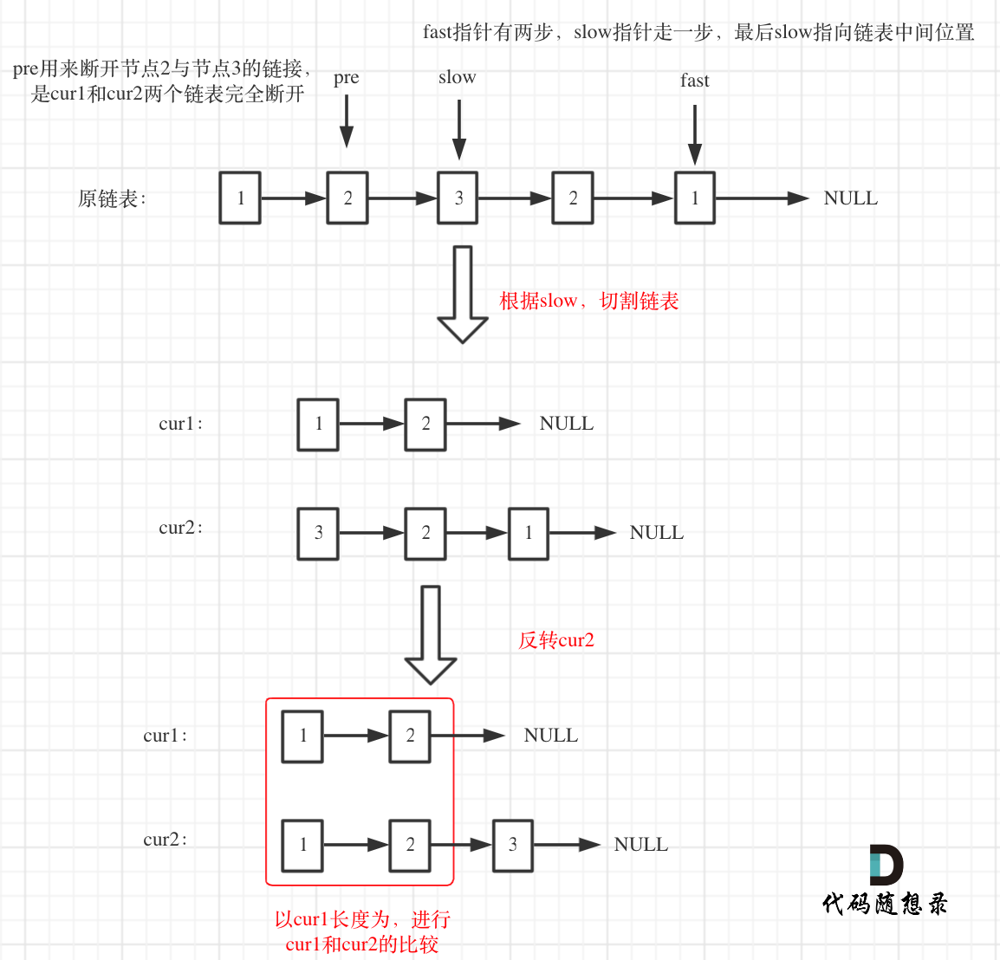
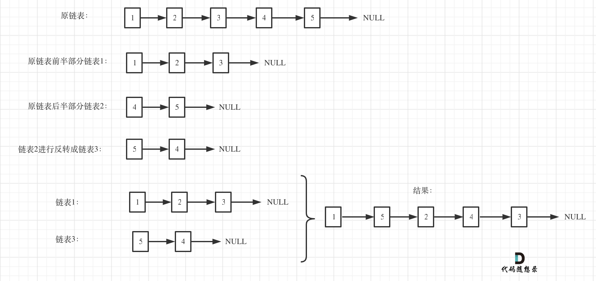
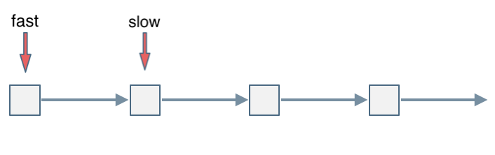

## Day74: 额外题目（链表）

### 234. 回文链表

[LeetCode](https://leetcode.cn/problems/palindrome-linked-list/)  [文章讲解](https://programmercarl.com/0234.%E5%9B%9E%E6%96%87%E9%93%BE%E8%A1%A8.html)

#### 题目描述：

给你一个单链表的头节点 `head` ，请你判断该链表是否为回文链表。如果是，返回 `true` ；否则，返回 `false` 。

**示例 1：**


> 输入：head = [1,2,2,1]
> 输出：true

**示例 2：**


> 输入：head = [1,2]
> 输出：false

#### 我的解法：

将链表转换成数组，然后用双指针法判断该数值是不是回文数组，即该链表是不是回文链表。（先求出链表长度，然后给定 vector 的初始长度，这样避免 vector 每次添加节点重新开辟空间，可以一定程度上的优化）

```C++
class Solution
{
 public:
	bool isPalindrome(ListNode* head)
	{
		vector<int> vec;
		ListNode* cur = head;
		while (cur != nullptr)
		{
			vec.push_back(cur->val);
			cur = cur->next;
		}

		for (int left = 0, right = vec.size() - 1; left <= right; left++, right--)
		{
			if (vec[left] != vec[right]) return false;
		}
		return true;
	}
};
```

#### 反转后半部分链表：

分为如下几步：

- 用快慢指针，快指针有两步，慢指针走一步，快指针遇到终止位置时，慢指针就在链表中间位置
- 同时用 `pre` 记录慢指针指向节点的前一个节点，用来分割链表
- 将链表分为前后均等两部分，如果链表长度是奇数，那么后半部分多一个节点
- 将后半部分反转 ，得 `cur2`，前半部分为 `cur1`
- 按照 `cur1` 的长度，一次比较 `cur1` 和 `cur2` 的节点数值

如图所示：



```cpp
class Solution2
{
 private:
    ListNode* reverseList(ListNode* head)
    {
       if (head == nullptr || head->next == nullptr) return head;

       ListNode* cur = head;
       ListNode* pre = head->next;
       cur->next = nullptr;
       while (pre != nullptr)
       {
          ListNode* temp = pre->next;
          pre->next = cur;
          cur = pre;
          pre = temp;
       }
       return cur;
    }

 public:
    bool isPalindrome(ListNode* head)
    {
       if (head == nullptr || head->next == nullptr) return true;

       // 分割链表
       ListNode* slow = head; // 慢指针，找到链表中间分位置，作为分割
       ListNode* fast = head;
       ListNode* pre; // 记录慢指针的前一个节点，用来分割链表
       while (fast != nullptr && fast->next != nullptr)
       {
          pre = slow;
          slow = slow->next;
          fast = fast->next->next;
       }
       pre->next = nullptr; // 分割链表

       ListNode* cur1 = reverseList(slow); // 反转后半部分，总链表长度如果是奇数，cur2比cur1多一个节点
       ListNode* cur2 = head; // 前半部分
       while (cur1 != nullptr && cur2 != nullptr)
       {
          if (cur1->val != cur2->val) return false;

          cur1 = cur1->next;
          cur2 = cur2->next;
       }
       return true;
    }
};
```

### 143. 重排链表

[LeetCode](https://leetcode.cn/problems/reorder-list/)  [文章讲解]()

#### 题目描述：

给定一个单链表 `L` 的头节点 `head` ，单链表 `L` 表示为：

```
L0 → L1 → … → Ln - 1 → Ln
```

请将其重新排列后变为：

```
L0 → Ln → L1 → Ln - 1 → L2 → Ln - 2 → …
```

不能只是单纯的改变节点内部的值，而是需要实际的进行节点交换。

**示例 1：**


> 输入：head = [1,2,3,4]
> 输出：[1,4,2,3]

**示例 2：**


> 输入：head = [1,2,3,4,5]
> 输出：[1,5,2,4,3]

#### 我的解法：

使用栈保存倒序的链表，同时统计链表长度，链表长度除以 2 就是需要插入的元素个数，也是需要弹栈的次数

```C++
class Solution
{
 public:
	void reorderList(ListNode* head)
	{
		// 使用栈保存倒序的链表，同时统计链表长度
		stack<ListNode*> st;
		ListNode* cur = head;
		int size = 0;
		while (cur != nullptr)
		{
			++size;
			st.push(cur);
			cur = cur->next;
		}

		cur = head;
		for (int i = 0; i < size / 2; i++)
		{
			ListNode* temp = st.top();
			st.pop();

			// 插入操作
			temp->next = cur->next;
			cur->next = temp;

			// 获取下一次操作的节点
			cur = temp->next;
		}
		cur->next = nullptr; // 最后一个节点末尾置空
	}
};
```

##### 法2：

把链表放进双向队列（deque），然后通过双向队列一前一后弹出数据，来构造新的链表。这种方法比操作数组容易一些，不用双指针模拟一前一后了

```cpp
class Solution2
{
 public:
    void reorderList(ListNode* head)
    {
       deque<ListNode*> que;
       ListNode* cur = head;
       if (cur == nullptr) return;

       while (cur->next != nullptr)
       {
          que.push_back(cur->next);
          cur = cur->next;
       }

       cur = head;
       int count = 0; // 计数，偶数去后面，奇数取前面
       ListNode* node;
       while (que.size())
       {
          if (count % 2 == 0)
          {
             node = que.back();
             que.pop_back();
          }
          else
          {
             node = que.front();
             que.pop_front();
          }
          count++;
          cur->next = node;
          cur = cur->next;
       }
       cur->next = nullptr; // 注意结尾
    }
};
```

#### 分割法：

将链表分割成两个链表，然后把第二个链表反转，之后在通过两个链表拼接成新的链表。

如图：



这种方法，比较难，平均切割链表，看上去很简单，真正代码写的时候有很多细节，同时两个链表最后拼装整一个新的链表也有一些细节需要注意！

```cpp
class Solution3
{
 private:
    // 反转链表
    ListNode* reverseList(ListNode* head)
    {
       ListNode* temp; // 保存cur的下一个节点
       ListNode* cur = head;
       ListNode* pre = nullptr;
       while (cur)
       {
          temp = cur->next;  // 保存一下 cur的下一个节点，因为接下来要改变cur->next
          cur->next = pre; // 翻转操作
          // 更新pre 和 cur指针
          pre = cur;
          cur = temp;
       }
       return pre;
    }

 public:
    void reorderList(ListNode* head)
    {
       if (head == nullptr) return;
       // 使用快慢指针法，将链表分成长度均等的两个链表head1和head2
       // 如果总链表长度为奇数，则head1相对head2多一个节点
       ListNode* fast = head;
       ListNode* slow = head;
       while (fast && fast->next && fast->next->next)
       {
          fast = fast->next->next;
          slow = slow->next;
       }
       ListNode* head1 = head;
       ListNode* head2;
       head2 = slow->next;
       slow->next = nullptr;

       // 对head2进行翻转
       head2 = reverseList(head2);

       // 将head1和head2交替生成新的链表head
       ListNode* cur1 = head1;
       ListNode* cur2 = head2;
       ListNode* cur = head;
       cur1 = cur1->next;
       int count = 0; // 偶数取head2的元素，奇数取head1的元素
       while (cur1 && cur2)
       {
          if (count % 2 == 0)
          {
             cur->next = cur2;
             cur2 = cur2->next;
          }
          else
          {
             cur->next = cur1;
             cur1 = cur1->next;
          }
          count++;
          cur = cur->next;
       }
       if (cur2 != nullptr)
       { // 处理结尾
          cur->next = cur2;
       }
       if (cur1 != nullptr)
       {
          cur->next = cur1;
       }
    }
};
```

### 141. 环形链表

[LeetCode](https://leetcode.cn/problems/linked-list-cycle/)  [文章讲解]()

#### 题目描述：

给你一个链表的头节点 `head` ，判断链表中是否有环。

如果链表中有某个节点，可以通过连续跟踪 `next` 指针再次到达，则链表中存在环。 为了表示给定链表中的环，评测系统内部使用整数 `pos` 来表示链表尾连接到链表中的位置（索引从 0 开始）。**注意：`pos` 不作为参数进行传递** 。仅仅是为了标识链表的实际情况。

*如果链表中存在环* ，则返回 `true` 。 否则，返回 `false` 。

**示例 1：**


> 输入：head = [3,2,0,-4], pos = 1
> 输出：true
> 解释：链表中有一个环，其尾部连接到第二个节点。

**示例 2：**


> 输入：head = [1,2], pos = 0
> 输出：true
> 解释：链表中有一个环，其尾部连接到第一个节点。

**示例 3：**


> 输入：head = [1], pos = -1
> 输出：false
> 解释：链表中没有环。

#### 我的解法：

可以使用快慢指针法， 分别定义 fast 和 slow指针，从头结点出发，fast指针每次移动两个节点，slow指针每次移动一个节点，如果 fast 和 slow指针在途中相遇 ，说明这个链表有环。

为什么fast 走两个节点，slow走一个节点，有环的话，一定会在环内相遇呢，而不是永远的错开呢？

首先第一点： **fast指针一定先进入环中，如果fast 指针和slow指针相遇的话，一定是在环中相遇，这是毋庸置疑的。**

那么来看一下，**为什么fast指针和slow指针一定会相遇呢？**

可以画一个环，然后让 fast指针在任意一个节点开始追赶slow指针。

会发现最终都是这种情况， 如下图：



fast和slow各自再走一步， fast和slow就相遇了

这是因为fast是走两步，slow是走一步，**其实相对于slow来说，fast是一个节点一个节点的靠近slow的**，所以fast一定可以和slow重合。

动画如下：


```C++
class Solution
{
 public:
	bool hasCycle(ListNode* head)
	{
		ListNode* slow = head;
		ListNode* fast = head;

		while (fast != nullptr && fast->next != nullptr)
		{
			slow = slow->next;
			fast = fast->next->next;

			if (slow == fast) return true;
		}
		return false;
	}
};
```

### 今日总结

回忆了链表交换两个节点，判断链表中是否有环，判断是否交点先进行对齐
