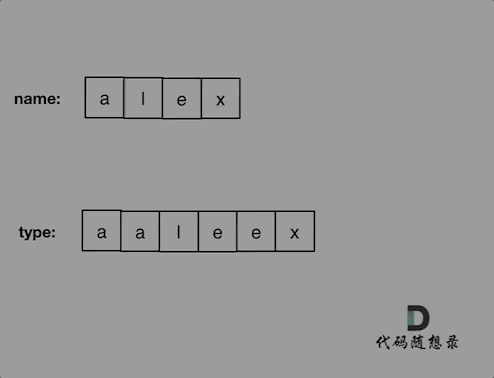
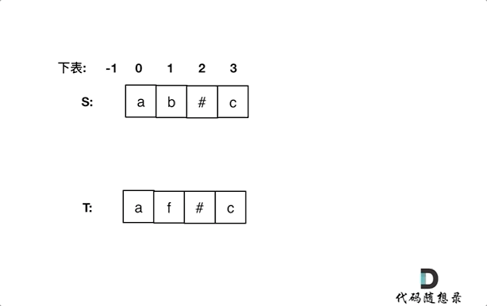

## Day75: 额外题目（哈希表、字符串）

### 205. 同构字符串

[LeetCode](https://leetcode.cn/problems/isomorphic-strings/)  [文章讲解](https://programmercarl.com/0205.%E5%90%8C%E6%9E%84%E5%AD%97%E7%AC%A6%E4%B8%B2.html)

#### 题目描述：

给定两个字符串 `s` 和 `t` ，判断它们是否是同构的。

如果 `s` 中的字符可以按某种映射关系替换得到 `t` ，那么这两个字符串是同构的。

每个出现的字符都应当映射到另一个字符，同时不改变字符的顺序。不同字符不能映射到同一个字符上，相同字符只能映射到同一个字符上，字符可以映射到自己本身。

**示例 1:**

> 输入：s = "egg", t = "add"
> 输出：true

**示例 2：**

> 输入：s = "foo", t = "bar"
> 输出：false

**示例 3：**

> 输入：s = "paper", t = "title"
> 输出：true

#### 我的解法：

使用两个map 保存 s[i] 到 t[j] 和 t[j] 到 s[i] 的映射关系，如果发现对应不上，立刻返回 false

```C++
class Solution
{
 public:
	bool isIsomorphic(const string& s, const string& t)
	{
		unordered_map<char, char> umap1;
		unordered_map<char, char> umap2;
		for (int i = 0; i < s.size(); i++)
		{
			if (!umap1.count(s[i])) umap1[s[i]] = t[i];
			if (!umap2.count(t[i])) umap2[t[i]] = s[i];

			if (umap1[s[i]] != t[i] || umap2[t[i]] != s[i]) return false;
		}
		return true;
	}
};
```

### 1002. 查找共用字符

[LeetCode](https://leetcode.cn/problems/find-common-characters/)  [文章讲解](https://programmercarl.com/1002.%E6%9F%A5%E6%89%BE%E5%B8%B8%E7%94%A8%E5%AD%97%E7%AC%A6.html)

#### 题目描述：

给你一个字符串数组 `words` ，请你找出所有在 `words` 的每个字符串中都出现的共用字符（ **包括重复字符**），并以数组形式返回。你可以按 **任意顺序** 返回答案。

**示例 1：**

> 输入：words = ["bella","label","roller"]
> 输出：["e","l","l"]

**示例 2：**

> 输入：words = ["cool","lock","cook"]
> 输出：["c","o"]

#### 参考解法：

这道题目一眼看上去，就是用哈希法，**“小写字符”，“出现频率”， 这些关键字都是为哈希法量身定做的啊**

整体思路就是统计出搜索字符串里26个字符的出现的频率，然后取每个字符频率最小值，就是 一个字符在所有字符串里出现的最小次数了，最后转成输出格式就可以了。

如图：


```C++
class Solution
{
 public:
	vector<string> commonChars(vector<string>& words)
	{
		int hash[26] = { 0 }; // 用来统计所有字符串里字符出现的最小频率
		// 用第一个字符串给hash初始化
		for (char ch : words[0])
		{
			hash[ch - 'a']++;
		}

		int hashOther[26] = { 0 }; // 统计除第一个字符串外字符的出现频率
		for (int i = 1; i < words.size(); i++)
		{
			memset(hashOther, 0, 26 * sizeof(int));
			for (char ch : words[i])
			{
				hashOther[ch - 'a']++;
			}

			// 更新hash，保证hash里统计26个字符在所有字符串里出现的最小次数
			for (int k = 0; k < 26; k++)
			{
				hash[k] = min(hash[k], hashOther[k]);
			}
		}

		vector<string> result;
		// 将hash统计的字符次数，转成输出形式
		for (int k = 0; k < 26; k++)
		{
			while (hash[k] != 0) // 注意这里是while，多个重复的字符
			{
				result.push_back(string(1, 'a' + k)); // char -> string
				hash[k]--;
			}
		}
		return result;
	}
};
```

### 925.长按键入

[LeetCode](https://leetcode.cn/problems/long-pressed-name/)  [文章讲解](https://programmercarl.com/0925.%E9%95%BF%E6%8C%89%E9%94%AE%E5%85%A5.html)

#### 题目描述：

你的朋友正在使用键盘输入他的名字 `name`。偶尔，在键入字符 `c` 时，按键可能会被*长按*，而字符可能被输入 1 次或多次。

你将会检查键盘输入的字符 `typed`。如果它对应的可能是你的朋友的名字（其中一些字符可能被长按），那么就返回 `True`。

**示例 1：**

> 输入：name = "alex", typed = "aaleex"
> 输出：true
> 解释：'alex' 中的 'a' 和 'e' 被长按。

**示例 2：**

> 输入：name = "saeed", typed = "ssaaedd"
> 输出：false
> 解释：'e' 一定需要被键入两次，但在 typed 的输出中不是这样。

#### 参考解法：

这道题目一看以为是哈希，仔细一看不行，要有顺序。

所以模拟同时遍历两个数组，进行对比就可以了。

对比的时候需要一下几点：

- name[i] 和 typed[j]相同，则i++，j++ （继续向后对比）
- name[i] 和 typed[j]不相同
  - 看是不是第一位就不相同了，也就是j如果等于0，那么直接返回false
  - 不是第一位不相同，就让j跨越重复项，移动到重复项之后的位置，再次比较name[i] 和typed[j]
    - 如果 name[i] 和 typed[j]相同，则i++，j++ （继续向后对比）
    - 不相同，返回false
- 对比完之后有两种情况
  - name没有匹配完，例如name:"pyplrzzzzdsfa" type:"ppyypllr"
  - type没有匹配完，例如name:"alex" type:"alexxrrrrssda"

动画如下：



```C++
class Solution
{
 public:
	bool isLongPressedName(const string& name, const string& typed)
	{
		int i = 0, j = 0;
		while (i < name.size() && j < typed.size())
		{
			if (name[i] == typed[j])
			{
				// 相同则同时向后匹配
				i++, j++;
			}
			else
			{
				// 不相同
				if (j == 0) return false; // 如果是第一位就不相同直接返回false
				// j跨越重复项，向后移动，同时防止j越界
				while (j < typed.size() && typed[j] == typed[j - 1]) j++;
				if (name[i] == typed[j])
				{
					// j跨越重复项之后再次和name[i]匹配
					i++, j++;
				}
				else
					return false;
			}
		}
		// 说明name没有匹配完，例如 name:"pyplrzzzzdsfa" type:"ppyypllr"
		if (i < name.size()) return false;

		// 说明type没有匹配完，例如 name:"alex" type:"alexxrrrrssda"
		while (j < typed.size())
		{
			if (typed[j] == typed[j - 1])
				j++;
			else
				return false;
		}
		return true;
	}
};
```

### 844. 比较含退格的字符串

[LeetCode](https://leetcode.cn/problems/backspace-string-compare/)  [文章讲解](https://programmercarl.com/0844.%E6%AF%94%E8%BE%83%E5%90%AB%E9%80%80%E6%A0%BC%E7%9A%84%E5%AD%97%E7%AC%A6%E4%B8%B2.html)

#### 题目描述：

给定 `s` 和 `t` 两个字符串，当它们分别被输入到空白的文本编辑器后，如果两者相等，返回 `true` 。`#` 代表退格字符。

**注意：**如果对空文本输入退格字符，文本继续为空。

**示例 1：**

> 输入：s = "ab#c", t = "ad#c"
> 输出：true
> 解释：s 和 t 都会变成 "ac"。

**示例 2：**

> 输入：s = "ab##", t = "c#d#"
> 输出：true
> 解释：s 和 t 都会变成 ""。

**示例 3：**

> 输入：s = "a#c", t = "b"
> 输出：false
> 解释：s 会变成 "c"，但 t 仍然是 "b"。

#### 我的解法：

这道题目一看就是要使用栈的节奏，这种匹配（消除）问题也是栈的擅长所在

**那么本题，确实可以使用栈的思路，但是没有必要使用栈，因为最后比较的时候还要比较栈里的元素，有点麻烦**。

这里直接使用字符串string，来作为栈，末尾添加和弹出，string都有相应的接口，最后比较的时候，只要比较两个字符串就可以了，比比较栈里的元素方便一些。

```C++
class Solution
{
 private:
	string getString(const string& S)
	{
		string s;
		for (int i = 0; i < S.size(); i++)
		{
			if (S[i] != '#')
				s += S[i];
			else if (!s.empty())
				s.pop_back();
		}
		return s;
	}
 public:
	bool backspaceCompare(string S, string T)
	{
		return getString(S) == getString(T);
	}
};
```

#### 双指针法：

同时从后向前遍历S和T（i初始为S末尾，j初始为T末尾），记录#的数量，模拟消除的操作，如果#用完了，就开始比较S[i]和S[j]。

动画如下：



如果S[i]和S[j]不相同返回false，如果有一个指针（i或者j）先走到的字符串头部位置，也返回false。

需要在一个大循环中执行 `消除# -> 比较`，只消除一次无法去除字符串中所有的 #

```cpp
class Solution2
{
 public:
    bool backspaceCompare(string S, string T)
    {
       int sSkipNum = 0; // 记录S的#数量
       int tSkipNum = 0; // 记录T的#数量
       int i = S.size() - 1;
       int j = T.size() - 1;
       while (true)
       {
          while (i >= 0)
          {
             // 从后向前，消除S的#
             if (S[i] == '#') sSkipNum++;
             else
             {
                if (sSkipNum > 0) sSkipNum--;
                else break;
             }
             i--;
          }

          while (j >= 0)
          {
             // 从后向前，消除T的#
             if (T[j] == '#') tSkipNum++;
             else
             {
                if (tSkipNum > 0) tSkipNum--;
                else break;
             }
             j--;
          }

          // 后半部分#消除完了，接下来比较S[i] != T[j]
          if (i < 0 || j < 0) break; // S 或者T 遍历到头了
          
          if (S[i] != T[j]) return false;
          i--;
          j--;
       }
       // 说明S和T同时遍历完毕
       if (i == -1 && j == -1) return true;
       return false;
    }
};
```

### 今日总结

今天 是被简单题击败的一天
