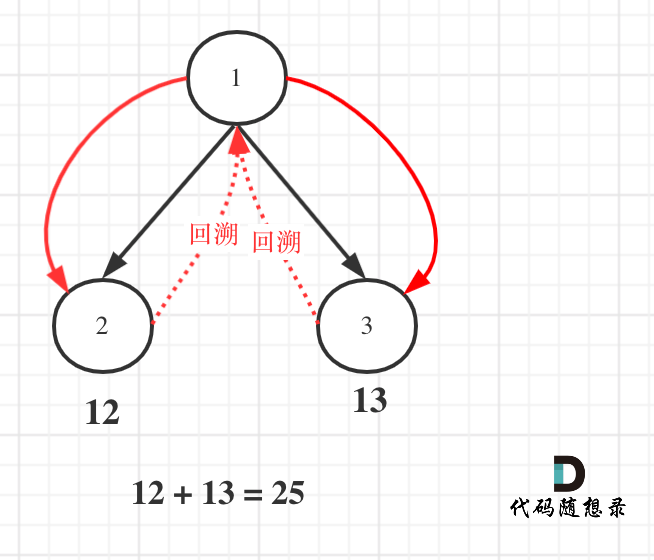

## Day76: 额外题目（二叉树）

### 129. 求根节点到叶节点数字之和

[LeetCode](https://leetcode.cn/problems/sum-root-to-leaf-numbers/)  [文章讲解](https://programmercarl.com/0129.%E6%B1%82%E6%A0%B9%E5%88%B0%E5%8F%B6%E5%AD%90%E8%8A%82%E7%82%B9%E6%95%B0%E5%AD%97%E4%B9%8B%E5%92%8C.html)

#### 题目描述：

给你一个二叉树的根节点 `root` ，树中每个节点都存放有一个 `0` 到 `9` 之间的数字。

每条从根节点到叶节点的路径都代表一个数字：

- 例如，从根节点到叶节点的路径 `1 -> 2 -> 3` 表示数字 `123` 。

计算从根节点到叶节点生成的 **所有数字之和** 。

**叶节点** 是指没有子节点的节点。

**示例 1：**

> 
> 
> 输入：root = [1,2,3]
> 输出：25
> 解释：
> 从根到叶子节点路径 1->2 代表数字 12
> 从根到叶子节点路径 1->3 代表数字 13
> 因此，数字总和 = 12 + 13 = 25

**示例 2：**

> 
> 
> 输入：root = [4,9,0,5,1]
> 输出：1026
> 解释：
> 从根到叶子节点路径 4->9->5 代表数字 495
> 从根到叶子节点路径 4->9->1 代表数字 491
> 从根到叶子节点路径 4->0 代表数字 40
> 因此，数字总和 = 495 + 491 + 40 = 1026

#### 我的解法：

采用回溯的先序遍历



```C++
class Solution
{
 private:
	int result = 0;
	void getPathSum(TreeNode* node, int sum)
	{
		if (node->left == nullptr && node->right == nullptr)
		{
			result += sum * 10 + node->val;
			return;
		}

		if (node->left != nullptr) getPathSum(node->left, sum * 10 + node->val);
		if (node->right != nullptr) getPathSum(node->right, sum * 10 + node->val);
	}

 public:
	int sumNumbers(TreeNode* root)
	{
		result = 0;
		if (root == nullptr) return result;
		getPathSum(root, 0);
		return result;
	}
};
```

### 1382.将二叉搜索树变平衡

[LeetCode](https://leetcode.cn/problems/balance-a-binary-search-tree/)  [文章讲解](https://programmercarl.com/1382.%E5%B0%86%E4%BA%8C%E5%8F%89%E6%90%9C%E7%B4%A2%E6%A0%91%E5%8F%98%E5%B9%B3%E8%A1%A1.html)

#### 题目描述：

给你一棵二叉搜索树，请你返回一棵 **平衡后** 的二叉搜索树，新生成的树应该与原来的树有着相同的节点值。如果有多种构造方法，请你返回任意一种。

如果一棵二叉搜索树中，每个节点的两棵子树高度差不超过 `1` ，我们就称这棵二叉搜索树是 **平衡的** 。

**示例 1：**


> 输入：root = [1,null,2,null,3,null,4,null,null]
> 输出：[2,1,3,null,null,null,4]
> 解释：这不是唯一的正确答案，[3,1,4,null,2,null,null] 也是一个可行的构造方案。

**示例 2：**


> 输入: root = [2,1,3]
> 输出: [2,1,3]

#### 我的解法：

对二叉搜索进行中序遍历可以得到从小到大排列的数组，然后以数组的中心为根节点，左边为左子树，右边为右子树构建二叉树。

```C++
class Solution
{
 private:
	vector<int> nums;
	void traversal(TreeNode* node)
	{
		if (node == nullptr) return;
		traversal(node->left);
		nums.push_back(node->val);
		traversal(node->right);
	}

	TreeNode* nums2tree(int start, int end)
	{
		if (start >= end) return nullptr;

		if (end - start == 1) return new TreeNode(nums[start]);

		int mid = (end + start) / 2;
		auto node = new TreeNode(nums[mid]);
		node->left = nums2tree(start, mid);
		node->right = nums2tree(mid + 1, end);
		return node;
	}

 public:
	TreeNode* balanceBST(TreeNode* root)
	{
		nums.clear();
		traversal(root);
		if (nums.size() <= 1) return root;

		return nums2tree(0, nums.size());
	}
};
```

### 100. 相同的树

[LeetCode](https://leetcode.cn/problems/same-tree/)  [文章讲解](https://programmercarl.com/0100.%E7%9B%B8%E5%90%8C%E7%9A%84%E6%A0%91.html)

#### 题目描述：

给你两棵二叉树的根节点 `p` 和 `q` ，编写一个函数来检验这两棵树是否相同。

如果两个树在结构上相同，并且节点具有相同的值，则认为它们是相同的。

**示例 1：**

> 
> 
> 输入：p = [1,2,3], q = [1,2,3]
> 输出：true

**示例 2：**

> 
> 
> 输入：p = [1,2], q = [1,null,2]
> 输出：false

**示例 3：**

> 
> 
> 输入：p = [1,2,1], q = [1,1,2]
> 输出：false

#### 我的解法：

分情况依次讨论即可。

```C++
class Solution
{
 public:
	bool isSameTree(TreeNode* p, TreeNode* q)
	{
		if (p == nullptr && q == nullptr)
			return true;
		else if (p == nullptr && q != nullptr)
			return false;
		else if (p != nullptr && q == nullptr)
			return false;
		else if (p->val == q->val)
		{
			return isSameTree(p->right, q->right) && isSameTree(p->left, q->left);
		}
		else
			return false;
	}
};
```

### 今日总结

复习了二叉树的递归遍历、层序遍历、通过数组构建平衡二叉树等，今天题目都不算难，全都AC了
