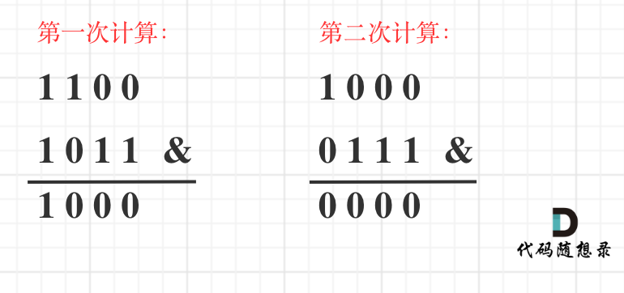

## Day76: 额外题目（回溯、贪心、位运算）

### 52. N皇后II

[LeetCode](https://leetcode.cn/problems/n-queens-ii/)  [文章讲解](https://programmercarl.com/0052.N%E7%9A%87%E5%90%8EII.html)

#### 题目描述：

**n 皇后问题** 研究的是如何将 `n` 个皇后放置在 `n × n` 的棋盘上，并且使皇后彼此之间不能相互攻击。

给你一个整数 `n` ，返回 **n 皇后问题** 不同的解决方案的数量。

**示例 1：**

> 
> 
> 输入：n = 4
> 输出：2
> 解释：如上图所示，4 皇后问题存在两个不同的解法。

**示例 2：**

> 输入：n = 1
> 输出：1

#### 我的解法：

同 51.N皇后

```C++
class Solution
{
 private:
	int count = 0;
	void backtracking(int n, int row, vector<string>& chessboard)
	{
		if (row == n)
		{
			++count;
			return;
		}

		for (int col = 0; col < n; ++col)
		{
			if (isValid(row, col, chessboard, n))
			{
				chessboard[row][col] = 'Q';
				backtracking(n, row + 1, chessboard);
				chessboard[row][col] = '.';
			}
		}
	}

	bool isValid(int row, int col, vector<string>& chessboard, int n)
	{
		// 检查列
		for (int i = 0; i < row; ++i)
		{
			if (chessboard[i][col] == 'Q') return false;
		}

		// 检查 45°
		for (int i = row - 1, j = col - 1; i >= 0 && j >= 0; --i, --j)
		{
			if (chessboard[i][j] == 'Q') return false;
		}

		// 检查 135°
		for (int i = row - 1, j = col + 1; i >= 0 && j < n; --i, ++j)
		{
			if (chessboard[i][j] == 'Q') return false;
		}

		return true;
	}

 public:
	int totalNQueens(int n)
	{
		count = 0;
		vector<string> chessboard(n, string(n, '.'));
		backtracking(n, 0, chessboard);
		return count;
	}
};
```

### 649. Dota2 参议院

[LeetCode](https://leetcode.cn/problems/dota2-senate/)  [文章讲解](https://programmercarl.com/0649.Dota2%E5%8F%82%E8%AE%AE%E9%99%A2.html)

#### 题目描述：

Dota2 的世界里有两个阵营：`Radiant`（天辉）和 `Dire`（夜魇）

Dota2 参议院由来自两派的参议员组成。现在参议院希望对一个 Dota2 游戏里的改变作出决定。他们以一个基于轮为过程的投票进行。在每一轮中，每一位参议员都可以行使两项权利中的 **一** 项：

- **禁止一名参议员的权利**：参议员可以让另一位参议员在这一轮和随后的几轮中丧失 **所有的权利** 。
- **宣布胜利**：如果参议员发现有权利投票的参议员都是 **同一个阵营的** ，他可以宣布胜利并决定在游戏中的有关变化。

给你一个字符串 `senate` 代表每个参议员的阵营。字母 `'R'` 和 `'D'`分别代表了 `Radiant`（天辉）和 `Dire`（夜魇）。然后，如果有 `n` 个参议员，给定字符串的大小将是 `n`。

以轮为基础的过程从给定顺序的第一个参议员开始到最后一个参议员结束。这一过程将持续到投票结束。所有失去权利的参议员将在过程中被跳过。

假设每一位参议员都足够聪明，会为自己的政党做出最好的策略，你需要预测哪一方最终会宣布胜利并在 Dota2 游戏中决定改变。输出应该是 `"Radiant"` 或 `"Dire"` 。

**示例 1：**

> 输入：senate = "RD"
> 输出："Radiant"
> 解释：
> 第 1 轮时，第一个参议员来自 Radiant 阵营，他可以使用第一项权利让第二个参议员失去所有权利。
> 这一轮中，第二个参议员将会被跳过，因为他的权利被禁止了。
> 第 2 轮时，第一个参议员可以宣布胜利，因为他是唯一一个有投票权的人。

**示例 2：**

> 输入：senate = "RDD"
> 输出："Dire"
> 解释：
> 第 1 轮时，第一个来自 Radiant 阵营的参议员可以使用第一项权利禁止第二个参议员的权利。
> 这一轮中，第二个来自 Dire 阵营的参议员会将被跳过，因为他的权利被禁止了。
> 这一轮中，第三个来自 Dire 阵营的参议员可以使用他的第一项权利禁止第一个参议员的权利。
> 因此在第二轮只剩下第三个参议员拥有投票的权利,于是他可以宣布胜利

#### 参考解法：

例如输入"RRDDD"，执行过程：

- 第一轮：senate[0]的R消灭senate[2]的D，senate[1]的R消灭senate[3]的D，senate[4]的D消灭senate[0]的R，此时剩下"RD"，第一轮结束！
- 第二轮：senate[0]的R消灭senate[1]的D，第二轮结束
- 第三轮：只有R了，R胜利

**其实这是一个持续消灭的过程！** 即：如果同时存在R和D就继续进行下一轮消灭，轮数直到只剩下R或者D为止！

那么每一轮消灭的策略应该是什么呢？

例如：RDDRD

第一轮：senate[0]的R消灭senate[1]的D，那么senate[2]的D，是消灭senate[0]的R还是消灭senate[3]的R呢？

当然是消灭senate[3]的R，因为当轮到这个R的时候，它可以消灭senate[4]的D。

**所以消灭的策略是，尽量消灭自己后面的对手，因为前面的对手已经使用过权利了，而后序的对手依然可以使用权利消灭自己的同伴！**

那么局部最优：有一次权利机会，就消灭自己后面的对手。全局最优：为自己的阵营赢取最大利益。

局部最优可以退出全局最优，举不出反例，那么试试贪心。

实现代码，在每一轮循环的过程中，去过模拟优先消灭身后的对手，其实是比较麻烦的。

这里有一个技巧，就是用一个变量记录当前参议员之前有几个敌对对手了，进而判断自己是否被消灭了。这个变量用flag来表示。

```C++
class Solution
{
 public:
	string predictPartyVictory(string senate)
	{
		// R = true表示本轮循环结束后，字符串里依然有R。D同理
		bool R = true, D = true;
		// 当flag大于0时，R在D前出现，R可以消灭D。当flag小于0时，D在R前出现，D可以消灭R
		int flag = 0;
		while (R && D)  // 一旦R或者D为false，就结束循环，说明本轮结束后只剩下R或者D了
		{
			R = false;
			D = false;

			for (int i = 0; i < senate.size(); ++i)
			{
				if (senate[i] == 'R')
				{
					if (flag < 0)
						senate[i] = '0'; // 消灭R，R此时为false
					else
						R = true;  // 如果没被消灭，本轮循环结束有R

					++flag;
				}

				if (senate[i] == 'D')
				{
					if (flag > 0)
						senate[i] = '0';
					else
						D = true;

					--flag;
				}
			}
		}
		// 循环结束之后，R和D只能有一个为true
		return R == true ? "Radiant" : "Dire";
	}
};
```

### 1221. 分割平衡字符串

[LeetCode](https://leetcode.cn/problems/split-a-string-in-balanced-strings/)  [文章讲解](https://programmercarl.com/1221.%E5%88%86%E5%89%B2%E5%B9%B3%E8%A1%A1%E5%AD%97%E7%AC%A6%E4%B8%B2.html)

#### 题目描述：

**平衡字符串** 中，`'L'` 和 `'R'` 字符的数量是相同的。

给你一个平衡字符串 `s`，请你将它分割成尽可能多的子字符串，并满足：

- 每个子字符串都是平衡字符串。

返回可以通过分割得到的平衡字符串的 **最大数量** **。**

**示例 1：**

> 输入：s = "RLRRLLRLRL"
> 输出：4
> 解释：s 可以分割为 "RL"、"RRLL"、"RL"、"RL" ，每个子字符串中都包含相同数量的 'L' 和 'R' 。

**示例 2：**

> 输入：s = "RLRRRLLRLL"
> 输出：2
> 解释：s 可以分割为 "RL"、"RRRLLRLL"，每个子字符串中都包含相同数量的 'L' 和 'R' 。
> 注意，s 无法分割为 "RL"、"RR"、"RL"、"LR"、"LL" 因为第 2 个和第 5 个子字符串不是平衡字符串。

**示例 3：**

> 输入：s = "LLLLRRRR"
> 输出：1
> 解释：s 只能保持原样 "LLLLRRRR" 。

#### 我的解法：

从前向后遍历，只要遇到平衡子串，计数就+1，遍历一遍即可。

局部最优：从前向后遍历，只要遇到平衡子串 就统计

全局最优：统计了最多的平衡子串。

局部最优可以推出全局最优，举不出反例，那么就试试贪心。

例如，LRLR 这本身就是平衡子串 , 但要遇到LR就可以分割。

```C++
class Solution
{
 public:
	int balancedStringSplit(const string& s)
	{
		int result = 0;
		int count = 0;
		char preChar;

		for (int i = 0; i < s.size(); i++)
		{
			if (count == 0)
			{
				preChar = s[i];
				++count;
			}
			else
			{
				if (preChar == s[i])
				{
					++count;
				}
				else
				{
					--count;
					if (count == 0) ++result;
				}
			}
		}
		return result;
	}
};
```

逻辑简化：

```cpp
class Solution2
{
 public:
    int balancedStringSplit(string s)
    {
       int result = 0;
       int count = 0;
       for (int i = 0; i < s.size(); i++)
       {
          if (s[i] == 'R') count++;
          else count--;
          if (count == 0) result++;
       }
       return result;
    }
};
```

### 1356. 根据数字二进制下 1 的数目排序

[LeetCode](https://leetcode.cn/problems/sort-integers-by-the-number-of-1-bits/)  [文章讲解](https://programmercarl.com/1356.%E6%A0%B9%E6%8D%AE%E6%95%B0%E5%AD%97%E4%BA%8C%E8%BF%9B%E5%88%B6%E4%B8%8B1%E7%9A%84%E6%95%B0%E7%9B%AE%E6%8E%92%E5%BA%8F.html)

#### 题目描述：

给你一个整数数组 `arr` 。请你将数组中的元素按照其二进制表示中数字 **1** 的数目升序排序。

如果存在多个数字二进制中 **1** 的数目相同，则必须将它们按照数值大小升序排列。

请你返回排序后的数组。

**示例 1：**

> 输入：arr = [0,1,2,3,4,5,6,7,8]
> 输出：[0,1,2,4,8,3,5,6,7]
> 解释：[0] 是唯一一个有 0 个 1 的数。
> [1,2,4,8] 都有 1 个 1 。
> [3,5,6] 有 2 个 1 。
> [7] 有 3 个 1 。
> 按照 1 的个数排序得到的结果数组为 [0,1,2,4,8,3,5,6,7]

**示例 2：**

> 输入：arr = [1024,512,256,128,64,32,16,8,4,2,1]
> 输出：[1,2,4,8,16,32,64,128,256,512,1024]
> 解释：数组中所有整数二进制下都只有 1 个 1 ，所以你需要按照数值大小将它们排序。

**示例 3：**

> 输入：arr = [10000,10000]
> 输出：[10000,10000]

**示例 4：**

> 输入：arr = [2,3,5,7,11,13,17,19]
> 输出：[2,3,5,17,7,11,13,19]

**示例 5：**

> 输入：arr = [10,100,1000,10000]
> 输出：[10,100,10000,1000]

#### 我的解法：

这道题其实是考察如何计算一个数的二进制中1的数量。

- 方法一：

朴实无华挨个计算1的数量，最多就是循环n的二进制位数，32位。

```cpp
int bitCount(int n) {
    int count = 0; // 计数器
    while (n > 0) {
        if((n & 1) == 1)  count++;  // 当前位是1，count++
        n >>= 1 ; // n向右移位
    }
    return count;
}
```

- 方法二

这种方法，只循环n的二进制中1的个数次，比方法一高效的多

```cpp
int bitCount(int n) {
    int count = 0;
    while (n) {
        n &= (n - 1); // 清除最低位的1
        count++;
    }
    return count;
}
```

以计算12的二进制1的数量为例，如图所示：



```C++
class Solution
{
 private:
	int bitCount1(int n)
	{
		int count = 0; // 计数器
		while (n > 0)
		{
			if ((n & 1) == 1) ++count;  // 当前位是1，count++
			n >>= 1; // n向右移位
		}
		return count;
	}

	int bitCount2(int n)
	{
		int count = 0;
		while (n)
		{
			n &= (n - 1); // 清除最低位的1
			++count;
		}
		return count;
	}

 public:
	vector<int> sortByBits(vector<int>& arr)
	{
		sort(arr.begin(), arr.end(), [this](int a, int b) -> bool
		{
		  int count_a = bitCount2(a);
		  int count_b = bitCount2(b);
		  if (count_a == count_b) return a < b; // 如果bit中1数量相同，比较数值大小
		  return count_a < count_b; // 否则比较bit中1数量大小
		});

		return arr;
	}
};
```

### 今日总结

复习了N皇后，贪心算法以及位运算。
