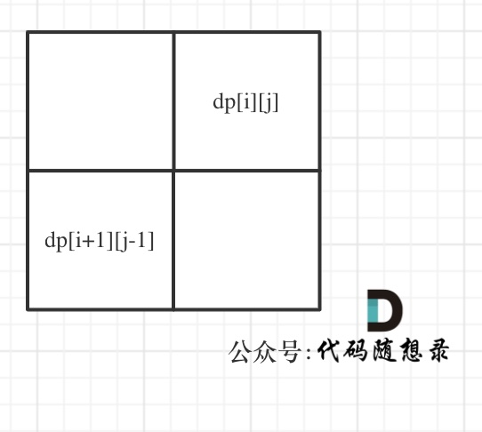

## Day78: 额外题目（动规、图论）

### 5. 最长回文子串

[LeetCode](https://leetcode.cn/problems/longest-palindromic-substring/)  [文章讲解](https://programmercarl.com/0005.%E6%9C%80%E9%95%BF%E5%9B%9E%E6%96%87%E5%AD%90%E4%B8%B2.html)

#### 题目描述：

给你一个字符串 `s`，找到 `s` 中最长的回文子串。

如果字符串的反序与原始字符串相同，则该字符串称为回文字符串。

**示例 1：**

> 输入：s = "babad"
> 输出："bab"
> 解释："aba" 同样是符合题意的答案。

**示例 2：**

> 输入：s = "cbbd"
> 输出："bb"

#### 我的解法：

动规五部曲：

1. 确定dp数组（dp table）以及下标的含义

布尔类型的`dp[i][j]`：表示区间范围`[i,j]` （注意是左闭右闭）的子串是否是回文子串，如果是`dp[i][j]`为true，否则为false。

2. 确定递推公式

在确定递推公式时，就要分析如下几种情况。

整体上是两种，就是`s[i]`与`s[j]`相等，`s[i]`与`s[j]`不相等这两种。

当`s[i]`与`s[j]`不相等，`dp[i][j]`一定是false。

当`s[i]`与`s[j]`相等时，这就复杂一些了，有如下三种情况

- 情况一：下标i 与 j相同，同一个字符例如a，当然是回文子串
- 情况二：下标i 与 j相差为1，例如aa，也是文子串
- 情况三：下标：i 与 j相差大于1的时候，例如cabac，此时`s[i]`与`s[j]`已经相同了，我们看i到j区间是不是回文子串就看aba是不是回文就可以了，那么aba的区间就是 i+1 与 j-1区间，这个区间是不是回文就看`dp[i + 1][j - 1]`是否为true。

以上三种情况分析完了，那么递归公式如下：

```cpp
if (s[i] == s[j]) {
    if (j - i <= 1) { // 情况一 和 情况二
        dp[i][j] = true;
    } else if (dp[i + 1][j - 1]) { // 情况三
        dp[i][j] = true;
    }
}
```

注意这里没有列出当`s[i]`与`s[j]`不相等的时候，因为在下面`dp[i][j]`初始化的时候，就初始为false。

3. dp数组如何初始化

`dp[i][j]`初始化为false。

4. 确定遍历顺序

首先从递推公式中可以看出，情况三是根据`dp[i + 1][j - 1]`是否为true，在对`dp[i][j]`进行赋值true的。

`dp[i + 1][j - 1]` 在 `dp[i][j]`的左下角，如图：



如果这矩阵是从上到下，从左到右遍历，那么会用到没有计算过的`dp[i + 1][j - 1]`，也就是根据不确定是不是回文的区间`[i+1,j-1]`，来判断了`[i,j]`是不是回文，那结果一定是不对的。

**所以一定要从下到上，从左到右遍历，这样保证`dp[i + 1][j - 1]`都是经过计算的**。

有的代码实现是优先遍历列，然后遍历行，其实也是一个道理，都是为了保证`dp[i + 1][j - 1]`都是经过计算的。

5. 举例推导dp数组

举例，输入："aaa"，`dp[i][j]`状态如下：


**注意因为`dp[i][j]`的定义，所以j一定是大于等于i的，那么在填充`dp[i][j]`的时候一定是只填充右上半部分**。

```C++
class Solution
{
 public:
	string longestPalindrome(const string& s)
	{
		vector<vector<bool>> dp(s.size(), vector<bool>(s.size(), false));

		int start = 0, end = 0;
		for (int i = s.size() - 1; i >= 0; --i)
		{
			for (int j = i; j < s.size(); ++j)
			{
				if (s[i] == s[j])
				{
					if (i == j || i + 1 == j)
						dp[i][j] = true;
					else
						dp[i][j] = dp[i + 1][j - 1];

                    // 更新最长的回文子串
					if (dp[i][j] && (end - start < j - i))
					{
						end = j;
						start = i;
					}
				}
			}
		}
		return s.substr(start, end - start + 1);
	}
};
```

### 132. 分割回文串 II

[LeetCode](https://leetcode.cn/problems/palindrome-partitioning-ii/)  [文章讲解](https://programmercarl.com/0132.%E5%88%86%E5%89%B2%E5%9B%9E%E6%96%87%E4%B8%B2II.html)

#### 题目描述：

给你一个字符串 `s`，请你将 `s` 分割成一些子串，使每个子串都是回文串。

返回符合要求的 **最少分割次数** 。

**示例 1：**

> 输入：s = "aab"
> 输出：1
> 解释：只需一次分割就可将 s 分割成 ["aa","b"] 这样两个回文子串。

**示例 2：**

> 输入：s = "a"
> 输出：0

**示例 3：**

> 输入：s = "ab"
> 输出：1

#### 参考解法：

动规五部曲分析如下：

1. 确定dp数组（dp table）以及下标的含义

`dp[i]`：范围是`[0, i]`的回文子串，最少分割次数是`dp[i]`。

2. 确定递推公式

来看一下由什么可以推出 `dp[i]`。

如果要对长度为 `[0, i]` 的子串进行分割，分割点为 `j`。

那么如果分割后，区间 `[j + 1, i]` 是回文子串，那么 `dp[i]` 就等于 `dp[j] + 1`。

这里可能有同学就不明白了，为什么只看 `[j + 1, i]` 区间，不看 `[0, j]` 区间是不是回文子串呢？

那么在回顾一下 `dp[i]` 的定义： 范围是 `[0, i]` 的回文子串，最少分割次数是 `dp[i]`。

`[0, j]` 区间的最小切割数量，我们已经知道了就是dp[j]。

此时就找到了递推关系，当切割点 `j` 在 `[0, i]` 之间时候，`dp[i] = dp[j] + 1`;

本题是要找到最少分割次数，所以遍历 `j` 的时候要取最小的 `dp[i]`。

**所以最后递推公式为：`dp[i] = min(dp[i], dp[j] + 1)`;**

注意这里不是要 `dp[j] + 1` 和 `dp[i]` 去比较，而是要在遍历 `j` 的过程中取最小的 `dp[i]`！

可以有 `dp[j] + 1` 推出，当 `[j + 1, i]`  为回文子串

3. dp数组如何初始化

首先来看一下`dp[0]`应该是多少。

`dp[i]`： 范围是`[0, i]`的回文子串，最少分割次数是`dp[i]`。

那么`dp[0]`一定是0，长度为1的字符串最小分割次数就是0。这个是比较直观的。

在看一下非零下标的`dp[i]`应该初始化为多少？

在递推公式`dp[i] = min(dp[i], dp[j] + 1)` 中我们可以看出每次要取最小的`dp[i]`。

那么非零下标的`dp[i]`就应该初始化为一个最大数，这样递推公式在计算结果的时候才不会被初始值覆盖！

```cpp
vector<int> dp(s.size());
for (int i = 0; i < s.size(); i++) dp[i] = i;
```

4. 确定遍历顺序

根据递推公式：`dp[i] = min(dp[i], dp[j] + 1)`;

`j` 是在`[0，i]`之间，所以遍历`i`的for循环一定在外层，这里遍历`j`的for循环在内层才能通过 计算过的`dp[j]`数值推导出`dp[i]`。

其中，二维数组`isPalindromic[i][j]`，记录`[i, j]`是不是回文子串。

那么这个`isPalindromic[i][j]`是怎么的代码的呢？

就是其实这两道题目的代码：

- [647. 回文子串](https://programmercarl.com/0647.回文子串.html)
- 5.最长回文子串

所以先用一个二维数组来保存整个字符串的回文情况。

5. 举例推导dp数组

以输入："aabc" 为例：


```C++
class Solution
{
 public:
	int minCut(string s)
	{
		// 二维数组isPalindromic来保存整个字符串的回文情况
		vector<vector<bool>> isPalindromic(s.size(), vector<bool>(s.size(), false));
		for (int i = s.size() - 1; i >= 0; i--)
		{
			for (int j = i; j < s.size(); j++)
			{
				if (s[i] == s[j])
				{
					if (j - i <= 1)
						isPalindromic[i][j] = true;
					else
						isPalindromic[i][j] = isPalindromic[i + 1][j - 1];
				}
			}
		}


		// dp[i]：范围是[0, i]的回文子串，最少分割次数是dp[i]
		vector<int> dp(s.size(), 0);
		for (int i = 0; i < dp.size(); i++) // 初始化
		{
			dp[i] = i;
		}

		for (int i = 1; i < s.size(); i++)
		{
			// 判断是不是回文子串
			if (isPalindromic[0][i])
			{
				dp[i] = 0;
				continue;
			}

			for (int j = 0; j < i; j++)
			{
				if (isPalindromic[j + 1][i])
				{
					dp[i] = min(dp[i], dp[j] + 1);
				}
			}
		}
		return dp.back();
	}
};
```

### 673.最长递增子序列的个数

[LeetCode](https://leetcode.cn/problems/number-of-longest-increasing-subsequence/)  [文章讲解](https://programmercarl.com/0673.%E6%9C%80%E9%95%BF%E9%80%92%E5%A2%9E%E5%AD%90%E5%BA%8F%E5%88%97%E7%9A%84%E4%B8%AA%E6%95%B0.html)

#### 题目描述：

给定一个未排序的整数数组 `nums` ， *返回最长递增子序列的个数* 。

**注意** 这个数列必须是 **严格** 递增的。

**示例 1:**

> 输入: [1,3,5,4,7]
> 输出: 2
> 解释: 有两个最长递增子序列，分别是 [1, 3, 4, 7] 和[1, 3, 5, 7]。

**示例 2:**

> 输入: [2,2,2,2,2]
> 输出: 5
> 解释: 最长递增子序列的长度是1，并且存在5个子序列的长度为1，因此输出5。

#### 参考解法：

1. **确定dp数组（dp table）以及下标的含义**

这道题目我们要一起维护两个数组。

`dp[i]`：`i`之前（包括i）最长递增子序列的长度为`dp[i]`

`count[i]`：以`nums[i]`为结尾的字符串，最长递增子序列的个数为`count[i]`

2. **确定递推公式**

在 300.最长上升子序列 中，给出的状态转移是：

`if (nums[i] > nums[j]) dp[i] = max(dp[i], dp[j] + 1);`

即：位置`i`的最长递增子序列长度 等于`j`从`0`到`i-1`各个位置的最长升序子序列 + 1的最大值。

本题就没那么简单了，我们要考虑两个维度，一个是`dp[i]`的更新，一个是`count[i]`的更新。

那么如何更新`count[i]`呢？

以`nums[i]`为结尾的字符串，最长递增子序列的个数为`count[i]`。

那么在`nums[i] > nums[j]`前提下，如果在`[0, i-1]`的范围内，找到了`j`，使得`dp[j] + 1 > dp[i]`，说明找到了一个更长的递增子序列。

那么以`j`为结尾的子串的最长递增子序列的个数，就是最新的以`i`为结尾的子串的最长递增子序列的个数，即：`count[i] = count[j]`。

在`nums[i] > nums[j]`前提下，如果在`[0, i-1]`的范围内，找到了`j`，使得`dp[j] + 1 == dp[i]`，说明找到了两个相同长度的递增子序列。

那么以`i`为结尾的子串的最长递增子序列的个数 就应该加上以`j`为结尾的子串的最长递增子序列的个数，即：`count[i] += count[j];`

题目要求最长递增序列的长度的个数，我们应该把最长长度记录下来。

代码如下：

```cpp
for (int i = 1; i < nums.size(); i++) {
    for (int j = 0; j < i; j++) {
        if (nums[i] > nums[j]) {
            if (dp[j] + 1 > dp[i]) {
                count[i] = count[j];
            } else if (dp[j] + 1 == dp[i]) {
                count[i] += count[j];
            }
            dp[i] = max(dp[i], dp[j] + 1);
        }
        if (dp[i] > maxCount) maxCount = dp[i]; // 记录最长长度
    }
}
```

3. **dp数组如何初始化**

再回顾一下`dp[i]`和`count[i]`的定义

`count[i]`记录了以`nums[i]`为结尾的字符串，最长递增子序列的个数。

那么最少也就是1个，所以`count[i]`初始为1。

`dp[i]`记录了`i`之前（包括i）最长递增序列的长度。

最小的长度也是1，所以`dp[i]`初始为1。

4. **确定遍历顺序**

`dp[i]` 是由0到`i-1`各个位置的最长升序子序列 推导而来，那么遍历`i`一定是从前向后遍历。

`j`其实就是0到`i-1`，遍历i的循环里外层，遍历j则在内层。

最后还有再遍历一遍`dp[i]`，把最长递增序列长度对应的`count[i]`累计下来就是结果了。

```cpp
int result = 0; // 统计结果
for (int i = 0; i < nums.size(); i++) {
    if (maxCount == dp[i]) result += count[i];
}
```

5. **举例推导dp数组**

输入：[1,3,5,4,7]


```C++
class Solution
{
 public:
	int findNumberOfLIS(vector<int>& nums)
	{
		if (nums.size() <= 1) return nums.size();

		vector<int> dp(nums.size(), 1);
		vector<int> count(nums.size(), 1);
		int maxCount = 0;
		for (int i = 1; i < nums.size(); ++i)
		{
			for (int j = 0; j < i; ++j)
			{
				if (nums[i] > nums[j])
				{
					if (dp[j] + 1 > dp[i])
					{
						dp[i] = dp[j] + 1;

						count[i] = count[j];
					}
					else if (dp[j] + 1 == dp[i])
					{
						count[i] += count[j];
					}
				}
			}
			if (dp[i] > maxCount) maxCount = dp[i];
		}

		int result = 0;
		for (int i = 0; i < nums.size(); ++i)
		{
			if (maxCount == dp[i]) result += count[i];
		}
		return result;
	}
};
```

### 今日总结

回顾了动规，图的遍历。
